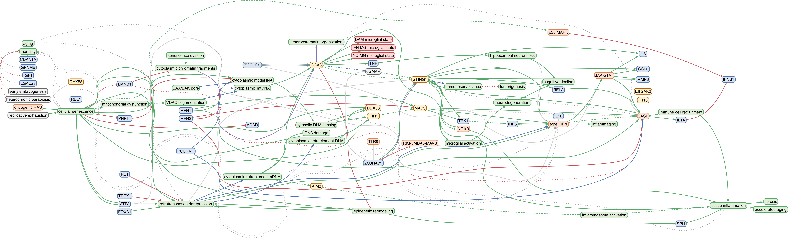

<div align="center">
  <h1>NASP knowledge compendium</h1>
</div>

Mechanism-centric curation and visualization of **N**ucleic **A**cid
**S**ensing **P**athways (**NASP**).

This repository contains two connected parts:

1. [**An agentic curation tool** for extracting mechanistic relationships
   from literature](agent/README.md).

2.  [**A data compendium** of marker-gene modules and curated paper-level mechanism files with visualizations.](docs/README.md).

</br>
Follow the linked `README.md` files for detailed usage.

</br>




</br>

## Installation

This repository is under *active development* and `pyproject.toml` may not be fully up to date.

#### 2. Package install

```sh
# system prerequisite
conda install -c conda-forge graphviz

# prepare a fresh conda environment
conda create -n nasp_compendium python=3.11 -y
conda activate nasp_compendium
python -m pip install -U pip setuptools wheel

# download and install from source
git clone https://github.com/sciencesteveho/nasp_compendium.git
cd nasp_compendium
pip install -e .
```

</br>

## Development

Install the dev extras:

```sh
pip install -e ".[dev]"
```

CI runs the pre-commit suite. Local hooks are opt-in:

```sh
pre-commit install --hook-type pre-commit --hook-type pre-push
```

</br>

## Marker-gene modules

Use `GeneModules` to load marker-gene modules as signed gene lists.

```python
from nasp_compendium import GeneModules

# See all possible modules
module_ids = GeneModules().module_ids()

# Get a scoring set
module = GeneModules.modules("dna_sensing")
genes = GeneModules.genes("dna_sensing")
positive_genes = GeneModules.genes("dna_sensing", directions=["positive"])

# Get NA sensors only
nucleic_acid_sensors = GeneModules.sensors("dna_rna")

# Get all sensors
all_sensors = GeneModules.sensors("all")
```

Validate a module against an AnnData-like dataset and map symbols to
`adata.var_names`:

```python
coverage = GeneModules.validate_dataset(adata, module="dna_sensing")
matched = GeneModules.modules(
    "dna_sensing",
    adata=adata,
    gene_symbol_column="feature_name",
)

matched.gene_id_output
matched.missing_positive_genes
matched.missing_inverse_genes
```

Use a custom marker-gene TSV:

```python
catalog = GeneModules.from_tsv("my_panel.tsv")
custom_genes = catalog.get_genes("dna_sensing")
module_spec = catalog.get_module("dna_sensing").as_dict()
```

Single-cell scoring lives in `nasp_atlas.single_cell`.
