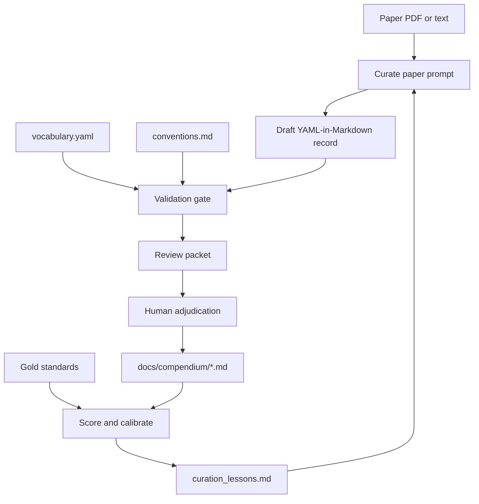

# NASP agentic curation tool

The agentic curation tool helps convert NASP-related papers into structured
mechanism records. The output is a YAML-in-Markdown draft that can be validated,
reviewed, adjudicated, scored, and added to the shared compendium.

## Architecture



</br>

## Core workflow

1. Use the curation prompt to extract candidate paper entities, claims, and
   edges into a YAML-in-Markdown draft.
2. Validate the draft against controlled vocabulary and graph conventions.
3. Generate a review packet for human adjudication.
4. Score against gold-standard files when calibrating the workflow.
5. Update conventions or lessons when calibration reveals a reusable rule.

## Example extraction prompts

### First-pass paper curation

Use this prompt when curating a new paper into the compendium.

```text
You are curating a paper for the NASP mechanistic compendium.

Use the repository files below as binding instructions:
- agent/analysis_prompt.md
- agent/conventions.md
- agent/curation_lessons.md
- agent/vocabulary.yaml

Task:
Curate the attached paper into a YAML-in-Markdown compendium record.

Focus on mechanistic relationships involving nucleic acid sensing, innate
immune signaling, interferon output, inflammatory output, senescence,
inflammaging, mitochondrial nucleic acid sensing, retrotransposon
derepression, autophagy, inflammasome activation, and related checkpoints.

Requirements:
1. Extract paper metadata.
2. Extract declared entities using the controlled vocabulary where possible.
3. Extract claims with evidence location, assay, disposition, and support.
4. Emit graph edges only when the paper supports a mechanistic relationship.
5. Do not over-compress multi-step mechanisms into unsupported shortcut edges.
6. Distinguish direct perturbation evidence from correlative evidence.
7. Keep context-only observations out of the graph unless they support an edge.
8. Use proposed_terms only when no controlled term is suitable.
9. Return one complete YAML-in-Markdown draft.

Before finalizing, self-check:
- Are the graph edges supported by specific claims?
- Are causal verbs justified by perturbation or direct measurement?
- Are broad cohort or atlas claims marked as correlative where appropriate?
- Are negative results represented without implying positive mechanisms?
```

### Review and repair a draft

Use this prompt after generating a draft, especially if validation or review
packets reveal issues.

```text
You are reviewing a draft NASP compendium record.

Use the repository files below as binding instructions:
- agent/conventions.md
- agent/curation_lessons.md
- agent/vocabulary.yaml
- agent/prompts/audit_paper.md

Task:
Audit the draft against the source paper and the compendium conventions.

Return:
1. Hard errors that should be fixed before merging.
2. Edges that are unsupported, over-compressed, or use the wrong relationship.
3. Claims that should be changed to context_only, negative, or insufficient.
4. Missing graph-worthy mechanisms.
5. Vocabulary terms that should be replaced with canonical terms.
6. A corrected YAML-in-Markdown draft.

Pay special attention to:
- whether source and target nodes are mechanistically appropriate;
- whether the relationship verb is too strong;
- whether correlative data are being treated as causal;
- whether the paper supports NASP-specific biology or only general stress,
  inflammation, aging, or disease context.
```

### Calibrate against a gold standard

Use this prompt when testing whether the agent is improving on held-out papers.

```text
You are calibrating NASP compendium curation against a gold standard.

Use the repository files below as binding instructions:
- agent/conventions.md
- agent/curation_lessons.md
- agent/vocabulary.yaml
- agent/prompts/calibrate_against_gold_standard.md

Task:
Compare the draft curation to the gold-standard curation.

Return:
1. Recovered gold edges.
2. Missed gold edges.
3. Extra draft edges that should be removed.
4. Extra draft edges that are valid but absent from the gold standard.
5. Vocabulary or convention failures.
6. Reusable lessons that should be added to curation_lessons.md.

Do not tune only for superficial edge matching. Prioritize whether the draft
captures the same mechanistic claims with the same evidence strength,
relationship direction, and biological scope.
```

## Commands

Validate a draft or compendium directory:

```sh
compendium validate --dir docs/compendium --strict
```

Generate a review packet:

```sh
compendium review_packet path/to/draft.md --out review_packet.md --gate
```

Score draft curation against gold standards:

```sh
compendium score \
  --draft docs/compendium \
  --gold docs/compendium \
  --format text
```

Diff two compendium states:

```sh
compendium diff old_compendium_dir new_compendium_dir --format text
```

## Repo organization

| Path                  | Purpose                                                               |
| --------------------- | --------------------------------------------------------------------- |
| `analysis_prompt.md`  | Main paper-analysis prompt for mechanistic extraction.                |
| `conventions.md`      | Curation rules and graph-construction conventions.                    |
| `curation_lessons.md` | Lessons learned from calibrations and audits.                         |
| `vocabulary.yaml`     | Controlled terms for entities, relationships, evidence, and tiers.    |
| `prompts/`            | Task-specific prompts for curation, audit, backfill, and calibration. |
| `specs/`              | Specifications for controlled vocabulary and tiered term handling.    |

</br>
