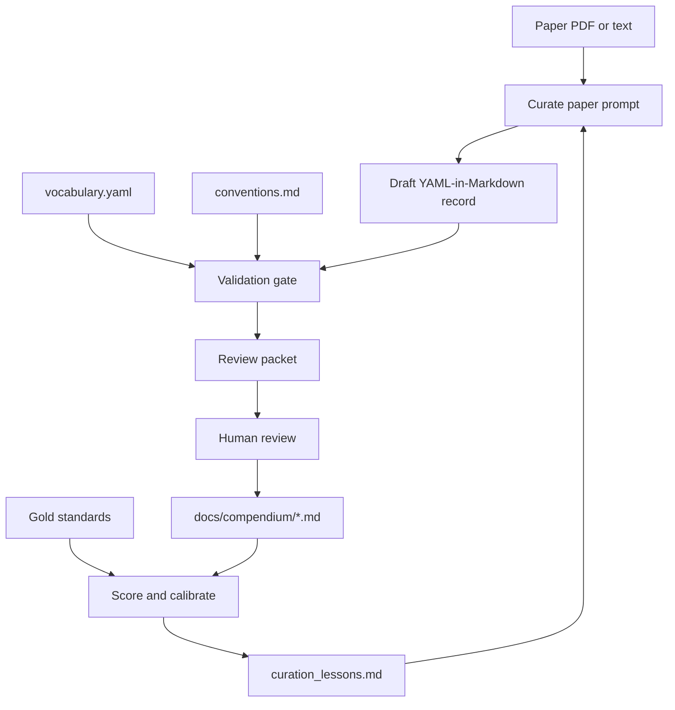

# NASP agentic curation tool

The agentic curation tool helps convert NASP-related papers into structured
mechanism records. The output is a YAML-in-Markdown draft that can be validated,
reviewed, scored, and added to the shared compendium.

## Architecture


```mermaid
flowchart TD
    Paper[Paper PDF or text] --> Curate[Curate paper prompt]
    Curate --> Draft[Draft YAML-in-Markdown record]
    Vocabulary[vocabulary.yaml] --> Validate[Validation gate]
    Conventions[conventions.md] --> Validate
    Draft --> Validate
    Validate --> Review[Review packet]
    Review --> Human[Human review]
    Human --> Compendium[docs/compendium/*.md]
    Gold[Gold standards] --> Score[Score and calibrate]
    Compendium --> Score
    Score --> Lessons[curation_lessons.md]
    Lessons --> Curate
```

</br>

## Core workflow

1. Use the curation prompt to extract candidate paper entities and edges into
   a YAML-in-Markdown draft.
2. Validate the draft against controlled vocabulary and graph conventions.
3. Generate a review packet for human review.
4. Score against gold-standard files when calibrating the workflow.
5. Update conventions or lessons when calibration reveals a reusable rule.

The single-agent workflow remains the default. For papers with deep branching,
many specificity controls, or difficult evidence boundaries, the optional
multi-agent workflow adds independent recall and precision review without
changing the schema or promotion path.

## Optional multi-agent review

`prompts/curate_paper_multi_agent.md` keeps the parent as the sole curator and
adjudicator. The parent exact-gates and hash-freezes an initial draft, launches
the read-only `recall_reviewer` and `precision_reviewer` together, waits for
both, adjudicates every proposal against the paper, and writes one revised
human-review candidate. The initial file remains an immutable audit snapshot.

The project-scoped `.codex/config.toml` allows three concurrent threads and one
level of delegation. Reviewer definitions live in `.codex/agents/` and enforce
`sandbox_mode = "read-only"`. Project configuration loads only after the
repository is trusted. Do not launch this workflow with `--yolo` or a live
permission override that weakens the reviewer sandbox.

From the repository root, run:

```sh
codex -C . \
  "Follow agent/prompts/curate_paper_multi_agent.md for paper_id=<paper_id> \
and paper_path=data/literature/<paper_id>.pdf. Use recall_reviewer and \
precision_reviewer exactly as instructed. Stop before promotion."
```

The workflow writes only ignored working artifacts under
`agent/reports/curation_runs/`, `agent/reports/audits/`, and
`agent/reports/graph_diffs/`. It never writes to `docs/compendium/`, accepts a
reviewer recommendation automatically, promotes a draft, or commits.

### Held-out evaluation protocol

Do not claim an accuracy improvement from adding reviewers without a paired
evaluation on multiple fresh held-out papers:

1. Run the existing single-agent prompt and the multi-agent prompt in separate
   clean sessions with the same paper, model, instructions, and tool access.
   Counterbalance which arm runs first, and hide each arm's output from the
   other.
2. Exact-gate and hash both final drafts before revealing an external reference.
   A paper that has already informed prompts or lessons is a regression check,
   not a fresh held-out result.
3. After both drafts are frozen, score each with `compendium score`. Compare
   core-edge recall, supporting-edge recall, relationship and evidence-strength
   errors, and forbidden-shortcut violations. Manually classify unmatched
   extras as supported additions or unsupported extra edges; scorer `extra`
   alone does not establish that an edge is wrong.
4. Record human adjudication burden for each arm: findings considered,
   accepted/rejected/modified decisions, source lookups, edits, and elapsed
   review time. Also record tokens, wall-clock time, and execution cost wherever
   the Codex client exposes them.

Use `prompts/calibrate_held_out.md` for reference isolation and scoring. Keep
human promotion manual regardless of the result.

## Example extraction prompts

### First-pass paper curation

Use this prompt when curating a new paper into the compendium.

```text
You are curating a paper for the NASP mechanistic compendium.

Use the repository files below as binding instructions:
- agent/analysis_prompt.md
- agent/conventions.md
- agent/curation_lessons.md
- agent/vocabulary.yaml

Task:
Curate the attached paper into a YAML-in-Markdown compendium record.

Focus on mechanistic relationships involving nucleic acid sensing, innate
immune signaling, interferon output, inflammatory output, senescence,
inflammaging, mitochondrial nucleic acid sensing, retrotransposon
derepression, autophagy, inflammasome activation, and related checkpoints.

Requirements:
1. Extract paper metadata.
2. Extract declared entities using the controlled vocabulary where possible.
3. Emit graph edges only when the paper supports a mechanistic relationship,
   each with its evidence strength, context, and support text.
4. Do not over-compress multi-step mechanisms into unsupported shortcut edges.
5. Distinguish direct perturbation evidence from correlative evidence.
6. Keep context-only observations out of the graph unless they support an edge.
7. Use proposed_terms only when no controlled term is suitable.
8. Return one complete YAML-in-Markdown draft.

Before finalizing, self-check:
- Is every graph edge supported by specific evidence in the paper?
- Are causal verbs justified by perturbation or direct measurement?
- Are broad cohort or atlas associations marked as correlative where appropriate?
- Are negative results represented without implying positive mechanisms?
```

### Review and repair a draft

Use this prompt after generating a draft, especially if validation or review
packets reveal issues.

```text
You are reviewing a draft NASP compendium record.

Use the repository files below as binding instructions:
- agent/conventions.md
- agent/curation_lessons.md
- agent/vocabulary.yaml
- agent/prompts/audit_paper.md

Task:
Audit the draft against the source paper and the compendium conventions.

Return:
1. Hard errors that should be fixed before merging.
2. Edges that are unsupported, over-compressed, or use the wrong relationship.
3. Edges that should be demoted to context-only or recast as negative findings.
4. Missing graph-worthy mechanisms.
5. Vocabulary terms that should be replaced with canonical terms.
6. A corrected YAML-in-Markdown draft.

Pay special attention to:
- whether source and target nodes are mechanistically appropriate;
- whether the relationship verb is too strong;
- whether correlative data are being treated as causal;
- whether the paper supports NASP-specific biology or only general stress,
  inflammation, aging, or disease context.
```

### Audit against a revealed reference

Use this only after a draft has been frozen. It is a non-blind error and
reference-quality audit, not evidence of held-out generalization.

```text
You are auditing a frozen NASP compendium draft against a revealed reference.

Use the repository files below as binding instructions:
- agent/conventions.md
- agent/curation_lessons.md
- agent/vocabulary.yaml
- agent/prompts/calibrate_against_gold_standard.md

Task:
Compare the draft curation to the gold-standard curation.

Return:
1. Recovered gold edges.
2. Missed gold edges.
3. Extra draft edges that should be removed.
4. Extra draft edges that are valid but absent from the gold standard.
5. Vocabulary or convention failures.
6. Reusable lessons that should be added to curation_lessons.md.

Do not tune only for superficial edge matching. Prioritize whether the draft
captures the same mechanistic relationships with the same evidence strength,
relationship direction, and biological scope.
```

## Commands

Gate an exact draft:

```sh
compendium review_packet path/to/draft.md --out review_packet.md --gate
```

Validate the compendium after promotion:

```sh
compendium validate --dir docs/compendium
```

Score draft curation against gold standards:

```sh
compendium score \
  --draft path/to/paper.draft.md \
  --gold path/to/paper.gold.md \
  --format text
```

Diff two compendium states:

```sh
compendium diff old_compendium_dir new_compendium_dir --format text
```

## Repo organization

| Path                  | Purpose                                                               |
| --------------------- | --------------------------------------------------------------------- |
| `analysis_prompt.md`  | Main paper-analysis prompt for mechanistic extraction.                |
| `conventions.md`      | Curation rules and graph-construction conventions.                    |
| `curation_lessons.md` | Lessons learned from calibrations and audits.                         |
| `vocabulary.yaml`     | Controlled terms for entities, relationships, evidence, and tiers.    |
| `prompts/`            | Task-specific prompts for curation, audit, backfill, and calibration. |
| `specs/`              | Specifications for controlled vocabulary and tiered term handling.    |

</br>
