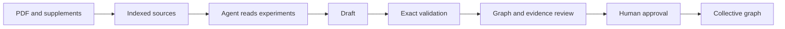

# Extract papers into a reviewable mechanism graph

Ask the agent:

> Follow `agent/prompts/curate_paper.md` for paper ID `author_2026` and PDF
> `data/literature/paper.pdf`. Prepare a source-linked review before promotion.

The agent reads the paper and its experiments. Local tools index PDF pages,
validate the exact draft, and produce an interactive graph with inspectable
per-paper evidence and a proposed collective-graph diff. No model service or
new orchestration framework is required.

## Setup

Install the project and PDF tools in your project environment:

```sh
pip install -e ".[extraction]"
```

Graphviz's `dot` executable must be installed (e.g. `conda install -c conda-forge
graphviz`). The ordinary graph and marker-gene commands do not require PDF tools.
PDF preparation uses [pypdfium2](https://pypdfium2.readthedocs.io/en/stable/).

## Workflow


```mermaid
flowchart LR
  P[PDF and supplements] --> S[Indexed sources]
  S --> A[Agent reads experiments]
  A --> D[Draft]
  D --> V[Exact validation]
  V --> R[Graph and evidence review]
  R --> H[Human approval]
  H --> G[Collective graph]
```

Run the commands in [the extraction prompt](prompts/curate_paper.md). The only
scientific/schema reference is [the contract](extraction_contract.md); names
and aliases live in [the reviewed vocabulary](vocabulary.yaml).

Each run is local and ignored. `review_paper` creates a new numbered revision
containing the frozen draft, manifest, source-page images, HTML review and text
diff. It checks source hashes and page bounds, preserves all evidence records,
and never edits the accepted collection. Open `review.html` directly in a
browser; no server, network library or build step is needed. Select an arrow
or the claim list to view its experiment and evidence page. Use the view,
paper, entity, inferred-continuity and association controls to explore.

An image-only source without extractable text needs an OCR-enabled PDF before
intake. Sparse-text pages are flagged for visual inspection.
The workflow records missing supplements explicitly; it cannot verify claims
whose decisive evidence is unavailable.

## Review, vocabulary and evaluation

- For an existing record, use [audit_paper](prompts/audit_paper.md).
- A new concept needs `proposed_terms: [{term: ..., reason: ...}]` in the draft.
  `python agent/build_vocabulary.py --check` checks vocabulary use in accepted
  records; it never promotes terms. Run without `--check` to print proposals.
- [Independent recall/precision review](prompts/curate_paper_multi_agent.md) is
  optional. It has not established an extraction-quality improvement.
- [Held-out evaluation](prompts/calibrate_held_out.md) freezes outputs before
  revealing references. Core recall requires correct direction and relation;
  evidence agreement is separate. Gold-relative extras are unadjudicated.
- Ordinary graphs exclude `.gold.md`, `forbidden_shortcut` and excluded rows.
  The previous combined graph included evaluation material. References require
  deliberate scientific review and promotion before entering the collection.

[The working refactor plan](paper_extraction_refactor_plan.md) tracks progress
and remaining evidence. The [reference audit](../docs/gold_review/20261007_audit.md)
links 13 candidate reviews awaiting scientific approval; those papers are
exposed regression cases, not a fresh quality benchmark. Prior prompts and
lessons are retained under
`archive/pre_refactor_20261007/` for reproducibility, outside the default reading
path. They are historical instructions, not current policy.
