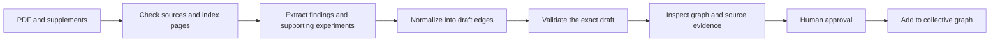

# Paper extraction refactor: working plan

Date: 2026-10-07. Status: implementation delivered; reference ratification and
fresh extraction evaluation remain open.

Execution note: source preparation from stage 4 is being implemented before
finishing stage 1. The local environment could extract text but lacked a PDF
page renderer; the audit needs both. This dependency change keeps the audit
and subsequent extraction runs on the same page-indexed source artifacts.

## Outcome and boundary

Give the agent a paper PDF and available supplements. Receive a faithful,
source-linked mechanism graph that is quick to inspect, correct, and approve
for the collective NASP graph. Success means recovering useful biology with
little human repair, not matching a particular curator's wording or passing
YAML validation.

Start with one paper per run. Batch processing can reuse the same workflow
after it works reliably. This is the default planning assumption pending the
user's workflow preference.

Scope: extraction instructions, source preparation, reference quality,
vocabulary, extraction validation/scoring, review artifacts, and the handoff
into the collective graph. Graph changes are limited to faithful inclusion,
evidence preservation, and the extraction review view. Marker-gene modules,
atlas analyses, essentiality work, and a general website redesign are outside
scope. Preserve the user's existing work. No automatic commits.

Retain `paper` + `edges` as the public compendium format. Any necessary format
change must be justified by a worked case and accompanied by a migration and
consumer checks. A new agent framework or database is not a prerequisite.

## What reconnaissance established

| Finding | Evidence and implication |
| --- | --- |
| Instructions have several overlapping authorities. | `analysis_prompt.md`, `conventions.md`, and `curation_lessons.md` alone contain 7,987 whitespace-delimited words. The analysis prompt requires a presentation-length panel summary as well as extraction; the task prompt says the output is just the record. Vocabulary ownership and new-term handling also differ between prose and code. |
| Reference quality is unsettled. | There are 12 gold files and 13 matching paper PDFs including the active Gulen record. `docs/gold_review/human_verification.md` already contains 64 unresolved review items. Use that queue as audit input, not another instruction document. |
| Ordinary validation does not validate the reference corpus. | Exact temporary `.md` copies of all golds produced errors for Jiang, Ma, Sprenger, Tyshkovskiy, and Wang. The vocabulary freshness check also failed. Normal directory validation passes while skipping all golds. |
| The headline score can reward the wrong biology. | A synthetic reference `CGAS activates STING1` and draft `CGAS suppresses STING1` yield 100% core recall and 0% relationship recall. The implementation defines core recall by endpoints, although design documentation describes relationship recovery. |
| The review gate is weaker than its name suggests. | Synthetic drafts with empty or null support, and `paper: {}; edges: []`, return no gate blockers. An invalid file ending in `.gold.md` is also skipped by exact-file review. |
| Evaluation material reaches published graph inputs. | Combined Graphviz and Mermaid paths request `include_gold=True`. That loader currently returns 13 papers and 220 rows, including 12 `forbidden_shortcut` rows and two rows flagged `score_exclude`. The ordinary loader returns one paper and 23 edges. |
| Aggregation loses evidence distinctions. | Duplicate-edge aggregation retains the first edge's context, support, and evidence strength while merging paper IDs. A two-source probe reproduced this loss. |
| More reviewers have not established a reliable solution. | Re-scoring the four saved initial/reviewed pairs reproduces 32 relationship matches in both, across 67 initial and 74 reviewed edges. Gold-relative precision falls from 48% to 43%; this is not source-adjudicated precision. |

The selected existing test suite passes: 33 tests across review packets,
scoring, graph CLI, graph loading/rendering, and Mermaid rendering. These
tests establish a software baseline; they do not establish extraction quality.
There is no PDF-to-reviewed-graph entry point in the current CLI.

PDF spot-checks examined source text and figure legends, not a full visual
audit of every panel:

- **Mao:** PDF page 7, Fig. 4g,h and Extended Data Fig. 5c,d distinguish an
  indirect IFN effect from absent direct promoter occupancy. The gold's
  `ATF3 does_not_drive type_I_IFN` misrepresents that distinction.
- **Martinez:** PDF page 6 and Fig. 4i,j show DNA-damage readouts following
  CGAS depletion. They do not isolate cytoplasmic L1 cDNA as the cause. PDF
  page 7 proposes SPI1 mediation. The gold labels both cDNA-to-DNA-damage
  and SPI1-to-inflammation as perturbation-supported causal relationships.
- **Tyshkovskiy:** PDF page 5 describes IGF1 as negatively associated with
  maximum lifespan. The gold's mortality-negative edge explains this as a
  lifespan-positive association. Its endpoint and sign require adjudication;
  simply flipping a mortality arrow would skip that work.

These findings justify reference and tooling repairs. They do not establish
that shorter prompts alone will fix extraction, or that every unmatched draft
edge is wrong.

## Scientific contract to adopt

1. **Extract what the experiment establishes.** Record what was perturbed,
   what was measured, the result, and the condition for each proposed edge.
   An intervention changing B and C does not by itself establish B → C.
2. **Preserve resolved mechanisms without manufacturing missing steps.**
   Retain supported intermediates. A tested distal effect may remain a scoped
   functional relationship; it must not imply direct molecular contact or
   replace an experimentally resolved chain. Canonical continuity is optional,
   explicitly inferred context, not a mandatory discovery credited to a paper.
3. **Keep claims at the experiment's resolution.** Combined sensor tests do
   not independently establish each sensor's role. Motif enrichment is not
   regulator perturbation. Chronological age, senescence, expected mortality,
   measured death, and a prediction score are different endpoints.
4. **Separate results, interpretation, and uncertainty.** Use the existing
   evidence labels with one consistent definition. Author-proposed mechanisms
   that are not established remain visible in review notes; do not silently
   upgrade them to experimental findings. Measuring two objects is not the
   same as measuring their relationship.
5. **Scope negative findings.** A tested lack of effect can be a useful edge
   under its stated conditions. Absent binding, missing measurements, and a
   lack of statistical significance must not become universal functional
   negatives.
6. **Normalize identity, preserve biology.** Use explicit aliases for reusable
   entities. Keep experimental details in context. Retain mechanistically
   important ligands, mediators, branches, and regulators; keep marker panels
   as program readouts unless their individual roles are tested.

The reference audit must apply these rules to both gold and agent output.
Reference omissions, defensible alternate representations, and unsupported
agent additions need different dispositions. Equivalence may cover alternate
representations of one claim, not distinct biological branches.

## Intended workflow

One curation entry point coordinates this flow. The agent performs scientific
reading; deterministic tools handle source preparation, structural checks,
artifact generation, and graph integration. Initially use the existing agent
environment, without requiring a new model service or agent orchestration
framework.

Use one ignored run directory per paper/run. The reviewable outputs are a
draft, one graph-and-evidence review document, and a small run manifest. Keep
PDF text and page images local and ignored. The manifest records source
hashes/versions, available or missing supplements, instruction version,
observable model settings, validation status, and time/cost when available.

The review document presents a readable paper graph, evidence for every edge,
unresolved findings, and the proposed collective-graph change. Selecting an
edge reveals its experiment, context, paper, and page/panel locator. Provide
zoom, paper/entity focus, and a distinct optional view of inferred continuity
and associations. Preserve all per-paper evidence when edges are combined.
Cross-paper connectivity must not be presented as a pathway experimentally
established in one system.

## Ordered work and completion gates

Complete these stages in order. Update this document with results and justified
scope changes; do not repeatedly append new mandatory prompt rules.

### 1. Vet references and settle the scientific contract

- [x] Audit Mao, Martinez, and Tyshkovskiy first to resolve the demonstrated
  negative-result, mediation, and endpoint problems. Review Gulen as the sole
  active style example. Then cover the remaining nine gold files.
- [x] Inventory main text, figures, extended data, and supplements for every
  paper. Visually inspect decisive panels where legends/text cannot resolve
  the claim. Record missing source material explicitly.
- [x] Audit every reference edge and perform a source-first pass for omitted
  central findings and important controls. For each disputed item, prepare a
  specific keep/revise/remove/unresolved recommendation with page/panel support.
- [ ] Close the existing 64-item queue through evidence and shared policy;
  bring the human concrete recommendations and genuine unresolved choices.
- [x] Write candidate references and a compact audit outside
  `docs/compendium/`. Preserve originals. Distinguish core paper findings from
  optional background or supporting findings, and exclude unresolved claims
  from accuracy denominators.
  Use ordinary `.draft.md` filenames and explicit proposals for necessary new
  vocabulary so the current gold-suffix bypass cannot conceal failures.

**Gate:** every reference row has an adjudication and source locator; every
known central omission has a disposition; candidate files pass exact-file
validation under the agreed vocabulary. Human review ratifies the candidates
before they become authoritative references. Unavailable decisive evidence
remains an explicit gap, not an assumed confirmation.

### 2. Repair evaluation and graph boundaries

- [x] Make exact-file validation independent of filename suffix. Reject
  missing/null required values, invalid references/types, and accidental empty
  outputs. An intentional finding of no in-scope mechanisms needs an explicit
  run disposition and explanation.
- [x] Make headline mechanism recovery require correct endpoints, direction,
  and relationship/sign. Report evidence agreement separately. Add small
  discriminating cases for sign reversal, false mediation, equivalent
  representations, independent branches, and scored/forbidden collisions.
- [x] Label reference-unmatched extras as unmatched until source-adjudicated.
  Do not call them unsupported merely because the gold omits them.
- [ ] Give vocabulary and aliases one owner. Resolve the observed stale terms
  by audit; stop automatically importing unreviewed gold terminology as truth.
  Keep discovery of new biological terms easy and reviewable.
- [x] Separate evaluation references/counterexamples from accepted graph
  inputs. Exclude forbidden/excluded rows from every ordinary graph path.
  Preserve evidence from every paper during aggregation.

**Gate:** the reproduced failures now fail appropriately, valid existing
records still load, and the complete relevant software suite passes. There
must be no successful empty review caused by skipped input.
Rerun the candidate-reference gates after these repairs and resolve their
vocabulary proposals before freezing the evaluation set.

Correcting inclusion will initially reduce the active graph to Gulen's record.
Rebuilding the collective graph requires deliberate promotion of vetted
papers; do not silently promote golds to preserve the old graph's size.

### 3. Replace the instruction maze

- [x] Keep one extraction entry prompt, one concise scientific/schema
  reference, and one vocabulary/alias source. Target at most 1,500 words of
  mandatory prose, excluding the machine-readable vocabulary.
- [x] Reduce extraction-specific `AGENTS.md` content to routing and essential
  repository boundaries. Agents should not need to read renderer source code
  to curate a paper.
- [x] Move exhaustive figure-by-figure presentation summaries to an opt-in
  task. Archive superseded lessons, calibration narratives, and duplicate
  recipes outside the normal extraction reading path.
- [x] Keep multi-agent review optional until a paired evaluation demonstrates
  better source-grounded accuracy or lower human correction time.

**Gate:** a fresh session can find the entire workflow from one instruction
and a PDF path. There are no competing schema, new-term, evidence, or
completion rules. Worked examples illustrate general judgments rather than
revealing evaluation answers.

### 4. Deliver one complete extraction and review path

- [x] Add reproducible page-indexed text preparation and on-demand figure
  images. Check PDF identity/version and source readability before extraction;
  surface missing supplements and unreadable pages.
- [x] Extract candidate findings with their experiments before normalizing
  nodes. Keep this working evidence in the same run; avoid introducing another
  mandatory compendium schema or duplicating facts across reports.
- [x] Generate the draft, run exact validation, and produce the local review
  view and proposed graph diff through one workflow.
- [x] Make all edges inspectable, including qualified negatives and inferred
  edges. Keep unsupported candidates visible as unresolved review items rather
  than graph assertions.
- [x] Support a targeted repair and rerun of the complete acceptance checks
  without overwriting prior reviewed/accepted artifacts.

**Gate:** one representative PDF completes intake → draft → evidence-linked
graph → reviewed correction → isolated collective-graph preview. Verify the
actual page links, arrow meanings, evidence controls, and preserved provenance;
file existence alone is insufficient. Also exercise missing supplement,
unreadable-source, and no-in-scope-findings cases.

### 5. Demonstrate extraction quality

- [ ] Re-evaluate saved drafts against ratified references to separate old
  extraction errors from reference/scoring errors.
- [ ] Freeze the simplified workflow and compare it with the previous workflow
  in separate source-only sessions. Keep references, audits, old drafts, and
  answer-bearing examples out of those sessions; do not rely only on promises
  not to open accessible files.
- [ ] Use at least four fresh papers covering distinct mechanisms, with two
  independent runs per paper per workflow. Select papers absent from prior
  prompt development. Treat existing exposed papers as regression cases.
  Test an association-only or out-of-scope paper separately; it must not be
  forced into a causal pathway to satisfy a recall target.
- [ ] Freeze drafts before revealing independently prepared references. Have
  source-grounded adjudication cover all emitted edges and missing core
  findings. Report per-paper counts, repeat variability, critical errors,
  source-link accuracy, human edits/review minutes, and observable cost.

**Proposed acceptance targets, to lock before these runs:** at least 95%
source-adjudicated edge precision and 90% core-finding recall on each paper/run;
zero wrong-sign or unsupported core findings; zero fabricated support locators;
all required core branches represented. A repeated omission of a central
branch fails regardless of the aggregate percentage. Target median human
review/correction time of at most 15 minutes per paper without wholesale
re-extraction. Report unavailable-source and unresolved cases separately;
they must not disappear from the results.

These are engineering acceptance targets, not a claim of general accuracy.
If a run fails, identify whether the cause is source access, evidence
interpretation, normalization, graph construction, or evaluation. Repair that
boundary and rerun the complete relevant acceptance set. A used holdout
becomes a regression case after it informs a change.

### 6. Adopt and rebuild the collective graph

- [ ] Present the extraction results, reviewed references, and exact proposed
  graph changes for approval.
- [ ] Promote approved records individually, with validation, textual
  compendium diff, and graph rendering after promotion. Verify that the
  displayed evidence and graph additions agree with the approved record.
- [x] Retire obsolete extraction entry points and document the one normal
  workflow. Keep historical evaluation artifacts available but outside it.
- [ ] Add batch processing only by repeating the accepted one-paper workflow,
  with separate statuses and review decisions for each paper.

**Gate:** new papers can be added reproducibly with bounded review effort,
and every displayed collective-graph assertion traces to accepted evidence.

## Execution results — 2026-10-07

### Reference audit (stage 1: candidates ready, ratification open)

[Audit report](../docs/gold_review/20261007_audit.md) and
[interactive review index](reports/curation_runs/reference_audit_20261007/index.html).
All 220 original rows have source-located recommendations: 159 revisions
(including evidence/context/tier corrections), 55 removals and 6 unresolved
claims. Thirteen candidates contain 209 proposed assertions. Every original
record retains its original hash. Every candidate passes exact-file validation;
proposed vocabulary and topology warnings remain visible.

The 64-item queue now contains concrete recommendations. Scientific ratification
is still needed; six original claims require missing Ma/Wang supplementary
panels. Three supplementary PDFs were retrieved for Jiang, López-Polo and
Martinez. Main/Extended Data coverage and incomplete supplements are explicit
in each review. The audit is reference-assisted and cannot demonstrate blind
extraction performance.

### Evaluation and graph boundaries (stage 2: software complete)

Exact-file validation no longer depends on the suffix and blocks incomplete,
malformed and unexplained empty records. Signed relationship matching defines
core recovery; endpoint-only overlap remains diagnostic. Canonical inference
cannot enter the core denominator. Forbidden-triple precedence, independent
branches, source gaps and evidence agreement have discriminating checks.
Unmatched extras are unadjudicated, not automatically false.

The vocabulary builder reports accepted-record gaps without rewriting the
canonical file or mining golds. Thirty-seven candidate term proposals remain
for scientific review before freezing evaluation references. Historical
mechanical string normalization remains a scoring convenience; scoring does
not judge whether context or assay interpretations are biologically equivalent.
Source adjudication is still required.

Normal loaders/renderers exclude reference and counterexample rows and preserve
all contributing evidence during aggregation, separating inference from
experimental evidence. The current accepted graph contains one paper (Gulen,
23 assertions). The checked-in combined Mermaid snapshot was regenerated;
previous snapshots are preserved under `archive/pre_refactor_20261007/`.

### Instructions and workflow (stages 3–4: delivered)

Mandatory extraction prose is now **1,129 words**, compared with 7,987 in the
three previous overlapping documents. One prompt routes to one scientific/schema
contract and the reviewed vocabulary. Figure presentations and independent
review are optional. Previous recipes and the original verification queue are
archived outside the normal reading path.

`prepare_paper`, `render_page` and `review_paper` provide PDF intake, indexed
text, on-demand figures, exact validation, immutable reviewed revisions, an
interactive paper graph, per-claim evidence and an isolated collective preview
with a text diff. No accepted record is written by the workflow. The CLI works
in the existing `nasp_compendium` Python 3.11 environment; its pinned PDF extra
(pypdfium2 5.14.0 and Pillow 12.3.0) is installed.

All 13 candidates completed the review path. Mao completed a correction and
second freeze without overwriting its first revision; López-Polo's second
revision reuses the canonical BAX/BAK pore identity. All 209 assertions have
local source-page links. Headless Chrome exercised paper/collective/accepted
views, paper/entity filters, association and inferred controls, zoom, evidence
images, an association-only paper and a context-qualified negative. There were
no JavaScript runtime errors. Synthetic cases exercise changed sources,
unreadable PDFs, unavailable/out-of-range locators, missing-supplement notes,
explicit no-findings, and preservation of accepted inputs.

### Verification

- Full suite: **83 tests passed**, including marker-module regression coverage.
- Ruff formatting and lint: all 16 changed Python paths pass.
- Pyright: zero errors and warnings for the changed production paths.
- Python 3.11 wheel built; HTML, CSS and JavaScript review assets are included.
- Accepted collection validation passes with one existing advisory shortcut
  warning. Vocabulary coverage check passes. All 13 candidate gates pass.
- Original-record hashes agree; no accepted record or gold was overwritten.
- No commits. User essentiality and other unrelated work remains untouched.

The shell's default Python 3.13 is outside the declared project range and was
rejected by wheel installation checks. Final runtime checks use Python 3.11;
the project requirement was not widened to bypass that failure.

### Remaining work and closure conditions

| Remaining gap | Classification and exact close |
| --- | --- |
| Candidate scientific reference adoption and vocabulary | **Decision.** Review the 13 frozen candidates and 64 recommendations, resolve the 37 vocabulary proposals, then explicitly ratify the resulting references. The index and per-paper diffs make this review concrete. |
| Six original Ma/Wang claims plus the Wang METTL3 omission | **External information.** Obtain and inspect the specific supplementary panels listed in the audit. Until then these claims stay out of scored candidates; do not presume confirmation. |
| Reliable extraction with little human repair (stage 5) | **Unresolved core.** Freeze the workflow, choose four genuinely fresh papers, run both instruction arms twice per paper in source-only isolated sessions, reveal independently vetted references only after output freeze, and measure the stated accuracy and human-review targets. Existing audited papers are exposed regression cases. |
| Saved-output comparison | **Bounded remainder, after ratification.** Score the saved initial/reviewed drafts against ratified candidates and source-adjudicate their unmatched claims. This will diagnose old results but cannot establish fresh performance. |
| Promotion and collective-graph growth (stage 6) | **Decision, followed by bounded work.** On explicit scientific approval, promote exactly the approved frozen records, validate, show the collection diff and regenerate graphs. Batch extraction follows demonstrated one-paper success. |

Software completion is not scientific extraction acceptance. Stages 5 and 6
remain deliberately unchecked; no successful accuracy result is claimed.

Suggested commit (manual only):
`refactor(agent): Make paper extraction source-linked and reviewable`
