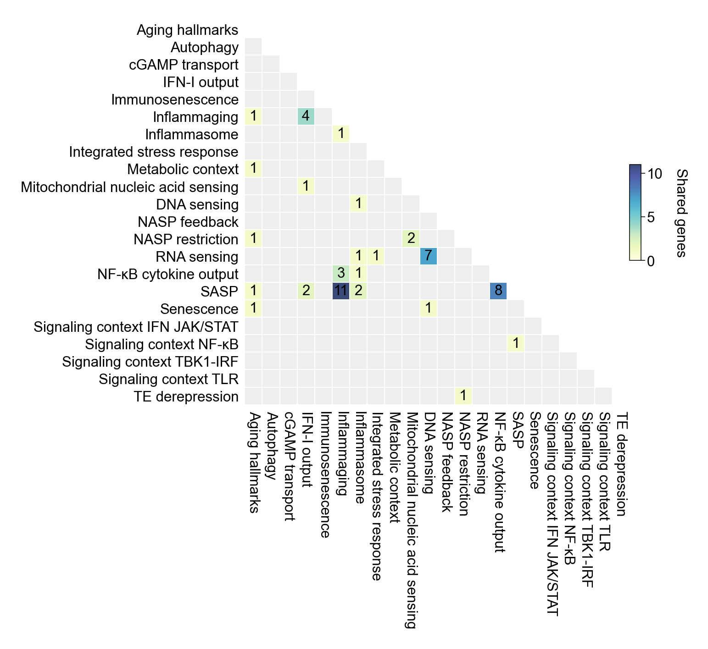

# Marker gene taxonomy

## Modules

- [Aging hallmarks](aging_hallmarks.md)
- [Autophagy](autophagy.md)
- [cGAMP transport](cgamp_transport.md)
- [IFN-I output](ifn_i_output.md)
- [Immunosenescence](immunosenescence.md)
- [Inflammaging](inflammaging.md)
- [Inflammasome](inflammasome.md)
- [Integrated stress response](isr.md)
- [Metabolic context](metabolic_context.md)
- [Mitochondrial nucleic acid sensing](mitochondrial_na_sensing.md)
- [DNA sensing](nasp_dna_sensing.md)
- [NASP feedback](nasp_feedback.md)
- [NASP restriction](nasp_restriction.md)
- [RNA sensing](nasp_rna_sensing.md)
- [NF-κB cytokine output](nfkb_cytokine_output.md)
- [SASP](sasp.md)
- [Senescence](senescence.md)
- [Signaling context IFN JAK/STAT](signaling_context_ifn_jak_stat.md)
- [Signaling context NF-κB](signaling_context_nfkb.md)
- [Signaling context TBK1-IRF](signaling_context_tbk1_irf.md)
- [Signaling context TLR](signaling_context_tlr.md)
- [TE derepression](te_derepression.md)
