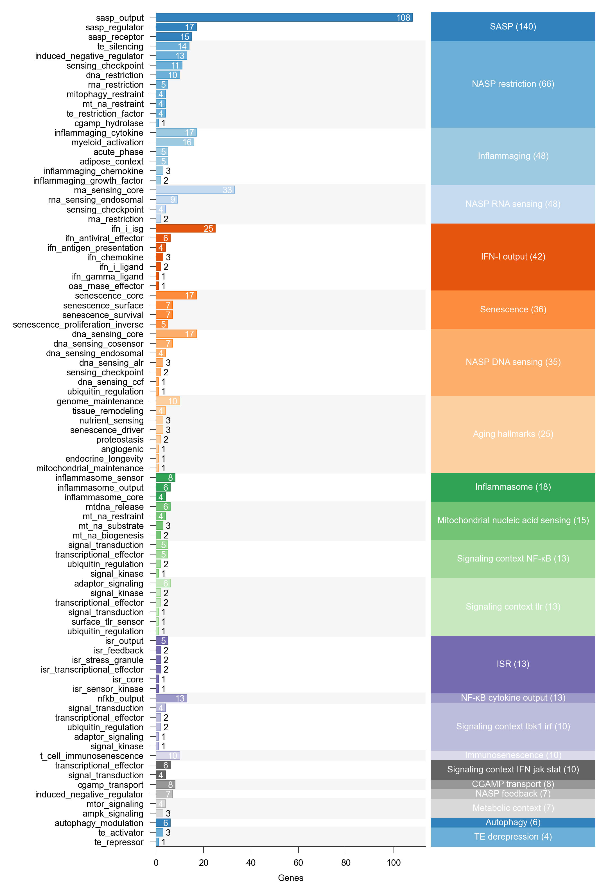

# Marker gene taxonomy

## Modules

- [Aging hallmarks](aging_hallmarks.md)
- [Autophagy](autophagy.md)
- [CGAMP transport](cgamp_transport.md)
- [IFN-I output](ifn_i_output.md)
- [Immunosenescence](immunosenescence.md)
- [Inflammaging](inflammaging.md)
- [Inflammasome](inflammasome.md)
- [ISR](isr.md)
- [Metabolic context](metabolic_context.md)
- [Mitochondrial nucleic acid sensing](mitochondrial_na_sensing.md)
- [NASP DNA sensing](nasp_dna_sensing.md)
- [NASP feedback](nasp_feedback.md)
- [NASP restriction](nasp_restriction.md)
- [NASP RNA sensing](nasp_rna_sensing.md)
- [NF-κB cytokine output](nfkb_cytokine_output.md)
- [SASP](sasp.md)
- [Senescence](senescence.md)
- [Signaling context IFN jak stat](signaling_context_ifn_jak_stat.md)
- [Signaling context NF-κB](signaling_context_nfkb.md)
- [Signaling context tbk1 irf](signaling_context_tbk1_irf.md)
- [Signaling context tlr](signaling_context_tlr.md)
- [TE derepression](te_derepression.md)
