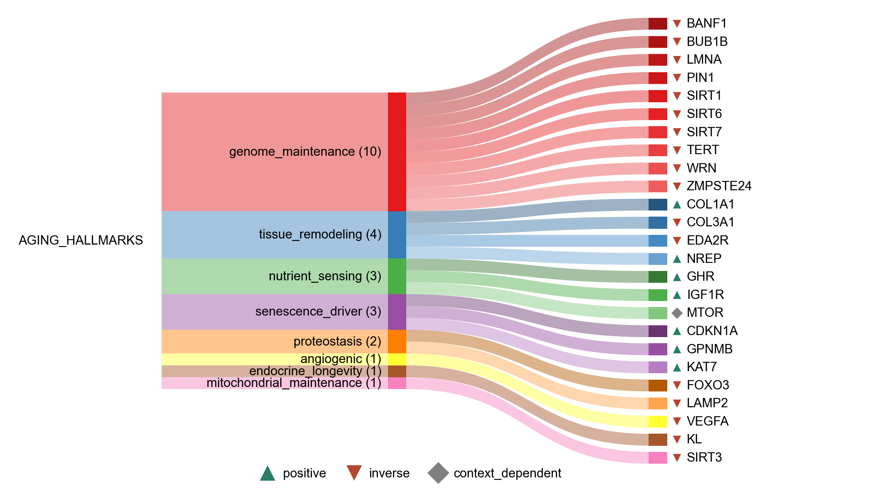

# AGING_HALLMARKS

| Gene | Module Class | Sensor Family | Activation Tier | Scoring Direction | Cell Type Breadth | Detectability | Also in Module(s) | DOI | Aliases | Is_Sensor | Panel Source |
| --- | --- | --- | --- | --- | --- | --- | --- | --- | --- | --- | --- |
| VEGFA | angiogenic |  | Post-NASP | inverse | Broad | high |  | 10.1126/science.abc8479 | VEGF |  |  |
| KL | endocrine_longevity |  | Post-NASP | inverse | Kidney-enriched | low |  | 10.1038/36285 | Klotho |  |  |
| BANF1 | genome_maintenance |  | Post-NASP | inverse | Broad | high |  | 10.1016/j.cell.2022.11.001 |  |  |  |
| BUB1B | genome_maintenance |  | Post-NASP | inverse | Broad | low |  | 10.15252/embj.201386907 |  |  |  |
| LMNA | genome_maintenance |  | Post-NASP | inverse | Broad | high |  | 10.1016/j.cell.2022.11.001 |  |  |  |
| PIN1 | genome_maintenance |  | Post-NASP | inverse | Broad | medium |  | 10.1016/j.celrep.2021.109694 |  |  |  |
| SIRT1 | genome_maintenance |  | Post-NASP | inverse | Broad | low |  | 10.1080/00207454.2022.2057849 |  |  |  |
| SIRT6 | genome_maintenance |  | Post-NASP | inverse | Broad | low |  | 10.1016/j.cell.2019.03.043 |  |  |  |
| SIRT7 | genome_maintenance |  | Post-NASP | inverse | Broad | low |  | 10.1080/00207454.2022.2057849 |  |  |  |
| TERT | genome_maintenance |  | Post-NASP | inverse | Broad | low |  | 10.1016/j.cell.2008.09.034 |  |  |  |
| WRN | genome_maintenance |  | Post-NASP | inverse | Broad | medium |  | 10.1021/bi0266986 |  |  |  |
| ZMPSTE24 | genome_maintenance |  | Post-NASP | inverse | Broad | medium |  | 10.1083/jcb.200801096 |  |  |  |
| SIRT3 | mitochondrial_maintenance |  | Post-NASP | inverse | Broad | low |  | 10.1016/j.celrep.2013.01.005 |  |  |  |
| GHR | nutrient_sensing |  | Post-NASP | positive | Liver/Broad | high |  | 10.1111/acel.13506 |  |  |  |
| IGF1R | nutrient_sensing |  | Post-NASP | positive | Broad | high |  | 10.1016/j.cell.2022.11.001 |  |  |  |
| MTOR | nutrient_sensing |  | Post-NASP | context_dependent | Broad | medium |  | 10.1038/nature08221 |  |  |  |
| FOXO3 | proteostasis |  | Post-NASP | inverse | Broad | high |  | 10.1093/gerona/glab378 |  |  |  |
| LAMP2 | proteostasis |  | Post-NASP | inverse | Broad | high |  | 10.1038/s41586-020-03129-z | LAMP2A |  |  |
| CDKN1A | senescence_driver |  | Post-NASP | positive | Broad | high |  | 10.1038/s41586-026-10542-3 |  |  |  |
| GPNMB | senescence_driver |  | Post-NASP | positive | Immune-enriched | high |  | 10.1038/s41586-026-10542-3 |  |  |  |
| KAT7 | senescence_driver |  | Post-NASP | positive | Broad | medium |  | 10.1126/scitranslmed.abd2655 |  |  |  |
| COL1A1 | tissue_remodeling |  | Post-NASP | positive | Fibroblast-enriched | high |  | 10.1038/s41586-026-10542-3 |  |  |  |
| COL3A1 | tissue_remodeling |  | Post-NASP | inverse | Fibroblast-enriched | high |  | 10.1038/s41586-026-10542-3 |  |  |  |
| EDA2R | tissue_remodeling |  | Post-NASP | inverse | Broad | low |  | 10.1038/s41586-026-10542-3 |  |  |  |
| NREP | tissue_remodeling |  | Post-NASP | positive | Broad | high |  | 10.1038/s41586-026-10542-3 |  |  |  |
