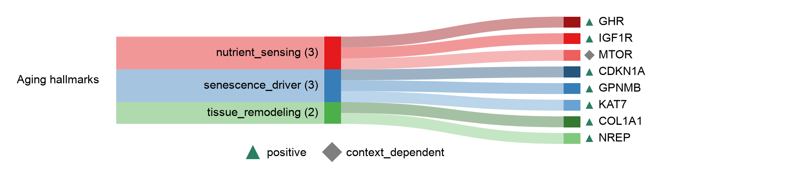

# Aging hallmarks

| Gene | Module Class | Sensor Family | Activation Tier | Scoring Direction | Cell Type Breadth | Detectability | Also in Module(s) | DOI | Aliases | Is_Sensor | Panel Source |
| --- | --- | --- | --- | --- | --- | --- | --- | --- | --- | --- | --- |
| GHR | nutrient_sensing |  | Post-NASP | positive | Liver/Broad | high |  | [10.1111/acel.13506](https://doi.org/10.1111/acel.13506) |  |  |  |
| IGF1R | nutrient_sensing |  | Post-NASP | positive | Broad | high |  | [10.1016/j.cell.2022.11.001](https://doi.org/10.1016/j.cell.2022.11.001) |  |  |  |
| MTOR | nutrient_sensing |  | Post-NASP | context_dependent | Broad | medium |  | [10.1038/nature08221](https://doi.org/10.1038/nature08221) |  |  |  |
| CDKN1A | senescence_driver |  | Post-NASP | positive | Broad | high |  | [10.1038/s41586-026-10542-3](https://doi.org/10.1038/s41586-026-10542-3) |  |  |  |
| GPNMB | senescence_driver |  | Post-NASP | positive | Immune-enriched | high |  | [10.1038/s41586-026-10542-3](https://doi.org/10.1038/s41586-026-10542-3) |  |  |  |
| KAT7 | senescence_driver |  | Post-NASP | positive | Broad | medium |  | [10.1126/scitranslmed.abd2655](https://doi.org/10.1126/scitranslmed.abd2655) |  |  |  |
| COL1A1 | tissue_remodeling |  | Post-NASP | positive | Fibroblast-enriched | high |  | [10.1038/s41586-026-10542-3](https://doi.org/10.1038/s41586-026-10542-3) |  |  |  |
| NREP | tissue_remodeling |  | Post-NASP | positive | Broad | high |  | [10.1038/s41586-026-10542-3](https://doi.org/10.1038/s41586-026-10542-3) |  |  |  |
