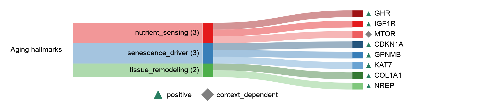

# Aging hallmarks

| Gene | HGNC ID | HGNC Symbol | Entrez ID | Module Class | Sensor Family | Scoring Direction | Single-Cell Detectability | Also in Module(s) | DOI | Aliases | Is_Sensor | Panel Source | DepMap Essential | s_het | s_het Lower 95% | s_het Upper 95% | UniProt ID | Monomer (kDa) | STRING Sensor Partners | STRING Partners |
| --- | --- | --- | --- | --- | --- | --- | --- | --- | --- | --- | --- | --- | --- | --- | --- | --- | --- | --- | --- | --- |
| GHR | HGNC:4263 | GHR | 2690 | nutrient_sensing |  | positive | high |  | [10.1111/acel.13506](https://doi.org/10.1111/acel.13506) |  |  |  | no | 0.0125942 | 0.00460396 | 0.023028 | P10912 | 71.5 | 0 | 47 |
| IGF1R | HGNC:5465 | IGF1R | 3480 | nutrient_sensing |  | positive | high |  | [10.1016/j.cell.2022.11.001](https://doi.org/10.1016/j.cell.2022.11.001) |  |  |  | no | 0.0761572 | 0.0474963 | 0.115862 | P08069 | 154.8 | 0 | 116 |
| MTOR | HGNC:3942 | MTOR | 2475 | nutrient_sensing |  | context_dependent | medium |  | [10.1038/nature08221](https://doi.org/10.1038/nature08221) |  |  |  | yes | 0.141788 | 0.092402 | 0.207585 | P42345 | 288.9 | 1 | 263 |
| CDKN1A | HGNC:1784 | CDKN1A | 1026 | senescence_driver |  | positive | high |  | [10.1038/s41586-026-10542-3](https://doi.org/10.1038/s41586-026-10542-3) |  |  |  | no | 0.0156098 | 0.00145099 | 0.0393901 | P38936 | 18.1 | 0 | 186 |
| GPNMB | HGNC:4462 | GPNMB | 10457 | senescence_driver |  | positive | high |  | [10.1038/s41586-026-10542-3](https://doi.org/10.1038/s41586-026-10542-3) |  |  |  | no | 0.00112645 | 0.000286218 | 0.00260729 | Q14956 | 63.9 | 0 | 10 |
| KAT7 | HGNC:17016 | KAT7 | 11143 | senescence_driver |  | positive | medium |  | [10.1126/scitranslmed.abd2655](https://doi.org/10.1126/scitranslmed.abd2655) |  |  |  | no | 0.381268 | 0.14331 | 0.708711 | O95251 | 70.6 | 1 | 68 |
| COL1A1 | HGNC:2197 | COL1A1 | 1277 | tissue_remodeling |  | positive | high |  | [10.1038/s41586-026-10542-3](https://doi.org/10.1038/s41586-026-10542-3) |  |  |  | no | 0.297986 | 0.160764 | 0.485146 | P02452 | 138.9 | 0 | 89 |
| NREP | HGNC:16834 | NREP | 9315 | tissue_remodeling |  | positive | high |  | [10.1038/s41586-026-10542-3](https://doi.org/10.1038/s41586-026-10542-3) |  |  |  | no | 0.00927797 | 0.000990718 | 0.029346 | Q16612 | 7.9 | 0 | 12 |
