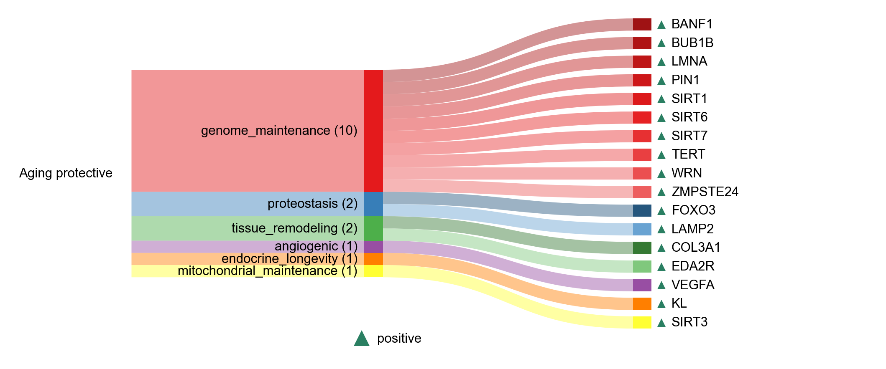

# Aging protective

| Gene | Module Class | Sensor Family | Activation Tier | Scoring Direction | Cell Type Breadth | Detectability | Also in Module(s) | DOI | Aliases | Is_Sensor | Panel Source |
| --- | --- | --- | --- | --- | --- | --- | --- | --- | --- | --- | --- |
| VEGFA | angiogenic |  | Post-NASP | positive | Broad | high |  | [10.1126/science.abc8479](https://doi.org/10.1126/science.abc8479) | VEGF |  |  |
| KL | endocrine_longevity |  | Post-NASP | positive | Kidney-enriched | low |  | [10.1038/36285](https://doi.org/10.1038/36285) | Klotho |  |  |
| BANF1 | genome_maintenance |  | Post-NASP | positive | Broad | high |  | [10.1016/j.cell.2022.11.001](https://doi.org/10.1016/j.cell.2022.11.001) |  |  |  |
| BUB1B | genome_maintenance |  | Post-NASP | positive | Broad | low |  | [10.15252/embj.201386907](https://doi.org/10.15252/embj.201386907) |  |  |  |
| LMNA | genome_maintenance |  | Post-NASP | positive | Broad | high |  | [10.1016/j.cell.2022.11.001](https://doi.org/10.1016/j.cell.2022.11.001) |  |  |  |
| PIN1 | genome_maintenance |  | Post-NASP | positive | Broad | medium |  | [10.1016/j.celrep.2021.109694](https://doi.org/10.1016/j.celrep.2021.109694) |  |  |  |
| SIRT1 | genome_maintenance |  | Post-NASP | positive | Broad | low |  | [10.1080/00207454.2022.2057849](https://doi.org/10.1080/00207454.2022.2057849) |  |  |  |
| SIRT6 | genome_maintenance |  | Post-NASP | positive | Broad | low |  | [10.1016/j.cell.2019.03.043](https://doi.org/10.1016/j.cell.2019.03.043) |  |  |  |
| SIRT7 | genome_maintenance |  | Post-NASP | positive | Broad | low |  | [10.1080/00207454.2022.2057849](https://doi.org/10.1080/00207454.2022.2057849) |  |  |  |
| TERT | genome_maintenance |  | Post-NASP | positive | Broad | low |  | [10.1016/j.cell.2008.09.034](https://doi.org/10.1016/j.cell.2008.09.034) |  |  |  |
| WRN | genome_maintenance |  | Post-NASP | positive | Broad | medium |  | [10.1021/bi0266986](https://doi.org/10.1021/bi0266986) |  |  |  |
| ZMPSTE24 | genome_maintenance |  | Post-NASP | positive | Broad | medium |  | [10.1083/jcb.200801096](https://doi.org/10.1083/jcb.200801096) |  |  |  |
| SIRT3 | mitochondrial_maintenance |  | Post-NASP | positive | Broad | low |  | [10.1016/j.celrep.2013.01.005](https://doi.org/10.1016/j.celrep.2013.01.005) |  |  |  |
| FOXO3 | proteostasis |  | Post-NASP | positive | Broad | high |  | [10.1093/gerona/glab378](https://doi.org/10.1093/gerona/glab378) |  |  |  |
| LAMP2 | proteostasis |  | Post-NASP | positive | Broad | high |  | [10.1038/s41586-020-03129-z](https://doi.org/10.1038/s41586-020-03129-z) | LAMP2A |  |  |
| COL3A1 | tissue_remodeling |  | Post-NASP | positive | Fibroblast-enriched | high |  | [10.1038/s41586-026-10542-3](https://doi.org/10.1038/s41586-026-10542-3) |  |  |  |
| EDA2R | tissue_remodeling |  | Post-NASP | positive | Broad | low |  | [10.1038/s41586-026-10542-3](https://doi.org/10.1038/s41586-026-10542-3) |  |  |  |
