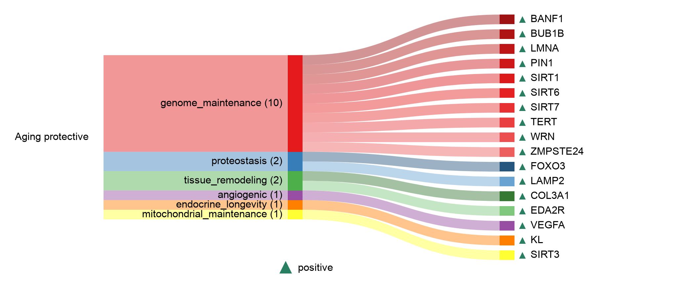

# Aging protective

| Gene | HGNC ID | HGNC Symbol | Entrez ID | Module Class | Sensor Family | Activation Tier | Scoring Direction | Cell Type Breadth | Detectability | Also in Module(s) | DOI | Aliases | Is_Sensor | Panel Source | DepMap Essential | s_het | s_het Lower 95% | s_het Upper 95% | UniProt ID | Monomer (kDa) | STRING Sensor Partners |
| --- | --- | --- | --- | --- | --- | --- | --- | --- | --- | --- | --- | --- | --- | --- | --- | --- | --- | --- | --- | --- | --- |
| VEGFA | HGNC:12680 | VEGFA | 7422 | angiogenic |  | Post-NASP | positive | Broad | high |  | [10.1126/science.abc8479](https://doi.org/10.1126/science.abc8479) | VEGF |  |  | no | 0.0158462 | 0.00612022 | 0.028292 | P15692 | 43.6 | 0 |
| KL | HGNC:6344 | KL | 9365 | endocrine_longevity |  | Post-NASP | positive | Kidney-enriched | low |  | [10.1038/36285](https://doi.org/10.1038/36285) | Klotho |  |  | no | 0.010803 | 0.00158153 | 0.0234974 | Q9UEF7 | 116.2 | 2 |
| BANF1 | HGNC:17397 | BANF1 | 8815 | genome_maintenance |  | Post-NASP | positive | Broad | high |  | [10.1016/j.cell.2022.11.001](https://doi.org/10.1016/j.cell.2022.11.001) |  |  |  | yes | 0.174989 | 0.00826872 | 0.591726 | O75531 | 10.1 | 0 |
| BUB1B | HGNC:1149 | BUB1B | 701 | genome_maintenance |  | Post-NASP | positive | Broad | low |  | [10.15252/embj.201386907](https://doi.org/10.15252/embj.201386907) |  |  |  | yes | 0.0163418 | 0.0077209 | 0.025935 | O60566 | 119.5 | 0 |
| LMNA | HGNC:6636 | LMNA | 4000 | genome_maintenance |  | Post-NASP | positive | Broad | high |  | [10.1016/j.cell.2022.11.001](https://doi.org/10.1016/j.cell.2022.11.001) |  |  |  | no | 0.19495 | 0.0753944 | 0.3956 | P02545 | 74.1 | 4 |
| PIN1 | HGNC:8988 | PIN1 | 5300 | genome_maintenance |  | Post-NASP | positive | Broad | medium |  | [10.1016/j.celrep.2021.109694](https://doi.org/10.1016/j.celrep.2021.109694) |  |  |  | no | 0.0712988 | 0.0233922 | 0.151827 | Q13526 | 18.2 | 0 |
| SIRT1 | HGNC:14929 | SIRT1 | 23411 | genome_maintenance |  | Post-NASP | positive | Broad | low |  | [10.1080/00207454.2022.2057849](https://doi.org/10.1080/00207454.2022.2057849) |  |  |  | no | 0.073524 | 0.0404218 | 0.121336 | Q96EB6 | 81.7 | 2 |
| SIRT6 | HGNC:14934 | SIRT6 | 51548 | genome_maintenance |  | Post-NASP | positive | Broad | low |  | [10.1016/j.cell.2019.03.043](https://doi.org/10.1016/j.cell.2019.03.043) |  |  |  | no | 0.0164899 | 0.00518895 | 0.0324378 | Q8N6T7 | 39.1 | 3 |
| SIRT7 | HGNC:14935 | SIRT7 | 51547 | genome_maintenance |  | Post-NASP | positive | Broad | low |  | [10.1080/00207454.2022.2057849](https://doi.org/10.1080/00207454.2022.2057849) |  |  |  | no | 0.0244507 | 0.0112295 | 0.0428504 | Q9NRC8 | 44.9 | 1 |
| TERT | HGNC:11730 | TERT | 7015 | genome_maintenance |  | Post-NASP | positive | Broad | low |  | [10.1016/j.cell.2008.09.034](https://doi.org/10.1016/j.cell.2008.09.034) |  |  |  | no | 0.0795479 | 0.0354856 | 0.151706 | O14746 | 127.0 | 2 |
| WRN | HGNC:12791 | WRN | 7486 | genome_maintenance |  | Post-NASP | positive | Broad | medium |  | [10.1021/bi0266986](https://doi.org/10.1021/bi0266986) |  |  |  | no | 0.00270401 | 0.000652626 | 0.00631689 | Q14191 | 162.5 | 5 |
| ZMPSTE24 | HGNC:12877 | ZMPSTE24 | 10269 | genome_maintenance |  | Post-NASP | positive | Broad | medium |  | [10.1083/jcb.200801096](https://doi.org/10.1083/jcb.200801096) |  |  |  | no | 0.0044338 | 0.00118282 | 0.00961157 | O75844 | 54.8 | 0 |
| SIRT3 | HGNC:14931 | SIRT3 | 23410 | mitochondrial_maintenance |  | Post-NASP | positive | Broad | low |  | [10.1016/j.celrep.2013.01.005](https://doi.org/10.1016/j.celrep.2013.01.005) |  |  |  | no | 0.000772583 | 0.000107828 | 0.00229333 | Q9NTG7 | 43.6 | 1 |
| FOXO3 | HGNC:3821 | FOXO3 | 2309 | proteostasis |  | Post-NASP | positive | Broad | high |  | [10.1093/gerona/glab378](https://doi.org/10.1093/gerona/glab378) |  |  |  | no | 0.188102 | 0.0876653 | 0.32648 | O43524 | 71.3 | 0 |
| LAMP2 | HGNC:6501 | LAMP2 | 3920 | proteostasis |  | Post-NASP | positive | Broad | high |  | [10.1038/s41586-020-03129-z](https://doi.org/10.1038/s41586-020-03129-z) | LAMP2A |  |  | no | 0.0617056 | 0.00916051 | 0.183911 | P13473 | 45.0 | 0 |
| COL3A1 | HGNC:2201 | COL3A1 | 1281 | tissue_remodeling |  | Post-NASP | positive | Fibroblast-enriched | high |  | [10.1038/s41586-026-10542-3](https://doi.org/10.1038/s41586-026-10542-3) |  |  |  | no | 0.226956 | 0.130039 | 0.357452 | P02461 | 138.6 | 0 |
| EDA2R | HGNC:17756 | EDA2R | 60401 | tissue_remodeling |  | Post-NASP | positive | Broad | low |  | [10.1038/s41586-026-10542-3](https://doi.org/10.1038/s41586-026-10542-3) |  |  |  | no | 0.00393007 | 0.000544217 | 0.0102889 | Q9HAV5 | 32.8 | 0 |
