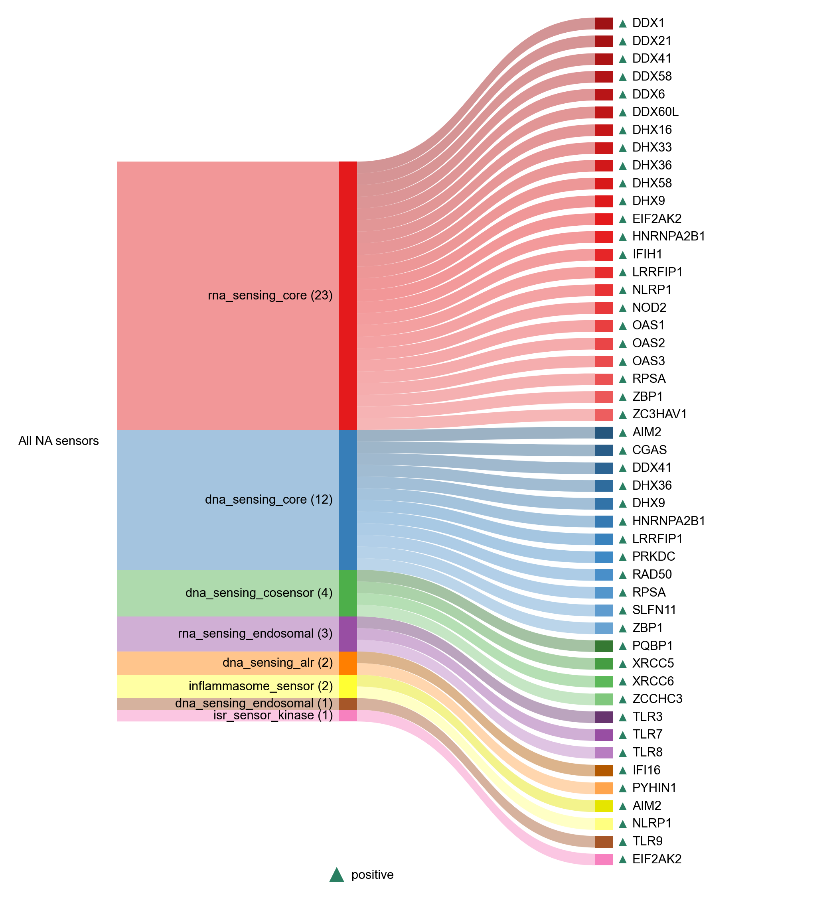

# All NA sensors

| Gene | HGNC ID | HGNC Symbol | Entrez ID | Module | Module Class | Sensor Family | Activation Tier | Scoring Direction | Cell Type Breadth | Detectability | Also in Module(s) | DOI | Aliases | Is_Sensor | Panel Source | DepMap Essential | s_het | s_het Lower 95% | s_het Upper 95% | UniProt ID | Monomer (kDa) | STRING Sensor Partners |
| --- | --- | --- | --- | --- | --- | --- | --- | --- | --- | --- | --- | --- | --- | --- | --- | --- | --- | --- | --- | --- | --- | --- |
| AIM2 | HGNC:357 | AIM2 | 9447 | INFLAMMASOME | inflammasome_sensor | ALR | Early | positive | Immune-enriched | low |  | [10.1016/j.jsb.2017.08.001](https://doi.org/10.1016/j.jsb.2017.08.001) |  | dna_sensor |  | no | 0.0018237 | 0.000355671 | 0.00469457 | O14862 | 39.0 | 4 |
| NLRP1 | HGNC:14374 | NLRP1 | 22861 | INFLAMMASOME | inflammasome_sensor | NLR | Early | positive | Immune-enriched | medium | NASP_RNA_SENSING | [10.1126/science.abd0811](https://doi.org/10.1126/science.abd0811) |  | rna_sensor |  | no | 0.00268723 | 0.000677947 | 0.00615108 | Q9C000 | 165.9 | 4 |
| EIF2AK2 | HGNC:9437 | EIF2AK2 | 5610 | ISR | isr_sensor_kinase | PKR | Early | positive | Broad | high | NASP_RNA_SENSING | [10.1016/S1357-2725(96)00169-0](https://doi.org/10.1016/S1357-2725(96)00169-0) |  | rna_sensor |  | no | 0.021497 | 0.0105888 | 0.0355189 | P19525 | 62.1 | 7 |
| IFI16 | HGNC:5395 | IFI16 | 3428 | NASP_DNA_SENSING | dna_sensing_alr | ALR | Early | positive | Broad | high | INFLAMMASOME | [10.1038/ni.1932](https://doi.org/10.1038/ni.1932) |  | dna_sensor |  | no | 0.00360891 | 0.000111916 | 0.0145265 | Q16666 | 88.3 | 17 |
| PYHIN1 | HGNC:28894 | PYHIN1 | 149628 | NASP_DNA_SENSING | dna_sensing_alr | ALR | Early | positive | Broad | medium |  | [10.15252/msb.20145808](https://doi.org/10.15252/msb.20145808) | IFIX | dna_sensor |  | no | 0.000955454 | 6.95973e-05 | 0.00327121 | Q6K0P9 | 55.1 | 3 |
| AIM2 | HGNC:357 | AIM2 | 9447 | NASP_DNA_SENSING | dna_sensing_core | ALR | Early | positive | Immune-enriched | low |  | [10.1038/ni.1702](https://doi.org/10.1038/ni.1702) |  | dna_sensor |  | no | 0.0018237 | 0.000355671 | 0.00469457 | O14862 | 39.0 | 4 |
| CGAS | HGNC:21367 | CGAS | 115004 | NASP_DNA_SENSING | dna_sensing_core | cGAS-STING | Early | positive | Broad | low |  | [10.1126/science.1229963](https://doi.org/10.1126/science.1229963) | MB21D1 | dna_sensor |  | no | 0.00114308 | 0.000111287 | 0.00362328 | Q8N884 | 58.8 | 2 |
| DDX41 | HGNC:18674 | DDX41 | 51428 | NASP_DNA_SENSING | dna_sensing_core | cGAS-STING | Early | positive | Immune-enriched | low |  | [10.1038/ni.2091](https://doi.org/10.1038/ni.2091) |  | dna_sensor; rna_sensor |  | yes | 0.0202501 | 0.0114355 | 0.0308882 | Q9UJV9 | 69.8 | 4 |
| DHX36 | HGNC:14410 | DHX36 | 170506 | NASP_DNA_SENSING | dna_sensing_core | Multi | Early | positive | Immune-enriched | medium | NASP_RNA_SENSING | [10.1038/s41467-019-10432-5](https://doi.org/10.1038/s41467-019-10432-5) |  | dna_sensor; rna_sensor |  | yes | 0.0634367 | 0.041011 | 0.0922737 | Q9H2U1 | 114.8 | 7 |
| DHX9 | HGNC:2750 | DHX9 | 1660 | NASP_DNA_SENSING | dna_sensing_core | RLR | Early | positive | Immune-enriched | medium |  | [10.4049/jimmunol.1101307](https://doi.org/10.4049/jimmunol.1101307) |  | dna_sensor; rna_sensor |  | yes | 0.484762 | 0.188918 | 0.858618 | Q08211 | 141.0 | 14 |
| HNRNPA2B1 | HGNC:5033 | HNRNPA2B1 | 3181 | NASP_DNA_SENSING | dna_sensing_core |  | Early | positive | Broad | high |  | [10.1126/science.aav0758](https://doi.org/10.1126/science.aav0758) |  | dna_sensor; rna_sensor |  | no | 0.341931 | 0.087894 | 0.758554 | P22626 | 37.4 | 3 |
| LRRFIP1 | HGNC:6702 | LRRFIP1 | 9208 | NASP_DNA_SENSING | dna_sensing_core | cGAS-STING | Early | positive | Broad | high |  | [10.1038/ni.1876](https://doi.org/10.1038/ni.1876) |  | dna_sensor; rna_sensor |  | no | 0.0151172 | 0.00422464 | 0.0277294 | Q32MZ4 | 89.3 | 1 |
| PRKDC | HGNC:9413 | PRKDC | 5591 | NASP_DNA_SENSING | dna_sensing_core |  | Early | positive | Broad | high |  | [10.7554/eLife.00047](https://doi.org/10.7554/eLife.00047) | DNA-PK | dna_sensor |  | yes | 0.511914 | 0.277572 | 0.820253 | P78527 | 469.1 | 3 |
| RAD50 | HGNC:9816 | RAD50 | 10111 | NASP_DNA_SENSING | dna_sensing_core | cGAS-STING | Early | positive | Broad | medium |  | [10.1038/s41586-023-06889-6](https://doi.org/10.1038/s41586-023-06889-6) |  | dna_sensor |  | no | 0.00449025 | 0.00149327 | 0.00869434 | Q92878 | 153.9 | 3 |
| RPSA | HGNC:6502 | RPSA | 3921 | NASP_DNA_SENSING | dna_sensing_core |  | Early | positive | Broad | high |  | [10.1038/s41467-023-43784-0](https://doi.org/10.1038/s41467-023-43784-0) |  | dna_sensor; rna_sensor |  | yes | 0.117622 | 7.34944e-07 | 0.976037 | P08865 | 32.9 | 2 |
| SLFN11 | HGNC:26633 | SLFN11 | 91607 | NASP_DNA_SENSING | dna_sensing_core |  | Active | positive | Broad | low |  | [10.1126/sciimmunol.adj5465](https://doi.org/10.1126/sciimmunol.adj5465) |  | dna_sensor |  | no | 0.00129516 | 0.000101987 | 0.00441139 | Q7Z7L1 | 102.8 | 7 |
| ZBP1 | HGNC:16176 | ZBP1 | 81030 | NASP_DNA_SENSING | dna_sensing_core | ZBP1 | Early | positive | Broad | low | IFN_I_OUTPUT | [10.1038/nature06013](https://doi.org/10.1038/nature06013) |  | dna_sensor; rna_sensor |  | no | 0.00100338 | 0.000110625 | 0.00300173 | Q9H171 | 46.3 | 0 |
| PQBP1 | HGNC:9330 | PQBP1 | 10084 | NASP_DNA_SENSING | dna_sensing_cosensor | cGAS-STING | Early | positive | Broad | medium |  | [10.1016/j.cell.2015.04.050](https://doi.org/10.1016/j.cell.2015.04.050) |  | dna_sensor |  | no | 0.28116 | 0.072192 | 0.620012 | O60828 | 30.5 | 1 |
| XRCC5 | HGNC:12833 | XRCC5 | 7520 | NASP_DNA_SENSING | dna_sensing_cosensor | cGAS-STING | Early | positive | Broad | high |  | [10.7554/eLife.00047](https://doi.org/10.7554/eLife.00047) |  | dna_sensor |  | yes | 0.137787 | 0.0715512 | 0.234114 | P13010 | 82.7 | 4 |
| XRCC6 | HGNC:4055 | XRCC6 | 2547 | NASP_DNA_SENSING | dna_sensing_cosensor | cGAS-STING | Early | positive | Broad | high |  | [10.1111/imm.13318](https://doi.org/10.1111/imm.13318) | ku70 | dna_sensor |  | yes | 0.157937 | 0.0684247 | 0.29981 | P12956 | 69.8 | 5 |
| ZCCHC3 | HGNC:16230 | ZCCHC3 | 85364 | NASP_DNA_SENSING | dna_sensing_cosensor | cGAS-STING | Early | positive | Broad | low |  | [10.1038/s41467-018-05559-w](https://doi.org/10.1038/s41467-018-05559-w) |  | dna_sensor |  | no | 0.0242711 | 0.000278821 | 0.108598 | Q9NUD5 | 43.5 | 5 |
| TLR9 | HGNC:15633 | TLR9 | 54106 | NASP_DNA_SENSING | dna_sensing_endosomal | TLR | Early | positive | Immune-enriched | low | IFN_I_OUTPUT | [10.1038/35047123](https://doi.org/10.1038/35047123) |  | dna_sensor |  | no | 0.00784932 | 0.000734228 | 0.0209074 | Q9NR96 | 115.9 | 3 |
| DDX1 | HGNC:2734 | DDX1 | 1653 | NASP_RNA_SENSING | rna_sensing_core | RLR | Early | positive | Broad | medium |  | [10.1016/j.immuni.2011.03.027](https://doi.org/10.1016/j.immuni.2011.03.027) |  | rna_sensor |  | no | 0.0859529 | 0.0401584 | 0.155416 | Q92499 | 82.4 | 5 |
| DDX21 | HGNC:2744 | DDX21 | 9188 | NASP_RNA_SENSING | rna_sensing_core | RLR | Early | positive | Broad | high |  | [10.1016/j.bbrc.2016.03.120](https://doi.org/10.1016/j.bbrc.2016.03.120) |  | rna_sensor |  | yes | 0.16497 | 0.0879762 | 0.273351 | Q9NR30 | 87.3 | 5 |
| DDX41 | HGNC:18674 | DDX41 | 51428 | NASP_RNA_SENSING | rna_sensing_core | cGAS-STING | Early | positive | Immune-enriched | low |  | [10.1038/ni.2091](https://doi.org/10.1038/ni.2091) |  | dna_sensor; rna_sensor |  | yes | 0.0202501 | 0.0114355 | 0.0308882 | Q9UJV9 | 69.8 | 4 |
| DDX58 | HGNC:19102 | RIGI | 23586 | NASP_RNA_SENSING | rna_sensing_core | RLR | Early | positive | Broad | high |  | [10.1038/ni1087](https://doi.org/10.1038/ni1087) | RIGI; RIG-I | rna_sensor |  | no | 0.00126183 | 0.000250545 | 0.00321646 | O95786 | 106.6 | 7 |
| DDX6 | HGNC:2747 | DDX6 | 1656 | NASP_RNA_SENSING | rna_sensing_core | RLR | Active | positive | Broad | high |  | [10.3390/ijms19071877](https://doi.org/10.3390/ijms19071877) |  | rna_sensor |  | yes | 0.308015 | 0.138564 | 0.536945 | P26196 | 54.4 | 4 |
| DDX60L | HGNC:26429 | DDX60L | 91351 | NASP_RNA_SENSING | rna_sensing_core | RLR | Active | positive | Broad | high |  | [10.1128/JVI.01297-15](https://doi.org/10.1128/JVI.01297-15) |  | rna_sensor |  | no | 0.00049094 | 5.76932e-05 | 0.00146029 | Q5H9U9 | 197.6 | 1 |
| DHX16 | HGNC:2739 | DHX16 | 8449 | NASP_RNA_SENSING | rna_sensing_core | RLR | Active | positive | Broad | low |  | [10.1016/j.celrep.2022.110434](https://doi.org/10.1016/j.celrep.2022.110434) |  | rna_sensor |  | yes | 0.0161568 | 0.0102602 | 0.0224928 | O60231 | 119.3 | 3 |
| DHX33 | HGNC:16718 | DHX33 | 56919 | NASP_RNA_SENSING | rna_sensing_core | RLR | Active | positive | Broad | low |  | [10.1016/j.immuni.2013.07.001](https://doi.org/10.1016/j.immuni.2013.07.001) |  | rna_sensor |  | yes | 0.0066547 | 0.00215864 | 0.0132931 | Q9H6R0 | 78.9 | 3 |
| DHX36 | HGNC:14410 | DHX36 | 170506 | NASP_RNA_SENSING | rna_sensing_core | RLR | Early | positive | Immune-enriched | medium | NASP_RNA_SENSING | [10.1038/s41467-019-10432-5](https://doi.org/10.1038/s41467-019-10432-5) |  | dna_sensor; rna_sensor |  | yes | 0.0634367 | 0.041011 | 0.0922737 | Q9H2U1 | 114.8 | 7 |
| DHX58 | HGNC:29517 | DHX58 | 79132 | NASP_RNA_SENSING | rna_sensing_core | RLR | Early | positive | Broad | low |  | [10.1073/pnas.0606699104](https://doi.org/10.1073/pnas.0606699104) | LGP2 | rna_sensor |  | no | 0.000752953 | 9.14163e-05 | 0.00231151 | Q96C10 | 76.6 | 4 |
| DHX9 | HGNC:2750 | DHX9 | 1660 | NASP_RNA_SENSING | rna_sensing_core | Multi | Early | positive | Immune-enriched | medium |  | [10.4049/jimmunol.1101307](https://doi.org/10.4049/jimmunol.1101307) |  | dna_sensor; rna_sensor |  | yes | 0.484762 | 0.188918 | 0.858618 | Q08211 | 141.0 | 14 |
| EIF2AK2 | HGNC:9437 | EIF2AK2 | 5610 | NASP_RNA_SENSING | rna_sensing_core | PKR | Early | positive | Broad | high | NASP_RNA_SENSING | [10.1073/pnas.75.3.1121](https://doi.org/10.1073/pnas.75.3.1121) |  | rna_sensor |  | no | 0.021497 | 0.0105888 | 0.0355189 | P19525 | 62.1 | 7 |
| HNRNPA2B1 | HGNC:5033 | HNRNPA2B1 | 3181 | NASP_RNA_SENSING | rna_sensing_core |  | Early | positive | Broad | high |  | [10.1126/science.aav0758](https://doi.org/10.1126/science.aav0758) |  | dna_sensor; rna_sensor |  | no | 0.341931 | 0.087894 | 0.758554 | P22626 | 37.4 | 3 |
| IFIH1 | HGNC:18873 | IFIH1 | 64135 | NASP_RNA_SENSING | rna_sensing_core | RLR | Early | positive | Broad | medium |  | [10.1038/nature04734](https://doi.org/10.1038/nature04734) | MDA5 | rna_sensor |  | no | 0.000352594 | 4.69686e-05 | 0.000982979 | Q9BYX4 | 116.7 | 5 |
| LRRFIP1 | HGNC:6702 | LRRFIP1 | 9208 | NASP_RNA_SENSING | rna_sensing_core | cGAS-STING | Early | positive | Broad | high |  | [10.1038/ni.1876](https://doi.org/10.1038/ni.1876) |  | dna_sensor; rna_sensor |  | no | 0.0151172 | 0.00422464 | 0.0277294 | Q32MZ4 | 89.3 | 1 |
| NLRP1 | HGNC:14374 | NLRP1 | 22861 | NASP_RNA_SENSING | rna_sensing_core | NLR | Early | positive | Immune-enriched | medium | NASP_RNA_SENSING | [10.1126/science.abd0811](https://doi.org/10.1126/science.abd0811) |  | rna_sensor |  | no | 0.00268723 | 0.000677947 | 0.00615108 | Q9C000 | 165.9 | 4 |
| NOD2 | HGNC:5331 | NOD2 | 64127 | NASP_RNA_SENSING | rna_sensing_core | NLR | Active | positive | Immune-enriched | low |  | [10.1038/mi.2011.29](https://doi.org/10.1038/mi.2011.29) |  | rna_sensor |  | no | 0.000512573 | 5.76673e-05 | 0.00158425 | Q9HC29 | 115.3 | 2 |
| OAS1 | HGNC:8086 | OAS1 | 4938 | NASP_RNA_SENSING | rna_sensing_core | OAS | Early | positive | Broad | medium | NASP_RNA_SENSING | [10.1073/pnas.1218528110](https://doi.org/10.1073/pnas.1218528110) |  | rna_sensor |  | no | 0.00059546 | 1.32388e-05 | 0.00273409 | P00973 | 46.0 | 2 |
| OAS2 | HGNC:8087 | OAS2 | 4939 | NASP_RNA_SENSING | rna_sensing_core | OAS | Early | positive | Broad | medium | NASP_RNA_SENSING | [10.1089/jir.2023.0098](https://doi.org/10.1089/jir.2023.0098) |  | rna_sensor |  | no | 0.000662365 | 4.27627e-05 | 0.00228191 | P29728 | 82.4 | 2 |
| OAS3 | HGNC:8088 | OAS3 | 4940 | NASP_RNA_SENSING | rna_sensing_core | OAS | Early | positive | Broad | low | NASP_RNA_SENSING | [10.1089/jir.2023.0098](https://doi.org/10.1089/jir.2023.0098) |  | rna_sensor |  | no | 0.000449835 | 6.1863e-05 | 0.0012743 | Q9Y6K5 | 121.2 | 2 |
| RPSA | HGNC:6502 | RPSA | 3921 | NASP_RNA_SENSING | rna_sensing_core |  | Early | positive | Broad | high |  | [10.1038/s41467-023-43784-0](https://doi.org/10.1038/s41467-023-43784-0) |  | dna_sensor; rna_sensor |  | yes | 0.117622 | 7.34944e-07 | 0.976037 | P08865 | 32.9 | 2 |
| ZBP1 | HGNC:16176 | ZBP1 | 81030 | NASP_RNA_SENSING | rna_sensing_core | ZBP1 | Early | positive | Broad | low | IFN_I_OUTPUT | [10.1038/nature06013](https://doi.org/10.1038/nature06013) |  | dna_sensor; rna_sensor |  | no | 0.00100338 | 0.000110625 | 0.00300173 | Q9H171 | 46.3 | 0 |
| ZC3HAV1 | HGNC:23721 | ZC3HAV1 | 56829 | NASP_RNA_SENSING | rna_sensing_core |  | Early | positive | Broad | high |  | [10.1038/s42003-024-07116-2](https://doi.org/10.1038/s42003-024-07116-2) | ZAP; PARP13 | rna_sensor |  | no | 0.0240001 | 0.0120118 | 0.0390374 | Q7Z2W4 | 101.4 | 2 |
| TLR3 | HGNC:11849 | TLR3 | 7098 | NASP_RNA_SENSING | rna_sensing_endosomal | TLR | Early | positive | Immune-enriched | low | IFN_I_OUTPUT | [10.1038/35099560](https://doi.org/10.1038/35099560) |  | rna_sensor |  | no | 0.00836415 | 0.00267059 | 0.0168594 | O15455 | 103.8 | 3 |
| TLR7 | HGNC:15631 | TLR7 | 51284 | NASP_RNA_SENSING | rna_sensing_endosomal | TLR | Early | positive | Immune-enriched | low | IFN_I_OUTPUT | [10.1126/science.1093620](https://doi.org/10.1126/science.1093620) |  | rna_sensor |  | no | 0.138111 | 0.0348474 | 0.333808 | Q9NYK1 | 120.9 | 3 |
| TLR8 | HGNC:15632 | TLR8 | 51311 | NASP_RNA_SENSING | rna_sensing_endosomal | TLR | Early | positive | Immune-enriched | low | NFKB_CYTOKINE_OUTPUT\|IFN_I_OUTPUT | [10.1126/science.1093620](https://doi.org/10.1126/science.1093620) |  | rna_sensor |  | no | 0.0544855 | 0.0236934 | 0.105398 | Q9NR97 | 119.8 | 4 |
