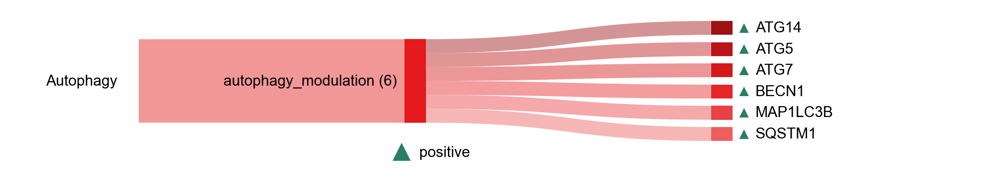

# Autophagy

| Gene | Module Class | Sensor Family | Activation Tier | Scoring Direction | Cell Type Breadth | Detectability | Also in Module(s) | DOI | Aliases | Is_Sensor | Panel Source |
| --- | --- | --- | --- | --- | --- | --- | --- | --- | --- | --- | --- |
| ATG14 | autophagy_modulation |  | Active | positive | Broad | medium |  | [10.1080/15548627.2021.1899440](https://doi.org/10.1080/15548627.2021.1899440) |  |  |  |
| ATG5 | autophagy_modulation |  | Active | positive | Broad | high |  | [10.1038/s41586-019-1006-9](https://doi.org/10.1038/s41586-019-1006-9) |  |  |  |
| ATG7 | autophagy_modulation |  | Active | positive | Broad | high |  | [10.1080/15548627.2021.1899440](https://doi.org/10.1080/15548627.2021.1899440) |  |  |  |
| BECN1 | autophagy_modulation |  | Active | positive | Broad | low |  | [10.1016/j.chom.2014.01.009](https://doi.org/10.1016/j.chom.2014.01.009) |  |  |  |
| MAP1LC3B | autophagy_modulation |  | Active | positive | Broad | high |  | [10.1038/s41586-019-1006-9](https://doi.org/10.1038/s41586-019-1006-9) |  |  |  |
| SQSTM1 | autophagy_modulation |  | Active | positive | Broad | high |  | [10.15252/embj.201797858](https://doi.org/10.15252/embj.201797858) |  |  |  |
