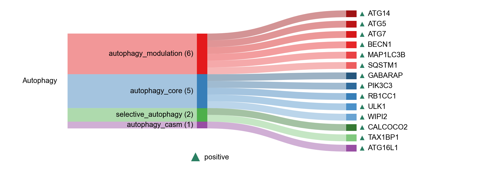

# Autophagy

| Gene | Module Class | Sensor Family | Activation Tier | Scoring Direction | Cell Type Breadth | Detectability | Also in Module(s) | DOI | Aliases | Is_Sensor | Panel Source |
| --- | --- | --- | --- | --- | --- | --- | --- | --- | --- | --- | --- |
| ATG16L1 | autophagy_casm | cGAS-STING | Active | positive | Broad | low |  | [10.1083/jcb.202009128](https://doi.org/10.1083/jcb.202009128) |  |  |  |
| GABARAP | autophagy_core |  | Active | positive | Broad | high |  | [10.1038/emboj.2010.74](https://doi.org/10.1038/emboj.2010.74) |  |  |  |
| PIK3C3 | autophagy_core |  | Active | positive | Broad | medium |  | [10.1091/mbc.e08-01-0080](https://doi.org/10.1091/mbc.e08-01-0080) |  |  |  |
| RB1CC1 | autophagy_core |  | Active | positive | Broad | high |  | [10.1091/mbc.e08-12-1249](https://doi.org/10.1091/mbc.e08-12-1249) | FIP200 |  |  |
| ULK1 | autophagy_core |  | Active | positive | Broad | medium |  | [10.1091/mbc.e08-12-1249](https://doi.org/10.1091/mbc.e08-12-1249) |  |  |  |
| WIPI2 | autophagy_core |  | Active | positive | Broad | medium |  | [10.1016/j.molcel.2014.05.021](https://doi.org/10.1016/j.molcel.2014.05.021) |  |  |  |
| ATG14 | autophagy_modulation |  | Active | positive | Broad | medium |  | [10.1080/15548627.2021.1899440](https://doi.org/10.1080/15548627.2021.1899440) |  |  |  |
| ATG5 | autophagy_modulation |  | Active | positive | Broad | high |  | [10.1038/s41586-019-1006-9](https://doi.org/10.1038/s41586-019-1006-9) |  |  |  |
| ATG7 | autophagy_modulation |  | Active | positive | Broad | high |  | [10.1080/15548627.2021.1899440](https://doi.org/10.1080/15548627.2021.1899440) |  |  |  |
| BECN1 | autophagy_modulation |  | Active | positive | Broad | low |  | [10.1016/j.chom.2014.01.009](https://doi.org/10.1016/j.chom.2014.01.009) |  |  |  |
| MAP1LC3B | autophagy_modulation |  | Active | positive | Broad | high |  | [10.1038/s41586-019-1006-9](https://doi.org/10.1038/s41586-019-1006-9) |  |  |  |
| SQSTM1 | autophagy_modulation |  | Active | positive | Broad | high |  | [10.15252/embj.201797858](https://doi.org/10.15252/embj.201797858) |  |  |  |
| CALCOCO2 | selective_autophagy |  | Active | positive | Broad | medium |  | [10.1038/ni.1800](https://doi.org/10.1038/ni.1800) | NDP52 |  |  |
| TAX1BP1 | selective_autophagy | TLR | Active | positive | Broad | high | NASP_FEEDBACK | [10.1371/journal.ppat.1006600](https://doi.org/10.1371/journal.ppat.1006600) |  |  |  |
