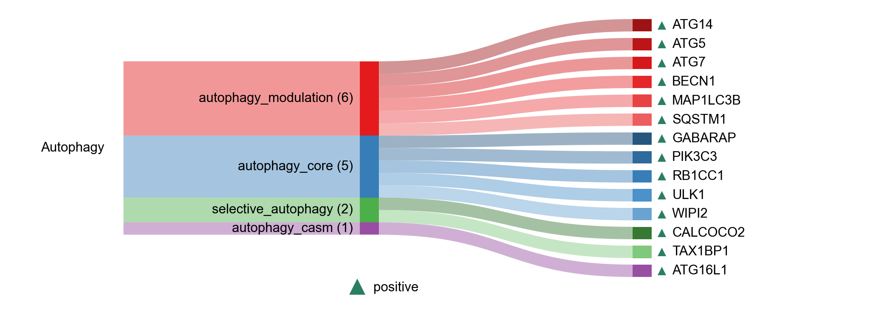

# Autophagy

| Gene | HGNC ID | HGNC Symbol | Entrez ID | Module Class | Sensor Family | Scoring Direction | Single-Cell Detectability | Also in Module(s) | DOI | Aliases | Is_Sensor | Panel Source | DepMap Essential | s_het | s_het Lower 95% | s_het Upper 95% | UniProt ID | Monomer (kDa) | STRING Sensor Partners | STRING Partners |
| --- | --- | --- | --- | --- | --- | --- | --- | --- | --- | --- | --- | --- | --- | --- | --- | --- | --- | --- | --- | --- |
| ATG16L1 | HGNC:21498 | ATG16L1 | 55054 | autophagy_casm | cGAS-STING | positive | low |  | [10.1083/jcb.202009128](https://doi.org/10.1083/jcb.202009128) |  |  |  | no | 0.0821183 | 0.0523064 | 0.121165 | Q676U5 | 68.3 | 2 | 105 |
| GABARAP | HGNC:4067 | GABARAP | 11337 | autophagy_core |  | positive | high |  | [10.1038/emboj.2010.74](https://doi.org/10.1038/emboj.2010.74) |  |  |  | no | 0.0509665 | 0.0141842 | 0.116605 | O95166 | 13.9 | 0 | 140 |
| PIK3C3 | HGNC:8974 | PIK3C3 | 5289 | autophagy_core |  | positive | medium |  | [10.1091/mbc.e08-01-0080](https://doi.org/10.1091/mbc.e08-01-0080) |  |  |  | yes | 0.0182772 | 0.0108021 | 0.0269648 | Q8NEB9 | 101.5 | 1 | 145 |
| RB1CC1 | HGNC:15574 | RB1CC1 | 9821 | autophagy_core |  | positive | high |  | [10.1091/mbc.e08-12-1249](https://doi.org/10.1091/mbc.e08-12-1249) | FIP200 |  |  | no | 0.160823 | 0.103336 | 0.234369 | Q8TDY2 | 183.1 | 0 | 102 |
| ULK1 | HGNC:12558 | ULK1 | 8408 | autophagy_core |  | positive | medium |  | [10.1091/mbc.e08-12-1249](https://doi.org/10.1091/mbc.e08-12-1249) |  |  |  | no | 0.0552101 | 0.0322905 | 0.0885888 | O75385 | 112.6 | 0 | 140 |
| WIPI2 | HGNC:32225 | WIPI2 | 26100 | autophagy_core |  | positive | medium |  | [10.1016/j.molcel.2014.05.021](https://doi.org/10.1016/j.molcel.2014.05.021) |  |  |  | no | 0.0455013 | 0.0244699 | 0.0752562 | Q9Y4P8 | 49.4 | 0 | 56 |
| ATG14 | HGNC:19962 | ATG14 | 22863 | autophagy_modulation |  | positive | medium |  | [10.1080/15548627.2021.1899440](https://doi.org/10.1080/15548627.2021.1899440) |  |  |  | no | 0.0304261 | 0.015033 | 0.0501477 | Q6ZNE5 | 55.3 | 1 | 74 |
| ATG5 | HGNC:589 | ATG5 | 9474 | autophagy_modulation |  | positive | high |  | [10.1038/s41586-019-1006-9](https://doi.org/10.1038/s41586-019-1006-9) |  |  |  | no | 0.0938319 | 0.0402945 | 0.177265 | Q9H1Y0 | 32.4 | 2 | 88 |
| ATG7 | HGNC:16935 | ATG7 | 10533 | autophagy_modulation |  | positive | high |  | [10.1080/15548627.2021.1899440](https://doi.org/10.1080/15548627.2021.1899440) |  |  |  | no | 0.00797603 | 0.00325048 | 0.0142343 | O95352 | 78.0 | 1 | 75 |
| BECN1 | HGNC:1034 | BECN1 | 8678 | autophagy_modulation |  | positive | low |  | [10.1016/j.chom.2014.01.009](https://doi.org/10.1016/j.chom.2014.01.009) |  |  |  | no | 0.0601556 | 0.0300289 | 0.103485 | Q14457 | 51.9 | 1 | 186 |
| MAP1LC3B | HGNC:13352 | MAP1LC3B | 81631 | autophagy_modulation |  | positive | high |  | [10.1038/s41586-019-1006-9](https://doi.org/10.1038/s41586-019-1006-9) |  |  |  | no | 0.0259148 | 0.00670972 | 0.0554689 | Q9GZQ8 | 14.7 | 3 | 202 |
| SQSTM1 | HGNC:11280 | SQSTM1 | 8878 | autophagy_modulation |  | positive | high |  | [10.15252/embj.201797858](https://doi.org/10.15252/embj.201797858) |  |  |  | no | 0.0164031 | 0.000940073 | 0.044528 | Q13501 | 47.7 | 7 | 449 |
| CALCOCO2 | HGNC:29912 | CALCOCO2 | 10241 | selective_autophagy |  | positive | medium |  | [10.1038/ni.1800](https://doi.org/10.1038/ni.1800) | NDP52 |  |  | no | 0.00703601 | 0.00083056 | 0.0192729 | Q13137 | 52.3 | 0 | 126 |
| TAX1BP1 | HGNC:11575 | TAX1BP1 | 8887 | selective_autophagy | TLR | positive | high | NASP_FEEDBACK | [10.1371/journal.ppat.1006600](https://doi.org/10.1371/journal.ppat.1006600) |  |  |  | no | 0.0205244 | 0.0122724 | 0.0310732 | Q86VP1 | 90.9 | 0 | 82 |
