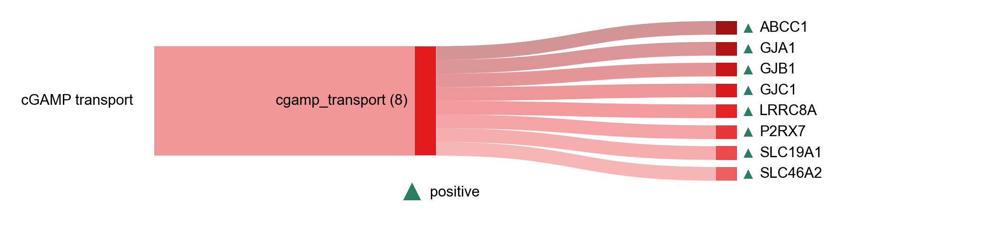

# cGAMP transport

| Gene | Module Class | Sensor Family | Activation Tier | Scoring Direction | Cell Type Breadth | Detectability | Also in Module(s) | DOI | Aliases | Is_Sensor | Panel Source |
| --- | --- | --- | --- | --- | --- | --- | --- | --- | --- | --- | --- |
| ABCC1 | cgamp_transport | cGAS-STING | Early | positive | Broad | high |  | [10.3389/fimmu.2023.1150705](https://doi.org/10.3389/fimmu.2023.1150705) |  |  |  |
| GJA1 | cgamp_transport | cGAS-STING | Early | positive | Broad | medium |  | [10.3389/fimmu.2023.1150705](https://doi.org/10.3389/fimmu.2023.1150705) | Cx43 |  |  |
| GJB1 | cgamp_transport | cGAS-STING | Early | positive | Broad | low |  | [10.3389/fimmu.2023.1150705](https://doi.org/10.3389/fimmu.2023.1150705) | Cx32 |  |  |
| GJC1 | cgamp_transport | cGAS-STING | Early | positive | Broad | low |  | [10.3389/fimmu.2023.1150705](https://doi.org/10.3389/fimmu.2023.1150705) | Cx45 |  |  |
| LRRC8A | cgamp_transport | cGAS-STING | Early | positive | Broad | medium |  | [10.3389/fimmu.2023.1150705](https://doi.org/10.3389/fimmu.2023.1150705) |  |  |  |
| P2RX7 | cgamp_transport | cGAS-STING | Early | positive | Immune-enriched | medium |  | [10.3389/fimmu.2023.1150705](https://doi.org/10.3389/fimmu.2023.1150705) |  |  |  |
| SLC19A1 | cgamp_transport | cGAS-STING | Early | positive | Broad | low |  | [10.3389/fimmu.2023.1150705](https://doi.org/10.3389/fimmu.2023.1150705) |  |  |  |
| SLC46A2 | cgamp_transport | cGAS-STING | Early | positive | Immune-enriched | low |  | [10.3389/fimmu.2023.1150705](https://doi.org/10.3389/fimmu.2023.1150705) |  |  |  |
