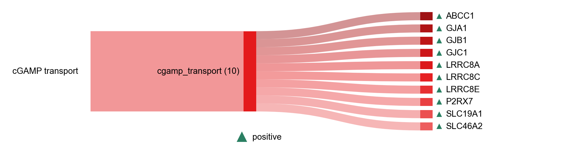

# cGAMP transport

| Gene | HGNC ID | HGNC Symbol | Entrez ID | Module Class | Sensor Family | Scoring Direction | Single-Cell Detectability | Also in Module(s) | DOI | Aliases | Is_Sensor | Panel Source | DepMap Essential | s_het | s_het Lower 95% | s_het Upper 95% | UniProt ID | Monomer (kDa) | STRING Sensor Partners | STRING Partners |
| --- | --- | --- | --- | --- | --- | --- | --- | --- | --- | --- | --- | --- | --- | --- | --- | --- | --- | --- | --- | --- |
| ABCC1 | HGNC:51 | ABCC1 | 4363 | cgamp_transport | cGAS-STING | positive | high |  | [10.3389/fimmu.2023.1150705](https://doi.org/10.3389/fimmu.2023.1150705) |  |  |  | no | 0.0324323 | 0.0229199 | 0.0439957 | P33527 | 171.6 | 0 | 25 |
| GJA1 | HGNC:4274 | GJA1 | 2697 | cgamp_transport | cGAS-STING | positive | medium |  | [10.3389/fimmu.2023.1150705](https://doi.org/10.3389/fimmu.2023.1150705) | Cx43 |  |  | no | 0.116279 | 0.0301145 | 0.269618 | P17302 | 43.0 | 0 | 112 |
| GJB1 | HGNC:4283 | GJB1 | 2705 | cgamp_transport | cGAS-STING | positive | low |  | [10.3389/fimmu.2023.1150705](https://doi.org/10.3389/fimmu.2023.1150705) | Cx32 |  |  | no | 0.212784 | 0.0600623 | 0.466439 | P08034 | 32.0 | 0 | 49 |
| GJC1 | HGNC:4280 | GJC1 | 10052 | cgamp_transport | cGAS-STING | positive | low |  | [10.3389/fimmu.2023.1150705](https://doi.org/10.3389/fimmu.2023.1150705) | Cx45 |  |  | no | 0.124637 | 0.0621486 | 0.213806 | P36383 | 45.5 | 0 | 34 |
| LRRC8A | HGNC:19027 | LRRC8A | 56262 | cgamp_transport | cGAS-STING | positive | medium |  | [10.3389/fimmu.2023.1150705](https://doi.org/10.3389/fimmu.2023.1150705) |  |  |  | no | 0.110105 | 0.0622829 | 0.175761 | Q8IWT6 | 94.2 | 0 | 17 |
| LRRC8C | HGNC:25075 | LRRC8C | 84230 | cgamp_transport | cGAS-STING | positive | medium |  | [10.1016/j.molcel.2020.10.021](https://doi.org/10.1016/j.molcel.2020.10.021) |  |  |  | no | 0.0445971 | 0.0296935 | 0.0642412 | Q8TDW0 | 92.5 | 0 | 12 |
| LRRC8E | HGNC:26272 | LRRC8E | 80131 | cgamp_transport | cGAS-STING | positive | low |  | [10.1016/j.molcel.2020.10.021](https://doi.org/10.1016/j.molcel.2020.10.021) |  |  |  | no | 0.00246972 | 0.000390758 | 0.00696492 | Q6NSJ5 | 90.2 | 0 | 18 |
| P2RX7 | HGNC:8537 | P2RX7 | 5027 | cgamp_transport | cGAS-STING | positive | medium |  | [10.3389/fimmu.2023.1150705](https://doi.org/10.3389/fimmu.2023.1150705) |  |  |  | no | 0.00084045 | 0.000173396 | 0.00211623 | Q99572 | 68.6 | 0 | 4 |
| SLC19A1 | HGNC:10937 | SLC19A1 | 6573 | cgamp_transport | cGAS-STING | positive | low |  | [10.3389/fimmu.2023.1150705](https://doi.org/10.3389/fimmu.2023.1150705) |  |  |  | no | 0.00135133 | 0.000229948 | 0.00368225 | P41440 | 64.9 | 0 | 9 |
| SLC46A2 | HGNC:16055 | SLC46A2 | 57864 | cgamp_transport | cGAS-STING | positive | low |  | [10.3389/fimmu.2023.1150705](https://doi.org/10.3389/fimmu.2023.1150705) |  |  |  | no | 0.000873461 | 0.000143874 | 0.00242114 | Q9BY10 | 51.1 | 0 | 0 |
