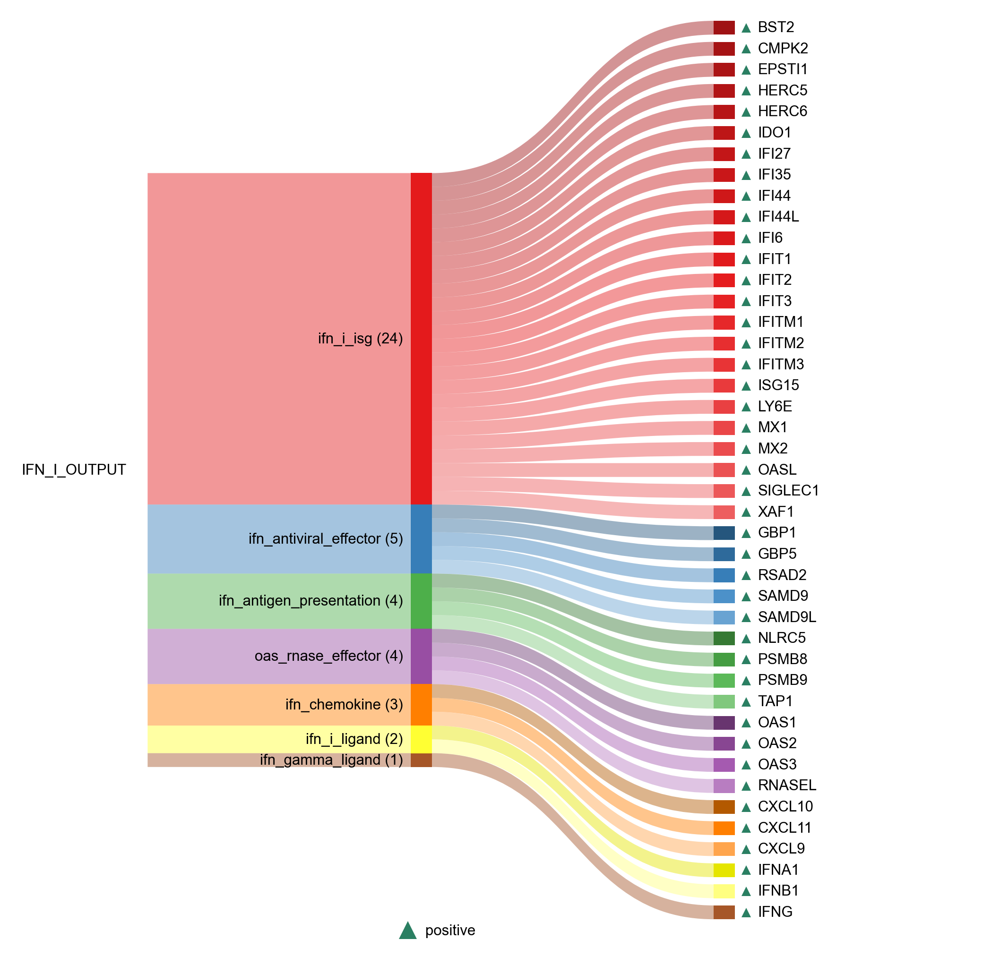

# IFN_I_OUTPUT

| Gene | Module Class | Sensor Family | Activation Tier | Scoring Direction | Cell Type Breadth | Detectability | Also in Module(s) | DOI | Aliases | Is_Sensor | Panel Source |
| --- | --- | --- | --- | --- | --- | --- | --- | --- | --- | --- | --- |
| NLRC5 | ifn_antigen_presentation |  | Active | positive | Broad | medium |  | 10.1073/pnas.1008684107 |  |  |  |
| PSMB8 | ifn_antigen_presentation |  | Active | positive | Broad | high |  | 10.1371/journal.pone.0180958 |  |  |  |
| PSMB9 | ifn_antigen_presentation |  | Active | positive | Broad | high |  | 10.1371/journal.pone.0180958 |  |  |  |
| TAP1 | ifn_antigen_presentation |  | Active | positive | Broad | high |  | 10.1371/journal.pone.0180958 |  |  |  |
| GBP1 | ifn_antiviral_effector |  | Active | positive | Immune-enriched | medium |  | 10.1084/jem.20182031 |  |  |  |
| GBP5 | ifn_antiviral_effector |  | Active | positive | Immune-enriched | high |  | 10.1084/jem.20182031 |  |  |  |
| RSAD2 | ifn_antiviral_effector |  | Active | positive | Broad | medium |  | 10.3390/pathogens14050510 |  |  |  |
| SAMD9 | ifn_antiviral_effector |  | Active | positive | Broad | medium |  | 10.1128/mBio.00385-13 |  |  |  |
| SAMD9L | ifn_antiviral_effector |  | Active | positive | Broad | medium |  | 10.1128/mBio.00385-13 |  |  |  |
| CXCL10 | ifn_chemokine |  | Active | positive | Broad | medium | IFN_I_OUTPUT\|NFKB_CYTOKINE_OUTPUT | 10.3389/fimmu.2017.01970 |  |  |  |
| CXCL11 | ifn_chemokine |  | Active | positive | Immune-enriched | low | INFLAMMAGING | 10.3389/fimmu.2017.01970 |  |  |  |
| CXCL9 | ifn_chemokine |  | Active | positive | Immune-enriched | medium | INFLAMMAGING | 10.3389/fimmu.2017.01970 |  |  |  |
| IFNG | ifn_gamma_ligand |  | Active | positive | Immune-enriched | medium | SASP | 10.1002/j.1460-2075.1982.tb01277.x |  |  |  |
| BST2 | ifn_i_isg |  | Active | positive | Broad | high |  | 10.4049/jimmunol.177.5.3260 |  |  |  |
| CMPK2 | ifn_i_isg |  | Active | positive | Broad | low |  | 10.1016/j.isci.2021.102498 |  |  |  |
| EPSTI1 | ifn_i_isg |  | Active | positive | Broad | medium |  | 10.1093/rheumatology/keaf297 |  |  |  |
| HERC5 | ifn_i_isg |  | Active | positive | Broad | low |  | 10.1073/pnas.0600397103 |  |  |  |
| HERC6 | ifn_i_isg |  | Active | positive | Broad | medium |  | 10.1016/j.isci.2024.108986 |  |  |  |
| IDO1 | ifn_i_isg |  | Active | positive | Immune-enriched | medium | IFN_GAMMA_OUTPUT\|INFLAMMAGING | 10.1073/pnas.85.4.1242 |  |  |  |
| IFI27 | ifn_i_isg |  | Active | positive | Broad | high |  | 10.3389/fmicb.2023.1176177 |  |  |  |
| IFI35 | ifn_i_isg |  | Active | positive | Broad | medium |  | 10.1128/JVI.03202-13 |  |  |  |
| IFI44 | ifn_i_isg |  | Active | positive | Broad | medium |  | 10.1128/JVI.00297-20 |  |  |  |
| IFI44L | ifn_i_isg |  | Active | positive | Broad | high |  | 10.1128/JVI.00297-20 |  |  |  |
| IFI6 | ifn_i_isg |  | Active | positive | Broad | high |  | 10.1038/s41598-025-20489-6 |  |  |  |
| IFIT1 | ifn_i_isg |  | Active | positive | Broad | medium |  | 10.1038/ni.2048 |  |  |  |
| IFIT2 | ifn_i_isg |  | Active | positive | Broad | low |  | 10.1038/nri3344 |  |  |  |
| IFIT3 | ifn_i_isg |  | Active | positive | Broad | medium |  | 10.1038/nri3344 |  |  |  |
| IFITM1 | ifn_i_isg |  | Active | positive | Broad | high |  | 10.1038/nri3344 |  |  |  |
| IFITM2 | ifn_i_isg |  | Active | positive | Broad | high |  | 10.1038/nri3344 |  |  |  |
| IFITM3 | ifn_i_isg |  | Active | positive | Broad | high |  | 10.1038/nri3344 |  |  |  |
| ISG15 | ifn_i_isg |  | Active | positive | Broad | high | SASP | 10.1038/s41579-018-0020-5 |  |  |  |
| LY6E | ifn_i_isg |  | Active | positive | Broad | high |  | 10.1038/s41467-018-06000-y |  |  |  |
| MX1 | ifn_i_isg |  | Active | positive | Broad | high |  | 10.1016/j.micinf.2007.09.010 |  |  |  |
| MX2 | ifn_i_isg |  | Active | positive | Broad | medium |  | 10.1038/nature12542 |  |  |  |
| OASL | ifn_i_isg | RLR | Active | positive | Broad | low |  | 10.1016/j.coviro.2023.101329 |  |  |  |
| SIGLEC1 | ifn_i_isg |  | Active | positive | Myeloid-enriched | low |  | 10.3389/fmed.2022.979373 |  |  |  |
| XAF1 | ifn_i_isg |  | Active | positive | Broad | high |  | 10.1074/jbc.M204851200 |  |  |  |
| IFNA1 | ifn_i_ligand |  | Active | positive | Broad | low |  | 10.1016/j.gene.2007.03.018 |  |  |  |
| IFNB1 | ifn_i_ligand |  | Active | positive | Broad | low |  | 10.1007/s12026-012-8293-7 |  |  |  |
| OAS1 | oas_rnase_effector | OAS | Active | positive | Broad | medium | NASP_RNA_SENSING | 10.1089/jir.2023.0098 |  | rna_sensor |  |
| OAS2 | oas_rnase_effector | OAS | Active | positive | Broad | medium | NASP_RNA_SENSING | 10.1089/jir.2023.0098 |  | rna_sensor |  |
| OAS3 | oas_rnase_effector | OAS | Active | positive | Broad | low | NASP_RNA_SENSING | 10.1089/jir.2023.0098 |  | rna_sensor |  |
| RNASEL | oas_rnase_effector |  | Active | positive | Broad | low |  | 10.1128/jvi.01471-07 |  |  |  |
