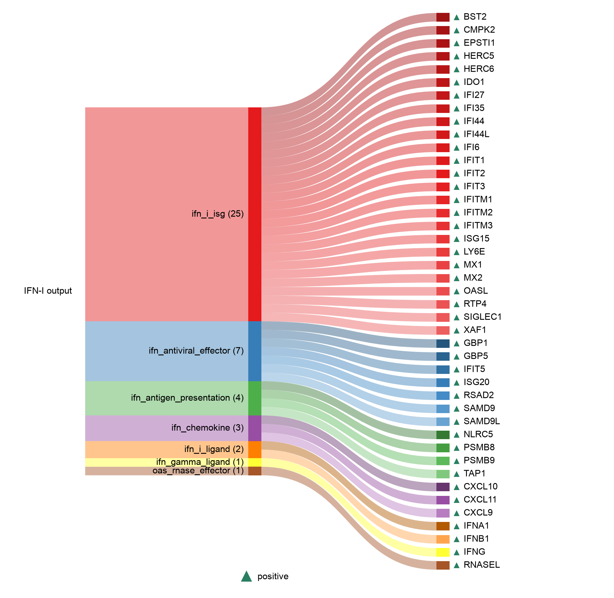

# IFN-I output

| Gene | HGNC ID | HGNC Symbol | Entrez ID | Module Class | Sensor Family | Scoring Direction | Single-Cell Detectability | Also in Module(s) | DOI | Aliases | Is_Sensor | Panel Source | DepMap Essential | s_het | s_het Lower 95% | s_het Upper 95% | UniProt ID | Monomer (kDa) | STRING Sensor Partners | STRING Partners |
| --- | --- | --- | --- | --- | --- | --- | --- | --- | --- | --- | --- | --- | --- | --- | --- | --- | --- | --- | --- | --- |
| NLRC5 | HGNC:29933 | NLRC5 | 84166 | ifn_antigen_presentation |  | positive | medium |  | [10.1073/pnas.1008684107](https://doi.org/10.1073/pnas.1008684107) |  |  |  | no | 0.01918 | 0.0105283 | 0.0289137 | Q86WI3 | 204.6 | 2 | 23 |
| PSMB8 | HGNC:9545 | PSMB8 | 5696 | ifn_antigen_presentation |  | positive | high |  | [10.1371/journal.pone.0180958](https://doi.org/10.1371/journal.pone.0180958) |  |  |  | no | 0.00673536 | 0.00158527 | 0.0153103 | P28062 | 30.4 | 0 | 57 |
| PSMB9 | HGNC:9546 | PSMB9 | 5698 | ifn_antigen_presentation |  | positive | high |  | [10.1371/journal.pone.0180958](https://doi.org/10.1371/journal.pone.0180958) |  |  |  | no | 0.00925766 | 0.00202684 | 0.0206475 | P28065 | 23.3 | 0 | 67 |
| TAP1 | HGNC:43 | TAP1 | 6890 | ifn_antigen_presentation |  | positive | high |  | [10.1371/journal.pone.0180958](https://doi.org/10.1371/journal.pone.0180958) |  |  |  | no | 0.00880017 | 0.00315755 | 0.0159549 | Q03518 | 81.0 | 0 | 33 |
| GBP1 | HGNC:4182 | GBP1 | 2633 | ifn_antiviral_effector |  | positive | medium |  | [10.1084/jem.20182031](https://doi.org/10.1084/jem.20182031) |  |  |  | no | 0.0017246 | 7.68283e-05 | 0.00639164 | P32455 | 67.9 | 0 | 11 |
| GBP5 | HGNC:19895 | GBP5 | 115362 | ifn_antiviral_effector |  | positive | high |  | [10.1084/jem.20182031](https://doi.org/10.1084/jem.20182031) |  |  |  | no | 0.00178375 | 6.75691e-05 | 0.00663464 | Q96PP8 | 66.6 | 0 | 12 |
| IFIT5 | HGNC:13328 | IFIT5 | 24138 | ifn_antiviral_effector |  | positive | low |  | [10.1073/pnas.1412842111](https://doi.org/10.1073/pnas.1412842111) |  |  |  | no | 0.00642951 | 0.000398413 | 0.0210694 | Q13325 | 55.8 | 0 | 33 |
| ISG20 | HGNC:6130 | ISG20 | 3669 | ifn_antiviral_effector |  | positive | high |  | [10.1128/mSphere.00209-18](https://doi.org/10.1128/mSphere.00209-18) |  |  |  | no | 0.00440669 | 0.000732614 | 0.0118305 | Q96AZ6 | 20.4 | 0 | 1 |
| RSAD2 | HGNC:30908 | RSAD2 | 91543 | ifn_antiviral_effector |  | positive | medium |  | [10.3390/pathogens14050510](https://doi.org/10.3390/pathogens14050510) |  |  |  | no | 0.00102913 | 0.000140851 | 0.00300019 | Q8WXG1 | 42.2 | 0 | 18 |
| SAMD9 | HGNC:1348 | SAMD9 | 54809 | ifn_antiviral_effector |  | positive | medium |  | [10.1128/mBio.00385-13](https://doi.org/10.1128/mBio.00385-13) |  |  |  | no | 0.000847836 | 0.000159595 | 0.00214451 | Q5K651 | 184.3 | 1 | 10 |
| SAMD9L | HGNC:1349 | SAMD9L | 219285 | ifn_antiviral_effector |  | positive | medium |  | [10.1128/mBio.00385-13](https://doi.org/10.1128/mBio.00385-13) |  |  |  | no | 0.00303755 | 0.000761107 | 0.00651454 | Q8IVG5 | 184.5 | 0 | 7 |
| CXCL10 | HGNC:10637 | CXCL10 | 3627 | ifn_chemokine |  | positive | medium | IFN_I_OUTPUT\|NFKB_CYTOKINE_OUTPUT | [10.3389/fimmu.2017.01970](https://doi.org/10.3389/fimmu.2017.01970) |  |  |  | no | 0.00665129 | 0.000815543 | 0.0208033 | P02778 | 10.9 | 0 | 41 |
| CXCL11 | HGNC:10638 | CXCL11 | 6373 | ifn_chemokine |  | positive | low | INFLAMMAGING | [10.3389/fimmu.2017.01970](https://doi.org/10.3389/fimmu.2017.01970) |  |  |  | no | 0.00409388 | 0.000178522 | 0.0160758 | O14625 | 10.4 | 0 | 46 |
| CXCL9 | HGNC:7098 | CXCL9 | 4283 | ifn_chemokine |  | positive | medium | INFLAMMAGING | [10.3389/fimmu.2017.01970](https://doi.org/10.3389/fimmu.2017.01970) |  |  |  | no | 0.00291641 | 0.000318048 | 0.00940075 | Q07325 | 14.0 | 0 | 42 |
| IFNG | HGNC:5438 | IFNG | 3458 | ifn_gamma_ligand |  | positive | medium | SASP | [10.1002/j.1460-2075.1982.tb01277.x](https://doi.org/10.1002/j.1460-2075.1982.tb01277.x) |  |  |  | no | 0.0256338 | 0.00346299 | 0.0728496 | P01579 | 19.3 | 0 | 16 |
| BST2 | HGNC:1119 | BST2 | 684 | ifn_i_isg |  | positive | high |  | [10.4049/jimmunol.177.5.3260](https://doi.org/10.4049/jimmunol.177.5.3260) |  |  |  | no | 0.00289903 | 0.000157129 | 0.0106416 | Q10589 | 19.8 | 0 | 24 |
| CMPK2 | HGNC:27015 | CMPK2 | 129607 | ifn_i_isg |  | positive | low |  | [10.1016/j.isci.2021.102498](https://doi.org/10.1016/j.isci.2021.102498) |  |  |  | no | 0.0010398 | 0.000141825 | 0.00308816 | Q5EBM0 | 49.4 | 0 | 9 |
| EPSTI1 | HGNC:16465 | EPSTI1 | 94240 | ifn_i_isg |  | positive | medium |  | [10.1093/rheumatology/keaf297](https://doi.org/10.1093/rheumatology/keaf297) |  |  |  | no | 0.000887905 | 9.31742e-05 | 0.00270752 | Q96J88 | 36.8 | 0 | 10 |
| HERC5 | HGNC:24368 | HERC5 | 51191 | ifn_i_isg |  | positive | low |  | [10.1073/pnas.0600397103](https://doi.org/10.1073/pnas.0600397103) |  |  |  | no | 0.00405813 | 0.000299063 | 0.0131436 | Q9UII4 | 116.9 | 5 | 179 |
| HERC6 | HGNC:26072 | HERC6 | 55008 | ifn_i_isg |  | positive | medium |  | [10.1016/j.isci.2024.108986](https://doi.org/10.1016/j.isci.2024.108986) |  |  |  | no | 0.000751242 | 0.00011407 | 0.00221895 | Q8IVU3 | 115.1 | 0 | 6 |
| IDO1 | HGNC:6059 | IDO1 | 3620 | ifn_i_isg |  | positive | medium | IFN_GAMMA_OUTPUT\|INFLAMMAGING | [10.1073/pnas.85.4.1242](https://doi.org/10.1073/pnas.85.4.1242) |  |  |  | no | 0.000794353 | 9.48418e-05 | 0.00249116 | P14902 | 45.3 | 0 | 3 |
| IFI27 | HGNC:5397 | IFI27 | 3429 | ifn_i_isg |  | positive | high |  | [10.3389/fmicb.2023.1176177](https://doi.org/10.3389/fmicb.2023.1176177) |  |  |  | no | 0.00340072 | 0.000172289 | 0.0128713 | P40305 | 11.5 | 2 | 11 |
| IFI35 | HGNC:5399 | IFI35 | 3430 | ifn_i_isg |  | positive | medium |  | [10.1128/JVI.03202-13](https://doi.org/10.1128/JVI.03202-13) |  |  |  | no | 0.000730817 | 9.26679e-05 | 0.00224505 | P80217 | 31.5 | 2 | 17 |
| IFI44 | HGNC:16938 | IFI44 | 10561 | ifn_i_isg |  | positive | medium |  | [10.1128/JVI.00297-20](https://doi.org/10.1128/JVI.00297-20) |  |  |  | no | 0.000622698 | 5.65141e-05 | 0.00202591 | Q8TCB0 | 50.5 | 0 | 3 |
| IFI44L | HGNC:17817 | IFI44L | 10964 | ifn_i_isg |  | positive | high |  | [10.1128/JVI.00297-20](https://doi.org/10.1128/JVI.00297-20) |  |  |  | no | 0.000549722 | 3.91232e-05 | 0.00183635 | Q53G44 | 51.3 | 0 | 2 |
| IFI6 | HGNC:4054 | IFI6 | 2537 | ifn_i_isg |  | positive | high |  | [10.1038/s41598-025-20489-6](https://doi.org/10.1038/s41598-025-20489-6) |  |  |  | no | 0.0035547 | 0.000413106 | 0.0106471 | P09912 | 12.9 | 1 | 4 |
| IFIT1 | HGNC:5407 | IFIT1 | 3434 | ifn_i_isg |  | positive | medium |  | [10.1038/ni.2048](https://doi.org/10.1038/ni.2048) |  |  |  | no | 0.00396323 | 0.000320254 | 0.0134128 | P09914 | 55.4 | 0 | 19 |
| IFIT2 | HGNC:5409 | IFIT2 | 3433 | ifn_i_isg |  | positive | low |  | [10.1038/nri3344](https://doi.org/10.1038/nri3344) |  |  |  | no | 0.00513797 | 0.000627232 | 0.014407 | P09913 | 54.6 | 1 | 14 |
| IFIT3 | HGNC:5411 | IFIT3 | 3437 | ifn_i_isg |  | positive | medium |  | [10.1038/nri3344](https://doi.org/10.1038/nri3344) |  |  |  | no | 0.00552056 | 0.000911953 | 0.015528 | O14879 | 56.0 | 1 | 30 |
| IFITM1 | HGNC:5412 | IFITM1 | 8519 | ifn_i_isg |  | positive | high |  | [10.1038/nri3344](https://doi.org/10.1038/nri3344) |  |  |  | no | 0.00842822 | 0.000537566 | 0.0293865 | P13164 | 14.0 | 0 | 9 |
| IFITM2 | HGNC:5413 | IFITM2 | 10581 | ifn_i_isg |  | positive | high |  | [10.1038/nri3344](https://doi.org/10.1038/nri3344) |  |  |  | yes | 0.010771 | 0.000567069 | 0.0396913 | Q01629 | 14.6 | 0 | 5 |
| IFITM3 | HGNC:5414 | IFITM3 | 10410 | ifn_i_isg |  | positive | high |  | [10.1038/nri3344](https://doi.org/10.1038/nri3344) |  |  |  | yes | 0.0114603 | 0.00134396 | 0.0359844 | Q01628 | 14.6 | 0 | 25 |
| ISG15 | HGNC:4053 | ISG15 | 9636 | ifn_i_isg |  | positive | high | SASP | [10.1038/s41579-018-0020-5](https://doi.org/10.1038/s41579-018-0020-5) |  |  |  | no | 0.00452041 | 0.000193777 | 0.0172058 | P05161 | 17.9 | 3 | 107 |
| LY6E | HGNC:6727 | LY6E | 4061 | ifn_i_isg |  | positive | high |  | [10.1038/s41467-018-06000-y](https://doi.org/10.1038/s41467-018-06000-y) |  |  |  | no | 0.0157681 | 0.0031579 | 0.0396077 | Q16553 | 13.5 | 0 | 7 |
| MX1 | HGNC:7532 | MX1 | 4599 | ifn_i_isg |  | positive | high |  | [10.1016/j.micinf.2007.09.010](https://doi.org/10.1016/j.micinf.2007.09.010) |  |  |  | no | 0.00241832 | 0.000506826 | 0.00591223 | P20591 | 75.5 | 0 | 19 |
| MX2 | HGNC:7533 | MX2 | 4600 | ifn_i_isg |  | positive | medium |  | [10.1038/nature12542](https://doi.org/10.1038/nature12542) |  |  |  | no | 0.00241438 | 0.000280765 | 0.00691531 | P20592 | 82.1 | 0 | 6 |
| OASL | HGNC:8090 | OASL | 8638 | ifn_i_isg | RLR | positive | low |  | [10.1016/j.coviro.2023.101329](https://doi.org/10.1016/j.coviro.2023.101329) |  |  |  | no | 0.000614974 | 7.6035e-05 | 0.00186113 | Q15646 | 59.2 | 2 | 17 |
| RTP4 | HGNC:23992 | RTP4 | 64108 | ifn_i_isg |  | positive | low |  | [10.1038/nature09907](https://doi.org/10.1038/nature09907) |  |  |  | no | 0.00185931 | 0.000189463 | 0.00607026 | Q96DX8 | 27.9 | 0 | 3 |
| SIGLEC1 | HGNC:11127 | SIGLEC1 | 6614 | ifn_i_isg |  | positive | low |  | [10.3389/fmed.2022.979373](https://doi.org/10.3389/fmed.2022.979373) |  |  |  | no | 0.000336953 | 5.13138e-05 | 0.000932717 | Q9BZZ2 | 182.6 | 0 | 3 |
| XAF1 | HGNC:30932 | XAF1 | 54739 | ifn_i_isg |  | positive | high |  | [10.1074/jbc.M204851200](https://doi.org/10.1074/jbc.M204851200) |  |  |  | no | 0.000877959 | 0.000109845 | 0.00266821 | Q6GPH4 | 34.6 | 0 | 22 |
| IFNA1 | HGNC:5417 | IFNA1 | 3439 | ifn_i_ligand |  | positive | low |  | [10.1016/j.gene.2007.03.018](https://doi.org/10.1016/j.gene.2007.03.018) |  |  |  | no | 0.00497176 | 0.000190693 | 0.0188778 | P0DY56 | 21.7 | 0 | 23 |
| IFNB1 | HGNC:5434 | IFNB1 | 3456 | ifn_i_ligand |  | positive | low |  | [10.1007/s12026-012-8293-7](https://doi.org/10.1007/s12026-012-8293-7) |  |  |  | no | 0.00316849 | 0.000234124 | 0.0109582 | P01574 | 22.3 | 1 | 21 |
| RNASEL | HGNC:10050 | RNASEL | 6041 | oas_rnase_effector |  | positive | low |  | [10.1128/jvi.01471-07](https://doi.org/10.1128/jvi.01471-07) |  |  |  | no | 0.0011668 | 0.000167878 | 0.00318353 | Q05823 | 83.5 | 0 | 8 |
