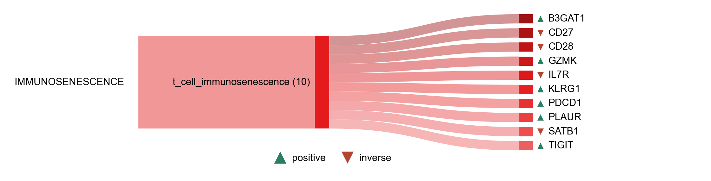

# IMMUNOSENESCENCE

| Gene | Module Class | Sensor Family | Activation Tier | Scoring Direction | Cell Type Breadth | Detectability | Also in Module(s) | DOI | Aliases | Is_Sensor | Panel Source |
| --- | --- | --- | --- | --- | --- | --- | --- | --- | --- | --- | --- |
| B3GAT1 | t_cell_immunosenescence |  | Post-NASP | positive | Broad | medium |  | 10.1182/blood-2002-07-2103 | CD57 |  |  |
| CD27 | t_cell_immunosenescence |  | Post-NASP | inverse | Broad | high |  | 10.1002/cyto.a.22351 |  |  |  |
| CD28 | t_cell_immunosenescence |  | Post-NASP | inverse | Broad | medium |  | 10.1016/S0145-305X(97)00027-X |  |  |  |
| GZMK | t_cell_immunosenescence |  | Post-NASP | positive | Immune-enriched | high |  | 10.1016/j.immuni.2020.11.005 |  |  |  |
| IL7R | t_cell_immunosenescence |  | Post-NASP | inverse | Immune-enriched | high |  | 10.1016/j.cyto.2012.03.013 | CD127 |  |  |
| KLRG1 | t_cell_immunosenescence |  | Post-NASP | positive | Broad | medium |  | 10.1016/S0531-5565(03)00134-7 |  |  |  |
| PDCD1 | t_cell_immunosenescence |  | Post-NASP | positive | Broad | low |  | 10.1073/pnas.0908805106 | PD-1 |  |  |
| PLAUR | t_cell_immunosenescence |  | Post-NASP | positive | Broad | high |  | 10.1038/s41586-020-2403-9 | uPAR |  |  |
| SATB1 | t_cell_immunosenescence |  | Post-NASP | inverse | Immune-enriched | high |  | 10.1016/j.immuni.2016.12.015 |  |  |  |
| TIGIT | t_cell_immunosenescence |  | Post-NASP | positive | Broad | medium |  | 10.3389/fimmu.2022.833531 |  |  |  |
