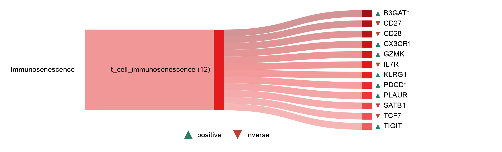

# Immunosenescence

| Gene | HGNC ID | HGNC Symbol | Entrez ID | Module Class | Sensor Family | Activation Tier | Scoring Direction | Cell Type Breadth | Detectability | Also in Module(s) | DOI | Aliases | Is_Sensor | Panel Source | DepMap Essential | s_het | s_het Lower 95% | s_het Upper 95% | UniProt ID | Monomer (kDa) | STRING Sensor Partners |
| --- | --- | --- | --- | --- | --- | --- | --- | --- | --- | --- | --- | --- | --- | --- | --- | --- | --- | --- | --- | --- | --- |
| B3GAT1 | HGNC:921 | B3GAT1 | 27087 | t_cell_immunosenescence |  | Post-NASP | positive | Broad | medium |  | [10.1182/blood-2002-07-2103](https://doi.org/10.1182/blood-2002-07-2103) | CD57 |  |  | no | 0.0529056 | 0.034243 | 0.0766394 | Q9P2W7 | 38.3 | 0 |
| CD27 | HGNC:11922 | CD27 | 939 | t_cell_immunosenescence |  | Post-NASP | inverse | Broad | high |  | [10.1002/cyto.a.22351](https://doi.org/10.1002/cyto.a.22351) |  |  |  | no | 0.00345691 | 0.00022064 | 0.0132292 | P26842 | 29.1 | 0 |
| CD28 | HGNC:1653 | CD28 | 940 | t_cell_immunosenescence |  | Post-NASP | inverse | Broad | medium |  | [10.1016/S0145-305X(97)00027-X](https://doi.org/10.1016/S0145-305X(97)00027-X) |  |  |  | no | 0.0245961 | 0.004993 | 0.059664 | P10747 | 25.1 | 0 |
| CX3CR1 | HGNC:2558 | CX3CR1 | 1524 | t_cell_immunosenescence |  | Post-NASP | positive | Immune-enriched | low |  | [10.1016/j.immuni.2016.10.018](https://doi.org/10.1016/j.immuni.2016.10.018) |  |  |  | no | 0.00777441 | 0.00191653 | 0.0191469 | P49238 | 40.4 | 0 |
| GZMK | HGNC:4711 | GZMK | 3003 | t_cell_immunosenescence |  | Post-NASP | positive | Immune-enriched | high |  | [10.1016/j.immuni.2020.11.005](https://doi.org/10.1016/j.immuni.2020.11.005) |  |  |  | no | 0.00120297 | 0.000165031 | 0.0036981 | P49863 | 28.9 | 0 |
| IL7R | HGNC:6024 | IL7R | 3575 | t_cell_immunosenescence |  | Post-NASP | inverse | Immune-enriched | high |  | [10.1016/j.cyto.2012.03.013](https://doi.org/10.1016/j.cyto.2012.03.013) | CD127 |  |  | no | 0.00224241 | 0.000256379 | 0.00665739 | P16871 | 51.6 | 0 |
| KLRG1 | HGNC:6380 | KLRG1 | 10219 | t_cell_immunosenescence |  | Post-NASP | positive | Broad | medium |  | [10.1016/S0531-5565(03)00134-7](https://doi.org/10.1016/S0531-5565(03)00134-7) |  |  |  | no | 0.00200942 | 0.00025655 | 0.00618977 | Q96E93 | 21.8 | 0 |
| PDCD1 | HGNC:8760 | PDCD1 | 5133 | t_cell_immunosenescence |  | Post-NASP | positive | Broad | low |  | [10.1073/pnas.0908805106](https://doi.org/10.1073/pnas.0908805106) | PD-1 |  |  | no | 0.0274727 | 0.00520403 | 0.0690893 | Q15116 | 31.6 | 0 |
| PLAUR | HGNC:9053 | PLAUR | 5329 | t_cell_immunosenescence |  | Post-NASP | positive | Broad | high |  | [10.1038/s41586-020-2403-9](https://doi.org/10.1038/s41586-020-2403-9) | uPAR |  |  | no | 0.00153082 | 0.000139399 | 0.00447505 | Q03405 | 37.0 | 0 |
| SATB1 | HGNC:10541 | SATB1 | 6304 | t_cell_immunosenescence |  | Post-NASP | inverse | Immune-enriched | high |  | [10.1016/j.immuni.2016.12.015](https://doi.org/10.1016/j.immuni.2016.12.015) |  |  |  | no | 0.150623 | 0.0687671 | 0.283855 | Q01826 | 86.0 | 0 |
| TCF7 | HGNC:11639 | TCF7 | 6932 | t_cell_immunosenescence |  | Post-NASP | inverse | Immune-enriched | high |  | [10.1016/j.immuni.2016.07.021](https://doi.org/10.1016/j.immuni.2016.07.021) | TCF1 |  |  | no | 0.0183794 | 0.00438281 | 0.0416799 | P36402 | 41.6 | 0 |
| TIGIT | HGNC:26838 | TIGIT | 201633 | t_cell_immunosenescence |  | Post-NASP | positive | Broad | medium |  | [10.3389/fimmu.2022.833531](https://doi.org/10.3389/fimmu.2022.833531) |  |  |  | no | 0.00135908 | 0.000162033 | 0.0042388 | Q495A1 | 26.3 | 0 |
