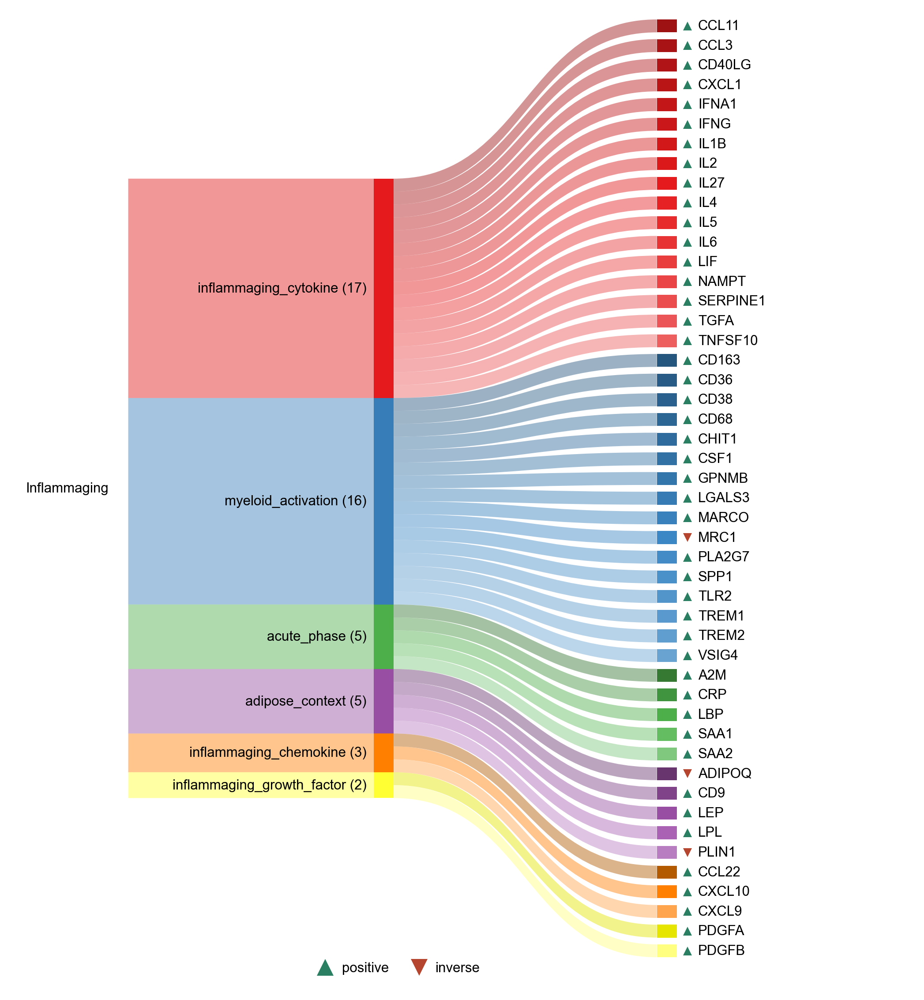

# Inflammaging

| Gene | Module Class | Sensor Family | Activation Tier | Scoring Direction | Cell Type Breadth | Detectability | Also in Module(s) | DOI | Aliases | Is_Sensor | Panel Source |
| --- | --- | --- | --- | --- | --- | --- | --- | --- | --- | --- | --- |
| A2M | acute_phase |  | Post-NASP | positive | Liver-enriched | high |  | [10.3389/fimmu.2021.803244](https://doi.org/10.3389/fimmu.2021.803244) | α2M |  |  |
| CRP | acute_phase |  | Post-NASP | positive | Liver-enriched | medium |  | [10.3389/fimmu.2018.00754](https://doi.org/10.3389/fimmu.2018.00754) |  |  |  |
| LBP | acute_phase |  | Post-NASP | positive | Liver-enriched | medium |  | [10.1016/s0898-6568(00)00149-2](https://doi.org/10.1016/s0898-6568(00)00149-2) |  |  |  |
| SAA1 | acute_phase |  | Post-NASP | positive | Liver-enriched | high |  | [10.1371/journal.pone.0217005](https://doi.org/10.1371/journal.pone.0217005) |  |  |  |
| SAA2 | acute_phase |  | Post-NASP | positive | Liver-enriched | medium |  | [10.1189/jlb.3VMR0315-080R](https://doi.org/10.1189/jlb.3VMR0315-080R) |  |  |  |
| ADIPOQ | adipose_context |  | Post-NASP | inverse | Adipose-enriched | medium |  | [10.1016/j.cca.2007.01.026](https://doi.org/10.1016/j.cca.2007.01.026) |  |  |  |
| CD9 | adipose_context |  | Post-NASP | positive | Adipose/Immune-enriched | high |  | [10.1038/s43587-025-00952-9](https://doi.org/10.1038/s43587-025-00952-9) |  |  |  |
| LEP | adipose_context |  | Post-NASP | positive | Adipose-enriched | low |  | [10.2174/157339508784325046](https://doi.org/10.2174/157339508784325046) |  |  |  |
| LPL | adipose_context |  | Post-NASP | positive | Adipose-enriched | high |  | [10.1038/s43587-025-00952-9](https://doi.org/10.1038/s43587-025-00952-9) |  |  |  |
| PLIN1 | adipose_context |  | Post-NASP | inverse | Adipose-enriched | medium |  | [10.1074/jbc.RA118.003541](https://doi.org/10.1074/jbc.RA118.003541) |  |  |  |
| CCL22 | inflammaging_chemokine |  | Post-NASP | positive | Immune-enriched | medium |  | [10.1038/s43587-025-00938-7](https://doi.org/10.1038/s43587-025-00938-7) |  |  | Franceschi et al., Nature Aging, 2025 |
| CXCL10 | inflammaging_chemokine |  | Post-NASP | positive | Broad | medium | IFN_I_OUTPUT\|NFKB_CYTOKINE_OUTPUT \| INFLAMMAGING | [10.1038/s43587-025-00938-7](https://doi.org/10.1038/s43587-025-00938-7) |  |  | Franceschi et al., Nature Aging, 2025 |
| CXCL9 | inflammaging_chemokine |  | Post-NASP | positive | Immune-enriched | medium |  | [10.1038/s43587-025-00938-7](https://doi.org/10.1038/s43587-025-00938-7) |  |  | Franceschi et al., Nature Aging, 2025 |
| CCL11 | inflammaging_cytokine |  | Post-NASP | positive | Immune-enriched | low |  | [10.1038/s43587-025-00938-7](https://doi.org/10.1038/s43587-025-00938-7) | Eotaxin |  | Franceschi et al., Nature Aging, 2025 |
| CCL3 | inflammaging_cytokine |  | Post-NASP | positive | Broad | high | SASP | [10.1038/s43587-025-00938-7](https://doi.org/10.1038/s43587-025-00938-7) | MIP1α |  | Franceschi et al., Nature Aging, 2025 |
| CD40LG | inflammaging_cytokine |  | Post-NASP | positive | Immune-enriched | low |  | [10.1038/s43587-025-00938-7](https://doi.org/10.1038/s43587-025-00938-7) |  |  | Franceschi et al., Nature Aging, 2025 |
| CXCL1 | inflammaging_cytokine |  | Post-NASP | positive | Broad | high | SASP; NFKB_CYTOKINE_OUTPUT | [10.1038/s43587-025-00938-7](https://doi.org/10.1038/s43587-025-00938-7) |  |  | Franceschi et al., Nature Aging, 2025 |
| IFNA1 | inflammaging_cytokine |  | Post-NASP | positive | Broad | low |  | [10.1038/s43587-025-00938-7](https://doi.org/10.1038/s43587-025-00938-7) | IFNα |  | Franceschi et al., Nature Aging, 2025 |
| IFNG | inflammaging_cytokine |  | Post-NASP | positive | Immune-enriched | medium | SASP | [10.1038/s43587-025-00938-7](https://doi.org/10.1038/s43587-025-00938-7) | FNγ |  | Franceschi et al., Nature Aging, 2025 |
| IL1B | inflammaging_cytokine |  | Post-NASP | positive | Myeloid-enriched | high | NFKB_CYTOKINE_OUTPUT | [10.1038/s43587-025-00938-7](https://doi.org/10.1038/s43587-025-00938-7) | IL-1β |  | Franceschi et al., Nature Aging, 2025 |
| IL2 | inflammaging_cytokine |  | Post-NASP | positive | Immune-enriched | low |  | [10.1038/s43587-025-00938-7](https://doi.org/10.1038/s43587-025-00938-7) | IL-2 |  | Franceschi et al., Nature Aging, 2025 |
| IL27 | inflammaging_cytokine |  | Post-NASP | positive | Immune-enriched | low |  | [10.1038/s43587-025-00938-7](https://doi.org/10.1038/s43587-025-00938-7) | IL-27 |  | Franceschi et al., Nature Aging, 2025 |
| IL4 | inflammaging_cytokine |  | Post-NASP | positive | Immune-enriched | low |  | [10.1038/s43587-025-00938-7](https://doi.org/10.1038/s43587-025-00938-7) | IL-4 |  | Franceschi et al., Nature Aging, 2025 |
| IL5 | inflammaging_cytokine |  | Post-NASP | positive | Immune-enriched | low |  | [10.1038/s43587-025-00938-7](https://doi.org/10.1038/s43587-025-00938-7) | IL-5 |  | Franceschi et al., Nature Aging, 2025 |
| IL6 | inflammaging_cytokine |  | Post-NASP | positive | Broad | medium | SASP; NFKB_CYTOKINE_OUTPUT | [10.1038/s43587-025-00938-7](https://doi.org/10.1038/s43587-025-00938-7) | IL-6 |  | Franceschi et al., Nature Aging, 2025 |
| LIF | inflammaging_cytokine |  | Post-NASP | positive | Broad | medium |  | [10.1038/s43587-025-00938-7](https://doi.org/10.1038/s43587-025-00938-7) |  |  | Franceschi et al., Nature Aging, 2025 |
| NAMPT | inflammaging_cytokine |  | Post-NASP | positive | Broad | high |  | [10.1038/s41556-019-0287-4](https://doi.org/10.1038/s41556-019-0287-4) |  |  |  |
| SERPINE1 | inflammaging_cytokine |  | Post-NASP | positive | Broad | high |  | [10.1038/s43587-025-00938-7](https://doi.org/10.1038/s43587-025-00938-7) | PAI1 |  | Franceschi et al., Nature Aging, 2025 |
| TGFA | inflammaging_cytokine |  | Post-NASP | positive | Broad | low |  | [10.1038/s43587-025-00938-7](https://doi.org/10.1038/s43587-025-00938-7) | TGFα |  | Franceschi et al., Nature Aging, 2025 |
| TNFSF10 | inflammaging_cytokine |  | Post-NASP | positive | Immune-enriched | high |  | [10.1038/s43587-025-00938-7](https://doi.org/10.1038/s43587-025-00938-7) | TRAIL |  | Franceschi et al., Nature Aging, 2025 |
| PDGFA | inflammaging_growth_factor |  | Post-NASP | positive | Broad | medium |  | [10.1038/s43587-025-00938-7](https://doi.org/10.1038/s43587-025-00938-7) |  |  | Franceschi et al., Nature Aging, 2025 |
| PDGFB | inflammaging_growth_factor |  | Post-NASP | positive | Broad | low |  | [10.1038/s43587-025-00938-7](https://doi.org/10.1038/s43587-025-00938-7) |  |  | Franceschi et al., Nature Aging, 2025 |
| CD163 | myeloid_activation |  | Post-NASP | positive | Immune-enriched | medium |  | [10.1089/ars.2012.4834](https://doi.org/10.1089/ars.2012.4834) |  |  |  |
| CD36 | myeloid_activation |  | Post-NASP | positive | Broad | high |  | [10.1038/s42255-019-0142-8](https://doi.org/10.1038/s42255-019-0142-8) |  |  |  |
| CD38 | myeloid_activation |  | Post-NASP | positive | Immune-enriched | medium |  | [10.1016/j.cmet.2016.05.006](https://doi.org/10.1016/j.cmet.2016.05.006) |  |  |  |
| CD68 | myeloid_activation |  | Post-NASP | positive | Liver/Immune-enriched | high |  | [10.1007/s11357-022-00536-0](https://doi.org/10.1007/s11357-022-00536-0) |  |  |  |
| CHIT1 | myeloid_activation |  | Post-NASP | positive | Immune-enriched | low |  | [10.1146/annurev-physiol-012110-142250](https://doi.org/10.1146/annurev-physiol-012110-142250) | PAI1 |  |  |
| CSF1 | myeloid_activation |  | Post-NASP | positive | Broad | medium | SASP | [10.1038/s43587-025-00938-7](https://doi.org/10.1038/s43587-025-00938-7) |  |  | Franceschi et al., Nature Aging, 2025 |
| GPNMB | myeloid_activation |  | Post-NASP | positive | Adipose/Immune-enriched | high |  | [10.3389/fimmu.2021.674739](https://doi.org/10.3389/fimmu.2021.674739) |  |  |  |
| LGALS3 | myeloid_activation |  | Post-NASP | positive | Broad | high |  | [10.1038/s41586-026-10542-3](https://doi.org/10.1038/s41586-026-10542-3) |  |  |  |
| MARCO | myeloid_activation |  | Post-NASP | positive | Liver/Immune-enriched | medium |  | [10.1182/blood-2010-03-276733](https://doi.org/10.1182/blood-2010-03-276733) |  |  |  |
| MRC1 | myeloid_activation |  | Post-NASP | inverse | Broad | high |  | [10.4049/jimmunol.1102188](https://doi.org/10.4049/jimmunol.1102188) |  |  |  |
| PLA2G7 | myeloid_activation |  | Post-NASP | positive | Broad | medium |  | [10.1126/science.abg7292](https://doi.org/10.1126/science.abg7292) |  |  |  |
| SPP1 | myeloid_activation |  | Post-NASP | positive | Immune-enriched | high | SASP | [10.1172/jci.insight.145811](https://doi.org/10.1172/jci.insight.145811) |  |  |  |
| TLR2 | myeloid_activation |  | Post-NASP | positive | Immune-enriched | high |  | [10.1186/s11658-026-00881-4](https://doi.org/10.1186/s11658-026-00881-4) |  |  |  |
| TREM1 | myeloid_activation |  | Post-NASP | positive | Myeloid-enriched | high |  | [10.1038/s41593-024-01610-w](https://doi.org/10.1038/s41593-024-01610-w) |  |  |  |
| TREM2 | myeloid_activation |  | Post-NASP | positive | Adipose/Immune-enriched | medium |  | [10.1038/s43587-026-01101-6](https://doi.org/10.1038/s43587-026-01101-6) |  |  |  |
| VSIG4 | myeloid_activation |  | Post-NASP | positive | Immune-enriched | medium |  | [10.1038/s41586-026-10542-3](https://doi.org/10.1038/s41586-026-10542-3) |  |  |  |
