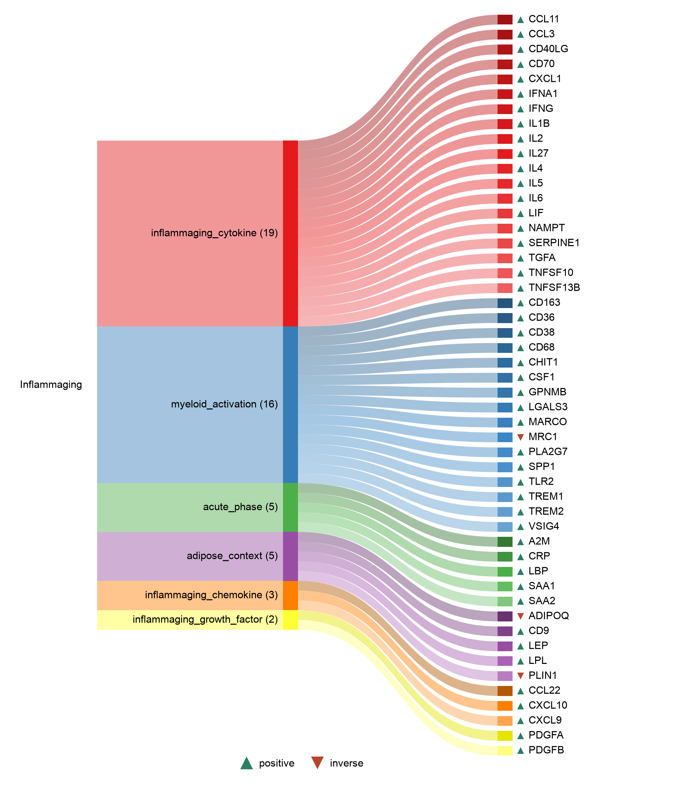

# Inflammaging

| Gene | HGNC ID | HGNC Symbol | Entrez ID | Module Class | Sensor Family | Scoring Direction | Single-Cell Detectability | Also in Module(s) | DOI | Aliases | Is_Sensor | Panel Source | DepMap Essential | s_het | s_het Lower 95% | s_het Upper 95% | UniProt ID | Monomer (kDa) | STRING Sensor Partners | STRING Partners |
| --- | --- | --- | --- | --- | --- | --- | --- | --- | --- | --- | --- | --- | --- | --- | --- | --- | --- | --- | --- | --- |
| A2M | HGNC:7 | A2M | 2 | acute_phase |  | positive | high |  | [10.3389/fimmu.2021.803244](https://doi.org/10.3389/fimmu.2021.803244) | α2M |  |  | no | 0.00867342 | 0.00132648 | 0.017542 | P01023 | 163.3 | 0 | 76 |
| CRP | HGNC:2367 | CRP | 1401 | acute_phase |  | positive | medium |  | [10.3389/fimmu.2018.00754](https://doi.org/10.3389/fimmu.2018.00754) |  |  |  | no | 0.00504777 | 0.000952337 | 0.0134732 | P02741 | 25.0 | 0 | 41 |
| LBP | HGNC:6517 | LBP | 3929 | acute_phase |  | positive | medium |  | [10.1016/s0898-6568(00)00149-2](https://doi.org/10.1016/s0898-6568(00)00149-2) |  |  |  | no | 0.000485046 | 8.00639e-05 | 0.00134669 | P18428 | 53.4 | 0 | 7 |
| SAA1 | HGNC:10513 | SAA1 | 6288 | acute_phase |  | positive | high |  | [10.1371/journal.pone.0217005](https://doi.org/10.1371/journal.pone.0217005) |  |  |  | no | 0.00409205 | 0.000267411 | 0.0144631 | P0DJI8 | 13.5 | 0 | 20 |
| SAA2 | HGNC:10514 | SAA2 | 6289 | acute_phase |  | positive | medium |  | [10.1189/jlb.3VMR0315-080R](https://doi.org/10.1189/jlb.3VMR0315-080R) |  |  |  | no | 0.00169504 | 8.53513e-05 | 0.00629194 | P0DJI9 | 13.5 | 0 | 8 |
| ADIPOQ | HGNC:13633 | ADIPOQ | 9370 | adipose_context |  | inverse | medium |  | [10.1016/j.cca.2007.01.026](https://doi.org/10.1016/j.cca.2007.01.026) |  |  |  | no | 0.00262198 | 0.000432515 | 0.00700935 | Q15848 | 26.4 | 0 | 12 |
| CD9 | HGNC:1709 | CD9 | 928 | adipose_context |  | positive | high |  | [10.1038/s43587-025-00952-9](https://doi.org/10.1038/s43587-025-00952-9) |  |  |  | no | 0.0143701 | 0.0039313 | 0.0309233 | P21926 | 25.4 | 0 | 106 |
| LEP | HGNC:6553 | LEP | 3952 | adipose_context |  | positive | low |  | [10.2174/157339508784325046](https://doi.org/10.2174/157339508784325046) |  |  |  | no | 0.0942666 | 0.00483221 | 0.307191 | P41159 | 18.6 | 0 | 25 |
| LPL | HGNC:6677 | LPL | 4023 | adipose_context |  | positive | high |  | [10.1038/s43587-025-00952-9](https://doi.org/10.1038/s43587-025-00952-9) |  |  |  | no | 0.00816304 | 0.00265468 | 0.0163363 | P06858 | 53.2 | 0 | 18 |
| PLIN1 | HGNC:9076 | PLIN1 | 5346 | adipose_context |  | inverse | medium |  | [10.1074/jbc.RA118.003541](https://doi.org/10.1074/jbc.RA118.003541) |  |  |  | no | 0.00111347 | 0.000143808 | 0.00327846 | O60240 | 56.0 | 0 | 12 |
| CCL22 | HGNC:10621 | CCL22 | 6367 | inflammaging_chemokine |  | positive | medium |  | [10.1038/s43587-025-00938-7](https://doi.org/10.1038/s43587-025-00938-7) |  |  | Franceschi et al., Nature Aging, 2025 | no | 0.00210741 | 0.0002059 | 0.00672685 | O00626 | 10.6 | 0 | 28 |
| CXCL10 | HGNC:10637 | CXCL10 | 3627 | inflammaging_chemokine |  | positive | medium | IFN_I_OUTPUT\|NFKB_CYTOKINE_OUTPUT \| INFLAMMAGING | [10.1038/s43587-025-00938-7](https://doi.org/10.1038/s43587-025-00938-7) |  |  | Franceschi et al., Nature Aging, 2025 | no | 0.00665129 | 0.000815543 | 0.0208033 | P02778 | 10.9 | 0 | 41 |
| CXCL9 | HGNC:7098 | CXCL9 | 4283 | inflammaging_chemokine |  | positive | medium |  | [10.1038/s43587-025-00938-7](https://doi.org/10.1038/s43587-025-00938-7) |  |  | Franceschi et al., Nature Aging, 2025 | no | 0.00291641 | 0.000318048 | 0.00940075 | Q07325 | 14.0 | 0 | 42 |
| CCL11 | HGNC:10610 | CCL11 | 6356 | inflammaging_cytokine |  | positive | low |  | [10.1038/s43587-025-00938-7](https://doi.org/10.1038/s43587-025-00938-7) | Eotaxin |  | Franceschi et al., Nature Aging, 2025 | no | 0.00124863 | 0.000100639 | 0.00427007 | P51671 | 10.7 | 0 | 43 |
| CCL3 | HGNC:10627 | CCL3 | 6348 | inflammaging_cytokine |  | positive | high | SASP | [10.1038/s43587-025-00938-7](https://doi.org/10.1038/s43587-025-00938-7) | MIP1α |  | Franceschi et al., Nature Aging, 2025 | no | 0.00192561 | 8.61327e-05 | 0.00713714 | P10147 | 10.1 | 0 | 26 |
| CD40LG | HGNC:11935 | CD40LG | 959 | inflammaging_cytokine |  | positive | low |  | [10.1038/s43587-025-00938-7](https://doi.org/10.1038/s43587-025-00938-7) |  |  | Franceschi et al., Nature Aging, 2025 | no | 0.131803 | 0.0174713 | 0.421292 | P29965 | 29.3 | 0 | 33 |
| CD70 | HGNC:11937 | CD70 | 970 | inflammaging_cytokine |  | positive | low |  | [10.1016/0092-8674(93)90133-B](https://doi.org/10.1016/0092-8674(93)90133-B) | TNFSF7; CD27LG |  |  | no | 0.0164662 | 0.00119779 | 0.0546461 | P32970 | 21.1 | 0 | 18 |
| CXCL1 | HGNC:4602 | CXCL1 | 2919 | inflammaging_cytokine |  | positive | high | SASP; NFKB_CYTOKINE_OUTPUT | [10.1038/s43587-025-00938-7](https://doi.org/10.1038/s43587-025-00938-7) |  |  | Franceschi et al., Nature Aging, 2025 | no | 0.010754 | 0.000763955 | 0.0340541 | P09341 | 11.3 | 0 | 44 |
| IFNA1 | HGNC:5417 | IFNA1 | 3439 | inflammaging_cytokine |  | positive | low |  | [10.1038/s43587-025-00938-7](https://doi.org/10.1038/s43587-025-00938-7) | IFNα |  | Franceschi et al., Nature Aging, 2025 | no | 0.00497176 | 0.000190693 | 0.0188778 | P0DY56 | 21.7 | 0 | 23 |
| IFNG | HGNC:5438 | IFNG | 3458 | inflammaging_cytokine |  | positive | medium | SASP | [10.1038/s43587-025-00938-7](https://doi.org/10.1038/s43587-025-00938-7) | FNγ |  | Franceschi et al., Nature Aging, 2025 | no | 0.0256338 | 0.00346299 | 0.0728496 | P01579 | 19.3 | 0 | 16 |
| IL1B | HGNC:5992 | IL1B | 3553 | inflammaging_cytokine |  | positive | high | NFKB_CYTOKINE_OUTPUT | [10.1038/s43587-025-00938-7](https://doi.org/10.1038/s43587-025-00938-7) | IL-1β |  | Franceschi et al., Nature Aging, 2025 | no | 0.0414579 | 0.00998333 | 0.0908958 | P01584 | 30.7 | 1 | 58 |
| IL2 | HGNC:6001 | IL2 | 3558 | inflammaging_cytokine |  | positive | low |  | [10.1038/s43587-025-00938-7](https://doi.org/10.1038/s43587-025-00938-7) | IL-2 |  | Franceschi et al., Nature Aging, 2025 | no | 0.0367295 | 0.0058498 | 0.0986829 | P60568 | 17.6 | 0 | 48 |
| IL27 | HGNC:19157 | IL27 | 246778 | inflammaging_cytokine |  | positive | low |  | [10.1038/s43587-025-00938-7](https://doi.org/10.1038/s43587-025-00938-7) | IL-27 |  | Franceschi et al., Nature Aging, 2025 | no | 0.0900598 | 0.0143646 | 0.240365 | Q8NEV9 | 27.5 | 0 | 21 |
| IL4 | HGNC:6014 | IL4 | 3565 | inflammaging_cytokine |  | positive | low |  | [10.1038/s43587-025-00938-7](https://doi.org/10.1038/s43587-025-00938-7) | IL-4 |  | Franceschi et al., Nature Aging, 2025 | no | 0.00503927 | 0.000746523 | 0.0138576 | P05112 | 17.5 | 0 | 20 |
| IL5 | HGNC:6016 | IL5 | 3567 | inflammaging_cytokine |  | positive | low |  | [10.1038/s43587-025-00938-7](https://doi.org/10.1038/s43587-025-00938-7) | IL-5 |  | Franceschi et al., Nature Aging, 2025 | no | 0.0021548 | 5.9249e-05 | 0.00893633 | P05113 | 15.2 | 0 | 26 |
| IL6 | HGNC:6018 | IL6 | 3569 | inflammaging_cytokine |  | positive | medium | SASP; NFKB_CYTOKINE_OUTPUT | [10.1038/s43587-025-00938-7](https://doi.org/10.1038/s43587-025-00938-7) | IL-6 |  | Franceschi et al., Nature Aging, 2025 | no | 0.00656064 | 0.000639596 | 0.0205606 | P05231 | 23.7 | 0 | 40 |
| LIF | HGNC:6596 | LIF | 3976 | inflammaging_cytokine |  | positive | medium |  | [10.1038/s43587-025-00938-7](https://doi.org/10.1038/s43587-025-00938-7) |  |  | Franceschi et al., Nature Aging, 2025 | no | 0.00906455 | 0.00202262 | 0.0203794 | P15018 | 22.0 | 0 | 18 |
| NAMPT | HGNC:30092 | NAMPT | 10135 | inflammaging_cytokine |  | positive | high |  | [10.1038/s41556-019-0287-4](https://doi.org/10.1038/s41556-019-0287-4) |  |  |  | no | 0.222162 | 0.0618177 | 0.510097 | P43490 | 55.5 | 0 | 38 |
| SERPINE1 | HGNC:8583 | SERPINE1 | 5054 | inflammaging_cytokine |  | positive | high |  | [10.1038/s43587-025-00938-7](https://doi.org/10.1038/s43587-025-00938-7) | PAI1 |  | Franceschi et al., Nature Aging, 2025 | no | 0.0173157 | 0.00620009 | 0.033767 | P05121 | 45.1 | 0 | 27 |
| TGFA | HGNC:11765 | TGFA | 7039 | inflammaging_cytokine |  | positive | low |  | [10.1038/s43587-025-00938-7](https://doi.org/10.1038/s43587-025-00938-7) | TGFα |  | Franceschi et al., Nature Aging, 2025 | no | 0.0258848 | 0.00503196 | 0.06165 | P01135 | 17.0 | 0 | 102 |
| TNFSF10 | HGNC:11925 | TNFSF10 | 8743 | inflammaging_cytokine |  | positive | high |  | [10.1038/s43587-025-00938-7](https://doi.org/10.1038/s43587-025-00938-7) | TRAIL |  | Franceschi et al., Nature Aging, 2025 | no | 0.00448973 | 0.000379825 | 0.0156657 | P50591 | 32.5 | 0 | 25 |
| TNFSF13B | HGNC:11929 | TNFSF13B | 10673 | inflammaging_cytokine |  | positive | medium |  | [10.1084/jem.190.11.1697](https://doi.org/10.1084/jem.190.11.1697) | BAFF |  |  | no | 0.202816 | 0.0508023 | 0.48842 | Q9Y275 | 31.2 | 0 | 52 |
| PDGFA | HGNC:8799 | PDGFA | 5154 | inflammaging_growth_factor |  | positive | medium |  | [10.1038/s43587-025-00938-7](https://doi.org/10.1038/s43587-025-00938-7) |  |  | Franceschi et al., Nature Aging, 2025 | no | 0.0950112 | 0.0345153 | 0.195454 | P04085 | 24.0 | 0 | 64 |
| PDGFB | HGNC:8800 | PDGFB | 5155 | inflammaging_growth_factor |  | positive | low |  | [10.1038/s43587-025-00938-7](https://doi.org/10.1038/s43587-025-00938-7) |  |  | Franceschi et al., Nature Aging, 2025 | no | 0.0648266 | 0.029784 | 0.116002 | P01127 | 27.3 | 0 | 75 |
| CD163 | HGNC:1631 | CD163 | 9332 | myeloid_activation |  | positive | medium |  | [10.1089/ars.2012.4834](https://doi.org/10.1089/ars.2012.4834) |  |  |  | no | 0.026552 | 0.0145352 | 0.0437062 | Q86VB7 | 125.5 | 0 | 13 |
| CD36 | HGNC:1663 | CD36 | 948 | myeloid_activation |  | positive | high |  | [10.1038/s42255-019-0142-8](https://doi.org/10.1038/s42255-019-0142-8) |  |  |  | no | 0.000199113 | 1.62346e-05 | 0.000609478 | P16671 | 53.1 | 0 | 38 |
| CD38 | HGNC:1667 | CD38 | 952 | myeloid_activation |  | positive | medium |  | [10.1016/j.cmet.2016.05.006](https://doi.org/10.1016/j.cmet.2016.05.006) |  |  |  | no | 0.00152219 | 0.000103441 | 0.00506605 | P28907 | 34.3 | 0 | 18 |
| CD68 | HGNC:1693 | CD68 | 968 | myeloid_activation |  | positive | high |  | [10.1007/s11357-022-00536-0](https://doi.org/10.1007/s11357-022-00536-0) |  |  |  | no | 0.00558489 | 0.00143242 | 0.0124218 | P34810 | 37.4 | 0 | 13 |
| CHIT1 | HGNC:1936 | CHIT1 | 1118 | myeloid_activation |  | positive | low |  | [10.1146/annurev-physiol-012110-142250](https://doi.org/10.1146/annurev-physiol-012110-142250) |  |  |  | no | 0.0010114 | 9.91227e-05 | 0.00325057 | Q13231 | 51.7 | 0 | 11 |
| CSF1 | HGNC:2432 | CSF1 | 1435 | myeloid_activation |  | positive | medium | SASP | [10.1038/s43587-025-00938-7](https://doi.org/10.1038/s43587-025-00938-7) |  |  | Franceschi et al., Nature Aging, 2025 | no | 0.0892372 | 0.0269222 | 0.199865 | P09603 | 60.2 | 0 | 32 |
| GPNMB | HGNC:4462 | GPNMB | 10457 | myeloid_activation |  | positive | high |  | [10.3389/fimmu.2021.674739](https://doi.org/10.3389/fimmu.2021.674739) |  |  |  | no | 0.00112645 | 0.000286218 | 0.00260729 | Q14956 | 63.9 | 0 | 10 |
| LGALS3 | HGNC:6563 | LGALS3 | 3958 | myeloid_activation |  | positive | high |  | [10.1038/s41586-026-10542-3](https://doi.org/10.1038/s41586-026-10542-3) |  |  |  | no | 0.00303077 | 0.000399543 | 0.00898972 | P17931 | 26.2 | 1 | 155 |
| MARCO | HGNC:6895 | MARCO | 8685 | myeloid_activation |  | positive | medium |  | [10.1182/blood-2010-03-276733](https://doi.org/10.1182/blood-2010-03-276733) |  |  |  | no | 0.00138932 | 0.000246558 | 0.00364679 | Q9UEW3 | 52.7 | 0 | 4 |
| MRC1 | HGNC:7228 | MRC1 | 4360 | myeloid_activation |  | inverse | high |  | [10.4049/jimmunol.1102188](https://doi.org/10.4049/jimmunol.1102188) |  |  |  | no | 0.00802622 | 0.000661944 | 0.0272827 | P22897 | 166.0 | 0 | 5 |
| PLA2G7 | HGNC:9040 | PLA2G7 | 7941 | myeloid_activation |  | positive | medium |  | [10.1126/science.abg7292](https://doi.org/10.1126/science.abg7292) |  |  |  | no | 0.000613884 | 0.000120537 | 0.00161639 | Q13093 | 50.1 | 0 | 33 |
| SPP1 | HGNC:11255 | SPP1 | 6696 | myeloid_activation |  | positive | high | SASP | [10.1172/jci.insight.145811](https://doi.org/10.1172/jci.insight.145811) |  |  |  | no | 0.00282285 | 0.00041663 | 0.00756033 | P10451 | 35.4 | 0 | 34 |
| TLR2 | HGNC:11848 | TLR2 | 7097 | myeloid_activation |  | positive | high |  | [10.1186/s11658-026-00881-4](https://doi.org/10.1186/s11658-026-00881-4) |  |  |  | no | 0.000926408 | 0.00010804 | 0.0029097 | O60603 | 89.8 | 4 | 55 |
| TREM1 | HGNC:17760 | TREM1 | 54210 | myeloid_activation |  | positive | high |  | [10.1038/s41593-024-01610-w](https://doi.org/10.1038/s41593-024-01610-w) |  |  |  | no | 0.0015261 | 0.000128569 | 0.00524204 | Q9NP99 | 26.4 | 0 | 5 |
| TREM2 | HGNC:17761 | TREM2 | 54209 | myeloid_activation |  | positive | medium |  | [10.1038/s43587-026-01101-6](https://doi.org/10.1038/s43587-026-01101-6) |  |  |  | no | 0.00110428 | 8.30168e-05 | 0.00378549 | Q9NZC2 | 25.4 | 0 | 54 |
| VSIG4 | HGNC:17032 | VSIG4 | 11326 | myeloid_activation |  | positive | medium |  | [10.1038/s41586-026-10542-3](https://doi.org/10.1038/s41586-026-10542-3) |  |  |  | no | 0.00280683 | 0.000271734 | 0.00780911 | Q9Y279 | 44.0 | 0 | 31 |
