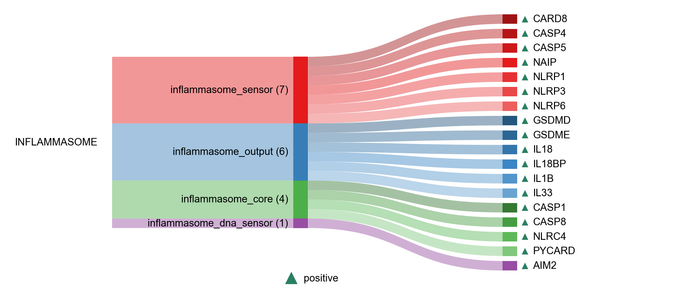

# INFLAMMASOME

| Gene | Module Class | Sensor Family | Activation Tier | Scoring Direction | Cell Type Breadth | Detectability | Also in Module(s) | DOI | Aliases | Is_Sensor | Panel Source |
| --- | --- | --- | --- | --- | --- | --- | --- | --- | --- | --- | --- |
| CASP1 | inflammasome_core |  | Active | positive | Immune-enriched | medium |  | 10.1038/ni.1703 |  |  |  |
| CASP8 | inflammasome_core |  | Active | positive | Broad | medium |  | 10.1074/jbc.M115.652321 |  |  |  |
| NLRC4 | inflammasome_core | NLR | Active | positive | Myeloid-enriched | low |  | 10.1073/pnas.1710433114 |  |  |  |
| PYCARD | inflammasome_core |  | Active | positive | Immune-enriched | high |  | 10.1242/jcs.207365 |  |  |  |
| AIM2 | inflammasome_dna_sensor | ALR | Early | positive | Immune-enriched | low |  | 10.1016/j.jsb.2017.08.001 | dna_sensor |  |  |
| GSDMD | inflammasome_output |  | Active | positive | Broad | medium |  | 10.1038/nature15541 |  |  |  |
| GSDME | inflammasome_output |  | Active | positive | Broad | low |  | 10.1126/sciimmunol.abj3859 |  |  |  |
| IL18 | inflammasome_output |  | Active | positive | Myeloid-enriched | medium | NFKB_CYTOKINE_OUTPUT | 10.1242/jcs.207365 |  |  |  |
| IL18BP | inflammasome_output |  | Active | positive | Broad | low |  | 10.3390/ijms252413505 |  |  |  |
| IL1B | inflammasome_output |  | Active | positive | Myeloid-enriched | high | NFKB_CYTOKINE_OUTPUT | 10.1242/jcs.207365 |  |  |  |
| IL33 | inflammasome_output |  | Active | positive | Epithelial-enriched | high |  | 10.1242/jcs.207365 |  |  |  |
| CARD8 | inflammasome_sensor |  | Active | positive | Broad | medium |  | 10.1126/science.abe1707 |  |  |  |
| CASP4 | inflammasome_sensor |  | Active | positive | Broad | medium |  | 10.1038/nature13683 |  |  |  |
| CASP5 | inflammasome_sensor |  | Active | positive | Broad | low |  | 10.1038/nature13683 |  |  |  |
| NAIP | inflammasome_sensor | NLR | Post-NASP | positive | Intestinal-enriched | high |  | 10.1016/j.coi.2015.01.010 |  |  |  |
| NLRP1 | inflammasome_sensor | NLR | Early | positive | Immune-enriched | medium | NASP_RNA_SENSING | 10.1126/science.abd0811 | rna_sensor |  |  |
| NLRP3 | inflammasome_sensor | NLR | Post-NASP | positive | Immune-enriched | low |  | 10.1111/acel.13050 |  |  |  |
| NLRP6 | inflammasome_sensor | NLR | Post-NASP | positive | Intestinal-enriched | low |  | 10.1038/s42003-022-03491-w |  |  |  |
