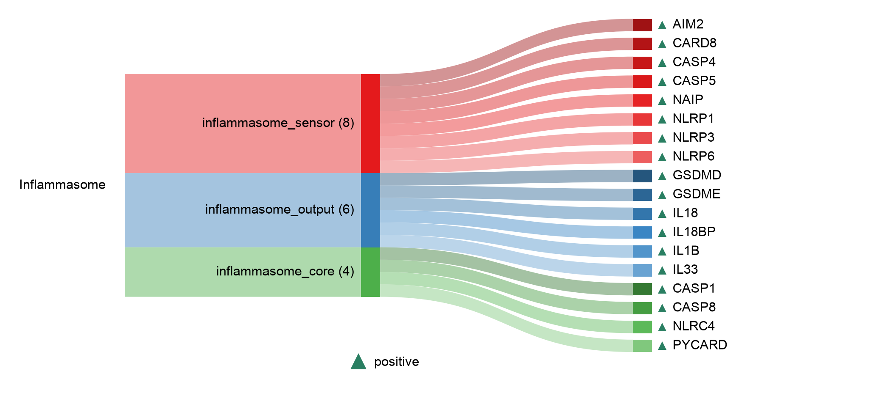

# Inflammasome

| Gene | HGNC ID | HGNC Symbol | Entrez ID | Module Class | Sensor Family | Activation Tier | Scoring Direction | Cell Type Breadth | Detectability | Also in Module(s) | DOI | Aliases | Is_Sensor | Panel Source | DepMap Essential | s_het | s_het Lower 95% | s_het Upper 95% | UniProt ID | Monomer (kDa) | STRING Sensor Partners |
| --- | --- | --- | --- | --- | --- | --- | --- | --- | --- | --- | --- | --- | --- | --- | --- | --- | --- | --- | --- | --- | --- |
| CASP1 | HGNC:1499 | CASP1 | 834 | inflammasome_core |  | Active | positive | Immune-enriched | medium |  | [10.1038/ni.1703](https://doi.org/10.1038/ni.1703) |  |  |  | no | 0.00678257 | 0.00116468 | 0.0174023 | P29466 | 45.2 | 6 |
| CASP8 | HGNC:1509 | CASP8 | 841 | inflammasome_core |  | Active | positive | Broad | medium |  | [10.1074/jbc.M115.652321](https://doi.org/10.1074/jbc.M115.652321) |  |  |  | no | 0.0173425 | 0.00678457 | 0.031009 | Q14790 | 55.4 | 4 |
| NLRC4 | HGNC:16412 | NLRC4 | 58484 | inflammasome_core | NLR | Active | positive | Myeloid-enriched | low |  | [10.1073/pnas.1710433114](https://doi.org/10.1073/pnas.1710433114) |  |  |  | no | 0.00436389 | 0.00150476 | 0.00862607 | Q9NPP4 | 116.2 | 5 |
| PYCARD | HGNC:16608 | PYCARD | 29108 | inflammasome_core |  | Active | positive | Immune-enriched | high |  | [10.1242/jcs.207365](https://doi.org/10.1242/jcs.207365) |  |  |  | no | 0.00445532 | 0.000268756 | 0.0154631 | Q9ULZ3 | 21.6 | 6 |
| GSDMD | HGNC:25697 | GSDMD | 79792 | inflammasome_output |  | Active | positive | Broad | medium |  | [10.1038/nature15541](https://doi.org/10.1038/nature15541) |  |  |  | no | 0.00174332 | 0.00018023 | 0.00536541 | P57764 | 52.8 | 3 |
| GSDME | HGNC:2810 | GSDME | 1687 | inflammasome_output |  | Active | positive | Broad | low |  | [10.1126/sciimmunol.abj3859](https://doi.org/10.1126/sciimmunol.abj3859) |  |  |  | no | 0.00118155 | 0.000209551 | 0.00323715 | O60443 | 54.6 | 0 |
| IL18 | HGNC:5986 | IL18 | 3606 | inflammasome_output |  | Active | positive | Myeloid-enriched | medium | NFKB_CYTOKINE_OUTPUT | [10.1242/jcs.207365](https://doi.org/10.1242/jcs.207365) |  |  |  | no | 0.0143344 | 0.00288566 | 0.0358939 | Q14116 | 22.3 | 0 |
| IL18BP | HGNC:5987 | IL18BP | 10068 | inflammasome_output |  | Active | positive | Broad | low |  | [10.3390/ijms252413505](https://doi.org/10.3390/ijms252413505) |  |  |  | no | 0.000761624 | 0.000137656 | 0.00208569 | O95998 | 21.1 | 0 |
| IL1B | HGNC:5992 | IL1B | 3553 | inflammasome_output |  | Active | positive | Myeloid-enriched | high | NFKB_CYTOKINE_OUTPUT | [10.1242/jcs.207365](https://doi.org/10.1242/jcs.207365) |  |  |  | no | 0.0414579 | 0.00998333 | 0.0908958 | P01584 | 30.7 | 1 |
| IL33 | HGNC:16028 | IL33 | 90865 | inflammasome_output |  | Active | positive | Epithelial-enriched | high |  | [10.1242/jcs.207365](https://doi.org/10.1242/jcs.207365) |  |  |  | no | 0.00111405 | 0.000127099 | 0.00332843 | O95760 | 30.8 | 0 |
| AIM2 | HGNC:357 | AIM2 | 9447 | inflammasome_sensor | ALR | Early | positive | Immune-enriched | low |  | [10.1016/j.jsb.2017.08.001](https://doi.org/10.1016/j.jsb.2017.08.001) |  | dna_sensor |  | no | 0.0018237 | 0.000355671 | 0.00469457 | O14862 | 39.0 | 4 |
| CARD8 | HGNC:17057 | CARD8 | 22900 | inflammasome_sensor |  | Active | positive | Broad | medium |  | [10.1126/science.abe1707](https://doi.org/10.1126/science.abe1707) |  |  |  | no | 0.00131814 | 0.000107129 | 0.00456877 | Q9Y2G2 | 60.7 | 3 |
| CASP4 | HGNC:1505 | CASP4 | 837 | inflammasome_sensor |  | Active | positive | Broad | medium |  | [10.1038/nature13683](https://doi.org/10.1038/nature13683) |  |  |  | no | 0.00171788 | 0.000186799 | 0.00510662 | P49662 | 43.3 | 4 |
| CASP5 | HGNC:1506 | CASP5 | 838 | inflammasome_sensor |  | Active | positive | Broad | low |  | [10.1038/nature13683](https://doi.org/10.1038/nature13683) |  |  |  | no | 0.000800168 | 8.23983e-05 | 0.00248615 | P51878 | 49.7 | 3 |
| NAIP | HGNC:7634 | NAIP | 4671 | inflammasome_sensor | NLR | Post-NASP | positive | Intestinal-enriched | high |  | [10.1016/j.coi.2015.01.010](https://doi.org/10.1016/j.coi.2015.01.010) |  |  |  | yes | 0.000603705 | 6.73536e-05 | 0.00189596 | Q13075 | 159.6 | 4 |
| NLRP1 | HGNC:14374 | NLRP1 | 22861 | inflammasome_sensor | NLR | Early | positive | Immune-enriched | medium | NASP_RNA_SENSING | [10.1126/science.abd0811](https://doi.org/10.1126/science.abd0811) |  | rna_sensor |  | no | 0.00268723 | 0.000677947 | 0.00615108 | Q9C000 | 165.9 | 4 |
| NLRP3 | HGNC:16400 | NLRP3 | 114548 | inflammasome_sensor | NLR | Post-NASP | positive | Immune-enriched | low |  | [10.1111/acel.13050](https://doi.org/10.1111/acel.13050) |  | inflammasome_sensor |  | no | 0.0194985 | 0.00908629 | 0.0318287 | Q96P20 | 118.2 | 4 |
| NLRP6 | HGNC:22944 | NLRP6 | 171389 | inflammasome_sensor | NLR | Post-NASP | positive | Intestinal-enriched | low |  | [10.1038/s42003-022-03491-w](https://doi.org/10.1038/s42003-022-03491-w) |  |  |  | no | 0.00334611 | 0.000289186 | 0.0105626 | P59044 | 98.8 | 3 |
