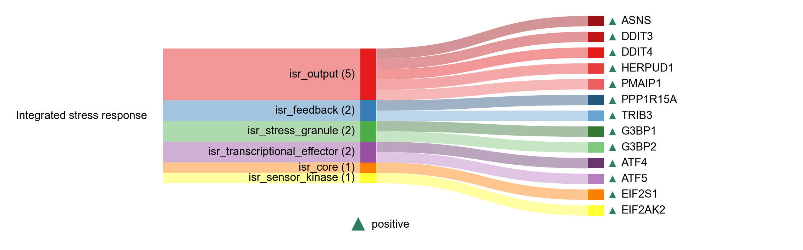

# Integrated stress response

| Gene | Module Class | Sensor Family | Activation Tier | Scoring Direction | Cell Type Breadth | Detectability | Also in Module(s) | DOI | Aliases | Is_Sensor | Panel Source |
| --- | --- | --- | --- | --- | --- | --- | --- | --- | --- | --- | --- |
| EIF2S1 | isr_core |  | Early | positive | Broad | medium |  | [10.1038/s41586-025-08794-6](https://doi.org/10.1038/s41586-025-08794-6) |  |  |  |
| PPP1R15A | isr_feedback |  | Active | positive | Broad | high |  | [10.1128/MCB.20.19.7192-7204.2000](https://doi.org/10.1128/MCB.20.19.7192-7204.2000) | GADD34 |  |  |
| TRIB3 | isr_feedback |  | Active | positive | Broad | low |  | [10.1074/jbc.M611723200](https://doi.org/10.1074/jbc.M611723200) |  |  |  |
| ASNS | isr_output |  | Active | positive | Broad | medium |  | [10.1016/S0021-9258(19)61468-7](https://doi.org/10.1016/S0021-9258(19)61468-7) |  |  |  |
| DDIT3 | isr_output |  | Active | positive | Broad | high |  | [10.1128/MCB.20.19.7192-7204.2000](https://doi.org/10.1128/MCB.20.19.7192-7204.2000) |  |  |  |
| DDIT4 | isr_output |  | Active | positive | Broad | high |  | [10.1016/j.cellsig.2013.08.038](https://doi.org/10.1016/j.cellsig.2013.08.038) |  |  |  |
| HERPUD1 | isr_output |  | Active | positive | Broad | high |  | [10.1074/jbc.M002063200](https://doi.org/10.1074/jbc.M002063200) |  |  |  |
| PMAIP1 | isr_output |  | Active | positive | Broad | high |  | [10.1091/mbc.e13-01-0067](https://doi.org/10.1091/mbc.e13-01-0067) |  |  |  |
| EIF2AK2 | isr_sensor_kinase | PKR | Early | positive | Broad | high | NASP_RNA_SENSING | [10.1016/S1357-2725(96)00169-0](https://doi.org/10.1016/S1357-2725(96)00169-0) |  | rna_sensor |  |
| G3BP1 | isr_stress_granule |  | Active | positive | Broad | medium |  | [10.1016/j.cell.2020.03.046](https://doi.org/10.1016/j.cell.2020.03.046) |  |  |  |
| G3BP2 | isr_stress_granule |  | Active | positive | Broad | high |  | [10.1016/j.cell.2020.03.046](https://doi.org/10.1016/j.cell.2020.03.046) |  |  |  |
| ATF4 | isr_transcriptional_effector |  | Active | positive | Broad | high |  | [10.1016/j.biocel.2007.01.020](https://doi.org/10.1016/j.biocel.2007.01.020) |  |  |  |
| ATF5 | isr_transcriptional_effector |  | Active | positive | Broad | medium |  | [10.1091/mbc.e13-01-0067](https://doi.org/10.1091/mbc.e13-01-0067) |  |  |  |
