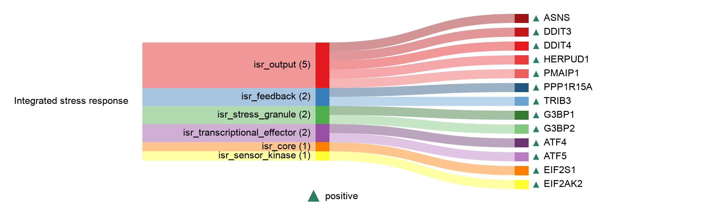

# Integrated stress response

| Gene | HGNC ID | HGNC Symbol | Entrez ID | Module Class | Sensor Family | Activation Tier | Scoring Direction | Cell Type Breadth | Detectability | Also in Module(s) | DOI | Aliases | Is_Sensor | Panel Source | DepMap Essential | s_het | s_het Lower 95% | s_het Upper 95% | UniProt ID | Monomer (kDa) | STRING Sensor Partners |
| --- | --- | --- | --- | --- | --- | --- | --- | --- | --- | --- | --- | --- | --- | --- | --- | --- | --- | --- | --- | --- | --- |
| EIF2S1 | HGNC:3265 | EIF2S1 | 1965 | isr_core |  | Early | positive | Broad | medium |  | [10.1038/s41586-025-08794-6](https://doi.org/10.1038/s41586-025-08794-6) |  |  |  | yes | 0.227492 | 0.0614424 | 0.539671 | P05198 | 36.1 | 3 |
| PPP1R15A | HGNC:14375 | PPP1R15A | 23645 | isr_feedback |  | Active | positive | Broad | high |  | [10.1128/MCB.20.19.7192-7204.2000](https://doi.org/10.1128/MCB.20.19.7192-7204.2000) | GADD34 |  |  | no | 0.010661 | 0.000312133 | 0.0392188 | O75807 | 73.5 | 0 |
| TRIB3 | HGNC:16228 | TRIB3 | 57761 | isr_feedback |  | Active | positive | Broad | low |  | [10.1074/jbc.M611723200](https://doi.org/10.1074/jbc.M611723200) |  |  |  | no | 0.00230648 | 0.000384638 | 0.00605682 | Q96RU7 | 39.6 | 0 |
| ASNS | HGNC:753 | ASNS | 440 | isr_output |  | Active | positive | Broad | medium |  | [10.1016/S0021-9258(19)61468-7](https://doi.org/10.1016/S0021-9258(19)61468-7) |  |  |  | no | 0.0250845 | 0.0095008 | 0.0506428 | P08243 | 64.4 | 0 |
| DDIT3 | HGNC:2726 | DDIT3 | 1649 | isr_output |  | Active | positive | Broad | high |  | [10.1128/MCB.20.19.7192-7204.2000](https://doi.org/10.1128/MCB.20.19.7192-7204.2000) |  |  |  | no | 0.0379556 | 0.00102995 | 0.126531 | P35638 | 19.2 | 0 |
| DDIT4 | HGNC:24944 | DDIT4 | 54541 | isr_output |  | Active | positive | Broad | high |  | [10.1016/j.cellsig.2013.08.038](https://doi.org/10.1016/j.cellsig.2013.08.038) |  |  |  | no | 0.0125156 | 0.00185328 | 0.0314425 | Q9NX09 | 25.4 | 0 |
| HERPUD1 | HGNC:13744 | HERPUD1 | 9709 | isr_output |  | Active | positive | Broad | high |  | [10.1074/jbc.M002063200](https://doi.org/10.1074/jbc.M002063200) |  |  |  | no | 0.0970603 | 0.0408135 | 0.186802 | Q15011 | 43.7 | 0 |
| PMAIP1 | HGNC:9108 | PMAIP1 | 5366 | isr_output |  | Active | positive | Broad | high |  | [10.1091/mbc.e13-01-0067](https://doi.org/10.1091/mbc.e13-01-0067) |  |  |  | no | 0.0154379 | 0.00138368 | 0.0496293 | Q13794 | 6.0 | 0 |
| EIF2AK2 | HGNC:9437 | EIF2AK2 | 5610 | isr_sensor_kinase | PKR | Early | positive | Broad | high | NASP_RNA_SENSING | [10.1016/S1357-2725(96)00169-0](https://doi.org/10.1016/S1357-2725(96)00169-0) |  | rna_sensor |  | no | 0.021497 | 0.0105888 | 0.0355189 | P19525 | 62.1 | 7 |
| G3BP1 | HGNC:30292 | G3BP1 | 10146 | isr_stress_granule |  | Active | positive | Broad | medium |  | [10.1016/j.cell.2020.03.046](https://doi.org/10.1016/j.cell.2020.03.046) |  |  |  | no | 0.110655 | 0.0430559 | 0.230289 | Q13283 | 52.2 | 8 |
| G3BP2 | HGNC:30291 | G3BP2 | 9908 | isr_stress_granule |  | Active | positive | Broad | high |  | [10.1016/j.cell.2020.03.046](https://doi.org/10.1016/j.cell.2020.03.046) |  |  |  | no | 0.31156 | 0.136035 | 0.553158 | Q9UN86 | 54.1 | 5 |
| ATF4 | HGNC:786 | ATF4 | 468 | isr_transcriptional_effector |  | Active | positive | Broad | high |  | [10.1016/j.biocel.2007.01.020](https://doi.org/10.1016/j.biocel.2007.01.020) |  |  |  | yes | 0.0182748 | 0.00040893 | 0.0758005 | P18848 | 38.6 | 0 |
| ATF5 | HGNC:790 | ATF5 | 22809 | isr_transcriptional_effector |  | Active | positive | Broad | medium |  | [10.1091/mbc.e13-01-0067](https://doi.org/10.1091/mbc.e13-01-0067) |  |  |  | no | 0.00828954 | 0.000693264 | 0.0189058 | Q9Y2D1 | 30.7 | 0 |
