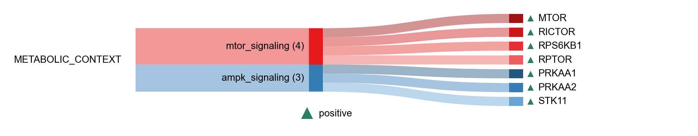

# METABOLIC_CONTEXT

| Gene | Module Class | Sensor Family | Activation Tier | Scoring Direction | Cell Type Breadth | Detectability | Also in Module(s) | DOI | Aliases | Is_Sensor | Panel Source |
| --- | --- | --- | --- | --- | --- | --- | --- | --- | --- | --- | --- |
| PRKAA1 | ampk_signaling |  | Active | positive | Adipose/Immune-enriched | medium |  | 10.1038/nature09932 |  |  |  |
| PRKAA2 | ampk_signaling |  | Active | positive | Liver-enriched | medium |  | 10.1038/nature09932 | AMPKα1 |  |  |
| STK11 | ampk_signaling |  | Active | positive | Broad | medium |  | 10.1016/j.cub.2003.10.031 |  |  |  |
| MTOR | mtor_signaling |  | Active | positive | Broad | medium | INFLAMMAGING\|SASP | 10.1038/369756a0 |  |  |  |
| RICTOR | mtor_signaling |  | Active | positive | Broad | high |  | 10.1016/j.cub.2004.06.054 | AMPKα2 |  |  |
| RPS6KB1 | mtor_signaling |  | Active | positive | Liver/Adipose-enriched | medium |  | 10.1016/S0092-8674(02)00808-5 |  |  |  |
| RPTOR | mtor_signaling |  | Active | positive | Broad | high |  | 10.1016/S0092-8674(02)00833-4 |  |  |  |
