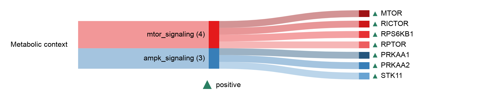

# Metabolic context

| Gene | HGNC ID | HGNC Symbol | Entrez ID | Module Class | Sensor Family | Scoring Direction | Single-Cell Detectability | Also in Module(s) | DOI | Aliases | Is_Sensor | Panel Source | DepMap Essential | s_het | s_het Lower 95% | s_het Upper 95% | UniProt ID | Monomer (kDa) | STRING Sensor Partners | STRING Partners |
| --- | --- | --- | --- | --- | --- | --- | --- | --- | --- | --- | --- | --- | --- | --- | --- | --- | --- | --- | --- | --- |
| PRKAA1 | HGNC:9376 | PRKAA1 | 5562 | ampk_signaling |  | positive | medium |  | [10.1038/nature09932](https://doi.org/10.1038/nature09932) | AMPKα1 |  |  | no | 0.0773262 | 0.039382 | 0.134638 | Q13131 | 64.0 | 0 | 131 |
| PRKAA2 | HGNC:9377 | PRKAA2 | 5563 | ampk_signaling |  | positive | medium |  | [10.1038/nature09932](https://doi.org/10.1038/nature09932) | AMPKα2 |  |  | no | 0.0185227 | 0.011178 | 0.0273686 | P54646 | 62.3 | 1 | 64 |
| STK11 | HGNC:11389 | STK11 | 6794 | ampk_signaling |  | positive | medium |  | [10.1016/j.cub.2003.10.031](https://doi.org/10.1016/j.cub.2003.10.031) |  |  |  | no | 0.181192 | 0.0674749 | 0.365362 | Q15831 | 48.6 | 0 | 80 |
| MTOR | HGNC:3942 | MTOR | 2475 | mtor_signaling |  | positive | medium | INFLAMMAGING\|SASP | [10.1038/369756a0](https://doi.org/10.1038/369756a0) |  |  |  | yes | 0.141788 | 0.092402 | 0.207585 | P42345 | 288.9 | 1 | 263 |
| RICTOR | HGNC:28611 | RICTOR | 253260 | mtor_signaling |  | positive | high |  | [10.1016/j.cub.2004.06.054](https://doi.org/10.1016/j.cub.2004.06.054) |  |  |  | no | 0.149053 | 0.0961491 | 0.21846 | Q6R327 | 192.2 | 0 | 109 |
| RPS6KB1 | HGNC:10436 | RPS6KB1 | 6198 | mtor_signaling |  | positive | medium |  | [10.1016/S0092-8674(02)00808-5](https://doi.org/10.1016/S0092-8674(02)00808-5) |  |  |  | no | 0.348288 | 0.130039 | 0.631626 | P23443 | 59.1 | 0 | 73 |
| RPTOR | HGNC:30287 | RPTOR | 57521 | mtor_signaling |  | positive | high |  | [10.1016/S0092-8674(02)00833-4](https://doi.org/10.1016/S0092-8674(02)00833-4) |  |  |  | yes | 0.228462 | 0.132131 | 0.35601 | Q8N122 | 149.0 | 0 | 174 |
