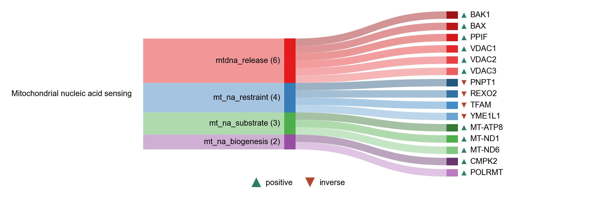

# Mitochondrial nucleic acid sensing

| Gene | Module Class | Sensor Family | Activation Tier | Scoring Direction | Cell Type Breadth | Detectability | Also in Module(s) | DOI | Aliases | Is_Sensor | Panel Source |
| --- | --- | --- | --- | --- | --- | --- | --- | --- | --- | --- | --- |
| CMPK2 | mt_na_biogenesis | cGAS-STING | Active | positive | Broad | low | IFN_I_OUTPUT | [10.1038/s41586-018-0372-z](https://doi.org/10.1038/s41586-018-0372-z) |  |  |  |
| POLRMT | mt_na_biogenesis | cGAS-STING | Active | positive | Broad | low |  | [10.1016/j.celrep.2022.111178](https://doi.org/10.1016/j.celrep.2022.111178) |  |  |  |
| PNPT1 | mt_na_restraint | cGAS-STING | Early | inverse | Broad | medium |  | [10.1038/s41586-018-0363-0](https://doi.org/10.1038/s41586-018-0363-0) |  |  |  |
| REXO2 | mt_na_restraint | cGAS-STING | Early | inverse | Broad | medium |  | [10.1093/nar/gkaa302](https://doi.org/10.1093/nar/gkaa302) |  |  |  |
| TFAM | mt_na_restraint | cGAS-STING | Early | inverse | Broad | medium | AGING_HALLMARKS | [10.1038/nature14156](https://doi.org/10.1038/nature14156) |  |  |  |
| YME1L1 | mt_na_restraint | cGAS-STING | Early | inverse | Broad | high |  | [10.1038/s42255-021-00385-9](https://doi.org/10.1038/s42255-021-00385-9) |  |  |  |
| MT-ATP8 | mt_na_substrate | cGAS-STING | Active | positive | Broad | high |  | [10.1038/s41467-024-51363-0](https://doi.org/10.1038/s41467-024-51363-0) |  |  |  |
| MT-ND1 | mt_na_substrate | RLR | Active | positive | Broad | high |  | [10.1038/s41467-024-51363-0](https://doi.org/10.1038/s41467-024-51363-0) |  |  |  |
| MT-ND6 | mt_na_substrate | RLR | Active | positive | Broad | high |  | [10.1038/s41467-024-51363-0](https://doi.org/10.1038/s41467-024-51363-0) |  |  |  |
| BAK1 | mtdna_release | cGAS-STING | Early | positive | Broad | low |  | [10.1038/s41586-023-06621-4](https://doi.org/10.1038/s41586-023-06621-4) |  |  |  |
| BAX | mtdna_release | cGAS-STING | Early | positive | Broad | high |  | [10.1038/s41586-023-06621-4](https://doi.org/10.1038/s41586-023-06621-4) |  |  |  |
| PPIF | mtdna_release | cGAS-STING | Early | positive | Broad | high |  | [10.1038/s41580-021-00433-y](https://doi.org/10.1038/s41580-021-00433-y) |  |  |  |
| VDAC1 | mtdna_release | cGAS-STING | Early | positive | Broad | high |  | [10.1126/science.aav4011](https://doi.org/10.1126/science.aav4011) |  |  |  |
| VDAC2 | mtdna_release | cGAS-STING | Early | positive | Broad | high |  | [10.1126/science.aav4011](https://doi.org/10.1126/science.aav4011) |  |  |  |
| VDAC3 | mtdna_release | cGAS-STING | Early | positive | Broad | medium |  | [10.1126/science.aav4011](https://doi.org/10.1126/science.aav4011) |  |  |  |
