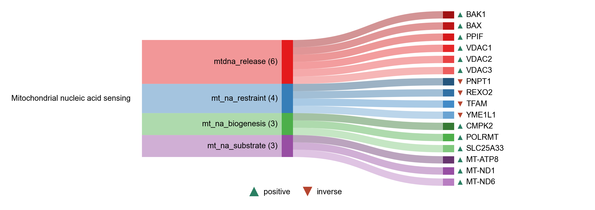

# Mitochondrial nucleic acid sensing

| Gene | HGNC ID | HGNC Symbol | Entrez ID | Module Class | Sensor Family | Activation Tier | Scoring Direction | Cell Type Breadth | Detectability | Also in Module(s) | DOI | Aliases | Is_Sensor | Panel Source | DepMap Essential | s_het | s_het Lower 95% | s_het Upper 95% | UniProt ID | Monomer (kDa) | STRING Sensor Partners |
| --- | --- | --- | --- | --- | --- | --- | --- | --- | --- | --- | --- | --- | --- | --- | --- | --- | --- | --- | --- | --- | --- |
| CMPK2 | HGNC:27015 | CMPK2 | 129607 | mt_na_biogenesis | cGAS-STING | Active | positive | Broad | low | IFN_I_OUTPUT | [10.1038/s41586-018-0372-z](https://doi.org/10.1038/s41586-018-0372-z) |  |  |  | no | 0.0010398 | 0.000141825 | 0.00308816 | Q5EBM0 | 49.4 | 0 |
| POLRMT | HGNC:9200 | POLRMT | 5442 | mt_na_biogenesis | cGAS-STING | Active | positive | Broad | low |  | [10.1016/j.celrep.2022.111178](https://doi.org/10.1016/j.celrep.2022.111178) |  |  |  | yes | 0.000978824 | 9.29825e-05 | 0.0031889 | O00411 | 138.6 | 0 |
| SLC25A33 | HGNC:29681 | SLC25A33 | 84275 | mt_na_biogenesis | cGAS-STING | Early | positive | Broad | medium |  | [10.1038/s42255-021-00385-9](https://doi.org/10.1038/s42255-021-00385-9) |  |  |  | no | 0.0209267 | 0.00479025 | 0.0528007 | Q9BSK2 | 35.4 | 0 |
| PNPT1 | HGNC:23166 | PNPT1 | 87178 | mt_na_restraint | cGAS-STING | Early | inverse | Broad | medium |  | [10.1038/s41586-018-0363-0](https://doi.org/10.1038/s41586-018-0363-0) |  |  |  | yes | 0.0245246 | 0.0126308 | 0.0385697 | Q8TCS8 | 86.0 | 0 |
| REXO2 | HGNC:17851 | REXO2 | 25996 | mt_na_restraint | cGAS-STING | Early | inverse | Broad | medium |  | [10.1093/nar/gkaa302](https://doi.org/10.1093/nar/gkaa302) |  |  |  | no | 0.0191874 | 0.00374875 | 0.0418571 | Q9Y3B8 | 26.8 | 0 |
| TFAM | HGNC:11741 | TFAM | 7019 | mt_na_restraint | cGAS-STING | Early | inverse | Broad | medium | AGING_HALLMARKS | [10.1038/nature14156](https://doi.org/10.1038/nature14156) |  |  |  | yes | 0.027061 | 0.00443422 | 0.0633488 | Q00059 | 29.1 | 2 |
| YME1L1 | HGNC:12843 | YME1L1 | 10730 | mt_na_restraint | cGAS-STING | Early | inverse | Broad | high |  | [10.1038/s42255-021-00385-9](https://doi.org/10.1038/s42255-021-00385-9) |  |  |  | no | 0.0850936 | 0.0527424 | 0.128181 | Q96TA2 | 86.5 | 0 |
| MT-ATP8 | HGNC:7415 | MT-ATP8 | 4509 | mt_na_substrate | cGAS-STING | Active | positive | Broad | high |  | [10.1038/s41467-024-51363-0](https://doi.org/10.1038/s41467-024-51363-0) |  |  |  |  |  |  |  | P03928 | 8.0 | 0 |
| MT-ND1 | HGNC:7455 | MT-ND1 | 4535 | mt_na_substrate | RLR | Active | positive | Broad | high |  | [10.1038/s41467-024-51363-0](https://doi.org/10.1038/s41467-024-51363-0) |  |  |  |  |  |  |  | P03886 | 35.7 | 0 |
| MT-ND6 | HGNC:7462 | MT-ND6 | 4541 | mt_na_substrate | RLR | Active | positive | Broad | high |  | [10.1038/s41467-024-51363-0](https://doi.org/10.1038/s41467-024-51363-0) |  |  |  |  |  |  |  | P03923 | 18.6 | 0 |
| BAK1 | HGNC:949 | BAK1 | 578 | mtdna_release | cGAS-STING | Early | positive | Broad | low |  | [10.1038/s41586-023-06621-4](https://doi.org/10.1038/s41586-023-06621-4) |  |  |  | no | 0.00670052 | 0.00167001 | 0.0153757 | Q16611 | 23.4 | 0 |
| BAX | HGNC:959 | BAX | 581 | mtdna_release | cGAS-STING | Early | positive | Broad | high |  | [10.1038/s41586-023-06621-4](https://doi.org/10.1038/s41586-023-06621-4) |  |  |  | no | 0.0471284 | 0.0133193 | 0.100564 | Q07812 | 21.2 | 2 |
| PPIF | HGNC:9259 | PPIF | 10105 | mtdna_release | cGAS-STING | Early | positive | Broad | high |  | [10.1038/s41580-021-00433-y](https://doi.org/10.1038/s41580-021-00433-y) |  |  |  | no | 0.00515725 | 0.000667253 | 0.0146314 | P30405 | 22.0 | 0 |
| VDAC1 | HGNC:12669 | VDAC1 | 7416 | mtdna_release | cGAS-STING | Early | positive | Broad | high |  | [10.1126/science.aav4011](https://doi.org/10.1126/science.aav4011) |  |  |  | yes | 0.121383 | 0.0369344 | 0.27598 | P21796 | 30.8 | 1 |
| VDAC2 | HGNC:12672 | VDAC2 | 7417 | mtdna_release | cGAS-STING | Early | positive | Broad | high |  | [10.1126/science.aav4011](https://doi.org/10.1126/science.aav4011) |  |  |  | no | 0.0516165 | 0.00896076 | 0.128355 | P45880 | 31.6 | 1 |
| VDAC3 | HGNC:12674 | VDAC3 | 7419 | mtdna_release | cGAS-STING | Early | positive | Broad | medium |  | [10.1126/science.aav4011](https://doi.org/10.1126/science.aav4011) |  |  |  | no | 0.278815 | 0.0672158 | 0.652589 | Q9Y277 | 30.7 | 2 |
