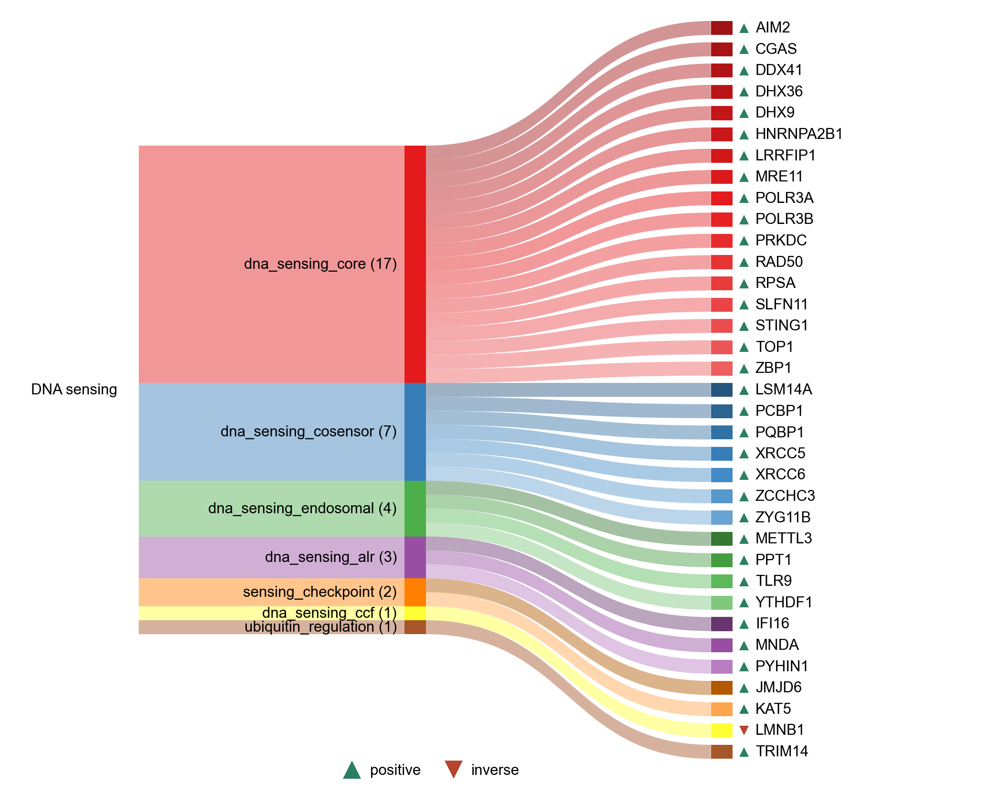

# DNA sensing

| Gene | Module Class | Sensor Family | Activation Tier | Scoring Direction | Cell Type Breadth | Detectability | Also in Module(s) | DOI | Aliases | Is_Sensor | Panel Source |
| --- | --- | --- | --- | --- | --- | --- | --- | --- | --- | --- | --- |
| IFI16 | dna_sensing_alr | ALR | Early | positive | Broad | high | INFLAMMASOME | [10.1038/ni.1932](https://doi.org/10.1038/ni.1932) |  | dna_sensor |  |
| MNDA | dna_sensing_alr | ALR | Active | positive | Immune-enriched | high |  | [10.3389/fimmu.2024.1395035](https://doi.org/10.3389/fimmu.2024.1395035) |  |  |  |
| PYHIN1 | dna_sensing_alr | ALR | Early | positive | Broad | medium |  | [10.15252/msb.20145808](https://doi.org/10.15252/msb.20145808) | IFIX | dna_sensor |  |
| LMNB1 | dna_sensing_ccf | cGAS-STING | Early | inverse | Broad | medium | SENESCENCE | [10.1038/nature24050](https://doi.org/10.1038/nature24050) |  |  |  |
| AIM2 | dna_sensing_core | ALR | Early | positive | Immune-enriched | low |  | [10.1038/ni.1702](https://doi.org/10.1038/ni.1702) |  | dna_sensor |  |
| CGAS | dna_sensing_core | cGAS-STING | Early | positive | Broad | low |  | [10.1126/science.1229963](https://doi.org/10.1126/science.1229963) | MB21D1 | dna_sensor |  |
| DDX41 | dna_sensing_core | cGAS-STING | Early | positive | Immune-enriched | low |  | [10.1038/ni.2091](https://doi.org/10.1038/ni.2091) |  | dna_sensor; rna_sensor |  |
| DHX36 | dna_sensing_core | RLR | Early | positive | Immune-enriched | medium | NASP_RNA_SENSING | [10.1038/s41467-019-10432-5](https://doi.org/10.1038/s41467-019-10432-5) |  | dna_sensor; rna_sensor |  |
| DHX9 | dna_sensing_core | RLR | Early | positive | Immune-enriched | medium |  | [10.4049/jimmunol.1101307](https://doi.org/10.4049/jimmunol.1101307) |  | dna_sensor; rna_sensor |  |
| HNRNPA2B1 | dna_sensing_core |  | Early | positive | Broad | high |  | [10.1126/science.aav0758](https://doi.org/10.1126/science.aav0758) |  | dna_sensor; rna_sensor |  |
| LRRFIP1 | dna_sensing_core | cGAS-STING | Early | positive | Broad | high |  | [10.1038/ni.1876](https://doi.org/10.1038/ni.1876) |  | dna_sensor; rna_sensor |  |
| MRE11 | dna_sensing_core | cGAS-STING | Early | positive | Broad | low |  | [10.1073/pnas.1222694110](https://doi.org/10.1073/pnas.1222694110) | MRE11A | dna_damage_sensor |  |
| POLR3A | dna_sensing_core |  | Early | positive | Broad | low |  | [10.1016/j.cell.2009.06.015](https://doi.org/10.1016/j.cell.2009.06.015) | RPC1 |  |  |
| POLR3B | dna_sensing_core |  | Early | positive | Broad | low |  | [10.1016/j.cell.2009.06.015](https://doi.org/10.1016/j.cell.2009.06.015) | RPC2 |  |  |
| PRKDC | dna_sensing_core |  | Early | positive | Broad | high |  | [10.7554/eLife.00047](https://doi.org/10.7554/eLife.00047) | DNA-PK | dna_sensor |  |
| RAD50 | dna_sensing_core | cGAS-STING | Early | positive | Broad | medium |  | [10.1038/s41586-023-06889-6](https://doi.org/10.1038/s41586-023-06889-6) |  | dna_sensor |  |
| RPSA | dna_sensing_core |  | Early | positive | Broad | high |  | [10.1038/s41467-023-43784-0](https://doi.org/10.1038/s41467-023-43784-0) |  | dna_sensor; rna_sensor |  |
| SLFN11 | dna_sensing_core |  | Active | positive | Broad | low |  | [10.1126/sciimmunol.adj5465](https://doi.org/10.1126/sciimmunol.adj5465) |  | dna_sensor |  |
| STING1 | dna_sensing_core | cGAS-STING | Early | positive | Broad | medium |  | [10.1038/nature07317](https://doi.org/10.1038/nature07317) | TMEM173 |  |  |
| TOP1 | dna_sensing_core | cGAS-STING | Active | positive | Broad | high |  | [10.1038/s41467-020-14652-y](https://doi.org/10.1038/s41467-020-14652-y) |  |  |  |
| ZBP1 | dna_sensing_core | ZBP1 | Early | positive | Broad | low | IFN_I_OUTPUT | [10.1038/nature06013](https://doi.org/10.1038/nature06013) |  | dna_sensor; rna_sensor |  |
| LSM14A | dna_sensing_cosensor |  | Early | positive | Broad | high |  | [10.1073/pnas.1203405109](https://doi.org/10.1073/pnas.1203405109) | RAPS5 |  |  |
| PCBP1 | dna_sensing_cosensor | cGAS-STING | Active | positive | Broad | high |  | [10.1038/s41423-020-0462-3](https://doi.org/10.1038/s41423-020-0462-3) |  |  |  |
| PQBP1 | dna_sensing_cosensor | cGAS-STING | Early | positive | Broad | medium |  | [10.1016/j.cell.2015.04.050](https://doi.org/10.1016/j.cell.2015.04.050) |  | dna_sensor |  |
| XRCC5 | dna_sensing_cosensor | cGAS-STING | Early | positive | Broad | high |  | [10.7554/eLife.00047](https://doi.org/10.7554/eLife.00047) |  | dna_sensor |  |
| XRCC6 | dna_sensing_cosensor | cGAS-STING | Early | positive | Broad | high |  | [10.1111/imm.13318](https://doi.org/10.1111/imm.13318) | ku70 | dna_sensor |  |
| ZCCHC3 | dna_sensing_cosensor | cGAS-STING | Early | positive | Broad | low |  | [10.1038/s41467-018-05559-w](https://doi.org/10.1038/s41467-018-05559-w) |  | dna_sensor |  |
| ZYG11B | dna_sensing_cosensor | cGAS-STING | Early | positive | Broad | high |  | [10.1016/j.celrep.2023.112278](https://doi.org/10.1016/j.celrep.2023.112278) |  |  |  |
| METTL3 | dna_sensing_endosomal | TLR | Active | positive | Broad | low |  | [10.1016/j.jbc.2024.107226](https://doi.org/10.1016/j.jbc.2024.107226) |  |  |  |
| PPT1 | dna_sensing_endosomal | TLR | Active | positive | Broad | medium |  | [10.1038/s41467-023-43650-z](https://doi.org/10.1038/s41467-023-43650-z) |  |  |  |
| TLR9 | dna_sensing_endosomal | TLR | Early | positive | Immune-enriched | low | IFN_I_OUTPUT | [10.1038/35047123](https://doi.org/10.1038/35047123) |  | dna_sensor |  |
| YTHDF1 | dna_sensing_endosomal | TLR | Active | positive | Immune-enriched | low |  | [10.1016/j.jbc.2024.107226](https://doi.org/10.1016/j.jbc.2024.107226) |  |  |  |
| JMJD6 | sensing_checkpoint | cGAS-STING | Active | positive | Broad | medium |  | [10.1126/science.aav0758](https://doi.org/10.1126/science.aav0758) | confirmed |  |  |
| KAT5 | sensing_checkpoint | cGAS-STING | Early | positive | Broad | low |  | [10.1073/pnas.1922330117](https://doi.org/10.1073/pnas.1922330117) |  |  |  |
| TRIM14 | ubiquitin_regulation | cGAS-STING | Active | positive | Broad | medium |  | [10.1016/j.molcel.2016.08.025](https://doi.org/10.1016/j.molcel.2016.08.025) |  |  |  |
