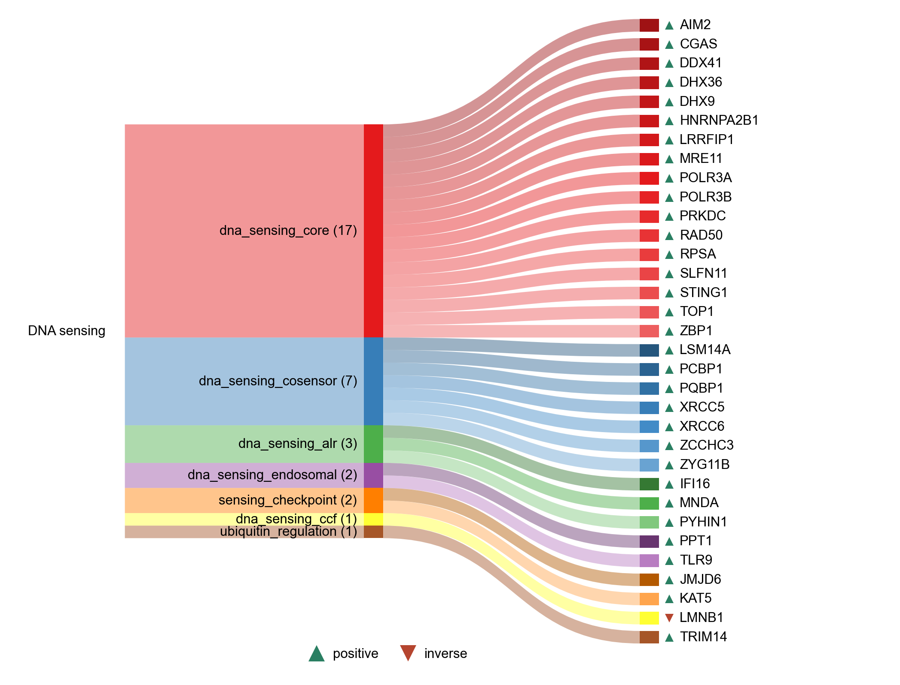

# DNA sensing

| Gene | HGNC ID | HGNC Symbol | Entrez ID | Module Class | Sensor Family | Scoring Direction | Single-Cell Detectability | Also in Module(s) | DOI | Aliases | Is_Sensor | Panel Source | DepMap Essential | s_het | s_het Lower 95% | s_het Upper 95% | UniProt ID | Monomer (kDa) | STRING Sensor Partners | STRING Partners |
| --- | --- | --- | --- | --- | --- | --- | --- | --- | --- | --- | --- | --- | --- | --- | --- | --- | --- | --- | --- | --- |
| IFI16 | HGNC:5395 | IFI16 | 3428 | dna_sensing_alr | ALR | positive | high | INFLAMMASOME | [10.1038/ni.1932](https://doi.org/10.1038/ni.1932) |  | dna_sensor |  | no | 0.00360891 | 0.000111916 | 0.0145265 | Q16666 | 88.3 | 17 | 624 |
| MNDA | HGNC:7183 | MNDA | 4332 | dna_sensing_alr | ALR | positive | high |  | [10.3389/fimmu.2024.1395035](https://doi.org/10.3389/fimmu.2024.1395035) |  |  |  | no | 0.00122576 | 6.95649e-05 | 0.00451911 | P41218 | 45.8 | 0 | 10 |
| PYHIN1 | HGNC:28894 | PYHIN1 | 149628 | dna_sensing_alr | ALR | positive | medium |  | [10.15252/msb.20145808](https://doi.org/10.15252/msb.20145808) | IFIX | dna_sensor |  | no | 0.000955454 | 6.95973e-05 | 0.00327121 | Q6K0P9 | 55.1 | 3 | 276 |
| LMNB1 | HGNC:6637 | LMNB1 | 4001 | dna_sensing_ccf | cGAS-STING | inverse | medium | SENESCENCE | [10.1038/nature24050](https://doi.org/10.1038/nature24050) |  |  |  | no | 0.0803557 | 0.0355015 | 0.152751 | P20700 | 66.4 | 2 | 151 |
| AIM2 | HGNC:357 | AIM2 | 9447 | dna_sensing_core | ALR | positive | low |  | [10.1038/ni.1702](https://doi.org/10.1038/ni.1702) |  | dna_sensor |  | no | 0.0018237 | 0.000355671 | 0.00469457 | O14862 | 39.0 | 4 | 22 |
| CGAS | HGNC:21367 | CGAS | 115004 | dna_sensing_core | cGAS-STING | positive | low |  | [10.1126/science.1229963](https://doi.org/10.1126/science.1229963) | MB21D1 | dna_sensor |  | no | 0.00114308 | 0.000111287 | 0.00362328 | Q8N884 | 58.8 | 2 | 101 |
| DDX41 | HGNC:18674 | DDX41 | 51428 | dna_sensing_core | cGAS-STING | positive | low |  | [10.1038/ni.2091](https://doi.org/10.1038/ni.2091) |  | dna_sensor; rna_sensor |  | yes | 0.0202501 | 0.0114355 | 0.0308882 | Q9UJV9 | 69.8 | 4 | 229 |
| DHX36 | HGNC:14410 | DHX36 | 170506 | dna_sensing_core | Multi | positive | medium | NASP_RNA_SENSING | [10.1038/s41467-019-10432-5](https://doi.org/10.1038/s41467-019-10432-5) |  | dna_sensor; rna_sensor |  | yes | 0.0634367 | 0.041011 | 0.0922737 | Q9H2U1 | 114.8 | 7 | 84 |
| DHX9 | HGNC:2750 | DHX9 | 1660 | dna_sensing_core | RLR | positive | medium |  | [10.4049/jimmunol.1101307](https://doi.org/10.4049/jimmunol.1101307) |  | dna_sensor; rna_sensor |  | yes | 0.484762 | 0.188918 | 0.858618 | Q08211 | 141.0 | 14 | 433 |
| HNRNPA2B1 | HGNC:5033 | HNRNPA2B1 | 3181 | dna_sensing_core |  | positive | high |  | [10.1126/science.aav0758](https://doi.org/10.1126/science.aav0758) |  | dna_sensor; rna_sensor |  | no | 0.341931 | 0.087894 | 0.758554 | P22626 | 37.4 | 3 | 266 |
| LRRFIP1 | HGNC:6702 | LRRFIP1 | 9208 | dna_sensing_core | cGAS-STING | positive | high |  | [10.1038/ni.1876](https://doi.org/10.1038/ni.1876) |  | dna_sensor; rna_sensor |  | no | 0.0151172 | 0.00422464 | 0.0277294 | Q32MZ4 | 89.3 | 1 | 44 |
| MRE11 | HGNC:7230 | MRE11 | 4361 | dna_sensing_core | cGAS-STING | positive | low |  | [10.1073/pnas.1222694110](https://doi.org/10.1073/pnas.1222694110) | MRE11A | dna_damage_sensor |  | yes | 0.00364374 | 0.0010811 | 0.00759291 | P49959 | 80.6 | 6 | 209 |
| POLR3A | HGNC:30074 | POLR3A | 11128 | dna_sensing_core | RLR | positive | low |  | [10.1016/j.cell.2009.06.015](https://doi.org/10.1016/j.cell.2009.06.015) | RPC1 |  |  | yes | 0.00966172 | 0.00501653 | 0.0151951 | O14802 | 155.6 | 0 | 85 |
| POLR3B | HGNC:30348 | POLR3B | 55703 | dna_sensing_core | RLR | positive | low |  | [10.1016/j.cell.2009.06.015](https://doi.org/10.1016/j.cell.2009.06.015) | RPC2 |  |  | yes | 0.00247113 | 0.000318009 | 0.00603801 | Q9NW08 | 127.8 | 1 | 77 |
| PRKDC | HGNC:9413 | PRKDC | 5591 | dna_sensing_core |  | positive | high |  | [10.7554/eLife.00047](https://doi.org/10.7554/eLife.00047) | DNA-PK | dna_sensor |  | yes | 0.511914 | 0.277572 | 0.820253 | P78527 | 469.1 | 3 | 423 |
| RAD50 | HGNC:9816 | RAD50 | 10111 | dna_sensing_core | cGAS-STING | positive | medium |  | [10.1038/s41586-023-06889-6](https://doi.org/10.1038/s41586-023-06889-6) |  | dna_sensor |  | no | 0.00449025 | 0.00149327 | 0.00869434 | Q92878 | 153.9 | 3 | 206 |
| RPSA | HGNC:6502 | RPSA | 3921 | dna_sensing_core |  | positive | high |  | [10.1038/s41467-023-43784-0](https://doi.org/10.1038/s41467-023-43784-0) |  | dna_sensor; rna_sensor |  | yes | 0.117622 | 7.34944e-07 | 0.976037 | P08865 | 32.9 | 2 | 262 |
| SLFN11 | HGNC:26633 | SLFN11 | 91607 | dna_sensing_core |  | positive | low |  | [10.1126/sciimmunol.adj5465](https://doi.org/10.1126/sciimmunol.adj5465) |  | dna_sensor |  | no | 0.00129516 | 0.000101987 | 0.00441139 | Q7Z7L1 | 102.8 | 7 | 263 |
| STING1 | HGNC:27962 | STING1 | 340061 | dna_sensing_core | cGAS-STING | positive | medium |  | [10.1038/nature07317](https://doi.org/10.1038/nature07317) | TMEM173 |  |  | no | 0.0258478 | 0.00689122 | 0.0610937 | Q86WV6 | 42.2 | 4 | 65 |
| TOP1 | HGNC:11986 | TOP1 | 7150 | dna_sensing_core | cGAS-STING | positive | high |  | [10.1038/s41467-020-14652-y](https://doi.org/10.1038/s41467-020-14652-y) |  |  |  | yes | 0.453442 | 0.235315 | 0.700769 | P11387 | 90.7 | 7 | 210 |
| ZBP1 | HGNC:16176 | ZBP1 | 81030 | dna_sensing_core | ZBP1 | positive | low | IFN_I_OUTPUT | [10.1038/nature06013](https://doi.org/10.1038/nature06013) |  | dna_sensor; rna_sensor |  | no | 0.00100338 | 0.000110625 | 0.00300173 | Q9H171 | 46.3 | 0 | 33 |
| LSM14A | HGNC:24489 | LSM14A | 26065 | dna_sensing_cosensor |  | positive | high |  | [10.1073/pnas.1203405109](https://doi.org/10.1073/pnas.1203405109) | RAPS5 |  |  | no | 0.0634569 | 0.0275759 | 0.121276 | Q8ND56 | 50.5 | 2 | 79 |
| PCBP1 | HGNC:8647 | PCBP1 | 5093 | dna_sensing_cosensor | cGAS-STING | positive | high |  | [10.1038/s41423-020-0462-3](https://doi.org/10.1038/s41423-020-0462-3) |  |  |  | yes | 0.327192 | 0.022405 | 0.838908 | Q15365 | 37.5 | 3 | 219 |
| PQBP1 | HGNC:9330 | PQBP1 | 10084 | dna_sensing_cosensor | cGAS-STING | positive | medium |  | [10.1016/j.cell.2015.04.050](https://doi.org/10.1016/j.cell.2015.04.050) |  | dna_sensor |  | no | 0.28116 | 0.072192 | 0.620012 | O60828 | 30.5 | 1 | 68 |
| XRCC5 | HGNC:12833 | XRCC5 | 7520 | dna_sensing_cosensor | cGAS-STING | positive | high |  | [10.7554/eLife.00047](https://doi.org/10.7554/eLife.00047) |  | dna_sensor |  | yes | 0.137787 | 0.0715512 | 0.234114 | P13010 | 82.7 | 4 | 363 |
| XRCC6 | HGNC:4055 | XRCC6 | 2547 | dna_sensing_cosensor | cGAS-STING | positive | high |  | [10.1111/imm.13318](https://doi.org/10.1111/imm.13318) | ku70 | dna_sensor |  | yes | 0.157937 | 0.0684247 | 0.29981 | P12956 | 69.8 | 5 | 408 |
| ZCCHC3 | HGNC:16230 | ZCCHC3 | 85364 | dna_sensing_cosensor | cGAS-STING | positive | low |  | [10.1038/s41467-018-05559-w](https://doi.org/10.1038/s41467-018-05559-w) |  | dna_sensor |  | no | 0.0242711 | 0.000278821 | 0.108598 | Q9NUD5 | 43.5 | 5 | 55 |
| ZYG11B | HGNC:25820 | ZYG11B | 79699 | dna_sensing_cosensor | cGAS-STING | positive | high |  | [10.1016/j.celrep.2023.112278](https://doi.org/10.1016/j.celrep.2023.112278) |  |  |  | no | 0.136814 | 0.0670255 | 0.241489 | Q9C0D3 | 83.9 | 0 | 64 |
| PPT1 | HGNC:9325 | PPT1 | 5538 | dna_sensing_endosomal | TLR | positive | medium |  | [10.1038/s41467-023-43650-z](https://doi.org/10.1038/s41467-023-43650-z) |  |  |  | no | 0.00901389 | 0.00430495 | 0.0150667 | P50897 | 34.2 | 0 | 16 |
| TLR9 | HGNC:15633 | TLR9 | 54106 | dna_sensing_endosomal | TLR | positive | low | IFN_I_OUTPUT | [10.1038/35047123](https://doi.org/10.1038/35047123) |  | dna_sensor |  | no | 0.00784932 | 0.000734228 | 0.0209074 | Q9NR96 | 115.9 | 3 | 78 |
| JMJD6 | HGNC:19355 | JMJD6 | 23210 | sensing_checkpoint | cGAS-STING | positive | medium |  | [10.1126/science.aav0758](https://doi.org/10.1126/science.aav0758) |  |  |  | no | 0.0720297 | 0.0391374 | 0.118202 | Q6NYC1 | 46.5 | 1 | 114 |
| KAT5 | HGNC:5275 | KAT5 | 10524 | sensing_checkpoint | cGAS-STING | positive | low |  | [10.1073/pnas.1922330117](https://doi.org/10.1073/pnas.1922330117) |  |  |  | yes | 0.0576618 | 0.0290532 | 0.100058 | Q92993 | 58.6 | 3 | 297 |
| TRIM14 | HGNC:16283 | TRIM14 | 9830 | ubiquitin_regulation | cGAS-STING | positive | medium |  | [10.1016/j.molcel.2016.08.025](https://doi.org/10.1016/j.molcel.2016.08.025) |  |  |  | no | 0.00977416 | 0.00232798 | 0.0228345 | Q14142 | 49.8 | 2 | 14 |
