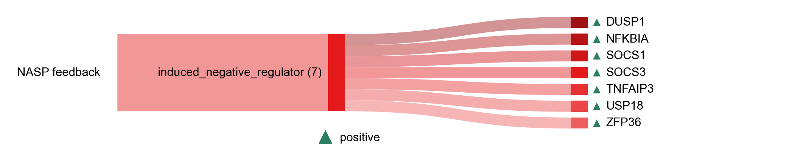

# NASP feedback

| Gene | Module Class | Sensor Family | Activation Tier | Scoring Direction | Cell Type Breadth | Detectability | Also in Module(s) | DOI | Aliases | Is_Sensor | Panel Source |
| --- | --- | --- | --- | --- | --- | --- | --- | --- | --- | --- | --- |
| DUSP1 | induced_negative_regulator |  | Active | positive | Broad | high |  | [10.1042/BST0341018](https://doi.org/10.1042/BST0341018) |  |  |  |
| NFKBIA | induced_negative_regulator |  | Early | positive | Broad | high | SENESCENCE\|SASP\|SIGNALING_CONTEXT \| NFKB_CYTOKINE_OUTPUT | [10.1101/cshperspect.a000034](https://doi.org/10.1101/cshperspect.a000034) |  |  |  |
| SOCS1 | induced_negative_regulator |  | Active | positive | Immune-enriched | medium |  | [10.1038/s41467-018-04013-1](https://doi.org/10.1038/s41467-018-04013-1) |  |  |  |
| SOCS3 | induced_negative_regulator |  | Active | positive | Broad | high |  | [10.1161/ATVBAHA.110.207464](https://doi.org/10.1161/ATVBAHA.110.207464) |  |  |  |
| TNFAIP3 | induced_negative_regulator |  | Active | positive | Broad | high | NFKB_CYTOKINE_OUTPUT | [10.1182/blood-2008-08-174110](https://doi.org/10.1182/blood-2008-08-174110) |  |  |  |
| USP18 | induced_negative_regulator |  | Active | positive | Broad | low |  | [10.1042/BSR20180250](https://doi.org/10.1042/BSR20180250) |  |  |  |
| ZFP36 | induced_negative_regulator |  | Active | positive | Broad | high |  | [10.1126/science.281.5379.1001](https://doi.org/10.1126/science.281.5379.1001) |  |  |  |
