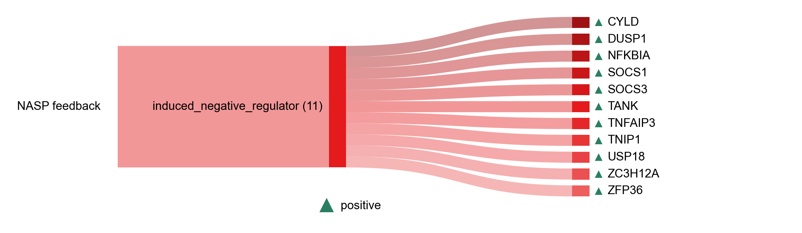

# NASP feedback

| Gene | HGNC ID | HGNC Symbol | Entrez ID | Module Class | Sensor Family | Scoring Direction | Single-Cell Detectability | Also in Module(s) | DOI | Aliases | Is_Sensor | Panel Source | DepMap Essential | s_het | s_het Lower 95% | s_het Upper 95% | UniProt ID | Monomer (kDa) | STRING Sensor Partners | STRING Partners |
| --- | --- | --- | --- | --- | --- | --- | --- | --- | --- | --- | --- | --- | --- | --- | --- | --- | --- | --- | --- | --- |
| CYLD | HGNC:2584 | CYLD | 1540 | induced_negative_regulator | RLR | positive | medium |  | [10.1038/embor.2008.136](https://doi.org/10.1038/embor.2008.136) |  |  |  | no | 0.146783 | 0.0834547 | 0.233099 | Q9NQC7 | 107.3 | 3 | 113 |
| DUSP1 | HGNC:3064 | DUSP1 | 1843 | induced_negative_regulator |  | positive | high |  | [10.1042/BST0341018](https://doi.org/10.1042/BST0341018) |  |  |  | no | 0.035091 | 0.0150487 | 0.0643424 | P28562 | 39.3 | 0 | 30 |
| NFKBIA | HGNC:7797 | NFKBIA | 4792 | induced_negative_regulator |  | positive | high | SENESCENCE\|SASP\|SIGNALING_CONTEXT \| NFKB_CYTOKINE_OUTPUT | [10.1101/cshperspect.a000034](https://doi.org/10.1101/cshperspect.a000034) |  |  |  | no | 0.269331 | 0.0687722 | 0.621655 | P25963 | 35.6 | 0 | 173 |
| SOCS1 | HGNC:19383 | SOCS1 | 8651 | induced_negative_regulator |  | positive | medium |  | [10.1038/s41467-018-04013-1](https://doi.org/10.1038/s41467-018-04013-1) |  |  |  | no | 0.0689179 | 0.0109877 | 0.18592 | O15524 | 23.6 | 0 | 107 |
| SOCS3 | HGNC:19391 | SOCS3 | 9021 | induced_negative_regulator |  | positive | high |  | [10.1161/ATVBAHA.110.207464](https://doi.org/10.1161/ATVBAHA.110.207464) |  |  |  | no | 0.124377 | 0.022311 | 0.328488 | O14543 | 24.8 | 0 | 108 |
| TANK | HGNC:11562 | TANK | 10010 | induced_negative_regulator | TLR | positive | high | SIGNALING_CONTEXT_TBK1_IRF | [10.1038/ni.1771](https://doi.org/10.1038/ni.1771) |  |  |  | no | 0.0769578 | 0.0282105 | 0.151531 | Q92844 | 47.8 | 3 | 54 |
| TNFAIP3 | HGNC:11896 | TNFAIP3 | 7128 | induced_negative_regulator |  | positive | high | NFKB_CYTOKINE_OUTPUT | [10.1182/blood-2008-08-174110](https://doi.org/10.1182/blood-2008-08-174110) |  |  |  | no | 0.175038 | 0.0800803 | 0.317221 | P21580 | 89.6 | 1 | 119 |
| TNIP1 | HGNC:16903 | TNIP1 | 10318 | induced_negative_regulator | TLR | positive | high |  | [10.1084/jem.20102177](https://doi.org/10.1084/jem.20102177) | ABIN-1 |  |  | no | 0.059403 | 0.0275108 | 0.110414 | Q15025 | 71.9 | 0 | 63 |
| USP18 | HGNC:12616 | USP18 | 11274 | induced_negative_regulator |  | positive | low |  | [10.1042/BSR20180250](https://doi.org/10.1042/BSR20180250) |  |  |  | yes | 0.00487536 | 0.000510792 | 0.0156706 | Q9UMW8 | 43.0 | 2 | 54 |
| ZC3H12A | HGNC:26259 | ZC3H12A | 80149 | induced_negative_regulator |  | positive | medium | NASP_FEEDBACK | [10.1038/nature07924](https://doi.org/10.1038/nature07924) |  |  |  | no | 0.0651865 | 0.0326832 | 0.114405 | Q5D1E8 | 65.7 | 0 | 29 |
| ZFP36 | HGNC:12862 | ZFP36 | 7538 | induced_negative_regulator |  | positive | high |  | [10.1126/science.281.5379.1001](https://doi.org/10.1126/science.281.5379.1001) |  |  |  | no | 0.0876915 | 0.0238096 | 0.208371 | P26651 | 34.0 | 1 | 91 |
