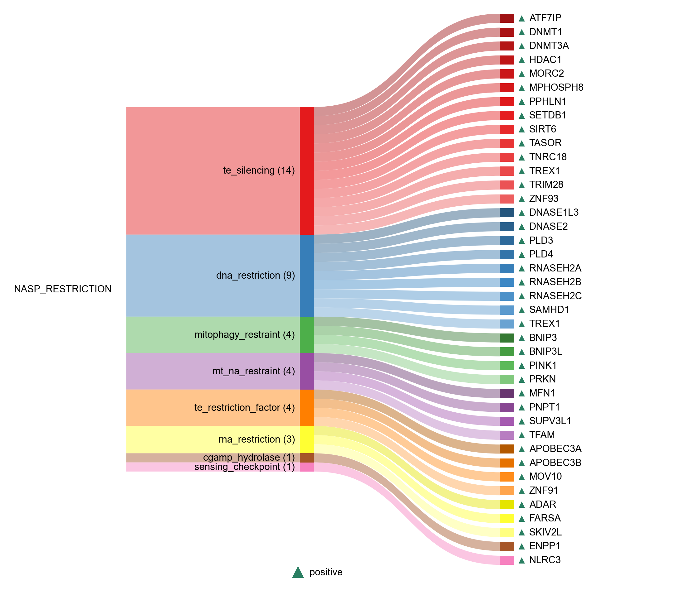

# NASP_RESTRICTION

| Gene | Module Class | Sensor Family | Activation Tier | Scoring Direction | Cell Type Breadth | Detectability | Also in Module(s) | DOI | Aliases | Is_Sensor | Panel Source |
| --- | --- | --- | --- | --- | --- | --- | --- | --- | --- | --- | --- |
| ENPP1 | cgamp_hydrolase | cGAS-STING | Active | positive | Broad | low |  | 10.1073/pnas.2119189119 |  |  |  |
| DNASE1L3 | dna_restriction | cGAS-STING | Active | positive | Liver/Immune-enriched | medium |  | 10.3389/fimmu.2021.629922 |  |  |  |
| DNASE2 | dna_restriction | cGAS-STING | Early | positive | Broad | low |  | 10.1038/s41467-017-01932-3 |  |  |  |
| PLD3 | dna_restriction | cGAS-STING | Active | positive | Broad | high |  | 10.3389/fimmu.2021.629922 |  |  |  |
| PLD4 | dna_restriction | cGAS-STING | Active | positive | Broad | medium |  | 10.3389/fimmu.2021.629922 |  |  |  |
| RNASEH2A | dna_restriction | cGAS-STING | Active | positive | Broad | low |  | 10.1038/s41467-022-30604-0 |  |  |  |
| RNASEH2B | dna_restriction | cGAS-STING | Active | positive | Broad | high |  | 10.1038/s41467-022-30604-0 |  |  |  |
| RNASEH2C | dna_restriction | cGAS-STING | Active | positive | Broad | medium |  | 10.1038/s41467-022-30604-0 |  |  |  |
| SAMHD1 | dna_restriction | cGAS-STING | Early | positive | Broad | high |  | 10.1016/j.celrep.2016.07.002 |  |  |  |
| TREX1 | dna_restriction | cGAS-STING | Early | positive | Broad | low |  | 10.1016/j.cell.2008.06.032 |  |  |  |
| BNIP3 | mitophagy_restraint | cGAS-STING | Active | positive | Broad | high |  | 10.1083/jcb.202408166 |  |  |  |
| BNIP3L | mitophagy_restraint |  | Active | positive | Broad | high |  | 10.1038/nature07006 | Nix |  |  |
| PINK1 | mitophagy_restraint | cGAS-STING | Active | positive | Broad | medium |  | 10.1111/acel.13622 |  |  |  |
| PRKN | mitophagy_restraint | cGAS-STING | Active | positive | Broad | high |  | 10.1083/jcb.200809125 |  |  |  |
| MFN1 | mt_na_restraint | cGAS-STING | Early | positive | Broad | medium |  | 10.1038/s41467-024-51363-0 |  |  |  |
| PNPT1 | mt_na_restraint | cGAS-STING | Early | positive | Broad | medium | MITOCHONDRIAL_NA_SENSING | 10.1038/s41467-024-51363-0 |  |  |  |
| SUPV3L1 | mt_na_restraint | RLR | Early | positive | Broad | low |  | 10.1038/s41586-018-0363-0 | SUV3 |  |  |
| TFAM | mt_na_restraint | cGAS-STING | Early | positive | Broad | medium | AGING_HALLMARKS; MITOCHONDRIAL_NA_SENSING | 10.1038/nature14156 |  |  |  |
| ADAR | rna_restriction | RLR | Early | positive | Broad | high |  | 10.1126/science.aac7049 |  |  |  |
| FARSA | rna_restriction | PKR | Early | positive | Broad | low |  | 10.1016/j.molcel.2026.04.030 |  |  |  |
| SKIV2L | rna_restriction |  | Early | positive | Broad | low |  | 10.1038/ni.2948 |  |  |  |
| NLRC3 | sensing_checkpoint | cGAS-STING | Active | positive | Broad | low |  | 10.1016/j.immuni.2014.01.010 |  |  |  |
| APOBEC3A | te_restriction_factor | RLR | Early | positive | Immune-enriched | medium |  | 10.1093/nar/gkj416 |  |  |  |
| APOBEC3B | te_restriction_factor | RLR | Early | positive | Immune-enriched | low |  | 10.1093/nar/gkj416 |  |  |  |
| MOV10 | te_restriction_factor | Multi | Early | positive | Broad | low |  | 10.1371/journal.pgen.1002941 |  |  |  |
| ZNF91 | te_restriction_factor | Multi | Early | positive | Broad | high |  | 10.1038/nature13760 |  |  |  |
| ATF7IP | te_silencing |  | Active | positive | Broad | high |  | 10.1093/nar/gkae1165 | MCAF1 |  |  |
| DNMT1 | te_silencing | Multi | Early | positive | Broad | medium |  | 10.1038/s41594-021-00603-8 |  |  |  |
| DNMT3A | te_silencing |  | Active | positive | Broad | medium |  | 10.1038/2413 |  |  |  |
| HDAC1 | te_silencing |  | Active | positive | Broad | medium |  | 10.1038/s41467-023-42417-w |  |  |  |
| MORC2 | te_silencing |  | Active | positive | Broad | low |  | 10.1093/nar/gkae1165 |  |  |  |
| MPHOSPH8 | te_silencing |  | Early | positive | Broad | high |  | 10.1093/nar/gkae1165 | MPP8 |  |  |
| PPHLN1 | te_silencing |  | Early | positive | Broad | high |  | 10.1093/nar/gkae1165 | Periphilin-1 |  |  |
| SETDB1 | te_silencing |  | Active | positive | Broad | low |  | 10.1038/s41467-018-04132-9 |  |  |  |
| SIRT6 | te_silencing |  | Early | positive | Broad | low |  | 10.1038/ncomms6011 |  |  |  |
| TASOR | te_silencing |  | Early | positive | Broad | medium |  | 10.1093/nar/gkae1165 | FAM208A |  |  |
| TNRC18 | te_silencing |  | Early | positive | Broad | high |  | 10.1038/s41586-023-06688-z |  |  |  |
| TREX1 | te_silencing | cGAS-STING | Early | positive | Broad | low |  | 10.1038/s41586-018-0784-9 |  |  |  |
| TRIM28 | te_silencing | Multi | Early | positive | Broad | medium |  | 10.1038/nature08674 | KAP1 |  |  |
| ZNF93 | te_silencing | Multi | Early | positive | Broad | low |  | 10.1038/nature13760 |  |  |  |
