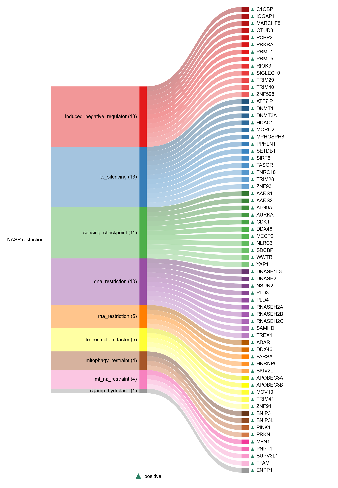

# NASP restriction

| Gene | HGNC ID | HGNC Symbol | Entrez ID | Module Class | Sensor Family | Scoring Direction | Single-Cell Detectability | Also in Module(s) | DOI | Aliases | Is_Sensor | Panel Source | DepMap Essential | s_het | s_het Lower 95% | s_het Upper 95% | UniProt ID | Monomer (kDa) | STRING Sensor Partners | STRING Partners |
| --- | --- | --- | --- | --- | --- | --- | --- | --- | --- | --- | --- | --- | --- | --- | --- | --- | --- | --- | --- | --- |
| ENPP1 | HGNC:3356 | ENPP1 | 5167 | cgamp_hydrolase | cGAS-STING | positive | low |  | [10.1073/pnas.2119189119](https://doi.org/10.1073/pnas.2119189119) |  |  |  | no | 0.0149211 | 0.00837044 | 0.0228577 | P22413 | 104.9 | 0 | 30 |
| DNASE1L3 | HGNC:2959 | DNASE1L3 | 1776 | dna_restriction | cGAS-STING | positive | medium |  | [10.3389/fimmu.2021.629922](https://doi.org/10.3389/fimmu.2021.629922) |  |  |  | no | 0.00273795 | 0.000350136 | 0.00832742 | Q13609 | 35.5 | 0 | 0 |
| DNASE2 | HGNC:2960 | DNASE2 | 1777 | dna_restriction | cGAS-STING | positive | low |  | [10.1038/s41467-017-01932-3](https://doi.org/10.1038/s41467-017-01932-3) |  |  |  | no | 0.00829996 | 0.00156493 | 0.0213926 | O00115 | 39.6 | 0 | 27 |
| NSUN2 | HGNC:25994 | NSUN2 | 54888 | dna_restriction | cGAS-STING | positive | low |  | [10.1016/j.cmet.2023.07.009](https://doi.org/10.1016/j.cmet.2023.07.009) |  | glucose_sensor |  | no | 0.025364 | 0.0113835 | 0.0419064 | Q08J23 | 86.5 | 2 | 93 |
| PLD3 | HGNC:17158 | PLD3 | 23646 | dna_restriction | cGAS-STING | positive | high |  | [10.3389/fimmu.2021.629922](https://doi.org/10.3389/fimmu.2021.629922) |  |  |  | no | 0.011232 | 0.00303444 | 0.0240083 | Q8IV08 | 54.7 | 0 | 27 |
| PLD4 | HGNC:23792 | PLD4 | 122618 | dna_restriction | cGAS-STING | positive | medium |  | [10.3389/fimmu.2021.629922](https://doi.org/10.3389/fimmu.2021.629922) |  |  |  | no | 0.00058833 | 5.73519e-05 | 0.00189059 | Q96BZ4 | 55.6 | 0 | 5 |
| RNASEH2A | HGNC:18518 | RNASEH2A | 10535 | dna_restriction | cGAS-STING | positive | low |  | [10.1038/s41467-022-30604-0](https://doi.org/10.1038/s41467-022-30604-0) |  |  |  | no | 0.00928204 | 0.00141453 | 0.0251324 | O75792 | 33.4 | 0 | 17 |
| RNASEH2B | HGNC:25671 | RNASEH2B | 79621 | dna_restriction | cGAS-STING | positive | high |  | [10.1038/s41467-022-30604-0](https://doi.org/10.1038/s41467-022-30604-0) |  |  |  | no | 0.00219958 | 0.00011035 | 0.00818186 | Q5TBB1 | 35.1 | 0 | 18 |
| RNASEH2C | HGNC:24116 | RNASEH2C | 84153 | dna_restriction | cGAS-STING | positive | medium |  | [10.1038/s41467-022-30604-0](https://doi.org/10.1038/s41467-022-30604-0) |  |  |  | no | 0.00159248 | 0.000217708 | 0.0048402 | Q8TDP1 | 17.8 | 0 | 8 |
| SAMHD1 | HGNC:15925 | SAMHD1 | 25939 | dna_restriction | cGAS-STING | positive | high |  | [10.1016/j.celrep.2016.07.002](https://doi.org/10.1016/j.celrep.2016.07.002) |  |  |  | no | 0.0124195 | 0.00651618 | 0.0198158 | Q9Y3Z3 | 72.2 | 0 | 93 |
| TREX1 | HGNC:12269 | TREX1 | 11277 | dna_restriction | cGAS-STING | positive | low |  | [10.1016/j.cell.2008.06.032](https://doi.org/10.1016/j.cell.2008.06.032) |  |  |  | no | 0.0154497 | 0.000593658 | 0.0595029 | Q9NSU2 | 33.2 | 0 | 9 |
| C1QBP | HGNC:1243 | C1QBP | 708 | induced_negative_regulator | RLR | positive | high |  | [10.1073/pnas.0811029106](https://doi.org/10.1073/pnas.0811029106) |  |  |  | no | 0.00926948 | 0.00206255 | 0.0207017 | Q07021 | 31.4 | 4 | 254 |
| IQGAP1 | HGNC:6110 | IQGAP1 | 8826 | induced_negative_regulator | cGAS-STING | positive | high |  | [10.4049/jimmunol.1601370](https://doi.org/10.4049/jimmunol.1601370) |  |  |  | no | 0.0642238 | 0.048683 | 0.0825143 | P46940 | 189.3 | 0 | 206 |
| MARCHF8 | HGNC:23356 | MARCHF8 | 220972 | induced_negative_regulator | cGAS-STING | positive | medium |  | [10.1126/scisignal.abk3067](https://doi.org/10.1126/scisignal.abk3067) |  |  |  | no | 0.00864248 | 0.00385402 | 0.0151044 | Q5T0T0 | 33.0 | 2 | 36 |
| OTUD3 | HGNC:29038 | OTUD3 | 23252 | induced_negative_regulator | RLR | positive | low |  | [10.1016/j.molcel.2020.06.020](https://doi.org/10.1016/j.molcel.2020.06.020) |  |  |  | no | 0.00606074 | 0.00145424 | 0.0132643 | Q5T2D3 | 45.1 | 2 | 45 |
| PCBP2 | HGNC:8648 | PCBP2 | 5094 | induced_negative_regulator | cGAS-STING | positive | high |  | [10.1038/s41467-022-29266-9](https://doi.org/10.1038/s41467-022-29266-9) |  |  |  | yes | 0.441868 | 0.0969164 | 0.909365 | Q15366 | 38.6 | 6 | 176 |
| PRKRA | HGNC:9438 | PRKRA | 8575 | induced_negative_regulator | PKR | positive | medium |  | [10.1038/s41467-025-58433-x](https://doi.org/10.1038/s41467-025-58433-x) | PACT |  |  | yes | 0.0608461 | 0.0219943 | 0.124944 | O75569 | 34.4 | 6 | 128 |
| PRMT1 | HGNC:5187 | PRMT1 | 3276 | induced_negative_regulator | cGAS-STING | positive | high |  | [10.1038/s41467-023-38443-3](https://doi.org/10.1038/s41467-023-38443-3) |  |  |  | yes | 0.598102 | 0.142406 | 0.981188 | Q99873 | 42.5 | 2 | 223 |
| PRMT5 | HGNC:10894 | PRMT5 | 10419 | induced_negative_regulator | cGAS-STING | positive | low |  | [10.1126/sciadv.abc1834](https://doi.org/10.1126/sciadv.abc1834) |  |  |  | yes | 0.166388 | 0.0764692 | 0.306115 | O14744 | 72.7 | 2 | 267 |
| RIOK3 | HGNC:11451 | RIOK3 | 8780 | induced_negative_regulator | RLR | positive | high |  | [10.1016/j.celrep.2015.03.027](https://doi.org/10.1016/j.celrep.2015.03.027) |  |  |  | no | 0.0181591 | 0.00687681 | 0.0323214 | O14730 | 59.1 | 1 | 54 |
| SIGLEC10 | HGNC:15620 | SIGLEC10 | 89790 | induced_negative_regulator | RLR | positive | low |  | [10.1093/glycob/cwu068](https://doi.org/10.1093/glycob/cwu068) |  |  |  | no | 0.00474082 | 0.000855524 | 0.0127538 | Q96LC7 | 76.6 | 2 | 11 |
| TRIM29 | HGNC:17274 | TRIM29 | 23650 | induced_negative_regulator | cGAS-STING | positive | high |  | [10.1038/s41467-017-00101-w](https://doi.org/10.1038/s41467-017-00101-w) |  |  |  | no | 0.00624903 | 0.00147125 | 0.0138265 | Q14134 | 65.8 | 3 | 95 |
| TRIM40 | HGNC:18736 | TRIM40 | 135644 | induced_negative_regulator | RLR | positive | low |  | [10.1016/j.celrep.2017.10.020](https://doi.org/10.1016/j.celrep.2017.10.020) |  |  |  | no | 0.000544445 | 5.67488e-05 | 0.00163007 | Q6P9F5 | 29.3 | 2 | 87 |
| ZNF598 | HGNC:28079 | ZNF598 | 90850 | induced_negative_regulator | RLR | positive | low |  | [10.1016/j.celrep.2019.07.081](https://doi.org/10.1016/j.celrep.2019.07.081) |  |  |  |  | 0.105081 | 0.0403116 | 0.221935 | Q86UK7 | 98.6 | 4 | 357 |
| BNIP3 | HGNC:1084 | BNIP3 | 664 | mitophagy_restraint | cGAS-STING | positive | high |  | [10.1083/jcb.202408166](https://doi.org/10.1083/jcb.202408166) |  |  |  | no | 0.0172672 | 0.00438073 | 0.0387857 | Q12983 | 21.5 | 0 | 30 |
| BNIP3L | HGNC:1085 | BNIP3L | 665 | mitophagy_restraint |  | positive | high |  | [10.1038/nature07006](https://doi.org/10.1038/nature07006) | Nix |  |  | no | 0.0539137 | 0.0198349 | 0.109808 | O60238 | 23.9 | 0 | 33 |
| PINK1 | HGNC:14581 | PINK1 | 65018 | mitophagy_restraint | cGAS-STING | positive | medium |  | [10.1111/acel.13622](https://doi.org/10.1111/acel.13622) |  |  |  | no | 0.00158286 | 0.000240901 | 0.00436309 | Q9BXM7 | 62.8 | 1 | 88 |
| PRKN | HGNC:8607 | PRKN | 5071 | mitophagy_restraint | cGAS-STING | positive | high |  | [10.1083/jcb.200809125](https://doi.org/10.1083/jcb.200809125) |  |  |  | no | 0.00106125 | 0.000223737 | 0.00282339 | O60260 | 51.6 | 5 | 400 |
| MFN1 | HGNC:18262 | MFN1 | 55669 | mt_na_restraint | cGAS-STING | positive | medium |  | [10.1038/s41467-024-51363-0](https://doi.org/10.1038/s41467-024-51363-0) |  |  |  | no | 0.0165598 | 0.00618865 | 0.0289043 | Q8IWA4 | 84.2 | 0 | 71 |
| PNPT1 | HGNC:23166 | PNPT1 | 87178 | mt_na_restraint | cGAS-STING | positive | medium | MITOCHONDRIAL_NA_SENSING | [10.1038/s41467-024-51363-0](https://doi.org/10.1038/s41467-024-51363-0) |  |  |  | yes | 0.0245246 | 0.0126308 | 0.0385697 | Q8TCS8 | 86.0 | 0 | 63 |
| SUPV3L1 | HGNC:11471 | SUPV3L1 | 6832 | mt_na_restraint | RLR | positive | low |  | [10.1038/s41586-018-0363-0](https://doi.org/10.1038/s41586-018-0363-0) | SUV3 |  |  | yes | 0.0268381 | 0.0144384 | 0.0423203 | Q8IYB8 | 88.0 | 0 | 58 |
| TFAM | HGNC:11741 | TFAM | 7019 | mt_na_restraint | cGAS-STING | positive | medium | AGING_HALLMARKS; MITOCHONDRIAL_NA_SENSING | [10.1038/nature14156](https://doi.org/10.1038/nature14156) |  |  |  | yes | 0.027061 | 0.00443422 | 0.0633488 | Q00059 | 29.1 | 2 | 147 |
| ADAR | HGNC:225 | ADAR | 103 | rna_restriction | RLR | positive | high |  | [10.1126/science.aac7049](https://doi.org/10.1126/science.aac7049) |  |  |  | no | 0.0663931 | 0.0416446 | 0.0989072 | P55265 | 136.1 | 4 | 101 |
| DDX46 | HGNC:18681 | DDX46 | 9879 | rna_restriction | RLR | positive | medium |  | [10.1038/ni.3830](https://doi.org/10.1038/ni.3830) |  |  |  | yes | 0.235408 | 0.116277 | 0.416088 | Q7L014 | 117.4 | 0 | 111 |
| FARSA | HGNC:3592 | FARSA | 2193 | rna_restriction | PKR | positive | low |  | [10.1016/j.molcel.2026.04.030](https://doi.org/10.1016/j.molcel.2026.04.030) |  |  |  | yes | 0.0298896 | 0.0165407 | 0.0468374 | Q9Y285 | 57.6 | 0 | 79 |
| HNRNPC | HGNC:5035 | HNRNPC | 3183 | rna_restriction | RLR | positive | high |  | [10.15252/embj.201899017](https://doi.org/10.15252/embj.201899017) |  |  |  | yes | 0.51 | 0.0979664 | 0.952965 | P07910 | 33.7 | 7 | 283 |
| SKIV2L | HGNC:10898 | SKIC2 | 6499 | rna_restriction |  | positive | low |  | [10.1038/ni.2948](https://doi.org/10.1038/ni.2948) |  |  |  | no | 0.00288737 | 0.000708137 | 0.00650666 | Q15477 | 137.8 | 1 | 125 |
| AARS1 | HGNC:20 | AARS1 | 16 | sensing_checkpoint | cGAS-STING | positive | medium |  | [10.1038/s41586-024-07992-y](https://doi.org/10.1038/s41586-024-07992-y) |  | l_lactate_sensor |  | yes | 0.0224592 | 0.0134817 | 0.0327156 | P49588 | 106.8 | 0 | 59 |
| AARS2 | HGNC:21022 | AARS2 | 57505 | sensing_checkpoint | cGAS-STING | positive | low |  | [10.1038/s41586-024-07992-y](https://doi.org/10.1038/s41586-024-07992-y) |  | l_lactate_sensor |  | yes | 0.00593754 | 0.00155063 | 0.0123652 | Q5JTZ9 | 107.3 | 0 | 28 |
| ATG9A | HGNC:22408 | ATG9A | 79065 | sensing_checkpoint | cGAS-STING | positive | low |  | [10.1073/pnas.0911267106](https://doi.org/10.1073/pnas.0911267106) |  |  |  | no | 0.0875296 | 0.050538 | 0.138726 | Q7Z3C6 | 94.4 | 0 | 67 |
| AURKA | HGNC:11393 | AURKA | 6790 | sensing_checkpoint | cGAS-STING | positive | low |  | [10.1172/JCI161929](https://doi.org/10.1172/JCI161929) |  |  |  | yes | 0.0742603 | 0.0335149 | 0.136416 | O14965 | 45.8 | 1 | 265 |
| CDK1 | HGNC:1722 | CDK1 | 983 | sensing_checkpoint | cGAS-STING | positive | medium |  | [10.1038/s41421-020-0162-2](https://doi.org/10.1038/s41421-020-0162-2) |  |  |  | yes | 0.318163 | 0.0812947 | 0.6962 | P06493 | 34.1 | 3 | 409 |
| DDX46 | HGNC:18681 | DDX46 | 9879 | sensing_checkpoint | RLR | positive | medium |  | [10.1038/ni.3830](https://doi.org/10.1038/ni.3830) |  |  |  | yes | 0.235408 | 0.116277 | 0.416088 | Q7L014 | 117.4 | 0 | 111 |
| MECP2 | HGNC:6990 | MECP2 | 4204 | sensing_checkpoint | cGAS-STING | positive | high |  | [10.1038/s41467-025-65713-z](https://doi.org/10.1038/s41467-025-65713-z) |  |  |  | no | 0.194067 | 0.020043 | 0.608276 | P51608 | 52.4 | 13 | 1151 |
| NLRC3 | HGNC:29889 | NLRC3 | 197358 | sensing_checkpoint | cGAS-STING | positive | low |  | [10.1016/j.immuni.2014.01.010](https://doi.org/10.1016/j.immuni.2014.01.010) |  |  |  | no | 0.00121081 | 8.7581e-05 | 0.00370133 | Q7RTR2 | 114.7 | 0 | 4 |
| SDCBP | HGNC:10662 | SDCBP | 6386 | sensing_checkpoint | TLR | positive | high |  | [10.1038/s41586-019-1612-6](https://doi.org/10.1038/s41586-019-1612-6) |  |  |  | no | 0.0159403 | 0.00294758 | 0.0418654 | O00560 | 32.4 | 1 | 100 |
| WWTR1 | HGNC:24042 | WWTR1 | 25937 | sensing_checkpoint | cGAS-STING | positive | high |  | [10.1038/ncb3496](https://doi.org/10.1038/ncb3496) |  |  |  | no | 0.0976656 | 0.0371896 | 0.199621 | Q9GZV5 | 44.1 | 0 | 76 |
| YAP1 | HGNC:16262 | YAP1 | 10413 | sensing_checkpoint | cGAS-STING | positive | high |  | [10.1038/ncb3496](https://doi.org/10.1038/ncb3496) |  |  |  | no | 0.361548 | 0.107652 | 0.745473 | P46937 | 54.5 | 0 | 223 |
| APOBEC3A | HGNC:17343 | APOBEC3A | 200315 | te_restriction_factor | RLR | positive | medium |  | [10.1093/nar/gkj416](https://doi.org/10.1093/nar/gkj416) |  |  |  | no | 0.000935335 | 7.65002e-05 | 0.00319185 | P31941 | 23.0 | 0 | 6 |
| APOBEC3B | HGNC:17352 | APOBEC3B | 9582 | te_restriction_factor | RLR | positive | low |  | [10.1093/nar/gkj416](https://doi.org/10.1093/nar/gkj416) |  |  |  | no | 0.00277121 | 0.000147319 | 0.0100775 | Q9UH17 | 45.9 | 1 | 18 |
| MOV10 | HGNC:7200 | MOV10 | 4343 | te_restriction_factor | Multi | positive | low |  | [10.1371/journal.pgen.1002941](https://doi.org/10.1371/journal.pgen.1002941) |  |  |  | no | 0.0579137 | 0.0338818 | 0.0910901 | Q9HCE1 | 113.7 | 5 | 125 |
| TRIM41 | HGNC:19013 | TRIM41 | 90933 | te_restriction_factor | cGAS-STING | positive | low |  | [10.1038/s41467-023-43001-y](https://doi.org/10.1038/s41467-023-43001-y) |  |  |  | no | 0.0778807 | 0.0410905 | 0.131112 | Q8WV44 | 71.7 | 3 | 32 |
| ZNF91 | HGNC:13166 | ZNF91 | 7644 | te_restriction_factor | Multi | positive | high |  | [10.1038/nature13760](https://doi.org/10.1038/nature13760) |  |  |  | no | 0.00459697 | 0.000386765 | 0.0158551 | Q05481 | 137.2 | 0 | 4 |
| ATF7IP | HGNC:20092 | ATF7IP | 55729 | te_silencing |  | positive | high |  | [10.1093/nar/gkae1165](https://doi.org/10.1093/nar/gkae1165) | MCAF1 |  |  | no | 0.239084 | 0.126871 | 0.389522 | Q6VMQ6 | 136.4 | 0 | 53 |
| DNMT1 | HGNC:2976 | DNMT1 | 1786 | te_silencing | Multi | positive | medium |  | [10.1038/s41594-021-00603-8](https://doi.org/10.1038/s41594-021-00603-8) |  |  |  | yes | 0.226459 | 0.121992 | 0.377167 | P26358 | 183.2 | 1 | 198 |
| DNMT3A | HGNC:2978 | DNMT3A | 1788 | te_silencing |  | positive | medium |  | [10.1038/2413](https://doi.org/10.1038/2413) |  |  |  | no | 0.00630405 | 0.00239612 | 0.0114465 | Q9Y6K1 | 101.9 | 1 | 153 |
| HDAC1 | HGNC:4852 | HDAC1 | 3065 | te_silencing |  | positive | medium |  | [10.1038/s41467-023-42417-w](https://doi.org/10.1038/s41467-023-42417-w) |  |  |  | no | 0.0814085 | 0.0333476 | 0.164615 | Q13547 | 55.1 | 0 | 632 |
| MORC2 | HGNC:23573 | MORC2 | 22880 | te_silencing |  | positive | low |  | [10.1093/nar/gkae1165](https://doi.org/10.1093/nar/gkae1165) |  |  |  | no | 0.109591 | 0.0674455 | 0.166684 | Q9Y6X9 | 117.8 | 1 | 64 |
| MPHOSPH8 | HGNC:29810 | MPHOSPH8 | 54737 | te_silencing |  | positive | high |  | [10.1093/nar/gkae1165](https://doi.org/10.1093/nar/gkae1165) | MPP8 |  |  | no | 0.0298473 | 0.0153996 | 0.0481891 | Q99549 | 97.2 | 2 | 76 |
| PPHLN1 | HGNC:19369 | PPHLN1 | 51535 | te_silencing |  | positive | high |  | [10.1093/nar/gkae1165](https://doi.org/10.1093/nar/gkae1165) | Periphilin-1 |  |  | no | 0.0134905 | 0.00338585 | 0.0256066 | Q8NEY8 | 52.7 | 2 | 71 |
| SETDB1 | HGNC:10761 | SETDB1 | 9869 | te_silencing |  | positive | low |  | [10.1038/s41467-018-04132-9](https://doi.org/10.1038/s41467-018-04132-9) |  |  |  | yes | 0.148584 | 0.0783488 | 0.259139 | Q15047 | 143.2 | 0 | 120 |
| SIRT6 | HGNC:14934 | SIRT6 | 51548 | te_silencing |  | positive | low |  | [10.1038/ncomms6011](https://doi.org/10.1038/ncomms6011) |  |  |  | no | 0.0164899 | 0.00518895 | 0.0324378 | Q8N6T7 | 39.1 | 3 | 93 |
| TASOR | HGNC:30314 | TASOR | 23272 | te_silencing |  | positive | medium |  | [10.1093/nar/gkae1165](https://doi.org/10.1093/nar/gkae1165) | FAM208A |  |  | no | 0.0864004 | 0.0548107 | 0.12894 | Q9UK61 | 189.0 | 1 | 56 |
| TNRC18 | HGNC:11962 | TNRC18 | 84629 | te_silencing |  | positive | high |  | [10.1038/s41586-023-06688-z](https://doi.org/10.1038/s41586-023-06688-z) |  |  |  | no | 0.216949 | 0.0962207 | 0.404395 | O15417 | 314.5 | 0 | 39 |
| TRIM28 | HGNC:16384 | TRIM28 | 10155 | te_silencing | Multi | positive | medium |  | [10.1038/nature08674](https://doi.org/10.1038/nature08674) | KAP1 |  |  | no | 0.419463 | 0.157618 | 0.758121 | Q13263 | 88.5 | 11 | 1416 |
| ZNF93 | HGNC:13169 | ZNF93 | 81931 | te_silencing | Multi | positive | low |  | [10.1038/nature13760](https://doi.org/10.1038/nature13760) |  |  |  | no | 0.00129619 | 0.000149259 | 0.00410424 | P35789 | 71.0 | 0 | 9 |
