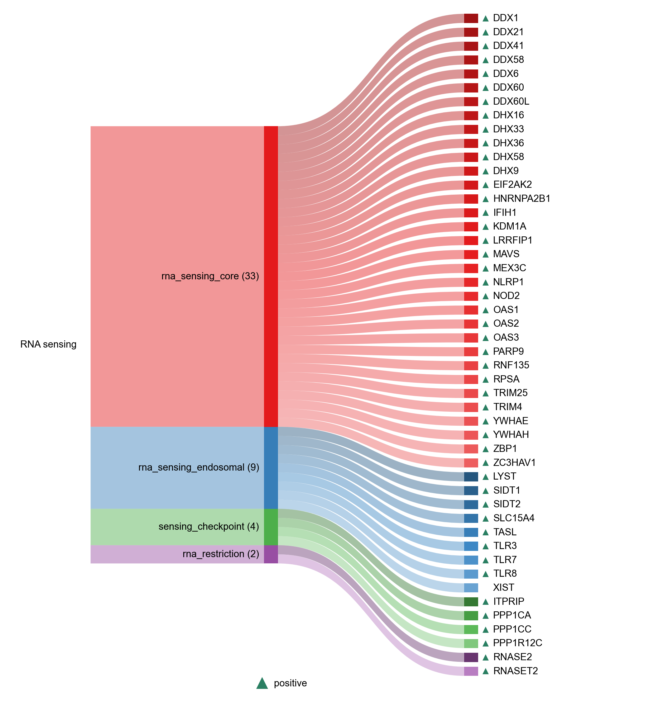

# NASP_RNA_SENSING

| Gene | Module Class | Sensor Family | Activation Tier | Scoring Direction | Cell Type Breadth | Detectability | Also in Module(s) | DOI | Aliases | Is_Sensor | Panel Source |
| --- | --- | --- | --- | --- | --- | --- | --- | --- | --- | --- | --- |
| RNASE2 | rna_restriction | TLR | Early | positive | Immune-enriched | low |  | 10.1016/j.immuni.2020.03.009 |  |  |  |
| RNASET2 | rna_restriction | TLR | Early | positive | Broad | high |  | 10.1016/j.cell.2019.11.001 |  |  |  |
| DDX1 | rna_sensing_core | RLR | Early | positive | Broad | medium |  | 10.1016/j.immuni.2011.03.027 |  | rna_sensor |  |
| DDX21 | rna_sensing_core | RLR | Early | positive | Broad | high |  | 10.1016/j.bbrc.2016.03.120 |  | rna_sensor |  |
| DDX41 | rna_sensing_core | cGAS-STING | Early | positive | Immune-enriched | low |  | 10.1038/ni.2091 |  | dna_sensor; rna_sensor |  |
| DDX58 | rna_sensing_core | RLR | Early | positive | Broad | high |  | 10.1038/ni1087 | RIGI; RIG-I | rna_sensor |  |
| DDX6 | rna_sensing_core | RLR | Active | positive | Broad | high |  | 10.3390/ijms19071877 |  | rna_sensor |  |
| DDX60 | rna_sensing_core | RLR | Active | positive | Broad | medium | IFN_I_OUTPUT | 10.1128/MCB.01368-10 |  | rna_sensor |  |
| DDX60 | rna_sensing_core | RLR | Active | positive | Broad | medium | IFN_I_OUTPUT | 10.1128/MCB.01368-10 |  |  |  |
| DDX60L | rna_sensing_core | RLR | Active | positive | Broad | high |  | 10.1128/JVI.01297-15 |  | rna_sensor |  |
| DHX16 | rna_sensing_core | RLR | Active | positive | Broad | low |  | 10.1016/j.celrep.2022.110434 |  | rna_sensor |  |
| DHX33 | rna_sensing_core | RLR | Active | positive | Broad | low |  | 10.1016/j.immuni.2013.07.001 |  | rna_sensor |  |
| DHX36 | rna_sensing_core | RLR | Early | positive | Immune-enriched | medium | NASP_RNA_SENSING | 10.1038/s41467-019-10432-5 |  | dna_sensor; rna_sensor |  |
| DHX58 | rna_sensing_core | RLR | Early | positive | Broad | low |  | 10.1073/pnas.0606699104 | LGP2 | rna_sensor |  |
| DHX9 | rna_sensing_core | RLR | Early | positive | Immune-enriched | medium |  | 10.4049/jimmunol.1101307 |  | dna_sensor; rna_sensor |  |
| HNRNPA2B1 | rna_sensing_core |  | Early | positive | Broad | high |  | 10.1126/science.aav0758 |  | dna_sensor; rna_sensor |  |
| IFIH1 | rna_sensing_core | RLR | Early | positive | Broad | medium |  | 10.1038/nature04734 | MDA5 | rna_sensor |  |
| KDM1A | rna_sensing_core | RLR | Active | positive | Broad | medium |  | 10.1371/journal.ppat.1009918 | LSD1 |  |  |
| LRRFIP1 | rna_sensing_core | cGAS-STING | Early | positive | Broad | high |  | 10.1038/ni.1876 |  | dna_sensor; rna_sensor |  |
| MAVS | rna_sensing_core | RLR | Early | positive | Broad | low |  | 10.1016/j.cell.2005.08.012 |  |  |  |
| MEX3C | rna_sensing_core | RLR | Active | positive | Broad | medium |  | 10.1073/pnas.1401674111 |  |  |  |
| NOD2 | rna_sensing_core | NLR | Active | positive | Immune-enriched | low |  | 10.1038/mi.2011.29 |  | rna_sensor |  |
| PARP9 | rna_sensing_core | Noncanonical_RNA | Active | positive | Immune-enriched | medium |  | 10.1038/s41467-021-23003-4 |  |  |  |
| RNF135 | rna_sensing_core | RLR | Early | positive | Broad | low |  | 10.1074/jbc.M804259200 |  |  |  |
| RPSA | rna_sensing_core |  | Early | positive | Broad | high |  | 10.1038/s41467-023-43784-0 |  | dna_sensor; rna_sensor |  |
| TRIM25 | rna_sensing_core | RLR | Early | positive | Broad | medium |  | 10.1126/science.ads4539 |  |  |  |
| TRIM4 | rna_sensing_core | RLR | Active | positive | Broad | medium |  | 10.1093/jmcb/mju005 |  |  |  |
| YWHAE | rna_sensing_core | RLR | Active | positive | Broad | high |  | 10.1016/j.chom.2012.04.006 | 14-3-3ε |  |  |
| YWHAH | rna_sensing_core | RLR | Active | positive | Broad | high |  | 10.1371/journal.ppat.1007582 | 14-3-3η |  |  |
| ZBP1 | rna_sensing_core | ZBP1 | Early | positive | Broad | low | IFN_I_OUTPUT | 10.1038/nature06013 |  | dna_sensor; rna_sensor |  |
| ZC3HAV1 | rna_sensing_core |  | Early | positive | Broad | high |  | 10.1038/s42003-024-07116-2 | ZAP; PARP13 | rna_sensor |  |
| LYST | rna_sensing_endosomal | TLR | Active | positive | Broad | high |  | 10.1084/jem.20141461 |  |  |  |
| SIDT1 | rna_sensing_endosomal | RLR | Active | positive | Broad | medium |  | 10.4049/jimmunol.1801369 |  |  |  |
| SIDT2 | rna_sensing_endosomal | RLR | Active | positive | Broad | low |  | 10.1016/j.immuni.2017.08.007 |  |  |  |
| SLC15A4 | rna_sensing_endosomal | TLR | Early | positive | Immune-enriched | low |  | 10.1073/pnas.1014051107 |  |  |  |
| TASL | rna_sensing_endosomal | TLR | Early | positive | Immune-enriched | low |  | 10.1016/j.celrep.2023.112916 |  |  |  |
| TLR3 | rna_sensing_endosomal | TLR | Early | positive | Immune-enriched | low | IFN_I_OUTPUT | 10.1038/35099560 |  | rna_sensor |  |
| TLR7 | rna_sensing_endosomal | TLR | Early | positive | Immune-enriched | low | IFN_I_OUTPUT | 10.1126/science.1093620 |  | rna_sensor |  |
| TLR8 | rna_sensing_endosomal | TLR | Early | positive | Immune-enriched | low | NFKB_CYTOKINE_OUTPUT\|IFN_I_OUTPUT | 10.1126/science.1093620 |  | rna_sensor |  |
| XIST | rna_sensing_endosomal | TLR | Early | Positive | Broad | high |  | 10.1172/jci.insight.169344 |  |  |  |
| ITPRIP | sensing_checkpoint | RLR | Active | positive | Broad | medium |  | 10.1128/jvi.00507-18 |  |  |  |
| PPP1CA | sensing_checkpoint | RLR | Early | positive | Broad | high |  | 10.1016/j.immuni.2012.11.018 | PP1α |  |  |
| PPP1CC | sensing_checkpoint | RLR | Early | positive | Broad | high |  | 10.1016/j.immuni.2012.11.018 | PP1γ |  |  |
| PPP1R12C | sensing_checkpoint | RLR | Active | positive | Broad | medium |  | 10.1016/j.cell.2022.08.011 | AAVS1 |  |  |
