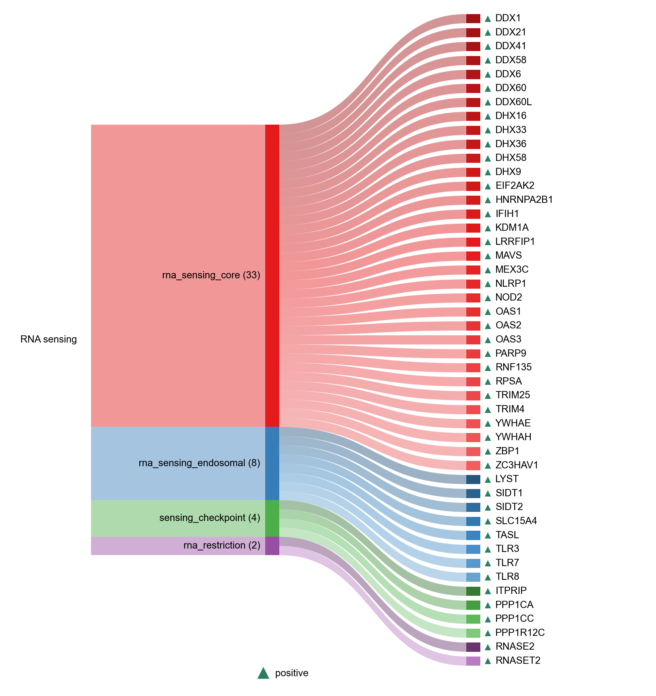

# RNA sensing

| Gene | HGNC ID | HGNC Symbol | Entrez ID | Module Class | Sensor Family | Activation Tier | Scoring Direction | Cell Type Breadth | Detectability | Also in Module(s) | DOI | Aliases | Is_Sensor | Panel Source | DepMap Essential | s_het | s_het Lower 95% | s_het Upper 95% | UniProt ID | Monomer (kDa) | STRING Sensor Partners |
| --- | --- | --- | --- | --- | --- | --- | --- | --- | --- | --- | --- | --- | --- | --- | --- | --- | --- | --- | --- | --- | --- |
| RNASE2 | HGNC:10045 | RNASE2 | 6036 | rna_restriction | TLR | Early | positive | Immune-enriched | low |  | [10.1016/j.immuni.2020.03.009](https://doi.org/10.1016/j.immuni.2020.03.009) |  |  |  | no | 0.00958576 | 0.000829042 | 0.0322916 | P10153 | 18.4 | 0 |
| RNASET2 | HGNC:21686 | RNASET2 | 8635 | rna_restriction | TLR | Early | positive | Broad | high |  | [10.1016/j.cell.2019.11.001](https://doi.org/10.1016/j.cell.2019.11.001) |  |  |  | no | 0.00306377 | 0.000420537 | 0.00881274 | O00584 | 29.5 | 0 |
| DDX1 | HGNC:2734 | DDX1 | 1653 | rna_sensing_core | RLR | Early | positive | Broad | medium |  | [10.1016/j.immuni.2011.03.027](https://doi.org/10.1016/j.immuni.2011.03.027) |  | rna_sensor |  | no | 0.0859529 | 0.0401584 | 0.155416 | Q92499 | 82.4 | 5 |
| DDX21 | HGNC:2744 | DDX21 | 9188 | rna_sensing_core | RLR | Early | positive | Broad | high |  | [10.1016/j.bbrc.2016.03.120](https://doi.org/10.1016/j.bbrc.2016.03.120) |  | rna_sensor |  | yes | 0.16497 | 0.0879762 | 0.273351 | Q9NR30 | 87.3 | 5 |
| DDX41 | HGNC:18674 | DDX41 | 51428 | rna_sensing_core | cGAS-STING | Early | positive | Immune-enriched | low |  | [10.1038/ni.2091](https://doi.org/10.1038/ni.2091) |  | dna_sensor; rna_sensor |  | yes | 0.0202501 | 0.0114355 | 0.0308882 | Q9UJV9 | 69.8 | 4 |
| DDX58 | HGNC:19102 | RIGI | 23586 | rna_sensing_core | RLR | Early | positive | Broad | high |  | [10.1038/ni1087](https://doi.org/10.1038/ni1087) | RIGI; RIG-I | rna_sensor |  | no | 0.00126183 | 0.000250545 | 0.00321646 | O95786 | 106.6 | 7 |
| DDX6 | HGNC:2747 | DDX6 | 1656 | rna_sensing_core | RLR | Active | positive | Broad | high |  | [10.3390/ijms19071877](https://doi.org/10.3390/ijms19071877) |  | rna_sensor |  | yes | 0.308015 | 0.138564 | 0.536945 | P26196 | 54.4 | 4 |
| DDX60 | HGNC:25942 | DDX60 | 55601 | rna_sensing_core | RLR | Active | positive | Broad | medium | IFN_I_OUTPUT | [10.1128/MCB.01368-10](https://doi.org/10.1128/MCB.01368-10) |  |  |  | no | 0.00476598 | 0.000756908 | 0.0116741 | Q8IY21 | 197.9 | 0 |
| DDX60L | HGNC:26429 | DDX60L | 91351 | rna_sensing_core | RLR | Active | positive | Broad | high |  | [10.1128/JVI.01297-15](https://doi.org/10.1128/JVI.01297-15) |  | rna_sensor |  | no | 0.00049094 | 5.76932e-05 | 0.00146029 | Q5H9U9 | 197.6 | 1 |
| DHX16 | HGNC:2739 | DHX16 | 8449 | rna_sensing_core | RLR | Active | positive | Broad | low |  | [10.1016/j.celrep.2022.110434](https://doi.org/10.1016/j.celrep.2022.110434) |  | rna_sensor |  | yes | 0.0161568 | 0.0102602 | 0.0224928 | O60231 | 119.3 | 3 |
| DHX33 | HGNC:16718 | DHX33 | 56919 | rna_sensing_core | RLR | Active | positive | Broad | low |  | [10.1016/j.immuni.2013.07.001](https://doi.org/10.1016/j.immuni.2013.07.001) |  | rna_sensor |  | yes | 0.0066547 | 0.00215864 | 0.0132931 | Q9H6R0 | 78.9 | 3 |
| DHX36 | HGNC:14410 | DHX36 | 170506 | rna_sensing_core | RLR | Early | positive | Immune-enriched | medium | NASP_RNA_SENSING | [10.1038/s41467-019-10432-5](https://doi.org/10.1038/s41467-019-10432-5) |  | dna_sensor; rna_sensor |  | yes | 0.0634367 | 0.041011 | 0.0922737 | Q9H2U1 | 114.8 | 7 |
| DHX58 | HGNC:29517 | DHX58 | 79132 | rna_sensing_core | RLR | Early | positive | Broad | low |  | [10.1073/pnas.0606699104](https://doi.org/10.1073/pnas.0606699104) | LGP2 | rna_sensor |  | no | 0.000752953 | 9.14163e-05 | 0.00231151 | Q96C10 | 76.6 | 4 |
| DHX9 | HGNC:2750 | DHX9 | 1660 | rna_sensing_core | Multi | Early | positive | Immune-enriched | medium |  | [10.4049/jimmunol.1101307](https://doi.org/10.4049/jimmunol.1101307) |  | dna_sensor; rna_sensor |  | yes | 0.484762 | 0.188918 | 0.858618 | Q08211 | 141.0 | 14 |
| EIF2AK2 | HGNC:9437 | EIF2AK2 | 5610 | rna_sensing_core | PKR | Early | positive | Broad | high | NASP_RNA_SENSING | [10.1073/pnas.75.3.1121](https://doi.org/10.1073/pnas.75.3.1121) |  | rna_sensor |  | no | 0.021497 | 0.0105888 | 0.0355189 | P19525 | 62.1 | 7 |
| HNRNPA2B1 | HGNC:5033 | HNRNPA2B1 | 3181 | rna_sensing_core |  | Early | positive | Broad | high |  | [10.1126/science.aav0758](https://doi.org/10.1126/science.aav0758) |  | dna_sensor; rna_sensor |  | no | 0.341931 | 0.087894 | 0.758554 | P22626 | 37.4 | 3 |
| IFIH1 | HGNC:18873 | IFIH1 | 64135 | rna_sensing_core | RLR | Early | positive | Broad | medium |  | [10.1038/nature04734](https://doi.org/10.1038/nature04734) | MDA5 | rna_sensor |  | no | 0.000352594 | 4.69686e-05 | 0.000982979 | Q9BYX4 | 116.7 | 5 |
| KDM1A | HGNC:29079 | KDM1A | 23028 | rna_sensing_core | RLR | Active | positive | Broad | medium |  | [10.1371/journal.ppat.1009918](https://doi.org/10.1371/journal.ppat.1009918) | LSD1 |  |  | no | 0.131044 | 0.0693268 | 0.222726 | O60341 | 92.9 | 5 |
| LRRFIP1 | HGNC:6702 | LRRFIP1 | 9208 | rna_sensing_core | cGAS-STING | Early | positive | Broad | high |  | [10.1038/ni.1876](https://doi.org/10.1038/ni.1876) |  | dna_sensor; rna_sensor |  | no | 0.0151172 | 0.00422464 | 0.0277294 | Q32MZ4 | 89.3 | 1 |
| MAVS | HGNC:29233 | MAVS | 57506 | rna_sensing_core | RLR | Early | positive | Broad | low |  | [10.1016/j.cell.2005.08.012](https://doi.org/10.1016/j.cell.2005.08.012) |  |  |  | no | 0.00274429 | 0.000390061 | 0.00748098 | Q7Z434 | 56.5 | 7 |
| MEX3C | HGNC:28040 | MEX3C | 51320 | rna_sensing_core | RLR | Active | positive | Broad | medium |  | [10.1073/pnas.1401674111](https://doi.org/10.1073/pnas.1401674111) |  |  |  | no | 0.136261 | 0.0484192 | 0.297093 | Q5U5Q3 | 69.4 | 6 |
| NLRP1 | HGNC:14374 | NLRP1 | 22861 | rna_sensing_core | NLR | Early | positive | Immune-enriched | medium | NASP_RNA_SENSING | [10.1126/science.abd0811](https://doi.org/10.1126/science.abd0811) |  | rna_sensor |  | no | 0.00268723 | 0.000677947 | 0.00615108 | Q9C000 | 165.9 | 4 |
| NOD2 | HGNC:5331 | NOD2 | 64127 | rna_sensing_core | NLR | Active | positive | Immune-enriched | low |  | [10.1038/mi.2011.29](https://doi.org/10.1038/mi.2011.29) |  | rna_sensor |  | no | 0.000512573 | 5.76673e-05 | 0.00158425 | Q9HC29 | 115.3 | 2 |
| OAS1 | HGNC:8086 | OAS1 | 4938 | rna_sensing_core | OAS | Early | positive | Broad | medium | NASP_RNA_SENSING | [10.1073/pnas.1218528110](https://doi.org/10.1073/pnas.1218528110) |  | rna_sensor |  | no | 0.00059546 | 1.32388e-05 | 0.00273409 | P00973 | 46.0 | 2 |
| OAS2 | HGNC:8087 | OAS2 | 4939 | rna_sensing_core | OAS | Early | positive | Broad | medium | NASP_RNA_SENSING | [10.1089/jir.2023.0098](https://doi.org/10.1089/jir.2023.0098) |  | rna_sensor |  | no | 0.000662365 | 4.27627e-05 | 0.00228191 | P29728 | 82.4 | 2 |
| OAS3 | HGNC:8088 | OAS3 | 4940 | rna_sensing_core | OAS | Early | positive | Broad | low | NASP_RNA_SENSING | [10.1089/jir.2023.0098](https://doi.org/10.1089/jir.2023.0098) |  | rna_sensor |  | no | 0.000449835 | 6.1863e-05 | 0.0012743 | Q9Y6K5 | 121.2 | 2 |
| PARP9 | HGNC:24118 | PARP9 | 83666 | rna_sensing_core | Noncanonical_RNA | Active | positive | Immune-enriched | medium |  | [10.1038/s41467-021-23003-4](https://doi.org/10.1038/s41467-021-23003-4) |  |  |  | no | 0.00396499 | 0.000691685 | 0.0106904 | Q8IXQ6 | 96.3 | 0 |
| RNF135 | HGNC:21158 | RNF135 | 84282 | rna_sensing_core | RLR | Early | positive | Broad | low |  | [10.1074/jbc.M804259200](https://doi.org/10.1074/jbc.M804259200) |  |  |  | no | 0.000976765 | 0.000119987 | 0.00306657 | Q8IUD6 | 47.9 | 4 |
| RPSA | HGNC:6502 | RPSA | 3921 | rna_sensing_core |  | Early | positive | Broad | high |  | [10.1038/s41467-023-43784-0](https://doi.org/10.1038/s41467-023-43784-0) |  | dna_sensor; rna_sensor |  | yes | 0.117622 | 7.34944e-07 | 0.976037 | P08865 | 32.9 | 2 |
| TRIM25 | HGNC:12932 | TRIM25 | 7706 | rna_sensing_core | RLR | Early | positive | Broad | medium |  | [10.1126/science.ads4539](https://doi.org/10.1126/science.ads4539) |  |  |  | no | 0.0147556 | 0.00264337 | 0.0323852 | Q14258 | 71.0 | 9 |
| TRIM4 | HGNC:16275 | TRIM4 | 89122 | rna_sensing_core | RLR | Active | positive | Broad | medium |  | [10.1093/jmcb/mju005](https://doi.org/10.1093/jmcb/mju005) |  |  |  | no | 0.000634349 | 7.43176e-05 | 0.00178241 | Q9C037 | 57.5 | 3 |
| YWHAE | HGNC:12851 | YWHAE | 7531 | rna_sensing_core | RLR | Active | positive | Broad | high |  | [10.1016/j.chom.2012.04.006](https://doi.org/10.1016/j.chom.2012.04.006) | 14-3-3ε |  |  | no | 0.457448 | 0.0824917 | 0.925115 | P62258 | 29.2 | 2 |
| YWHAH | HGNC:12853 | YWHAH | 7533 | rna_sensing_core | RLR | Active | positive | Broad | high |  | [10.1371/journal.ppat.1007582](https://doi.org/10.1371/journal.ppat.1007582) | 14-3-3η |  |  | no | 0.14785 | 0.0373303 | 0.397743 | Q04917 | 28.2 | 1 |
| ZBP1 | HGNC:16176 | ZBP1 | 81030 | rna_sensing_core | ZBP1 | Early | positive | Broad | low | IFN_I_OUTPUT | [10.1038/nature06013](https://doi.org/10.1038/nature06013) |  | dna_sensor; rna_sensor |  | no | 0.00100338 | 0.000110625 | 0.00300173 | Q9H171 | 46.3 | 0 |
| ZC3HAV1 | HGNC:23721 | ZC3HAV1 | 56829 | rna_sensing_core |  | Early | positive | Broad | high |  | [10.1038/s42003-024-07116-2](https://doi.org/10.1038/s42003-024-07116-2) | ZAP; PARP13 | rna_sensor |  | no | 0.0240001 | 0.0120118 | 0.0390374 | Q7Z2W4 | 101.4 | 2 |
| LYST | HGNC:1968 | LYST | 1130 | rna_sensing_endosomal | TLR | Active | positive | Broad | high |  | [10.1084/jem.20141461](https://doi.org/10.1084/jem.20141461) |  |  |  | no | 0.049664 | 0.0368736 | 0.0653823 | Q99698 | 429.1 | 0 |
| SIDT1 | HGNC:25967 | SIDT1 | 54847 | rna_sensing_endosomal | RLR | Active | positive | Broad | medium |  | [10.4049/jimmunol.1801369](https://doi.org/10.4049/jimmunol.1801369) |  |  |  | no | 0.000778554 | 0.000240504 | 0.00174366 | Q9NXL6 | 93.8 | 0 |
| SIDT2 | HGNC:24272 | SIDT2 | 51092 | rna_sensing_endosomal | RLR | Active | positive | Broad | low |  | [10.1016/j.immuni.2017.08.007](https://doi.org/10.1016/j.immuni.2017.08.007) |  |  |  | no | 0.0182933 | 0.00976961 | 0.0281043 | Q8NBJ9 | 94.5 | 0 |
| SLC15A4 | HGNC:23090 | SLC15A4 | 121260 | rna_sensing_endosomal | TLR | Early | positive | Immune-enriched | low |  | [10.1073/pnas.1014051107](https://doi.org/10.1073/pnas.1014051107) |  |  |  | no | 0.00818427 | 0.00237008 | 0.017466 | Q8N697 | 62.0 | 1 |
| TASL | HGNC:25667 | TASL | 80231 | rna_sensing_endosomal | TLR | Early | positive | Immune-enriched | low |  | [10.1016/j.celrep.2023.112916](https://doi.org/10.1016/j.celrep.2023.112916) |  |  |  | no | 0.163137 | 0.0297611 | 0.433478 | Q9HAI6 | 33.9 | 0 |
| TLR3 | HGNC:11849 | TLR3 | 7098 | rna_sensing_endosomal | TLR | Early | positive | Immune-enriched | low | IFN_I_OUTPUT | [10.1038/35099560](https://doi.org/10.1038/35099560) |  | rna_sensor |  | no | 0.00836415 | 0.00267059 | 0.0168594 | O15455 | 103.8 | 3 |
| TLR7 | HGNC:15631 | TLR7 | 51284 | rna_sensing_endosomal | TLR | Early | positive | Immune-enriched | low | IFN_I_OUTPUT | [10.1126/science.1093620](https://doi.org/10.1126/science.1093620) |  | rna_sensor |  | no | 0.138111 | 0.0348474 | 0.333808 | Q9NYK1 | 120.9 | 3 |
| TLR8 | HGNC:15632 | TLR8 | 51311 | rna_sensing_endosomal | TLR | Early | positive | Immune-enriched | low | NFKB_CYTOKINE_OUTPUT\|IFN_I_OUTPUT | [10.1126/science.1093620](https://doi.org/10.1126/science.1093620) |  | rna_sensor |  | no | 0.0544855 | 0.0236934 | 0.105398 | Q9NR97 | 119.8 | 4 |
| ITPRIP | HGNC:29370 | ITPRIP | 85450 | sensing_checkpoint | RLR | Active | positive | Broad | medium |  | [10.1128/jvi.00507-18](https://doi.org/10.1128/jvi.00507-18) |  |  |  | no | 0.0012847 | 0.000126211 | 0.00399858 | Q8IWB1 | 62.1 | 0 |
| PPP1CA | HGNC:9281 | PPP1CA | 5499 | sensing_checkpoint | RLR | Early | positive | Broad | high |  | [10.1016/j.immuni.2012.11.018](https://doi.org/10.1016/j.immuni.2012.11.018) | PP1α |  |  | yes | 0.139537 | 0.0457893 | 0.312827 | P62136 | 37.5 | 2 |
| PPP1CC | HGNC:9283 | PPP1CC | 5501 | sensing_checkpoint | RLR | Early | positive | Broad | high |  | [10.1016/j.immuni.2012.11.018](https://doi.org/10.1016/j.immuni.2012.11.018) | PP1γ |  |  | no | 0.157575 | 0.0614017 | 0.317535 | P36873 | 37.0 | 2 |
| PPP1R12C | HGNC:14947 | PPP1R12C | 54776 | sensing_checkpoint | RLR | Active | positive | Broad | medium |  | [10.1016/j.cell.2022.08.011](https://doi.org/10.1016/j.cell.2022.08.011) | AAVS1 |  |  | no | 0.0637312 | 0.0366734 | 0.101852 | Q9BZL4 | 84.9 | 1 |
