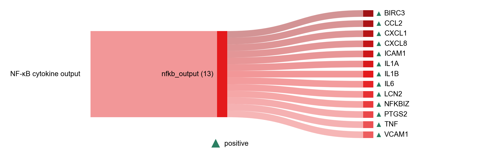

# NF-κB cytokine output

| Gene | Module Class | Sensor Family | Activation Tier | Scoring Direction | Cell Type Breadth | Detectability | Also in Module(s) | DOI | Aliases | Is_Sensor | Panel Source |
| --- | --- | --- | --- | --- | --- | --- | --- | --- | --- | --- | --- |
| BIRC3 | nfkb_output |  | Active | positive | Broad | medium |  | [10.1016/B978-0-12-801430-1.00002-0](https://doi.org/10.1016/B978-0-12-801430-1.00002-0) | c-IAP2 |  |  |
| CCL2 | nfkb_output |  | Active | positive | Broad | medium | SASP; NFKB_CYTOKINE_OUTPUT | [10.4049/jimmunol.153.5.2052](https://doi.org/10.4049/jimmunol.153.5.2052) | MCP-1 |  |  |
| CXCL1 | nfkb_output |  | Active | positive | Broad | high | SASP; NFKB_CYTOKINE_OUTPUT | [10.1152/ajpendo.00347.2013](https://doi.org/10.1152/ajpendo.00347.2013) |  |  |  |
| CXCL8 | nfkb_output |  | Active | positive | Broad | high | NFKB_CYTOKINE_OUTPUT | [10.1128/mcb.13.10.6137-6146.1993](https://doi.org/10.1128/mcb.13.10.6137-6146.1993) |  |  |  |
| ICAM1 | nfkb_output |  | Active | positive | Broad | medium | NFKB_CYTOKINE_OUTPUT | [10.1016/S0021-9258(17)37586-5](https://doi.org/10.1016/S0021-9258(17)37586-5) |  |  |  |
| IL1A | nfkb_output |  | Early | positive | Broad | medium |  | [10.1182/blood.V87.8.3410.bloodjournal8783410](https://doi.org/10.1182/blood.V87.8.3410.bloodjournal8783410) |  |  |  |
| IL1B | nfkb_output |  | Active | positive | Myeloid-enriched | high |  | [10.1128/mcb.13.10.6231-6240.1993](https://doi.org/10.1128/mcb.13.10.6231-6240.1993) |  |  |  |
| IL6 | nfkb_output |  | Active | positive | Broad | medium | SASP | [10.1128/mcb.10.5.2327-2334.1990](https://doi.org/10.1128/mcb.10.5.2327-2334.1990) |  |  |  |
| LCN2 | nfkb_output |  | Active | positive | Broad | high |  | [10.1189/jlb.1208719](https://doi.org/10.1189/jlb.1208719) | NGAL |  |  |
| NFKBIZ | nfkb_output |  | Active | positive | Broad | high |  | [10.1073/pnas.1912702117](https://doi.org/10.1073/pnas.1912702117) | IκBζ |  |  |
| PTGS2 | nfkb_output |  | Active | positive | Broad | high |  | [10.1023/a:1019927616000](https://doi.org/10.1023/a:1019927616000) |  |  |  |
| TNF | nfkb_output |  | Early | positive | Broad | medium | SENESCENCE\|SIGNALING_CONTEXT | [10.1084/jem.171.1.35](https://doi.org/10.1084/jem.171.1.35) |  |  |  |
| VCAM1 | nfkb_output |  | Active | positive | Epithelial-enriched | low |  | [10.1016/S0021-9258(18)42004-2](https://doi.org/10.1016/S0021-9258(18)42004-2) |  |  |  |
