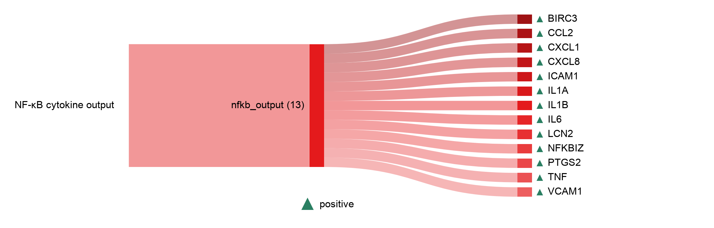

# NF-κB cytokine output

| Gene | HGNC ID | HGNC Symbol | Entrez ID | Module Class | Sensor Family | Scoring Direction | Single-Cell Detectability | Also in Module(s) | DOI | Aliases | Is_Sensor | Panel Source | DepMap Essential | s_het | s_het Lower 95% | s_het Upper 95% | UniProt ID | Monomer (kDa) | STRING Sensor Partners | STRING Partners |
| --- | --- | --- | --- | --- | --- | --- | --- | --- | --- | --- | --- | --- | --- | --- | --- | --- | --- | --- | --- | --- |
| BIRC3 | HGNC:591 | BIRC3 | 330 | nfkb_output |  | positive | medium |  | [10.1016/B978-0-12-801430-1.00002-0](https://doi.org/10.1016/B978-0-12-801430-1.00002-0) | c-IAP2 |  |  | no | 0.0259845 | 0.0126843 | 0.0446025 | Q13489 | 68.4 | 2 | 103 |
| CCL2 | HGNC:10618 | CCL2 | 6347 | nfkb_output |  | positive | medium | SASP; NFKB_CYTOKINE_OUTPUT | [10.4049/jimmunol.153.5.2052](https://doi.org/10.4049/jimmunol.153.5.2052) | MCP-1 |  |  | no | 0.0489921 | 0.0128433 | 0.11407 | P13500 | 11.0 | 0 | 62 |
| CXCL1 | HGNC:4602 | CXCL1 | 2919 | nfkb_output |  | positive | high | SASP; NFKB_CYTOKINE_OUTPUT | [10.1152/ajpendo.00347.2013](https://doi.org/10.1152/ajpendo.00347.2013) |  |  |  | no | 0.010754 | 0.000763955 | 0.0340541 | P09341 | 11.3 | 0 | 44 |
| CXCL8 | HGNC:6025 | CXCL8 | 3576 | nfkb_output |  | positive | high | NFKB_CYTOKINE_OUTPUT | [10.1128/mcb.13.10.6137-6146.1993](https://doi.org/10.1128/mcb.13.10.6137-6146.1993) |  |  |  | no | 0.000988691 | 0.000102379 | 0.00304981 | P10145 | 11.1 | 0 | 48 |
| ICAM1 | HGNC:5344 | ICAM1 | 3383 | nfkb_output |  | positive | medium | NFKB_CYTOKINE_OUTPUT | [10.1016/S0021-9258(17)37586-5](https://doi.org/10.1016/S0021-9258(17)37586-5) |  |  |  | no | 0.0233281 | 0.00193145 | 0.0532726 | P05362 | 57.8 | 0 | 47 |
| IL1A | HGNC:5991 | IL1A | 3552 | nfkb_output |  | positive | medium |  | [10.1182/blood.V87.8.3410.bloodjournal8783410](https://doi.org/10.1182/blood.V87.8.3410.bloodjournal8783410) |  |  |  | no | 0.00218897 | 0.00028524 | 0.00633744 | P01583 | 30.6 | 0 | 25 |
| IL1B | HGNC:5992 | IL1B | 3553 | nfkb_output |  | positive | high |  | [10.1128/mcb.13.10.6231-6240.1993](https://doi.org/10.1128/mcb.13.10.6231-6240.1993) |  |  |  | no | 0.0414579 | 0.00998333 | 0.0908958 | P01584 | 30.7 | 1 | 58 |
| IL6 | HGNC:6018 | IL6 | 3569 | nfkb_output |  | positive | medium | SASP | [10.1128/mcb.10.5.2327-2334.1990](https://doi.org/10.1128/mcb.10.5.2327-2334.1990) |  |  |  | no | 0.00656064 | 0.000639596 | 0.0205606 | P05231 | 23.7 | 0 | 40 |
| LCN2 | HGNC:6526 | LCN2 | 3934 | nfkb_output |  | positive | high |  | [10.1189/jlb.1208719](https://doi.org/10.1189/jlb.1208719) | NGAL |  |  | no | 0.000811485 | 6.3582e-05 | 0.00276991 | P80188 | 22.6 | 0 | 16 |
| NFKBIZ | HGNC:29805 | NFKBIZ | 64332 | nfkb_output |  | positive | high |  | [10.1073/pnas.1912702117](https://doi.org/10.1073/pnas.1912702117) | IκBζ |  |  | no | 0.131545 | 0.0679901 | 0.223308 | Q9BYH8 | 78.1 | 0 | 13 |
| PTGS2 | HGNC:9605 | PTGS2 | 5743 | nfkb_output |  | positive | high |  | [10.1023/a:1019927616000](https://doi.org/10.1023/a:1019927616000) |  |  |  | no | 0.0901807 | 0.0437051 | 0.16095 | P35354 | 69.0 | 0 | 40 |
| TNF | HGNC:11892 | TNF | 7124 | nfkb_output |  | positive | medium | SENESCENCE\|SIGNALING_CONTEXT | [10.1084/jem.171.1.35](https://doi.org/10.1084/jem.171.1.35) |  |  |  | no | 0.081908 | 0.0281914 | 0.172593 | P01375 | 25.6 | 0 | 252 |
| VCAM1 | HGNC:12663 | VCAM1 | 7412 | nfkb_output |  | positive | low |  | [10.1016/S0021-9258(18)42004-2](https://doi.org/10.1016/S0021-9258(18)42004-2) |  |  |  | no | 0.0341274 | 0.0122445 | 0.0744024 | P19320 | 81.3 | 0 | 27 |
