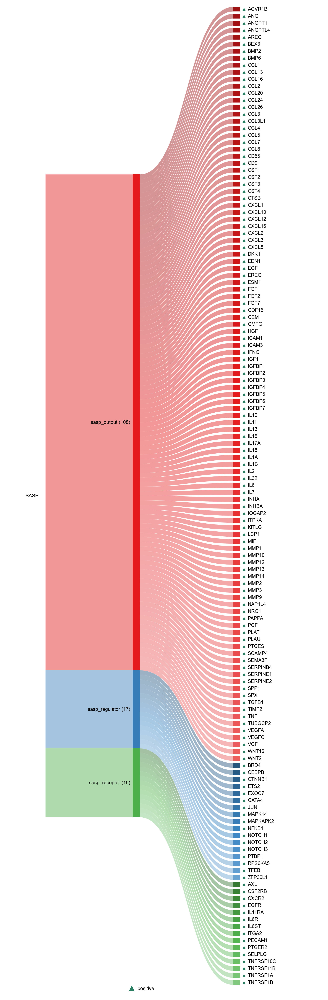

# SASP

| Gene | Module Class | Sensor Family | Activation Tier | Scoring Direction | Cell Type Breadth | Detectability | Also in Module(s) | DOI | Aliases | Is_Sensor | Panel Source |
| --- | --- | --- | --- | --- | --- | --- | --- | --- | --- | --- | --- |
| ACVR1B | sasp_output |  | Post-NASP | positive | Broad | medium |  | [10.1038/s41467-022-32552-1](https://doi.org/10.1038/s41467-022-32552-1) |  |  | SenMayo |
| ANG | sasp_output |  | Post-NASP | positive | Broad | medium |  | [10.1038/s41467-022-32552-1](https://doi.org/10.1038/s41467-022-32552-1) |  |  | SenMayo |
| ANGPT1 | sasp_output |  | Post-NASP | positive | Endothelial-enriched | medium |  | [10.1038/s41467-022-32552-1](https://doi.org/10.1038/s41467-022-32552-1) |  |  | SenMayo |
| ANGPTL4 | sasp_output |  | Post-NASP | positive | Broad | medium |  | [10.1038/s41467-022-32552-1](https://doi.org/10.1038/s41467-022-32552-1) |  |  | SenMayo |
| AREG | sasp_output |  | Post-NASP | positive | Broad | high |  | [10.1038/s41467-022-32552-1](https://doi.org/10.1038/s41467-022-32552-1) |  |  | SenMayo |
| BEX3 | sasp_output |  | Post-NASP | positive | Neural-enriched | high |  | [10.1038/s41467-022-32552-1](https://doi.org/10.1038/s41467-022-32552-1) |  |  | SenMayo |
| BMP2 | sasp_output |  | Post-NASP | positive | Broad | low |  | [10.1038/s41467-022-32552-1](https://doi.org/10.1038/s41467-022-32552-1) |  |  | SenMayo |
| BMP6 | sasp_output |  | Post-NASP | positive | Broad | low |  | [10.1038/s41467-022-32552-1](https://doi.org/10.1038/s41467-022-32552-1) |  |  | SenMayo |
| CCL1 | sasp_output |  | Post-NASP | positive | Immune-enriched | low |  | [10.1038/s41467-022-32552-1](https://doi.org/10.1038/s41467-022-32552-1) |  |  | SenMayo |
| CCL13 | sasp_output |  | Post-NASP | positive | Immune-enriched | low |  | [10.1038/s41467-022-32552-1](https://doi.org/10.1038/s41467-022-32552-1) |  |  | SenMayo |
| CCL16 | sasp_output |  | Post-NASP | positive | Immune-enriched | low |  | [10.1038/s41467-022-32552-1](https://doi.org/10.1038/s41467-022-32552-1) |  |  | SenMayo |
| CCL2 | sasp_output |  | Post-NASP | positive | Broad | medium | NFKB_CYTOKINE_OUTPUT | [10.1038/s41580-024-00738-8](https://doi.org/10.1038/s41580-024-00738-8) |  |  | SenNet |
| CCL20 | sasp_output |  | Post-NASP | positive | Broad | medium | NFKB_CYTOKINE_OUTPUT | [10.3389/fimmu.2023.1216376](https://doi.org/10.3389/fimmu.2023.1216376) |  |  |  |
| CCL24 | sasp_output |  | Post-NASP | positive | Immune-enriched | low |  | [10.1038/s41467-022-32552-1](https://doi.org/10.1038/s41467-022-32552-1) |  |  | SenMayo |
| CCL26 | sasp_output |  | Post-NASP | positive | Immune-enriched | low |  | [10.1038/s41467-022-32552-1](https://doi.org/10.1038/s41467-022-32552-1) |  |  | SenMayo |
| CCL3 | sasp_output |  | Post-NASP | positive | Broad | high |  | [10.1038/s41580-024-00738-8](https://doi.org/10.1038/s41580-024-00738-8) |  |  | SenNet |
| CCL3L1 | sasp_output |  | Post-NASP | positive | Immune-enriched | high |  | [10.1038/s41467-022-32552-1](https://doi.org/10.1038/s41467-022-32552-1) |  |  | SenMayo |
| CCL4 | sasp_output |  | Post-NASP | positive | Broad | high |  | [10.1038/s41580-024-00738-8](https://doi.org/10.1038/s41580-024-00738-8) |  |  | SenNet |
| CCL5 | sasp_output |  | Post-NASP | positive | Broad | high | NFKB_CYTOKINE_OUTPUT | [10.1038/s41580-024-00738-8](https://doi.org/10.1038/s41580-024-00738-8) |  |  | SenNet |
| CCL7 | sasp_output |  | Post-NASP | positive | Broad | low |  | [10.1038/s41580-024-00738-8](https://doi.org/10.1038/s41580-024-00738-8) |  |  | SenNet |
| CCL8 | sasp_output |  | Post-NASP | positive | Broad | low |  | [10.1038/s41580-024-00738-8](https://doi.org/10.1038/s41580-024-00738-8) |  |  | SenNet |
| CD55 | sasp_output |  | Post-NASP | positive | Broad | high |  | [10.1038/s41467-022-32552-1](https://doi.org/10.1038/s41467-022-32552-1) |  |  | SenMayo |
| CD9 | sasp_output |  | Post-NASP | positive | Broad | high |  | [10.1038/s41467-022-32552-1](https://doi.org/10.1038/s41467-022-32552-1) |  |  | SenMayo |
| CSF1 | sasp_output |  | Post-NASP | positive | Broad | medium |  | [10.1038/s41467-022-32552-1](https://doi.org/10.1038/s41467-022-32552-1) |  |  | SenMayo |
| CSF2 | sasp_output |  | Post-NASP | positive | Broad | low |  | [10.1038/s41580-024-00738-8](https://doi.org/10.1038/s41580-024-00738-8) |  |  | SenNet |
| CSF3 | sasp_output |  | Post-NASP | positive | Broad | medium |  | [10.1038/s41580-024-00738-8](https://doi.org/10.1038/s41580-024-00738-8) |  |  | SenNet |
| CST4 | sasp_output |  | Post-NASP | positive | Salivary-enriched | medium |  | [10.1038/s41467-022-32552-1](https://doi.org/10.1038/s41467-022-32552-1) |  |  | SenMayo |
| CTSB | sasp_output |  | Post-NASP | positive | Broad | high |  | [10.1038/s41467-022-32552-1](https://doi.org/10.1038/s41467-022-32552-1) |  |  | SenMayo |
| CXCL1 | sasp_output |  | Post-NASP | positive | Broad | high | NFKB_CYTOKINE_OUTPUT | [10.1038/s41580-024-00738-8](https://doi.org/10.1038/s41580-024-00738-8) |  |  | SenNet |
| CXCL10 | sasp_output |  | Post-NASP | positive | Broad | medium |  | [10.1038/s41580-024-00738-8](https://doi.org/10.1038/s41580-024-00738-8) |  |  | SenNet |
| CXCL12 | sasp_output |  | Post-NASP | positive | Broad | high |  | [10.1038/s41467-022-32552-1](https://doi.org/10.1038/s41467-022-32552-1) |  |  | SenMayo |
| CXCL16 | sasp_output |  | Post-NASP | positive | Broad | high |  | [10.1038/s41580-024-00738-8](https://doi.org/10.1038/s41580-024-00738-8) |  |  | SenNet |
| CXCL2 | sasp_output |  | Post-NASP | positive | Broad | high | NFKB_CYTOKINE_OUTPUT | [10.1038/s41580-024-00738-8](https://doi.org/10.1038/s41580-024-00738-8) |  |  | SenNet |
| CXCL3 | sasp_output |  | Post-NASP | positive | Broad | medium | NFKB_CYTOKINE_OUTPUT | [10.1038/s41467-022-32552-1](https://doi.org/10.1038/s41467-022-32552-1) |  |  | SenMayo |
| CXCL8 | sasp_output |  | Post-NASP | positive | Broad | high |  | [10.1038/s41580-024-00738-8](https://doi.org/10.1038/s41580-024-00738-8) |  |  | SenNet |
| DKK1 | sasp_output |  | Post-NASP | positive | Broad | medium |  | [10.1038/s41467-022-32552-1](https://doi.org/10.1038/s41467-022-32552-1) |  |  | SenMayo |
| EDN1 | sasp_output |  | Post-NASP | positive | Endothelial-enriched | medium |  | [10.1038/s41467-022-32552-1](https://doi.org/10.1038/s41467-022-32552-1) |  |  | SenMayo |
| EGF | sasp_output |  | Post-NASP | positive | Broad | high |  | [10.1038/s41467-022-32552-1](https://doi.org/10.1038/s41467-022-32552-1) |  |  | SenMayo |
| EREG | sasp_output |  | Post-NASP | positive | Broad | medium |  | [10.1038/s41467-022-32552-1](https://doi.org/10.1038/s41467-022-32552-1) |  |  | SenMayo |
| ESM1 | sasp_output |  | Post-NASP | positive | Endothelial-enriched | low |  | [10.1038/s41467-022-32552-1](https://doi.org/10.1038/s41467-022-32552-1) |  |  | SenMayo |
| FGF1 | sasp_output |  | Post-NASP | positive | Broad | medium |  | [10.1038/s41467-022-32552-1](https://doi.org/10.1038/s41467-022-32552-1) |  |  | SenMayo |
| FGF2 | sasp_output |  | Post-NASP | positive | Broad | low |  | [10.1038/s41467-022-32552-1](https://doi.org/10.1038/s41467-022-32552-1) |  |  | SenMayo |
| FGF7 | sasp_output |  | Post-NASP | positive | Epithelial-enriched | medium |  | [10.1038/s41467-022-32552-1](https://doi.org/10.1038/s41467-022-32552-1) |  |  | SenMayo |
| GDF15 | sasp_output |  | Post-NASP | positive | Broad | high |  | [10.1038/s41580-024-00738-8](https://doi.org/10.1038/s41580-024-00738-8) |  |  | SenNet |
| GEM | sasp_output |  | Post-NASP | positive | Broad | medium |  | [10.1038/s41467-022-32552-1](https://doi.org/10.1038/s41467-022-32552-1) |  |  | SenMayo |
| GMFG | sasp_output |  | Post-NASP | positive | Immune-enriched | high |  | [10.1038/s41467-022-32552-1](https://doi.org/10.1038/s41467-022-32552-1) |  |  | SenMayo |
| HGF | sasp_output |  | Post-NASP | positive | Broad | medium |  | [10.1038/s41580-024-00738-8](https://doi.org/10.1038/s41580-024-00738-8) |  |  | SenNet |
| ICAM1 | sasp_output |  | Post-NASP | positive | Broad | medium |  | [10.1038/s41580-024-00738-8](https://doi.org/10.1038/s41580-024-00738-8) |  |  | SenNet |
| ICAM3 | sasp_output |  | Post-NASP | positive | Broad | high |  | [10.1038/s41580-024-00738-8](https://doi.org/10.1038/s41580-024-00738-8) |  |  | SenNet |
| IFNG | sasp_output |  | Post-NASP | positive | Broad | medium | IFN_GAMMA_OUTPUT | [10.1038/s41580-024-00738-8](https://doi.org/10.1038/s41580-024-00738-8) |  |  | SenNet |
| IGF1 | sasp_output |  | Post-NASP | positive | Broad | medium |  | [10.1038/s41580-024-00738-8](https://doi.org/10.1038/s41580-024-00738-8) |  |  | SenNet |
| IGFBP1 | sasp_output |  | Post-NASP | positive | Liver-enriched | high |  | [10.1038/s41467-022-32552-1](https://doi.org/10.1038/s41467-022-32552-1) |  |  | SenMayo |
| IGFBP2 | sasp_output |  | Post-NASP | positive | Broad | high |  | [10.1038/s41580-024-00738-8](https://doi.org/10.1038/s41580-024-00738-8) |  |  | SenNet |
| IGFBP3 | sasp_output |  | Post-NASP | positive | Broad | high |  | [10.1038/s41580-024-00738-8](https://doi.org/10.1038/s41580-024-00738-8) |  |  | SenNet |
| IGFBP4 | sasp_output |  | Post-NASP | positive | Broad | high |  | [10.1038/s41580-024-00738-8](https://doi.org/10.1038/s41580-024-00738-8) |  |  | SenNet |
| IGFBP5 | sasp_output |  | Post-NASP | positive | Broad | high |  | [10.1038/s41580-024-00738-8](https://doi.org/10.1038/s41580-024-00738-8) |  |  | SenNet |
| IGFBP6 | sasp_output |  | Post-NASP | positive | Broad | high |  | [10.1038/s41467-022-32552-1](https://doi.org/10.1038/s41467-022-32552-1) |  |  | SenMayo |
| IGFBP7 | sasp_output |  | Post-NASP | positive | Broad | high |  | [10.1038/s41580-024-00738-8](https://doi.org/10.1038/s41580-024-00738-8) |  |  | SenNet |
| IL10 | sasp_output |  | Post-NASP | positive | Immune-enriched | low |  | [10.1038/s41467-022-32552-1](https://doi.org/10.1038/s41467-022-32552-1) |  |  | SenMayo |
| IL11 | sasp_output |  | Post-NASP | positive | Broad | low | INFLAMMAGING | [10.1038/s12276-019-0371-7](https://doi.org/10.1038/s12276-019-0371-7) |  |  |  |
| IL13 | sasp_output |  | Post-NASP | positive | Immune-enriched | low |  | [10.1038/s41467-022-32552-1](https://doi.org/10.1038/s41467-022-32552-1) |  |  | SenMayo |
| IL15 | sasp_output |  | Post-NASP | positive | Broad | medium |  | [10.1038/s41467-022-32552-1](https://doi.org/10.1038/s41467-022-32552-1) |  |  | SenMayo |
| IL17A | sasp_output |  | Post-NASP | positive | Broad | low |  | [10.1038/s41580-024-00738-8](https://doi.org/10.1038/s41580-024-00738-8) |  |  | SenNet |
| IL18 | sasp_output |  | Post-NASP | positive | Immune-enriched | medium |  | [10.1038/s41467-022-32552-1](https://doi.org/10.1038/s41467-022-32552-1) |  |  | SenMayo |
| IL1A | sasp_output |  | Post-NASP | positive | Broad | medium |  | [10.1038/s41580-024-00738-8](https://doi.org/10.1038/s41580-024-00738-8) |  |  | SenNet |
| IL1B | sasp_output |  | Post-NASP | positive | Broad | high | NFKB_CYTOKINE_OUTPUT | [10.1038/s41580-024-00738-8](https://doi.org/10.1038/s41580-024-00738-8) |  |  | SenNet |
| IL2 | sasp_output |  | Post-NASP | positive | Immune-enriched | low |  | [10.1038/s41467-022-32552-1](https://doi.org/10.1038/s41467-022-32552-1) |  |  | SenMayo |
| IL32 | sasp_output |  | Post-NASP | positive | Immune-enriched | high |  | [10.1038/s41467-022-32552-1](https://doi.org/10.1038/s41467-022-32552-1) |  |  | SenMayo |
| IL6 | sasp_output |  | Post-NASP | positive | Broad | medium | NFKB_CYTOKINE_OUTPUT | [10.1038/s41580-024-00738-8](https://doi.org/10.1038/s41580-024-00738-8) |  |  | SenNet |
| IL7 | sasp_output |  | Post-NASP | positive | Broad | high |  | [10.1038/s41580-024-00738-8](https://doi.org/10.1038/s41580-024-00738-8) |  |  | SenNet |
| INHA | sasp_output |  | Post-NASP | positive | Gonadal-enriched | medium |  | [10.1038/s41467-022-32552-1](https://doi.org/10.1038/s41467-022-32552-1) |  |  | SenMayo |
| INHBA | sasp_output |  | Post-NASP | positive | Broad | medium |  | [10.1038/s41580-024-00738-8](https://doi.org/10.1038/s41580-024-00738-8) |  |  | SenNet |
| IQGAP2 | sasp_output |  | Post-NASP | positive | Liver-enriched | high |  | [10.1038/s41467-022-32552-1](https://doi.org/10.1038/s41467-022-32552-1) |  |  | SenMayo |
| ITPKA | sasp_output |  | Post-NASP | positive | Neural-enriched | low |  | [10.1038/s41467-022-32552-1](https://doi.org/10.1038/s41467-022-32552-1) |  |  | SenMayo |
| KITLG | sasp_output |  | Post-NASP | positive | Broad | medium |  | [10.1038/s41467-022-32552-1](https://doi.org/10.1038/s41467-022-32552-1) |  |  | SenMayo |
| LCP1 | sasp_output |  | Post-NASP | positive | Immune-enriched | high |  | [10.1038/s41467-022-32552-1](https://doi.org/10.1038/s41467-022-32552-1) |  |  | SenMayo |
| MIF | sasp_output |  | Post-NASP | positive | Broad | high |  | [10.1038/s41467-022-32552-1](https://doi.org/10.1038/s41467-022-32552-1) |  |  | SenMayo |
| MMP1 | sasp_output |  | Post-NASP | positive | Broad | high |  | [10.1038/s41580-024-00738-8](https://doi.org/10.1038/s41580-024-00738-8) |  |  | SenNet |
| MMP10 | sasp_output |  | Post-NASP | positive | Broad | medium |  | [10.1038/s41580-024-00738-8](https://doi.org/10.1038/s41580-024-00738-8) |  |  | SenNet |
| MMP12 | sasp_output |  | Post-NASP | positive | Broad | low |  | [10.1038/s41580-024-00738-8](https://doi.org/10.1038/s41580-024-00738-8) |  |  | SenNet |
| MMP13 | sasp_output |  | Post-NASP | positive | Broad | low |  | [10.1038/s41580-024-00738-8](https://doi.org/10.1038/s41580-024-00738-8) |  |  | SenNet |
| MMP14 | sasp_output |  | Post-NASP | positive | Broad | medium |  | [10.1038/s41467-022-32552-1](https://doi.org/10.1038/s41467-022-32552-1) |  |  | SenMayo |
| MMP2 | sasp_output |  | Post-NASP | positive | Broad | high |  | [10.1038/s41580-024-00738-8](https://doi.org/10.1038/s41580-024-00738-8) |  |  | SenNet |
| MMP3 | sasp_output |  | Post-NASP | positive | Broad | low |  | [10.1038/s41580-024-00738-8](https://doi.org/10.1038/s41580-024-00738-8) |  |  | SenNet |
| MMP9 | sasp_output |  | Post-NASP | positive | Broad | medium |  | [10.1038/s41580-024-00738-8](https://doi.org/10.1038/s41580-024-00738-8) |  |  | SenNet |
| NAP1L4 | sasp_output |  | Post-NASP | positive | Broad | medium |  | [10.1038/s41467-022-32552-1](https://doi.org/10.1038/s41467-022-32552-1) |  |  | SenMayo |
| NRG1 | sasp_output |  | Post-NASP | positive | Broad | high |  | [10.1038/s41467-022-32552-1](https://doi.org/10.1038/s41467-022-32552-1) |  |  | SenMayo |
| PAPPA | sasp_output |  | Post-NASP | positive | Broad | high |  | [10.1038/s41467-022-32552-1](https://doi.org/10.1038/s41467-022-32552-1) |  |  | SenMayo |
| PGF | sasp_output |  | Post-NASP | positive | Endothelial-enriched | medium |  | [10.1038/s41467-022-32552-1](https://doi.org/10.1038/s41467-022-32552-1) |  |  | SenMayo |
| PLAT | sasp_output |  | Post-NASP | positive | Broad | medium |  | [10.1038/s41467-022-32552-1](https://doi.org/10.1038/s41467-022-32552-1) |  |  | SenMayo |
| PLAU | sasp_output |  | Post-NASP | positive | Broad | high |  | [10.1038/s41467-022-32552-1](https://doi.org/10.1038/s41467-022-32552-1) |  |  | SenMayo |
| PTGES | sasp_output |  | Post-NASP | positive | Broad | low |  | [10.1038/s41467-022-32552-1](https://doi.org/10.1038/s41467-022-32552-1) |  |  | SenMayo |
| SCAMP4 | sasp_output |  | Post-NASP | positive | Broad | low |  | [10.1038/s41467-022-32552-1](https://doi.org/10.1038/s41467-022-32552-1) |  |  | SenMayo |
| SEMA3F | sasp_output |  | Post-NASP | positive | Broad | low |  | [10.1038/s41467-022-32552-1](https://doi.org/10.1038/s41467-022-32552-1) |  |  | SenMayo |
| SERPINB4 | sasp_output |  | Post-NASP | positive | Epithelial-enriched | high |  | [10.1038/s41467-022-32552-1](https://doi.org/10.1038/s41467-022-32552-1) |  |  | SenMayo |
| SERPINE1 | sasp_output |  | Post-NASP | positive | Broad | high | INFLAMMAGING | [10.1038/s41580-024-00738-8](https://doi.org/10.1038/s41580-024-00738-8) |  |  | SenNet |
| SERPINE2 | sasp_output |  | Post-NASP | positive | Broad | high |  | [10.1038/s41467-022-32552-1](https://doi.org/10.1038/s41467-022-32552-1) |  |  | SenMayo |
| SPP1 | sasp_output |  | Post-NASP | positive | Broad | high | SASP | [10.1038/s41580-024-00738-8](https://doi.org/10.1038/s41580-024-00738-8) |  |  | SenNet |
| SPX | sasp_output |  | Post-NASP | positive | Endocrine-enriched | low |  | [10.1038/s41467-022-32552-1](https://doi.org/10.1038/s41467-022-32552-1) |  |  | SenMayo |
| TGFB1 | sasp_output |  | Post-NASP | positive | Broad | high |  | [10.1038/s41580-024-00738-8](https://doi.org/10.1038/s41580-024-00738-8) |  |  | SenNet |
| TIMP2 | sasp_output |  | Post-NASP | positive | Broad | high |  | [10.1038/s41580-024-00738-8](https://doi.org/10.1038/s41580-024-00738-8) |  |  | SenNet |
| TNF | sasp_output |  | Post-NASP | positive | Broad | medium |  | [10.1038/s41580-024-00738-8](https://doi.org/10.1038/s41580-024-00738-8) |  |  | SenNet |
| TUBGCP2 | sasp_output |  | Post-NASP | positive | Broad | low |  | [10.1038/s41467-022-32552-1](https://doi.org/10.1038/s41467-022-32552-1) |  |  | SenMayo |
| VEGFA | sasp_output |  | Post-NASP | positive | Broad | high | INFLAMMAGING | [10.1038/s41580-024-00738-8](https://doi.org/10.1038/s41580-024-00738-8) |  |  | SenNet |
| VEGFC | sasp_output |  | Post-NASP | positive | Endothelial-enriched | low |  | [10.1038/s41467-022-32552-1](https://doi.org/10.1038/s41467-022-32552-1) |  |  | SenMayo |
| VGF | sasp_output |  | Post-NASP | positive | Neural-enriched | high |  | [10.1038/s41467-022-32552-1](https://doi.org/10.1038/s41467-022-32552-1) |  |  | SenMayo |
| WNT16 | sasp_output |  | Post-NASP | positive | Broad | low |  | [10.1038/s41467-022-32552-1](https://doi.org/10.1038/s41467-022-32552-1) |  |  | SenMayo |
| WNT2 | sasp_output |  | Post-NASP | positive | Broad | low |  | [10.1038/s41467-022-32552-1](https://doi.org/10.1038/s41467-022-32552-1) |  |  | SenMayo |
| AXL | sasp_receptor |  | Post-NASP | positive | Broad | medium |  | [10.1038/s41467-022-32552-1](https://doi.org/10.1038/s41467-022-32552-1) |  |  | SenMayo |
| CSF2RB | sasp_receptor |  | Post-NASP | positive | Immune-enriched | medium |  | [10.1038/s41467-022-32552-1](https://doi.org/10.1038/s41467-022-32552-1) |  |  | SenMayo |
| CXCR2 | sasp_receptor |  | Post-NASP | positive | Immune-enriched | medium |  | [10.1038/s41467-022-32552-1](https://doi.org/10.1038/s41467-022-32552-1) |  |  | SenMayo |
| EGFR | sasp_receptor |  | Post-NASP | positive | Broad | high |  | [10.1038/s41467-022-32552-1](https://doi.org/10.1038/s41467-022-32552-1) |  |  | SenMayo |
| IL11RA | sasp_receptor |  | Post-NASP | positive | Broad | high |  | [10.1038/s12276-019-0371-7](https://doi.org/10.1038/s12276-019-0371-7) |  |  |  |
| IL6R | sasp_receptor |  | Post-NASP | positive | Broad | medium |  | [10.1126/science.3136546](https://doi.org/10.1126/science.3136546) |  |  |  |
| IL6ST | sasp_receptor |  | Post-NASP | positive | Broad | high |  | [10.1111/acel.14258](https://doi.org/10.1111/acel.14258) |  |  |  |
| ITGA2 | sasp_receptor |  | Post-NASP | positive | Broad | medium |  | [10.1038/s41467-022-32552-1](https://doi.org/10.1038/s41467-022-32552-1) |  |  | SenMayo |
| PECAM1 | sasp_receptor |  | Post-NASP | positive | Endothelial-enriched | medium |  | [10.1038/s41467-022-32552-1](https://doi.org/10.1038/s41467-022-32552-1) |  |  | SenMayo |
| PTGER2 | sasp_receptor |  | Post-NASP | positive | Broad | low |  | [10.1038/s41467-022-32552-1](https://doi.org/10.1038/s41467-022-32552-1) |  |  | SenMayo |
| SELPLG | sasp_receptor |  | Post-NASP | positive | Immune-enriched | high |  | [10.1038/s41467-022-32552-1](https://doi.org/10.1038/s41467-022-32552-1) |  |  | SenMayo |
| TNFRSF10C | sasp_receptor |  | Post-NASP | positive | Broad | low |  | [10.1038/s41467-022-32552-1](https://doi.org/10.1038/s41467-022-32552-1) |  |  | SenMayo |
| TNFRSF11B | sasp_receptor |  | Post-NASP | positive | Broad | medium |  | [10.1038/s41467-022-32552-1](https://doi.org/10.1038/s41467-022-32552-1) |  |  | SenMayo |
| TNFRSF1A | sasp_receptor |  | Post-NASP | positive | Broad | medium |  | [10.1038/s41580-024-00738-8](https://doi.org/10.1038/s41580-024-00738-8) |  |  | SenNet |
| TNFRSF1B | sasp_receptor |  | Post-NASP | positive | Broad | high |  | [10.1038/s41580-024-00738-8](https://doi.org/10.1038/s41580-024-00738-8) |  |  | SenNet |
| BRD4 | sasp_regulator |  | Post-NASP | positive | Broad | high |  | [10.1158/2159-8290.CD-16-0217](https://doi.org/10.1158/2159-8290.CD-16-0217) |  |  |  |
| CEBPB | sasp_regulator |  | Post-NASP | positive | Broad | high |  | [10.1016/j.exger.2019.110752](https://doi.org/10.1016/j.exger.2019.110752) |  |  |  |
| CTNNB1 | sasp_regulator |  | Post-NASP | positive | Broad | high |  | [10.1038/s41467-022-32552-1](https://doi.org/10.1038/s41467-022-32552-1) |  |  | SenMayo |
| ETS2 | sasp_regulator |  | Post-NASP | positive | Broad | high |  | [10.1038/s41467-022-32552-1](https://doi.org/10.1038/s41467-022-32552-1) |  |  | SenMayo |
| EXOC7 | sasp_regulator |  | Post-NASP | positive | Broad | medium |  | [10.1016/j.ccell.2018.06.007](https://doi.org/10.1016/j.ccell.2018.06.007) |  |  |  |
| GATA4 | sasp_regulator |  | Post-NASP | positive | Broad | medium |  | [10.1126/science.aaa5612](https://doi.org/10.1126/science.aaa5612) |  |  |  |
| JUN | sasp_regulator |  | Post-NASP | positive | Broad | high |  | [10.1038/s41467-022-32552-1](https://doi.org/10.1038/s41467-022-32552-1) |  |  | SenMayo |
| MAPK14 | sasp_regulator |  | Post-NASP | positive | Broad | medium |  | [10.1038/s41580-024-00738-8](https://doi.org/10.1038/s41580-024-00738-8) |  |  | SenNet |
| MAPKAPK2 | sasp_regulator |  | Post-NASP | positive | Broad | medium |  | [10.1038/ncb3225](https://doi.org/10.1038/ncb3225) |  |  |  |
| NFKB1 | sasp_regulator |  | Post-NASP | positive | Broad | high | SENESCENCE\|SASP\|SIGNALING_CONTEXT | [10.1038/s41580-024-00738-8](https://doi.org/10.1038/s41580-024-00738-8) |  |  | SenNet |
| NOTCH1 | sasp_regulator |  | Post-NASP | positive | Broad | low |  | [10.1038/ncb3397](https://doi.org/10.1038/ncb3397) |  |  |  |
| NOTCH2 | sasp_regulator |  | Post-NASP | positive | Broad | medium |  | [10.1016/j.celrep.2019.03.104](https://doi.org/10.1016/j.celrep.2019.03.104) |  |  |  |
| NOTCH3 | sasp_regulator |  | Post-NASP | positive | Broad | low |  | [10.1158/0008-5472.CAN-12-3902](https://doi.org/10.1158/0008-5472.CAN-12-3902) |  |  |  |
| PTBP1 | sasp_regulator |  | Post-NASP | positive | Broad | medium |  | [10.1016/j.ccell.2018.06.007](https://doi.org/10.1016/j.ccell.2018.06.007) |  |  |  |
| RPS6KA5 | sasp_regulator |  | Post-NASP | positive | Broad | medium |  | [10.1038/s41467-022-32552-1](https://doi.org/10.1038/s41467-022-32552-1) |  |  | SenMayo |
| TFEB | sasp_regulator |  | Active | positive | Broad | medium |  | [10.3390/cells11193153](https://doi.org/10.3390/cells11193153) |  |  |  |
| ZFP36L1 | sasp_regulator |  | Post-NASP | positive | Broad | high |  | [10.1038/ncb3225](https://doi.org/10.1038/ncb3225) |  |  |  |
