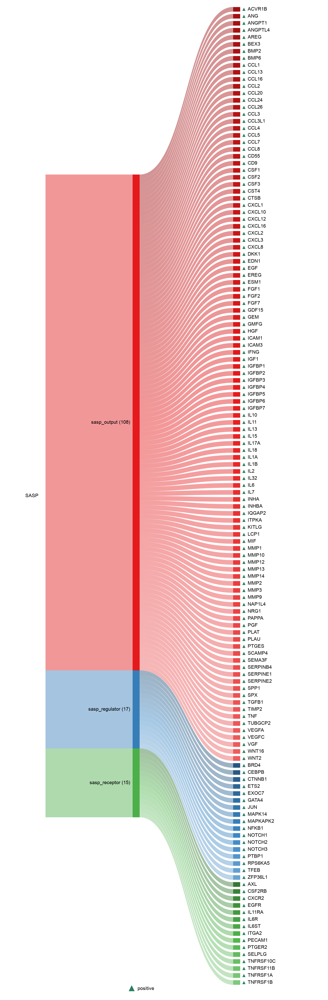

# SASP

| Gene | HGNC ID | HGNC Symbol | Entrez ID | Module Class | Sensor Family | Scoring Direction | Single-Cell Detectability | Also in Module(s) | DOI | Aliases | Is_Sensor | Panel Source | DepMap Essential | s_het | s_het Lower 95% | s_het Upper 95% | UniProt ID | Monomer (kDa) | STRING Sensor Partners | STRING Partners |
| --- | --- | --- | --- | --- | --- | --- | --- | --- | --- | --- | --- | --- | --- | --- | --- | --- | --- | --- | --- | --- |
| ACVR1B | HGNC:172 | ACVR1B | 91 | sasp_output |  | positive | medium |  | [10.1038/s41467-022-32552-1](https://doi.org/10.1038/s41467-022-32552-1) |  |  | SenMayo | no | 0.271003 | 0.137924 | 0.445347 | P36896 | 56.8 | 0 | 39 |
| ANG | HGNC:483 | ANG | 283 | sasp_output |  | positive | medium |  | [10.1038/s41467-022-32552-1](https://doi.org/10.1038/s41467-022-32552-1) |  |  | SenMayo | no | 0.00867031 | 0.00108294 | 0.0268128 | P03950 | 16.6 | 0 | 10 |
| ANGPT1 | HGNC:484 | ANGPT1 | 284 | sasp_output |  | positive | medium |  | [10.1038/s41467-022-32552-1](https://doi.org/10.1038/s41467-022-32552-1) |  |  | SenMayo | no | 0.0660562 | 0.0317861 | 0.116556 | Q15389 | 57.5 | 0 | 21 |
| ANGPTL4 | HGNC:16039 | ANGPTL4 | 51129 | sasp_output |  | positive | medium |  | [10.1038/s41467-022-32552-1](https://doi.org/10.1038/s41467-022-32552-1) |  |  | SenMayo | no | 0.00167643 | 0.000202118 | 0.00509542 | Q9BY76 | 45.2 | 0 | 17 |
| AREG | HGNC:651 | AREG | 374 | sasp_output |  | positive | high |  | [10.1038/s41467-022-32552-1](https://doi.org/10.1038/s41467-022-32552-1) |  |  | SenMayo | no | 0.0515756 | 0.00803325 | 0.147758 | P15514 | 27.9 | 0 | 95 |
| BEX3 | HGNC:13388 | BEX3 | 27018 | sasp_output |  | positive | high |  | [10.1038/s41467-022-32552-1](https://doi.org/10.1038/s41467-022-32552-1) |  |  | SenMayo | no | 0.200516 | 0.0321708 | 0.539032 | Q00994 | 13.0 | 0 | 8 |
| BMP2 | HGNC:1069 | BMP2 | 650 | sasp_output |  | positive | low |  | [10.1038/s41467-022-32552-1](https://doi.org/10.1038/s41467-022-32552-1) |  |  | SenMayo | no | 0.109012 | 0.0462848 | 0.20618 | P12643 | 44.7 | 0 | 42 |
| BMP6 | HGNC:1073 | BMP6 | 654 | sasp_output |  | positive | low |  | [10.1038/s41467-022-32552-1](https://doi.org/10.1038/s41467-022-32552-1) |  |  | SenMayo | no | 0.0537983 | 0.0163944 | 0.117078 | P22004 | 57.2 | 0 | 16 |
| CCL1 | HGNC:10609 | CCL1 | 6346 | sasp_output |  | positive | low |  | [10.1038/s41467-022-32552-1](https://doi.org/10.1038/s41467-022-32552-1) |  |  | SenMayo | no | 0.00177732 | 0.000130031 | 0.00623852 | P22362 | 11.0 | 0 | 24 |
| CCL13 | HGNC:10611 | CCL13 | 6357 | sasp_output |  | positive | low |  | [10.1038/s41467-022-32552-1](https://doi.org/10.1038/s41467-022-32552-1) |  |  | SenMayo | no | 0.0014114 | 7.93406e-05 | 0.0049946 | Q99616 | 11.0 | 0 | 37 |
| CCL16 | HGNC:10614 | CCL16 | 6360 | sasp_output |  | positive | low |  | [10.1038/s41467-022-32552-1](https://doi.org/10.1038/s41467-022-32552-1) |  |  | SenMayo | no | 0.00199455 | 9.69972e-05 | 0.00745398 | O15467 | 13.6 | 0 | 19 |
| CCL2 | HGNC:10618 | CCL2 | 6347 | sasp_output |  | positive | medium | NFKB_CYTOKINE_OUTPUT | [10.1038/s41580-024-00738-8](https://doi.org/10.1038/s41580-024-00738-8) |  |  | SenNet | no | 0.0489921 | 0.0128433 | 0.11407 | P13500 | 11.0 | 0 | 62 |
| CCL20 | HGNC:10619 | CCL20 | 6364 | sasp_output |  | positive | medium | NFKB_CYTOKINE_OUTPUT | [10.3389/fimmu.2023.1216376](https://doi.org/10.3389/fimmu.2023.1216376) |  |  |  | no | 0.00534026 | 0.00108114 | 0.0138174 | P78556 | 10.8 | 0 | 33 |
| CCL24 | HGNC:10623 | CCL24 | 6369 | sasp_output |  | positive | low |  | [10.1038/s41467-022-32552-1](https://doi.org/10.1038/s41467-022-32552-1) |  |  | SenMayo | no | 0.00469769 | 0.0011921 | 0.0109251 | O00175 | 13.1 | 0 | 24 |
| CCL26 | HGNC:10625 | CCL26 | 10344 | sasp_output |  | positive | low |  | [10.1038/s41467-022-32552-1](https://doi.org/10.1038/s41467-022-32552-1) |  |  | SenMayo | no | 0.00058077 | 6.15654e-05 | 0.00175995 | Q9Y258 | 10.6 | 0 | 38 |
| CCL3 | HGNC:10627 | CCL3 | 6348 | sasp_output |  | positive | high |  | [10.1038/s41580-024-00738-8](https://doi.org/10.1038/s41580-024-00738-8) |  |  | SenNet | no | 0.00192561 | 8.61327e-05 | 0.00713714 | P10147 | 10.1 | 0 | 26 |
| CCL3L1 | HGNC:10628 | CCL3L1 | 6349 | sasp_output |  | positive | high |  | [10.1038/s41467-022-32552-1](https://doi.org/10.1038/s41467-022-32552-1) |  |  | SenMayo |  | 0.00945494 | 0.000259142 | 0.0375459 | P16619 | 10.2 | 0 | 21 |
| CCL4 | HGNC:10630 | CCL4 | 6351 | sasp_output |  | positive | high |  | [10.1038/s41580-024-00738-8](https://doi.org/10.1038/s41580-024-00738-8) |  |  | SenNet | no | 0.0041176 | 6.54372e-05 | 0.0164559 | P13236 | 10.2 | 0 | 31 |
| CCL5 | HGNC:10632 | CCL5 | 6352 | sasp_output |  | positive | high | NFKB_CYTOKINE_OUTPUT | [10.1038/s41580-024-00738-8](https://doi.org/10.1038/s41580-024-00738-8) |  |  | SenNet | no | 0.0024536 | 0.000288504 | 0.00715274 | P13501 | 10.0 | 0 | 58 |
| CCL7 | HGNC:10634 | CCL7 | 6354 | sasp_output |  | positive | low |  | [10.1038/s41580-024-00738-8](https://doi.org/10.1038/s41580-024-00738-8) |  |  | SenNet | no | 0.00184037 | 0.000171361 | 0.00609691 | P80098 | 11.2 | 0 | 26 |
| CCL8 | HGNC:10635 | CCL8 | 6355 | sasp_output |  | positive | low |  | [10.1038/s41580-024-00738-8](https://doi.org/10.1038/s41580-024-00738-8) |  |  | SenNet | no | 0.00100505 | 9.82559e-05 | 0.00330191 | P80075 | 11.2 | 0 | 34 |
| CD55 | HGNC:2665 | CD55 | 1604 | sasp_output |  | positive | high |  | [10.1038/s41467-022-32552-1](https://doi.org/10.1038/s41467-022-32552-1) |  |  | SenMayo | no | 0.00322422 | 0.000738838 | 0.0076388 | P08174 | 41.4 | 0 | 35 |
| CD9 | HGNC:1709 | CD9 | 928 | sasp_output |  | positive | high |  | [10.1038/s41467-022-32552-1](https://doi.org/10.1038/s41467-022-32552-1) |  |  | SenMayo | no | 0.0143701 | 0.0039313 | 0.0309233 | P21926 | 25.4 | 0 | 106 |
| CSF1 | HGNC:2432 | CSF1 | 1435 | sasp_output |  | positive | medium |  | [10.1038/s41467-022-32552-1](https://doi.org/10.1038/s41467-022-32552-1) |  |  | SenMayo | no | 0.0892372 | 0.0269222 | 0.199865 | P09603 | 60.2 | 0 | 32 |
| CSF2 | HGNC:2434 | CSF2 | 1437 | sasp_output |  | positive | low |  | [10.1038/s41580-024-00738-8](https://doi.org/10.1038/s41580-024-00738-8) |  |  | SenNet | no | 0.0285151 | 0.00304865 | 0.0867766 | P04141 | 16.3 | 1 | 39 |
| CSF3 | HGNC:2438 | CSF3 | 1440 | sasp_output |  | positive | medium |  | [10.1038/s41580-024-00738-8](https://doi.org/10.1038/s41580-024-00738-8) |  |  | SenNet | no | 0.034367 | 0.00372861 | 0.0909774 | P09919 | 22.3 | 0 | 34 |
| CST4 | HGNC:2476 | CST4 | 1472 | sasp_output |  | positive | medium |  | [10.1038/s41467-022-32552-1](https://doi.org/10.1038/s41467-022-32552-1) |  |  | SenMayo | no | 0.00118126 | 9.74512e-05 | 0.00399753 | P01036 | 16.2 | 0 | 26 |
| CTSB | HGNC:2527 | CTSB | 1508 | sasp_output |  | positive | high |  | [10.1038/s41467-022-32552-1](https://doi.org/10.1038/s41467-022-32552-1) |  |  | SenMayo | no | 0.00536118 | 0.00132352 | 0.0125836 | P07858 | 37.8 | 0 | 49 |
| CXCL1 | HGNC:4602 | CXCL1 | 2919 | sasp_output |  | positive | high | NFKB_CYTOKINE_OUTPUT | [10.1038/s41580-024-00738-8](https://doi.org/10.1038/s41580-024-00738-8) |  |  | SenNet | no | 0.010754 | 0.000763955 | 0.0340541 | P09341 | 11.3 | 0 | 44 |
| CXCL10 | HGNC:10637 | CXCL10 | 3627 | sasp_output |  | positive | medium |  | [10.1038/s41580-024-00738-8](https://doi.org/10.1038/s41580-024-00738-8) |  |  | SenNet | no | 0.00665129 | 0.000815543 | 0.0208033 | P02778 | 10.9 | 0 | 41 |
| CXCL12 | HGNC:10672 | CXCL12 | 6387 | sasp_output |  | positive | high |  | [10.1038/s41467-022-32552-1](https://doi.org/10.1038/s41467-022-32552-1) |  |  | SenMayo | no | 0.0140831 | 0.00248266 | 0.036079 | P48061 | 10.7 | 0 | 56 |
| CXCL16 | HGNC:16642 | CXCL16 | 58191 | sasp_output |  | positive | high |  | [10.1038/s41580-024-00738-8](https://doi.org/10.1038/s41580-024-00738-8) |  |  | SenNet | no | 0.00459994 | 0.00038366 | 0.0152164 | Q9H2A7 | 27.6 | 0 | 21 |
| CXCL2 | HGNC:4603 | CXCL2 | 2920 | sasp_output |  | positive | high | NFKB_CYTOKINE_OUTPUT | [10.1038/s41580-024-00738-8](https://doi.org/10.1038/s41580-024-00738-8) |  |  | SenNet | no | 0.00226991 | 0.000117097 | 0.00840326 | P19875 | 11.4 | 0 | 42 |
| CXCL3 | HGNC:4604 | CXCL3 | 2921 | sasp_output |  | positive | medium | NFKB_CYTOKINE_OUTPUT | [10.1038/s41467-022-32552-1](https://doi.org/10.1038/s41467-022-32552-1) |  |  | SenMayo | no | 0.00242222 | 0.000168726 | 0.00831948 | P19876 | 11.3 | 0 | 29 |
| CXCL8 | HGNC:6025 | CXCL8 | 3576 | sasp_output |  | positive | high |  | [10.1038/s41580-024-00738-8](https://doi.org/10.1038/s41580-024-00738-8) |  |  | SenNet | no | 0.000988691 | 0.000102379 | 0.00304981 | P10145 | 11.1 | 0 | 48 |
| DKK1 | HGNC:2891 | DKK1 | 22943 | sasp_output |  | positive | medium |  | [10.1038/s41467-022-32552-1](https://doi.org/10.1038/s41467-022-32552-1) |  |  | SenMayo | no | 0.0208511 | 0.0029623 | 0.0512771 | O94907 | 28.7 | 0 | 17 |
| EDN1 | HGNC:3176 | EDN1 | 1906 | sasp_output |  | positive | medium |  | [10.1038/s41467-022-32552-1](https://doi.org/10.1038/s41467-022-32552-1) |  |  | SenMayo | no | 0.0268475 | 0.00497123 | 0.0652654 | P05305 | 24.4 | 0 | 7 |
| EGF | HGNC:3229 | EGF | 1950 | sasp_output |  | positive | high |  | [10.1038/s41467-022-32552-1](https://doi.org/10.1038/s41467-022-32552-1) |  |  | SenMayo | no | 0.00825116 | 0.0044364 | 0.0128916 | P01133 | 134.0 | 0 | 94 |
| EREG | HGNC:3443 | EREG | 2069 | sasp_output |  | positive | medium |  | [10.1038/s41467-022-32552-1](https://doi.org/10.1038/s41467-022-32552-1) |  |  | SenMayo | no | 0.00185206 | 0.000143359 | 0.00624407 | O14944 | 19.0 | 0 | 59 |
| ESM1 | HGNC:3466 | ESM1 | 11082 | sasp_output |  | positive | low |  | [10.1038/s41467-022-32552-1](https://doi.org/10.1038/s41467-022-32552-1) |  |  | SenMayo | no | 0.0229439 | 0.00750056 | 0.0476118 | Q9NQ30 | 20.1 | 0 | 2 |
| FGF1 | HGNC:3665 | FGF1 | 2246 | sasp_output |  | positive | medium |  | [10.1038/s41467-022-32552-1](https://doi.org/10.1038/s41467-022-32552-1) |  |  | SenMayo | no | 0.0148343 | 0.00236899 | 0.0421796 | P05230 | 17.5 | 1 | 71 |
| FGF2 | HGNC:3676 | FGF2 | 2247 | sasp_output |  | positive | low |  | [10.1038/s41467-022-32552-1](https://doi.org/10.1038/s41467-022-32552-1) |  |  | SenMayo | no | 0.0152958 | 0.00206434 | 0.0374297 | P09038 | 30.8 | 2 | 95 |
| FGF7 | HGNC:3685 | FGF7 | 2252 | sasp_output |  | positive | medium |  | [10.1038/s41467-022-32552-1](https://doi.org/10.1038/s41467-022-32552-1) |  |  | SenMayo | no | 0.0456565 | 0.0163893 | 0.0925677 | P21781 | 22.5 | 1 | 48 |
| GDF15 | HGNC:30142 | GDF15 | 9518 | sasp_output |  | positive | high |  | [10.1038/s41580-024-00738-8](https://doi.org/10.1038/s41580-024-00738-8) |  |  | SenNet | no | 0.00111295 | 7.9374e-05 | 0.00392041 | Q99988 | 34.1 | 0 | 12 |
| GEM | HGNC:4234 | GEM | 2669 | sasp_output |  | positive | medium |  | [10.1038/s41467-022-32552-1](https://doi.org/10.1038/s41467-022-32552-1) |  |  | SenMayo | no | 0.0034949 | 0.000624957 | 0.00884087 | P55040 | 33.9 | 0 | 23 |
| GMFG | HGNC:4374 | GMFG | 9535 | sasp_output |  | positive | high |  | [10.1038/s41467-022-32552-1](https://doi.org/10.1038/s41467-022-32552-1) |  |  | SenMayo | no | 0.00240524 | 0.000473941 | 0.00615701 | O60234 | 16.8 | 0 | 2 |
| HGF | HGNC:4893 | HGF | 3082 | sasp_output |  | positive | medium |  | [10.1038/s41580-024-00738-8](https://doi.org/10.1038/s41580-024-00738-8) |  |  | SenNet | no | 0.0576797 | 0.0367236 | 0.0855627 | P14210 | 83.1 | 0 | 46 |
| ICAM1 | HGNC:5344 | ICAM1 | 3383 | sasp_output |  | positive | medium |  | [10.1038/s41580-024-00738-8](https://doi.org/10.1038/s41580-024-00738-8) |  |  | SenNet | no | 0.0233281 | 0.00193145 | 0.0532726 | P05362 | 57.8 | 0 | 47 |
| ICAM3 | HGNC:5346 | ICAM3 | 3385 | sasp_output |  | positive | high |  | [10.1038/s41580-024-00738-8](https://doi.org/10.1038/s41580-024-00738-8) |  |  | SenNet | no | 0.000792747 | 9.93548e-05 | 0.00230052 | P32942 | 59.5 | 0 | 11 |
| IFNG | HGNC:5438 | IFNG | 3458 | sasp_output |  | positive | medium | IFN_GAMMA_OUTPUT | [10.1038/s41580-024-00738-8](https://doi.org/10.1038/s41580-024-00738-8) |  |  | SenNet | no | 0.0256338 | 0.00346299 | 0.0728496 | P01579 | 19.3 | 0 | 16 |
| IGF1 | HGNC:5464 | IGF1 | 3479 | sasp_output |  | positive | medium |  | [10.1038/s41580-024-00738-8](https://doi.org/10.1038/s41580-024-00738-8) |  |  | SenNet | no | 0.061258 | 0.0237826 | 0.124375 | P05019 | 21.8 | 0 | 42 |
| IGFBP1 | HGNC:5469 | IGFBP1 | 3484 | sasp_output |  | positive | high |  | [10.1038/s41467-022-32552-1](https://doi.org/10.1038/s41467-022-32552-1) |  |  | SenMayo | no | 0.00154168 | 0.000126678 | 0.00517234 | P08833 | 27.9 | 0 | 11 |
| IGFBP2 | HGNC:5471 | IGFBP2 | 3485 | sasp_output |  | positive | high |  | [10.1038/s41580-024-00738-8](https://doi.org/10.1038/s41580-024-00738-8) |  |  | SenNet | no | 0.0519934 | 0.0202494 | 0.102064 | P18065 | 34.8 | 0 | 9 |
| IGFBP3 | HGNC:5472 | IGFBP3 | 3486 | sasp_output |  | positive | high |  | [10.1038/s41580-024-00738-8](https://doi.org/10.1038/s41580-024-00738-8) |  |  | SenNet | no | 0.064135 | 0.0128642 | 0.156138 | P17936 | 31.7 | 2 | 34 |
| IGFBP4 | HGNC:5473 | IGFBP4 | 3487 | sasp_output |  | positive | high |  | [10.1038/s41580-024-00738-8](https://doi.org/10.1038/s41580-024-00738-8) |  |  | SenNet | no | 0.0227074 | 0.005229 | 0.0501758 | P22692 | 27.9 | 0 | 7 |
| IGFBP5 | HGNC:5474 | IGFBP5 | 3488 | sasp_output |  | positive | high |  | [10.1038/s41580-024-00738-8](https://doi.org/10.1038/s41580-024-00738-8) |  |  | SenNet | no | 0.161538 | 0.0443526 | 0.372997 | P24593 | 30.6 | 0 | 22 |
| IGFBP6 | HGNC:5475 | IGFBP6 | 3489 | sasp_output |  | positive | high |  | [10.1038/s41467-022-32552-1](https://doi.org/10.1038/s41467-022-32552-1) |  |  | SenMayo | no | 0.00901997 | 0.00214233 | 0.0204237 | P24592 | 25.3 | 0 | 11 |
| IGFBP7 | HGNC:5476 | IGFBP7 | 3490 | sasp_output |  | positive | high |  | [10.1038/s41580-024-00738-8](https://doi.org/10.1038/s41580-024-00738-8) |  |  | SenNet | no | 0.0185782 | 0.00522648 | 0.0392512 | Q16270 | 29.1 | 0 | 18 |
| IL10 | HGNC:5962 | IL10 | 3586 | sasp_output |  | positive | low |  | [10.1038/s41467-022-32552-1](https://doi.org/10.1038/s41467-022-32552-1) |  |  | SenMayo | no | 0.0260983 | 0.00753315 | 0.0532876 | P22301 | 20.5 | 0 | 17 |
| IL11 | HGNC:5966 | IL11 | 3589 | sasp_output |  | positive | low | INFLAMMAGING | [10.1038/s12276-019-0371-7](https://doi.org/10.1038/s12276-019-0371-7) |  |  |  | no | 0.00139372 | 0.000142399 | 0.00449739 | P20809 | 21.4 | 0 | 19 |
| IL13 | HGNC:5973 | IL13 | 3596 | sasp_output |  | positive | low |  | [10.1038/s41467-022-32552-1](https://doi.org/10.1038/s41467-022-32552-1) |  |  | SenMayo | no | 0.00367075 | 0.000107669 | 0.0150009 | P35225 | 15.8 | 0 | 26 |
| IL15 | HGNC:5977 | IL15 | 3600 | sasp_output |  | positive | medium |  | [10.1038/s41467-022-32552-1](https://doi.org/10.1038/s41467-022-32552-1) |  |  | SenMayo | no | 0.0131044 | 0.000359454 | 0.0514911 | P40933 | 18.1 | 0 | 22 |
| IL17A | HGNC:5981 | IL17A | 3605 | sasp_output |  | positive | low |  | [10.1038/s41580-024-00738-8](https://doi.org/10.1038/s41580-024-00738-8) |  |  | SenNet | no | 0.00579684 | 0.000450395 | 0.0199076 | Q16552 | 17.5 | 0 | 14 |
| IL18 | HGNC:5986 | IL18 | 3606 | sasp_output |  | positive | medium |  | [10.1038/s41467-022-32552-1](https://doi.org/10.1038/s41467-022-32552-1) |  |  | SenMayo | no | 0.0143344 | 0.00288566 | 0.0358939 | Q14116 | 22.3 | 0 | 14 |
| IL1A | HGNC:5991 | IL1A | 3552 | sasp_output |  | positive | medium |  | [10.1038/s41580-024-00738-8](https://doi.org/10.1038/s41580-024-00738-8) |  |  | SenNet | no | 0.00218897 | 0.00028524 | 0.00633744 | P01583 | 30.6 | 0 | 25 |
| IL1B | HGNC:5992 | IL1B | 3553 | sasp_output |  | positive | high | NFKB_CYTOKINE_OUTPUT | [10.1038/s41580-024-00738-8](https://doi.org/10.1038/s41580-024-00738-8) |  |  | SenNet | no | 0.0414579 | 0.00998333 | 0.0908958 | P01584 | 30.7 | 1 | 58 |
| IL2 | HGNC:6001 | IL2 | 3558 | sasp_output |  | positive | low |  | [10.1038/s41467-022-32552-1](https://doi.org/10.1038/s41467-022-32552-1) |  |  | SenMayo | no | 0.0367295 | 0.0058498 | 0.0986829 | P60568 | 17.6 | 0 | 48 |
| IL32 | HGNC:16830 | IL32 | 9235 | sasp_output |  | positive | high |  | [10.1038/s41467-022-32552-1](https://doi.org/10.1038/s41467-022-32552-1) |  |  | SenMayo | no | 0.00116794 | 0.000118939 | 0.00366768 | P24001 | 26.7 | 0 | 9 |
| IL6 | HGNC:6018 | IL6 | 3569 | sasp_output |  | positive | medium | NFKB_CYTOKINE_OUTPUT | [10.1038/s41580-024-00738-8](https://doi.org/10.1038/s41580-024-00738-8) |  |  | SenNet | no | 0.00656064 | 0.000639596 | 0.0205606 | P05231 | 23.7 | 0 | 40 |
| IL7 | HGNC:6023 | IL7 | 3574 | sasp_output |  | positive | high |  | [10.1038/s41580-024-00738-8](https://doi.org/10.1038/s41580-024-00738-8) |  |  | SenNet | no | 0.0691441 | 0.000308008 | 0.267515 | P13232 | 20.2 | 0 | 20 |
| INHA | HGNC:6065 | INHA | 3623 | sasp_output |  | positive | medium |  | [10.1038/s41467-022-32552-1](https://doi.org/10.1038/s41467-022-32552-1) |  |  | SenMayo | no | 0.00877936 | 0.00137155 | 0.0223523 | P05111 | 39.7 | 0 | 11 |
| INHBA | HGNC:6066 | INHBA | 3624 | sasp_output |  | positive | medium |  | [10.1038/s41580-024-00738-8](https://doi.org/10.1038/s41580-024-00738-8) |  |  | SenNet | no | 0.19644 | 0.0712123 | 0.390823 | P08476 | 47.4 | 0 | 20 |
| IQGAP2 | HGNC:6111 | IQGAP2 | 10788 | sasp_output |  | positive | high |  | [10.1038/s41467-022-32552-1](https://doi.org/10.1038/s41467-022-32552-1) |  |  | SenMayo | no | 0.00250919 | 0.000435837 | 0.00629326 | Q13576 | 180.6 | 0 | 55 |
| ITPKA | HGNC:6178 | ITPKA | 3706 | sasp_output |  | positive | low |  | [10.1038/s41467-022-32552-1](https://doi.org/10.1038/s41467-022-32552-1) |  |  | SenMayo | no | 0.0564282 | 0.0241953 | 0.105261 | P23677 | 51.0 | 0 | 12 |
| KITLG | HGNC:6343 | KITLG | 4254 | sasp_output |  | positive | medium |  | [10.1038/s41467-022-32552-1](https://doi.org/10.1038/s41467-022-32552-1) |  |  | SenMayo | no | 0.108852 | 0.0303697 | 0.255897 | P21583 | 30.9 | 0 | 39 |
| LCP1 | HGNC:6528 | LCP1 | 3936 | sasp_output |  | positive | high |  | [10.1038/s41467-022-32552-1](https://doi.org/10.1038/s41467-022-32552-1) |  |  | SenMayo | no | 0.0565327 | 0.0299619 | 0.0946431 | P13796 | 70.3 | 0 | 31 |
| MIF | HGNC:7097 | MIF | 4282 | sasp_output |  | positive | high |  | [10.1038/s41467-022-32552-1](https://doi.org/10.1038/s41467-022-32552-1) |  |  | SenMayo | no | 0.00380621 | 0.000403924 | 0.011544 | P14174 | 12.5 | 0 | 78 |
| MMP1 | HGNC:7155 | MMP1 | 4312 | sasp_output |  | positive | high |  | [10.1038/s41580-024-00738-8](https://doi.org/10.1038/s41580-024-00738-8) |  |  | SenNet | no | 0.000483793 | 6.62597e-05 | 0.00139362 | P03956 | 54.0 | 0 | 14 |
| MMP10 | HGNC:7156 | MMP10 | 4319 | sasp_output |  | positive | medium |  | [10.1038/s41580-024-00738-8](https://doi.org/10.1038/s41580-024-00738-8) |  |  | SenNet | no | 0.000440816 | 5.55717e-05 | 0.00126903 | P09238 | 54.2 | 0 | 11 |
| MMP12 | HGNC:7158 | MMP12 | 4321 | sasp_output |  | positive | low |  | [10.1038/s41580-024-00738-8](https://doi.org/10.1038/s41580-024-00738-8) |  |  | SenNet | no |  |  |  | P39900 | 54.0 | 0 | 2 |
| MMP13 | HGNC:7159 | MMP13 | 4322 | sasp_output |  | positive | low |  | [10.1038/s41580-024-00738-8](https://doi.org/10.1038/s41580-024-00738-8) |  |  | SenNet | no | 0.00277639 | 0.000532326 | 0.00698204 | P45452 | 53.8 | 0 | 4 |
| MMP14 | HGNC:7160 | MMP14 | 4323 | sasp_output |  | positive | medium |  | [10.1038/s41467-022-32552-1](https://doi.org/10.1038/s41467-022-32552-1) |  |  | SenMayo | no | 0.0871457 | 0.0506023 | 0.136794 | P50281 | 65.9 | 0 | 35 |
| MMP2 | HGNC:7166 | MMP2 | 4313 | sasp_output |  | positive | high |  | [10.1038/s41580-024-00738-8](https://doi.org/10.1038/s41580-024-00738-8) |  |  | SenNet | no | 0.0610023 | 0.0312453 | 0.103166 | P08253 | 73.9 | 0 | 56 |
| MMP3 | HGNC:7173 | MMP3 | 4314 | sasp_output |  | positive | low |  | [10.1038/s41580-024-00738-8](https://doi.org/10.1038/s41580-024-00738-8) |  |  | SenNet | no | 0.000543715 | 9.1926e-05 | 0.00150879 | P08254 | 54.0 | 0 | 23 |
| MMP9 | HGNC:7176 | MMP9 | 4318 | sasp_output |  | positive | medium |  | [10.1038/s41580-024-00738-8](https://doi.org/10.1038/s41580-024-00738-8) |  |  | SenNet | no | 0.000757186 | 8.64726e-05 | 0.00230875 | P14780 | 78.5 | 0 | 39 |
| NAP1L4 | HGNC:7640 | NAP1L4 | 4676 | sasp_output |  | positive | medium |  | [10.1038/s41467-022-32552-1](https://doi.org/10.1038/s41467-022-32552-1) |  |  | SenMayo | no | 0.0765923 | 0.0397667 | 0.130556 | Q99733 | 42.8 | 0 | 91 |
| NRG1 | HGNC:7997 | NRG1 | 3084 | sasp_output |  | positive | high |  | [10.1038/s41467-022-32552-1](https://doi.org/10.1038/s41467-022-32552-1) |  |  | SenMayo | no | 0.0927337 | 0.0435619 | 0.17145 | Q02297 | 70.4 | 0 | 55 |
| PAPPA | HGNC:8602 | PAPPA | 5069 | sasp_output |  | positive | high |  | [10.1038/s41467-022-32552-1](https://doi.org/10.1038/s41467-022-32552-1) |  |  | SenMayo | no | 0.0509702 | 0.0342245 | 0.0721164 | Q13219 | 181.0 | 0 | 12 |
| PGF | HGNC:8893 | PGF | 5228 | sasp_output |  | positive | medium |  | [10.1038/s41467-022-32552-1](https://doi.org/10.1038/s41467-022-32552-1) |  |  | SenMayo | no | 0.0327051 | 0.00429741 | 0.0845582 | P49763 | 24.8 | 0 | 11 |
| PLAT | HGNC:9051 | PLAT | 5327 | sasp_output |  | positive | medium |  | [10.1038/s41467-022-32552-1](https://doi.org/10.1038/s41467-022-32552-1) |  |  | SenMayo | no | 0.015861 | 0.00143891 | 0.0353272 | P00750 | 62.9 | 0 | 32 |
| PLAU | HGNC:9052 | PLAU | 5328 | sasp_output |  | positive | high |  | [10.1038/s41467-022-32552-1](https://doi.org/10.1038/s41467-022-32552-1) |  |  | SenMayo | no | 0.00496313 | 0.000997928 | 0.0121616 | P00749 | 48.5 | 0 | 56 |
| PTGES | HGNC:9599 | PTGES | 9536 | sasp_output |  | positive | low |  | [10.1038/s41467-022-32552-1](https://doi.org/10.1038/s41467-022-32552-1) |  |  | SenMayo | no | 0.0299574 | 0.00691846 | 0.0731297 | O14684 | 17.1 | 0 | 4 |
| SCAMP4 | HGNC:30385 | SCAMP4 | 113178 | sasp_output |  | positive | low |  | [10.1038/s41467-022-32552-1](https://doi.org/10.1038/s41467-022-32552-1) |  |  | SenMayo | no | 0.0116843 | 0.00174915 | 0.0277136 | Q969E2 | 25.7 | 0 | 4 |
| SEMA3F | HGNC:10728 | SEMA3F | 6405 | sasp_output |  | positive | low |  | [10.1038/s41467-022-32552-1](https://doi.org/10.1038/s41467-022-32552-1) |  |  | SenMayo | no | 0.113767 | 0.065915 | 0.180841 | Q13275 | 88.4 | 0 | 4 |
| SERPINB4 | HGNC:10570 | SERPINB4 | 6318 | sasp_output |  | positive | high |  | [10.1038/s41467-022-32552-1](https://doi.org/10.1038/s41467-022-32552-1) |  |  | SenMayo | no | 0.0013979 | 9.61061e-05 | 0.0048849 | P48594 | 44.9 | 0 | 30 |
| SERPINE1 | HGNC:8583 | SERPINE1 | 5054 | sasp_output |  | positive | high | INFLAMMAGING | [10.1038/s41580-024-00738-8](https://doi.org/10.1038/s41580-024-00738-8) |  |  | SenNet | no | 0.0173157 | 0.00620009 | 0.033767 | P05121 | 45.1 | 0 | 27 |
| SERPINE2 | HGNC:8951 | SERPINE2 | 5270 | sasp_output |  | positive | high |  | [10.1038/s41467-022-32552-1](https://doi.org/10.1038/s41467-022-32552-1) |  |  | SenMayo | no | 0.0567011 | 0.0278656 | 0.0981207 | P07093 | 44.0 | 0 | 8 |
| SPP1 | HGNC:11255 | SPP1 | 6696 | sasp_output |  | positive | high | SASP | [10.1038/s41580-024-00738-8](https://doi.org/10.1038/s41580-024-00738-8) |  |  | SenNet | no | 0.00282285 | 0.00041663 | 0.00756033 | P10451 | 35.4 | 0 | 34 |
| SPX | HGNC:28139 | SPX | 80763 | sasp_output |  | positive | low |  | [10.1038/s41467-022-32552-1](https://doi.org/10.1038/s41467-022-32552-1) |  |  | SenMayo | no | 0.0028818 | 0.00043871 | 0.00812696 | Q9BT56 | 13.3 | 0 | 4 |
| TGFB1 | HGNC:11766 | TGFB1 | 7040 | sasp_output |  | positive | high |  | [10.1038/s41580-024-00738-8](https://doi.org/10.1038/s41580-024-00738-8) |  |  | SenNet | no | 0.0607953 | 0.028284 | 0.110776 | P01137 | 44.3 | 0 | 134 |
| TIMP2 | HGNC:11821 | TIMP2 | 7077 | sasp_output |  | positive | high |  | [10.1038/s41580-024-00738-8](https://doi.org/10.1038/s41580-024-00738-8) |  |  | SenNet | no | 0.0771613 | 0.0303337 | 0.154694 | P16035 | 24.4 | 0 | 17 |
| TNF | HGNC:11892 | TNF | 7124 | sasp_output |  | positive | medium |  | [10.1038/s41580-024-00738-8](https://doi.org/10.1038/s41580-024-00738-8) |  |  | SenNet | no | 0.081908 | 0.0281914 | 0.172593 | P01375 | 25.6 | 0 | 252 |
| TUBGCP2 | HGNC:18599 | TUBGCP2 | 10844 | sasp_output |  | positive | low |  | [10.1038/s41467-022-32552-1](https://doi.org/10.1038/s41467-022-32552-1) |  |  | SenMayo | yes | 0.0110925 | 0.00392375 | 0.0203637 | Q9BSJ2 | 102.5 | 0 | 73 |
| VEGFA | HGNC:12680 | VEGFA | 7422 | sasp_output |  | positive | high | INFLAMMAGING | [10.1038/s41580-024-00738-8](https://doi.org/10.1038/s41580-024-00738-8) |  |  | SenNet | no | 0.0158462 | 0.00612022 | 0.028292 | P15692 | 43.6 | 0 | 65 |
| VEGFC | HGNC:12682 | VEGFC | 7424 | sasp_output |  | positive | low |  | [10.1038/s41467-022-32552-1](https://doi.org/10.1038/s41467-022-32552-1) |  |  | SenMayo | no | 0.0501895 | 0.0201516 | 0.0972242 | P49767 | 46.9 | 0 | 7 |
| VGF | HGNC:12684 | VGF | 7425 | sasp_output |  | positive | high |  | [10.1038/s41467-022-32552-1](https://doi.org/10.1038/s41467-022-32552-1) |  |  | SenMayo | no | 0.0480063 | 0.00639092 | 0.112588 | O15240 | 67.3 | 0 | 9 |
| WNT16 | HGNC:16267 | WNT16 | 51384 | sasp_output |  | positive | low |  | [10.1038/s41467-022-32552-1](https://doi.org/10.1038/s41467-022-32552-1) |  |  | SenMayo | no | 0.00540165 | 0.000855284 | 0.0145081 | Q9UBV4 | 40.7 | 0 | 16 |
| WNT2 | HGNC:12780 | WNT2 | 7472 | sasp_output |  | positive | low |  | [10.1038/s41467-022-32552-1](https://doi.org/10.1038/s41467-022-32552-1) |  |  | SenMayo | no | 0.0278447 | 0.0117658 | 0.0499438 | P09544 | 40.4 | 0 | 21 |
| AXL | HGNC:905 | AXL | 558 | sasp_receptor |  | positive | medium |  | [10.1038/s41467-022-32552-1](https://doi.org/10.1038/s41467-022-32552-1) |  |  | SenMayo | no | 0.0253194 | 0.0124457 | 0.0408565 | P30530 | 98.3 | 0 | 36 |
| CSF2RB | HGNC:2436 | CSF2RB | 1439 | sasp_receptor |  | positive | medium |  | [10.1038/s41467-022-32552-1](https://doi.org/10.1038/s41467-022-32552-1) |  |  | SenMayo | no | 0.0308749 | 0.0133378 | 0.0546892 | P32927 | 97.3 | 0 | 42 |
| CXCR2 | HGNC:6027 | CXCR2 | 3579 | sasp_receptor |  | positive | medium |  | [10.1038/s41467-022-32552-1](https://doi.org/10.1038/s41467-022-32552-1) |  |  | SenMayo | no | 0.0132064 | 0.0021454 | 0.0342599 | P25025 | 40.8 | 0 | 63 |
| EGFR | HGNC:3236 | EGFR | 1956 | sasp_receptor |  | positive | high |  | [10.1038/s41467-022-32552-1](https://doi.org/10.1038/s41467-022-32552-1) |  |  | SenMayo | no | 0.0693613 | 0.046289 | 0.099255 | P00533 | 134.3 | 2 | 619 |
| IL11RA | HGNC:5967 | IL11RA | 3590 | sasp_receptor |  | positive | high |  | [10.1038/s12276-019-0371-7](https://doi.org/10.1038/s12276-019-0371-7) |  |  |  | no | 0.00206718 | 0.000515904 | 0.00474523 | Q14626 | 45.2 | 0 | 5 |
| IL6R | HGNC:6019 | IL6R | 3570 | sasp_receptor |  | positive | medium |  | [10.1126/science.3136546](https://doi.org/10.1126/science.3136546) |  |  |  | no | 0.00607849 | 0.000375054 | 0.0189742 | P08887 | 51.5 | 0 | 34 |
| IL6ST | HGNC:6021 | IL6ST | 3572 | sasp_receptor |  | positive | high |  | [10.1111/acel.14258](https://doi.org/10.1111/acel.14258) |  |  |  | no | 0.0843523 | 0.0451713 | 0.141132 | P40189 | 103.5 | 0 | 51 |
| ITGA2 | HGNC:6137 | ITGA2 | 3673 | sasp_receptor |  | positive | medium |  | [10.1038/s41467-022-32552-1](https://doi.org/10.1038/s41467-022-32552-1) |  |  | SenMayo | no | 0.0115849 | 0.00661889 | 0.0176027 | P17301 | 129.3 | 0 | 114 |
| PECAM1 | HGNC:8823 | PECAM1 | 5175 | sasp_receptor |  | positive | medium |  | [10.1038/s41467-022-32552-1](https://doi.org/10.1038/s41467-022-32552-1) |  |  | SenMayo | no |  |  |  | P16284 | 82.5 | 0 | 44 |
| PTGER2 | HGNC:9594 | PTGER2 | 5732 | sasp_receptor |  | positive | low |  | [10.1038/s41467-022-32552-1](https://doi.org/10.1038/s41467-022-32552-1) |  |  | SenMayo | no | 0.00302026 | 0.000290683 | 0.00962146 | P43116 | 39.8 | 0 | 9 |
| SELPLG | HGNC:10722 | SELPLG | 6404 | sasp_receptor |  | positive | high |  | [10.1038/s41467-022-32552-1](https://doi.org/10.1038/s41467-022-32552-1) |  |  | SenMayo | no | 0.00376922 | 0.000306151 | 0.0129652 | Q14242 | 43.2 | 0 | 14 |
| TNFRSF10C | HGNC:11906 | TNFRSF10C | 8794 | sasp_receptor |  | positive | low |  | [10.1038/s41467-022-32552-1](https://doi.org/10.1038/s41467-022-32552-1) |  |  | SenMayo | no | 0.00113773 | 0.000110305 | 0.0036926 | O14798 | 27.4 | 0 | 7 |
| TNFRSF11B | HGNC:11909 | TNFRSF11B | 4982 | sasp_receptor |  | positive | medium |  | [10.1038/s41467-022-32552-1](https://doi.org/10.1038/s41467-022-32552-1) |  |  | SenMayo | no | 0.0347394 | 0.0138323 | 0.0637836 | O00300 | 46.0 | 0 | 4 |
| TNFRSF1A | HGNC:11916 | TNFRSF1A | 7132 | sasp_receptor |  | positive | medium |  | [10.1038/s41580-024-00738-8](https://doi.org/10.1038/s41580-024-00738-8) |  |  | SenNet | no | 0.147319 | 0.0534302 | 0.307445 | P19438 | 50.5 | 0 | 153 |
| TNFRSF1B | HGNC:11917 | TNFRSF1B | 7133 | sasp_receptor |  | positive | high |  | [10.1038/s41580-024-00738-8](https://doi.org/10.1038/s41580-024-00738-8) |  |  | SenNet | no | 0.0380542 | 0.0119162 | 0.0762336 | P20333 | 48.3 | 0 | 41 |
| BRD4 | HGNC:13575 | BRD4 | 23476 | sasp_regulator |  | positive | high |  | [10.1158/2159-8290.CD-16-0217](https://doi.org/10.1158/2159-8290.CD-16-0217) |  |  |  | yes | 0.671309 | 0.29564 | 0.96006 | O60885 | 152.2 | 14 | 1511 |
| CEBPB | HGNC:1834 | CEBPB | 1051 | sasp_regulator |  | positive | high |  | [10.1016/j.exger.2019.110752](https://doi.org/10.1016/j.exger.2019.110752) |  |  |  | no | 0.195316 | 0.0073035 | 0.675264 | P17676 | 36.1 | 0 | 108 |
| CTNNB1 | HGNC:2514 | CTNNB1 | 1499 | sasp_regulator |  | positive | high |  | [10.1038/s41467-022-32552-1](https://doi.org/10.1038/s41467-022-32552-1) |  |  | SenMayo | no | 0.445594 | 0.161462 | 0.809889 | P35222 | 85.5 | 6 | 600 |
| ETS2 | HGNC:3489 | ETS2 | 2114 | sasp_regulator |  | positive | high |  | [10.1038/s41467-022-32552-1](https://doi.org/10.1038/s41467-022-32552-1) |  |  | SenMayo | no | 0.167291 | 0.0734297 | 0.305192 | P15036 | 53.0 | 0 | 29 |
| EXOC7 | HGNC:23214 | EXOC7 | 23265 | sasp_regulator |  | positive | medium |  | [10.1016/j.ccell.2018.06.007](https://doi.org/10.1016/j.ccell.2018.06.007) |  |  |  | yes | 0.0200817 | 0.0107847 | 0.0315892 | Q9UPT5 | 83.4 | 0 | 76 |
| GATA4 | HGNC:4173 | GATA4 | 2626 | sasp_regulator |  | positive | medium |  | [10.1126/science.aaa5612](https://doi.org/10.1126/science.aaa5612) |  |  |  | no | 0.115189 | 0.0430002 | 0.23861 | P43694 | 44.6 | 0 | 57 |
| JUN | HGNC:6204 | JUN | 3725 | sasp_regulator |  | positive | high |  | [10.1038/s41467-022-32552-1](https://doi.org/10.1038/s41467-022-32552-1) |  |  | SenMayo | no | 0.25512 | 0.0364418 | 0.639508 | P05412 | 35.7 | 4 | 264 |
| MAPK14 | HGNC:6876 | MAPK14 | 1432 | sasp_regulator |  | positive | medium |  | [10.1038/s41580-024-00738-8](https://doi.org/10.1038/s41580-024-00738-8) |  |  | SenNet | no | 0.0780113 | 0.0358548 | 0.145064 | Q16539 | 41.3 | 1 | 202 |
| MAPKAPK2 | HGNC:6887 | MAPKAPK2 | 9261 | sasp_regulator |  | positive | medium |  | [10.1038/ncb3225](https://doi.org/10.1038/ncb3225) |  |  |  | no | 0.18786 | 0.0860508 | 0.336571 | P49137 | 45.6 | 0 | 56 |
| NFKB1 | HGNC:7794 | NFKB1 | 4790 | sasp_regulator |  | positive | high | SENESCENCE\|SASP\|SIGNALING_CONTEXT | [10.1038/s41580-024-00738-8](https://doi.org/10.1038/s41580-024-00738-8) |  |  | SenNet | no | 0.298297 | 0.146788 | 0.498546 | P19838 | 105.4 | 1 | 203 |
| NOTCH1 | HGNC:7881 | NOTCH1 | 4851 | sasp_regulator |  | positive | low |  | [10.1038/ncb3397](https://doi.org/10.1038/ncb3397) |  |  |  | no | 0.230659 | 0.143667 | 0.34194 | P46531 | 272.5 | 1 | 171 |
| NOTCH2 | HGNC:7882 | NOTCH2 | 4853 | sasp_regulator |  | positive | medium |  | [10.1016/j.celrep.2019.03.104](https://doi.org/10.1016/j.celrep.2019.03.104) |  |  |  | no | 0.161058 | 0.104468 | 0.233392 | Q04721 | 265.4 | 0 | 77 |
| NOTCH3 | HGNC:7883 | NOTCH3 | 4854 | sasp_regulator |  | positive | low |  | [10.1158/0008-5472.CAN-12-3902](https://doi.org/10.1158/0008-5472.CAN-12-3902) |  |  |  | no | 0.0772851 | 0.0504407 | 0.113231 | Q9UM47 | 243.6 | 0 | 78 |
| PTBP1 | HGNC:9583 | PTBP1 | 5725 | sasp_regulator |  | positive | medium |  | [10.1016/j.ccell.2018.06.007](https://doi.org/10.1016/j.ccell.2018.06.007) |  |  |  | no | 0.252546 | 0.0898728 | 0.517448 | P26599 | 59.6 | 4 | 204 |
| RPS6KA5 | HGNC:10434 | RPS6KA5 | 9252 | sasp_regulator |  | positive | medium |  | [10.1038/s41467-022-32552-1](https://doi.org/10.1038/s41467-022-32552-1) |  |  | SenMayo | no | 0.0881455 | 0.047438 | 0.147034 | O75582 | 89.9 | 0 | 38 |
| TFEB | HGNC:11753 | TFEB | 7942 | sasp_regulator |  | positive | medium |  | [10.3390/cells11193153](https://doi.org/10.3390/cells11193153) |  |  |  | no | 0.0994249 | 0.045022 | 0.187207 | P19484 | 52.9 | 0 | 28 |
| ZFP36L1 | HGNC:1107 | ZFP36L1 | 677 | sasp_regulator |  | positive | high |  | [10.1038/ncb3225](https://doi.org/10.1038/ncb3225) |  |  |  | no | 0.24211 | 0.0468209 | 0.592014 | Q07352 | 36.3 | 0 | 27 |
