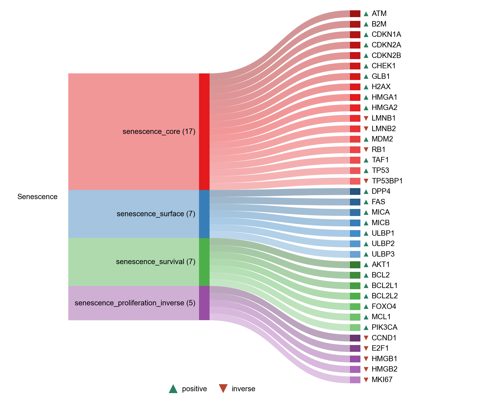

# Senescence

| Gene | Module Class | Sensor Family | Activation Tier | Scoring Direction | Cell Type Breadth | Detectability | Also in Module(s) | DOI | Aliases | Is_Sensor | Panel Source |
| --- | --- | --- | --- | --- | --- | --- | --- | --- | --- | --- | --- |
| ATM | senescence_core |  | Post-NASP | positive | Broad | high |  | [10.1038/s41580-024-00738-8](https://doi.org/10.1038/s41580-024-00738-8) |  |  | SenNet |
| B2M | senescence_core |  | Post-NASP | positive | Immune-enriched | high | INFLAMMAGING\|SENESCENCE | [10.1038/cddis.2014.489](https://doi.org/10.1038/cddis.2014.489) |  |  |  |
| CDKN1A | senescence_core |  | Post-NASP | positive | Broad | high |  | [10.1038/s41580-024-00738-8](https://doi.org/10.1038/s41580-024-00738-8) |  |  | SenNet |
| CDKN2A | senescence_core |  | Post-NASP | positive | Broad | medium |  | [10.1038/s41580-024-00738-8](https://doi.org/10.1038/s41580-024-00738-8) |  |  | SenNet |
| CDKN2B | senescence_core |  | Post-NASP | positive | Broad | low |  | [10.1038/s41580-024-00738-8](https://doi.org/10.1038/s41580-024-00738-8) |  |  | SenNet |
| CHEK1 | senescence_core |  | Post-NASP | positive | Broad | low |  | [10.1038/s41580-024-00738-8](https://doi.org/10.1038/s41580-024-00738-8) |  |  | SenNet |
| GLB1 | senescence_core |  | Post-NASP | positive | Broad | medium |  | [10.1038/s41580-024-00738-8](https://doi.org/10.1038/s41580-024-00738-8) |  |  | SenNet |
| H2AX | senescence_core |  | Post-NASP | positive | Broad | medium |  | [10.1038/s41580-024-00738-8](https://doi.org/10.1038/s41580-024-00738-8) |  |  | SenNet |
| HMGA1 | senescence_core |  | Post-NASP | positive | Broad | high |  | [10.1016/j.cell.2006.05.052](https://doi.org/10.1016/j.cell.2006.05.052) |  |  |  |
| HMGA2 | senescence_core |  | Post-NASP | positive | Broad | high |  | [10.1016/j.cell.2006.05.052](https://doi.org/10.1016/j.cell.2006.05.052) |  |  |  |
| LMNB1 | senescence_core |  | Post-NASP | inverse | Broad | medium |  | [10.1038/s41580-024-00738-8](https://doi.org/10.1038/s41580-024-00738-8) |  |  | SenNet |
| LMNB2 | senescence_core |  | Post-NASP | inverse | Broad | low |  | [10.1038/s41580-024-00738-8](https://doi.org/10.1038/s41580-024-00738-8) |  |  | SenNet |
| MDM2 | senescence_core |  | Post-NASP | positive | Broad | medium |  | [10.1038/s41580-024-00738-8](https://doi.org/10.1038/s41580-024-00738-8) |  |  | SenNet |
| RB1 | senescence_core |  | Post-NASP | inverse | Broad | high |  | [10.1038/s41580-024-00738-8](https://doi.org/10.1038/s41580-024-00738-8) |  |  | SenNet |
| TAF1 | senescence_core |  | Post-NASP | positive | Broad | medium |  | [10.1038/s41580-024-00738-8](https://doi.org/10.1038/s41580-024-00738-8) |  |  | SenNet |
| TP53 | senescence_core |  | Post-NASP | positive | Broad | low |  | [10.1038/s41580-024-00738-8](https://doi.org/10.1038/s41580-024-00738-8) |  |  | SenNet |
| TP53BP1 | senescence_core |  | Post-NASP | inverse | Broad | high |  | [10.1038/s41580-024-00738-8](https://doi.org/10.1038/s41580-024-00738-8) |  |  | SenNet |
| CCND1 | senescence_proliferation_inverse |  | Post-NASP | inverse | Broad | high |  | [10.1038/s41580-024-00738-8](https://doi.org/10.1038/s41580-024-00738-8) |  |  | SenNet |
| E2F1 | senescence_proliferation_inverse |  | Post-NASP | inverse | Broad | low |  | [10.1038/s41580-024-00738-8](https://doi.org/10.1038/s41580-024-00738-8) |  |  | SenNet |
| HMGB1 | senescence_proliferation_inverse |  | Post-NASP | inverse | Broad | high |  | [10.1038/s41580-024-00738-8](https://doi.org/10.1038/s41580-024-00738-8) |  |  | SenNet |
| HMGB2 | senescence_proliferation_inverse |  | Post-NASP | inverse | Broad | high |  | [10.1083/jcb.201608026](https://doi.org/10.1083/jcb.201608026) |  |  |  |
| MKI67 | senescence_proliferation_inverse |  | Post-NASP | inverse | Broad | medium |  | [10.1038/s41580-024-00738-8](https://doi.org/10.1038/s41580-024-00738-8) |  |  | SenNet |
| DPP4 | senescence_surface |  | Post-NASP | positive | Broad | medium |  | [10.1101/gad.302570.117](https://doi.org/10.1101/gad.302570.117) |  |  |  |
| FAS | senescence_surface |  | Post-NASP | positive | Broad | low |  | [10.1038/s41580-024-00738-8](https://doi.org/10.1038/s41580-024-00738-8) |  |  | SenNet |
| MICA | senescence_surface |  | Post-NASP | positive | Broad | low |  | [10.18632/aging.100897](https://doi.org/10.18632/aging.100897) |  |  |  |
| MICB | senescence_surface |  | Post-NASP | positive | Broad | medium |  | [10.1172/jci.insight.124716](https://doi.org/10.1172/jci.insight.124716) |  |  |  |
| ULBP1 | senescence_surface |  | Post-NASP | positive | Broad | low |  | [10.18632/aging.100897](https://doi.org/10.18632/aging.100897) |  |  |  |
| ULBP2 | senescence_surface |  | Post-NASP | positive | Broad | low |  | [10.18632/aging.100897](https://doi.org/10.18632/aging.100897) |  |  |  |
| ULBP3 | senescence_surface |  | Post-NASP | positive | Broad | low |  | [10.18632/aging.100897](https://doi.org/10.18632/aging.100897) |  |  |  |
| AKT1 | senescence_survival |  | Post-NASP | positive | Broad | medium |  | [10.1038/s41580-024-00738-8](https://doi.org/10.1038/s41580-024-00738-8) |  |  | SenNet |
| BCL2 | senescence_survival |  | Post-NASP | positive | Broad | high |  | [10.1038/s41580-024-00738-8](https://doi.org/10.1038/s41580-024-00738-8) |  |  | SenNet |
| BCL2L1 | senescence_survival |  | Post-NASP | positive | Broad | high |  | [10.1038/s41580-024-00738-8](https://doi.org/10.1038/s41580-024-00738-8) |  |  | SenNet |
| BCL2L2 | senescence_survival |  | Post-NASP | positive | Broad | low |  | [10.1038/s41580-024-00738-8](https://doi.org/10.1038/s41580-024-00738-8) |  |  | SenNet |
| FOXO4 | senescence_survival |  | Post-NASP | positive | Broad | low |  | [10.1016/j.cell.2017.02.031](https://doi.org/10.1016/j.cell.2017.02.031) |  |  |  |
| MCL1 | senescence_survival |  | Post-NASP | positive | Broad | high | MITOCHONDRIAL_NA_SENSING | [10.1038/s41580-024-00738-8](https://doi.org/10.1038/s41580-024-00738-8) |  |  | SenNet |
| PIK3CA | senescence_survival |  | Post-NASP | positive | Broad | medium |  | [10.1038/s41580-024-00738-8](https://doi.org/10.1038/s41580-024-00738-8) |  |  | SenNet |
