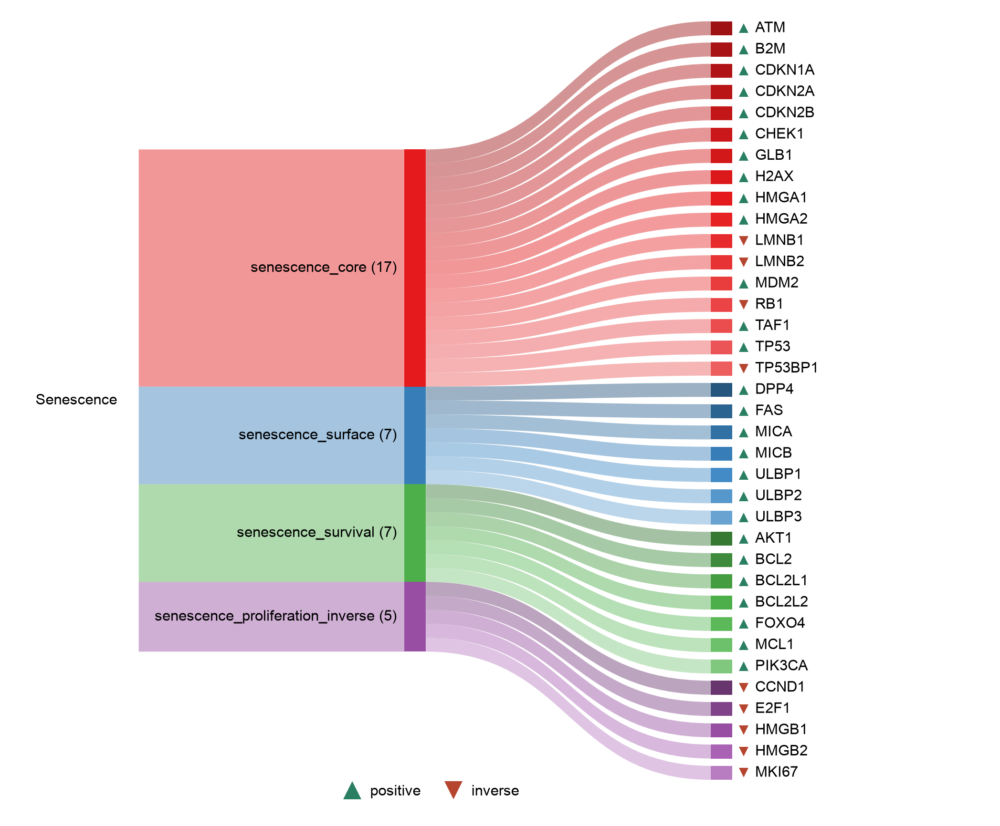

# Senescence

| Gene | HGNC ID | HGNC Symbol | Entrez ID | Module Class | Sensor Family | Scoring Direction | Single-Cell Detectability | Also in Module(s) | DOI | Aliases | Is_Sensor | Panel Source | DepMap Essential | s_het | s_het Lower 95% | s_het Upper 95% | UniProt ID | Monomer (kDa) | STRING Sensor Partners | STRING Partners |
| --- | --- | --- | --- | --- | --- | --- | --- | --- | --- | --- | --- | --- | --- | --- | --- | --- | --- | --- | --- | --- |
| ATM | HGNC:795 | ATM | 472 | senescence_core |  | positive | high |  | [10.1038/s41580-024-00738-8](https://doi.org/10.1038/s41580-024-00738-8) |  |  | SenNet | no | 0.00793926 | 0.00368625 | 0.0126392 | Q13315 | 350.7 | 5 | 289 |
| B2M | HGNC:914 | B2M | 567 | senescence_core |  | positive | high | INFLAMMAGING\|SENESCENCE | [10.1038/cddis.2014.489](https://doi.org/10.1038/cddis.2014.489) |  |  |  | no | 0.0270408 | 0.00709687 | 0.0647216 | P61769 | 13.7 | 0 | 133 |
| CDKN1A | HGNC:1784 | CDKN1A | 1026 | senescence_core |  | positive | high |  | [10.1038/s41580-024-00738-8](https://doi.org/10.1038/s41580-024-00738-8) |  |  | SenNet | no | 0.0156098 | 0.00145099 | 0.0393901 | P38936 | 18.1 | 0 | 186 |
| CDKN2A | HGNC:1787 | CDKN2A | 1029 | senescence_core |  | positive | medium |  | [10.1038/s41580-024-00738-8](https://doi.org/10.1038/s41580-024-00738-8) |  |  | SenNet | no | 0.0176157 | 0.000209601 | 0.0705987 | P42771 | 16.5 | 0 | 160 |
| CDKN2B | HGNC:1788 | CDKN2B | 1030 | senescence_core |  | positive | low |  | [10.1038/s41580-024-00738-8](https://doi.org/10.1038/s41580-024-00738-8) |  |  | SenNet | no | 0.00138936 | 0.000119459 | 0.00470316 | P42772 | 14.7 | 0 | 18 |
| CHEK1 | HGNC:1925 | CHEK1 | 1111 | senescence_core |  | positive | low |  | [10.1038/s41580-024-00738-8](https://doi.org/10.1038/s41580-024-00738-8) |  |  | SenNet | yes | 0.01204 | 0.00630974 | 0.0191365 | O14757 | 54.4 | 3 | 132 |
| GLB1 | HGNC:4298 | GLB1 | 2720 | senescence_core |  | positive | medium |  | [10.1038/s41580-024-00738-8](https://doi.org/10.1038/s41580-024-00738-8) |  |  | SenNet | no | 0.00521868 | 0.00223855 | 0.00959981 | P16278 | 76.1 | 0 | 53 |
| H2AX | HGNC:4739 | H2AX | 3014 | senescence_core |  | positive | medium |  | [10.1038/s41580-024-00738-8](https://doi.org/10.1038/s41580-024-00738-8) |  |  | SenNet | yes | 0.200423 | 0.00532406 | 0.718914 | P16104 | 15.1 | 8 | 624 |
| HMGA1 | HGNC:5010 | HMGA1 | 3159 | senescence_core |  | positive | high |  | [10.1016/j.cell.2006.05.052](https://doi.org/10.1016/j.cell.2006.05.052) |  |  |  | yes | 0.277685 | 0.041801 | 0.715037 | P17096 | 11.7 | 2 | 181 |
| HMGA2 | HGNC:5009 | HMGA2 | 8091 | senescence_core |  | positive | high |  | [10.1016/j.cell.2006.05.052](https://doi.org/10.1016/j.cell.2006.05.052) |  |  |  | no | 0.178544 | 0.0373812 | 0.446257 | P52926 | 11.8 | 2 | 70 |
| LMNB1 | HGNC:6637 | LMNB1 | 4001 | senescence_core |  | inverse | medium |  | [10.1038/s41580-024-00738-8](https://doi.org/10.1038/s41580-024-00738-8) |  |  | SenNet | no | 0.0803557 | 0.0355015 | 0.152751 | P20700 | 66.4 | 2 | 151 |
| LMNB2 | HGNC:6638 | LMNB2 | 84823 | senescence_core |  | inverse | low |  | [10.1038/s41580-024-00738-8](https://doi.org/10.1038/s41580-024-00738-8) |  |  | SenNet | no | 0.310179 | 0.103501 | 0.632103 | Q03252 | 69.9 | 1 | 75 |
| MDM2 | HGNC:6973 | MDM2 | 4193 | senescence_core |  | positive | medium |  | [10.1038/s41580-024-00738-8](https://doi.org/10.1038/s41580-024-00738-8) |  |  | SenNet | yes | 0.185154 | 0.0830389 | 0.338691 | Q00987 | 55.2 | 4 | 473 |
| RB1 | HGNC:9884 | RB1 | 5925 | senescence_core |  | inverse | high |  | [10.1038/s41580-024-00738-8](https://doi.org/10.1038/s41580-024-00738-8) |  |  | SenNet | no | 0.274167 | 0.136372 | 0.467284 | P06400 | 106.2 | 1 | 313 |
| TAF1 | HGNC:11535 | TAF1 | 6872 | senescence_core |  | positive | medium |  | [10.1038/s41580-024-00738-8](https://doi.org/10.1038/s41580-024-00738-8) |  |  | SenNet | yes | 0.436591 | 0.194632 | 0.737013 | P21675 | 214.7 | 0 | 211 |
| TP53 | HGNC:11998 | TP53 | 7157 | senescence_core |  | positive | low |  | [10.1038/s41580-024-00738-8](https://doi.org/10.1038/s41580-024-00738-8) |  |  | SenNet | no | 0.0785008 | 0.0336761 | 0.150928 | P04637 | 43.7 | 7 | 1117 |
| TP53BP1 | HGNC:11999 | TP53BP1 | 7158 | senescence_core |  | inverse | high |  | [10.1038/s41580-024-00738-8](https://doi.org/10.1038/s41580-024-00738-8) |  |  | SenNet | no | 0.10377 | 0.0656021 | 0.155237 | Q12888 | 213.6 | 6 | 406 |
| CCND1 | HGNC:1582 | CCND1 | 595 | senescence_proliferation_inverse |  | inverse | high |  | [10.1038/s41580-024-00738-8](https://doi.org/10.1038/s41580-024-00738-8) |  |  | SenNet | yes | 0.0672999 | 0.0240462 | 0.137492 | P24385 | 33.7 | 0 | 157 |
| E2F1 | HGNC:3113 | E2F1 | 1869 | senescence_proliferation_inverse |  | inverse | low |  | [10.1038/s41580-024-00738-8](https://doi.org/10.1038/s41580-024-00738-8) |  |  | SenNet | no | 0.209751 | 0.0628285 | 0.461106 | Q01094 | 46.9 | 1 | 150 |
| HMGB1 | HGNC:4983 | HMGB1 | 3146 | senescence_proliferation_inverse |  | inverse | high |  | [10.1038/s41580-024-00738-8](https://doi.org/10.1038/s41580-024-00738-8) |  |  | SenNet | yes | 0.437426 | 0.00180945 | 0.995396 | P09429 | 24.9 | 1 | 159 |
| HMGB2 | HGNC:5000 | HMGB2 | 3148 | senescence_proliferation_inverse |  | inverse | high |  | [10.1083/jcb.201608026](https://doi.org/10.1083/jcb.201608026) |  |  |  | no | 0.293459 | 0.056388 | 0.710171 | P26583 | 24.0 | 0 | 76 |
| MKI67 | HGNC:7107 | MKI67 | 4288 | senescence_proliferation_inverse |  | inverse | medium |  | [10.1038/s41580-024-00738-8](https://doi.org/10.1038/s41580-024-00738-8) |  |  | SenNet | no | 0.00554779 | 0.00107076 | 0.0128554 | P46013 | 358.7 | 5 | 481 |
| DPP4 | HGNC:3009 | DPP4 | 1803 | senescence_surface |  | positive | medium |  | [10.1101/gad.302570.117](https://doi.org/10.1101/gad.302570.117) |  |  |  | no | 0.00349345 | 0.000949415 | 0.00812249 | P27487 | 88.3 | 0 | 32 |
| FAS | HGNC:11920 | FAS | 355 | senescence_surface |  | positive | low |  | [10.1038/s41580-024-00738-8](https://doi.org/10.1038/s41580-024-00738-8) |  |  | SenNet | no | 0.0263773 | 0.00766793 | 0.0566925 | P25445 | 37.7 | 0 | 88 |
| MICA | HGNC:7090 | MICA | 100507436 | senescence_surface |  | positive | low |  | [10.18632/aging.100897](https://doi.org/10.18632/aging.100897) |  |  |  | no | 0.00151225 | 0.000110845 | 0.00522903 | Q29983 | 42.9 | 0 | 21 |
| MICB | HGNC:7091 | MICB | 4277 | senescence_surface |  | positive | medium |  | [10.1172/jci.insight.124716](https://doi.org/10.1172/jci.insight.124716) |  |  |  | no | 0.000998308 | 9.26347e-05 | 0.00330071 | Q29980 | 42.6 | 0 | 9 |
| ULBP1 | HGNC:14893 | ULBP1 | 80329 | senescence_surface |  | positive | low |  | [10.18632/aging.100897](https://doi.org/10.18632/aging.100897) |  |  |  | no | 0.00145555 | 7.22234e-05 | 0.00532529 | Q9BZM6 | 28.0 | 0 | 8 |
| ULBP2 | HGNC:14894 | ULBP2 | 80328 | senescence_surface |  | positive | low |  | [10.18632/aging.100897](https://doi.org/10.18632/aging.100897) |  |  |  | no | 0.00127143 | 0.000100431 | 0.00433767 | Q9BZM5 | 27.4 | 0 | 12 |
| ULBP3 | HGNC:14895 | ULBP3 | 79465 | senescence_surface |  | positive | low |  | [10.18632/aging.100897](https://doi.org/10.18632/aging.100897) |  |  |  | no | 0.00126167 | 9.16974e-05 | 0.00442993 | Q9BZM4 | 27.9 | 0 | 17 |
| AKT1 | HGNC:391 | AKT1 | 207 | senescence_survival |  | positive | medium |  | [10.1038/s41580-024-00738-8](https://doi.org/10.1038/s41580-024-00738-8) |  |  | SenNet | no | 0.149809 | 0.0508848 | 0.341636 | P31749 | 55.7 | 1 | 409 |
| BCL2 | HGNC:990 | BCL2 | 596 | senescence_survival |  | positive | high |  | [10.1038/s41580-024-00738-8](https://doi.org/10.1038/s41580-024-00738-8) |  |  | SenNet | no | 0.0881159 | 0.0435532 | 0.152155 | P10415 | 26.3 | 1 | 142 |
| BCL2L1 | HGNC:992 | BCL2L1 | 598 | senescence_survival |  | positive | high |  | [10.1038/s41580-024-00738-8](https://doi.org/10.1038/s41580-024-00738-8) |  |  | SenNet | yes | 0.122592 | 0.0570502 | 0.218028 | Q07817 | 26.0 | 1 | 108 |
| BCL2L2 | HGNC:995 | BCL2L2 | 599 | senescence_survival |  | positive | low |  | [10.1038/s41580-024-00738-8](https://doi.org/10.1038/s41580-024-00738-8) |  |  | SenNet | no | 0.0390014 | 0.00520062 | 0.143552 | Q92843 | 20.7 | 0 | 24 |
| FOXO4 | HGNC:7139 | FOXO4 | 4303 | senescence_survival |  | positive | low |  | [10.1016/j.cell.2017.02.031](https://doi.org/10.1016/j.cell.2017.02.031) |  |  |  | no | 0.0718705 | 0.0202459 | 0.174306 | P98177 | 53.7 | 0 | 40 |
| MCL1 | HGNC:6943 | MCL1 | 4170 | senescence_survival |  | positive | high | MITOCHONDRIAL_NA_SENSING | [10.1038/s41580-024-00738-8](https://doi.org/10.1038/s41580-024-00738-8) |  |  | SenNet | yes | 0.086098 | 0.0138556 | 0.222294 | Q07820 | 37.3 | 1 | 93 |
| PIK3CA | HGNC:8975 | PIK3CA | 5290 | senescence_survival |  | positive | medium |  | [10.1038/s41580-024-00738-8](https://doi.org/10.1038/s41580-024-00738-8) |  |  | SenNet | yes | 0.238183 | 0.122632 | 0.407758 | P42336 | 124.3 | 2 | 283 |
