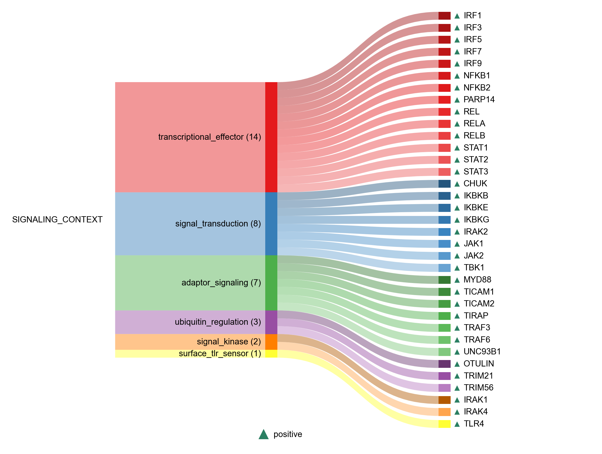

# SIGNALING_CONTEXT

| Gene | Module Class | Sensor Family | Activation Tier | Scoring Direction | Cell Type Breadth | Detectability | Also in Module(s) | DOI | Aliases | Is_Sensor | Panel Source |
| --- | --- | --- | --- | --- | --- | --- | --- | --- | --- | --- | --- |
| MYD88 | adaptor_signaling | TLR | Early | positive | Broad | medium |  | 10.1038/ni758 |  |  |  |
| TICAM1 | adaptor_signaling | TLR | Early | positive | Broad | low | NASP_RNA_SENSING | 10.1038/ni886 |  |  |  |
| TICAM2 | adaptor_signaling | TLR | Early | positive | Immune-enriched | low |  | 10.1038/nri1391 |  |  |  |
| TIRAP | adaptor_signaling | TLR | Early | positive | Broad | low |  | 10.1155/2023/2899271 |  |  |  |
| TRAF3 | adaptor_signaling | cGAS-STING | Early | positive | Broad | medium | NFKB_CYTOKINE_OUTPUT | 10.1038/s41392-022-01287-2 |  |  |  |
| TRAF6 | adaptor_signaling | cGAS-STING | Early | positive | Broad | low |  | 10.1016/j.bbrc.2019.05.022 |  |  |  |
| UNC93B1 | adaptor_signaling | TLR | Early | positive | Broad | low |  | 10.7554/eLife.00291 |  |  |  |
| BTK | signal_kinase | cGAS-STING | Active | positive | Immune-enriched | low |  | 10.1016/j.celrep.2015.01.039 |  |  |  |
| IRAK1 | signal_kinase | TLR | Early | positive | Broad | low | SIGNALING_CONTEXT\|IFN_I_OUTPUT | 10.1084/jem.20042372 |  |  |  |
| IRAK4 | signal_kinase | TLR | Early | positive | Broad | low | SIGNALING_CONTEXT\|IFN_I_OUTPUT | 10.1016/j.immuni.2005.09.016 |  |  |  |
| MAP3K7 | signal_kinase | Multi | Active | positive | Broad | medium |  | 10.1038/ni1255 |  |  |  |
| CHUK | signal_transduction |  | Active | positive | Broad | low |  | 10.1002/embr.201337983 |  |  |  |
| ELAVL1 | signal_transduction | Multi | Active | positive | Broad | medium |  | 10.1038/s44318-024-00331-x |  |  |  |
| HNRNPM | signal_transduction | Multi | Active | positive | Broad | high |  | 10.1038/s44318-024-00331-x |  |  |  |
| IKBKB | signal_transduction |  | Active | positive | Broad | medium |  | 10.1002/embr.201337983 |  |  |  |
| IKBKE | signal_transduction |  | Active | positive | Broad | low |  | 10.1038/ni921 |  |  |  |
| IKBKG | signal_transduction |  | Active | positive | Broad | low |  | 10.1002/embr.201337983 |  |  |  |
| IRAK2 | signal_transduction | TLR | Active | positive | Broad | medium |  | 10.3389/fimmu.2023.1133354 |  |  |  |
| JAK1 | signal_transduction |  | Active | positive | Broad | high |  | 10.1038/s41392-021-00791-1 |  |  |  |
| JAK2 | signal_transduction |  | Active | positive | Broad | medium |  | 10.1038/s41392-021-00791-1 |  |  |  |
| RIPK2 | signal_transduction | Multi | Active | positive | Immune-enriched | low |  | 10.1038/s41467-018-06451-3 |  |  |  |
| SENP7 | signal_transduction | cGAS-STING | Active | positive | Broad | high |  | 10.1371/journal.ppat.1006156 |  |  |  |
| TBK1 | signal_transduction |  | Early | positive | Broad | medium |  | 10.1038/ni921 |  |  |  |
| TLR4 | surface_tlr_sensor | TLR | Post-NASP | positive | Adipose/Immune-enriched | medium | NFKB_CYTOKINE_OUTPUT | 10.3892/ijmm.2020.4530 |  | lps_sensor |  |
| IRF1 | transcriptional_effector |  | Active | positive | Broad | high |  | 10.1073/pnas.0607181103 |  |  |  |
| IRF3 | transcriptional_effector |  | Early | positive | Broad | medium |  | 10.1038/ni921 |  |  |  |
| IRF5 | transcriptional_effector |  | Active | positive | Immune-enriched | low |  | 10.1093/intimm/dxy032 |  |  |  |
| IRF7 | transcriptional_effector |  | Active | positive | Broad | medium | SIGNALING_CONTEXT | 10.1038/nature03464 |  |  |  |
| IRF9 | transcriptional_effector |  | Active | positive | Broad | medium |  | 10.4161/jkst.27521 |  |  |  |
| NFKB1 | transcriptional_effector |  | Early | positive | Broad | high | SENESCENCE\|SASP\|SIGNALING_CONTEXT | 10.1101/cshperspect.a000034 |  |  |  |
| NFKB2 | transcriptional_effector |  | Early | positive | Broad | medium | SIGNALING_CONTEXT | 10.1101/cshperspect.a000034 |  |  |  |
| PARP14 | transcriptional_effector |  | Active | positive | Broad | high | SIGNALING_CONTEXT | 10.1038/s41467-023-41737-1 |  |  |  |
| REL | transcriptional_effector |  | Early | positive | Broad | high | SIGNALING_CONTEXT | 10.1101/cshperspect.a000034 |  |  |  |
| RELA | transcriptional_effector |  | Early | positive | Broad | low | SASP\|SIGNALING_CONTEXT | 10.1101/cshperspect.a000034 |  |  |  |
| RELB | transcriptional_effector |  | Early | positive | Broad | medium | SIGNALING_CONTEXT | 10.1101/cshperspect.a000034 |  |  |  |
| STAT1 | transcriptional_effector |  | Active | positive | Broad | high |  | 10.1038/nrm909 |  |  |  |
| STAT2 | transcriptional_effector |  | Active | positive | Broad | medium |  | 10.4161/jkst.27521 |  |  |  |
| STAT3 | transcriptional_effector |  | Active | positive | Broad | high |  | 10.1038/s41392-021-00791-1 |  |  |  |
| XBP1 | transcriptional_effector | TLR | Active | positive | Broad | high |  | 10.1038/ni.1857 |  |  |  |
| OTULIN | ubiquitin_regulation |  | Active | positive | Broad | medium |  | 10.1016/j.molcel.2014.03.016 |  |  |  |
| SENP2 | ubiquitin_regulation | Multi | Active | inverse | Broad | medium |  | 10.1093/jmcb/mjr020 |  |  |  |
| TRIM21 | ubiquitin_regulation |  | Active | positive | Broad | low |  | 10.1038/ni.2492 |  |  |  |
| TRIM3 | ubiquitin_regulation | TLR | Active | positive | Broad | low |  | 10.1073/pnas.2002472117 |  |  |  |
| TRIM56 | ubiquitin_regulation | cGAS-STING | Active | positive | Broad | medium |  | 10.1038/s41467-018-02936-3 |  |  |  |
