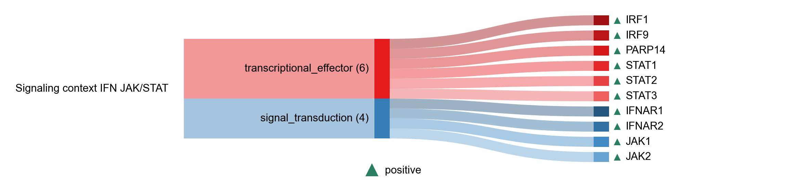

# Signaling context IFN JAK/STAT

| Gene | Module Class | Sensor Family | Activation Tier | Scoring Direction | Cell Type Breadth | Detectability | Also in Module(s) | DOI | Aliases | Is_Sensor | Panel Source |
| --- | --- | --- | --- | --- | --- | --- | --- | --- | --- | --- | --- |
| IFNAR1 | signal_transduction |  | Active | positive | Broad | medium |  | [10.1016/0092-8674(90)90738-Z](https://doi.org/10.1016/0092-8674(90)90738-Z) |  |  |  |
| IFNAR2 | signal_transduction |  | Active | positive | Broad | medium |  | [10.1074/jbc.270.37.21606](https://doi.org/10.1074/jbc.270.37.21606) |  |  |  |
| JAK1 | signal_transduction |  | Active | positive | Broad | high |  | [10.1038/s41392-021-00791-1](https://doi.org/10.1038/s41392-021-00791-1) |  |  |  |
| JAK2 | signal_transduction |  | Active | positive | Broad | medium |  | [10.1038/s41392-021-00791-1](https://doi.org/10.1038/s41392-021-00791-1) |  |  |  |
| IRF1 | transcriptional_effector |  | Active | positive | Broad | high |  | [10.1073/pnas.0607181103](https://doi.org/10.1073/pnas.0607181103) |  |  |  |
| IRF9 | transcriptional_effector |  | Active | positive | Broad | medium |  | [10.4161/jkst.27521](https://doi.org/10.4161/jkst.27521) |  |  |  |
| PARP14 | transcriptional_effector |  | Active | positive | Broad | high | SIGNALING_CONTEXT | [10.1038/s41467-023-41737-1](https://doi.org/10.1038/s41467-023-41737-1) |  |  |  |
| STAT1 | transcriptional_effector |  | Active | positive | Broad | high |  | [10.1038/nrm909](https://doi.org/10.1038/nrm909) |  |  |  |
| STAT2 | transcriptional_effector |  | Active | positive | Broad | medium |  | [10.4161/jkst.27521](https://doi.org/10.4161/jkst.27521) |  |  |  |
| STAT3 | transcriptional_effector |  | Active | positive | Broad | high |  | [10.1038/s41392-021-00791-1](https://doi.org/10.1038/s41392-021-00791-1) |  |  |  |
