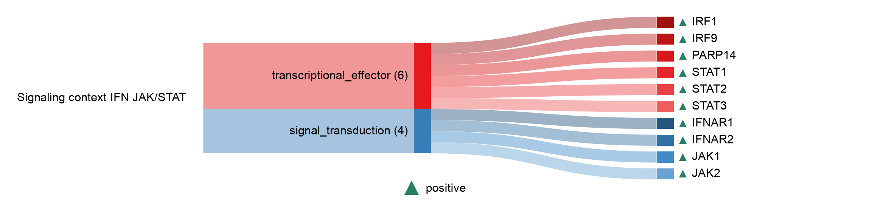

# Signaling context IFN JAK/STAT

| Gene | HGNC ID | HGNC Symbol | Entrez ID | Module Class | Sensor Family | Activation Tier | Scoring Direction | Cell Type Breadth | Detectability | Also in Module(s) | DOI | Aliases | Is_Sensor | Panel Source | DepMap Essential | s_het | s_het Lower 95% | s_het Upper 95% | UniProt ID | Monomer (kDa) | STRING Sensor Partners |
| --- | --- | --- | --- | --- | --- | --- | --- | --- | --- | --- | --- | --- | --- | --- | --- | --- | --- | --- | --- | --- | --- |
| IFNAR1 | HGNC:5432 | IFNAR1 | 3454 | signal_transduction |  | Active | positive | Broad | medium |  | [10.1016/0092-8674(90)90738-Z](https://doi.org/10.1016/0092-8674(90)90738-Z) |  |  |  | no | 0.00194798 | 0.000205575 | 0.00624108 | P17181 | 63.5 | 0 |
| IFNAR2 | HGNC:5433 | IFNAR2 | 3455 | signal_transduction |  | Active | positive | Broad | medium |  | [10.1074/jbc.270.37.21606](https://doi.org/10.1074/jbc.270.37.21606) |  |  |  | no | 0.00225157 | 0.000471434 | 0.0053957 | P48551 | 57.8 | 0 |
| JAK1 | HGNC:6190 | JAK1 | 3716 | signal_transduction |  | Active | positive | Broad | high |  | [10.1038/s41392-021-00791-1](https://doi.org/10.1038/s41392-021-00791-1) |  |  |  | no | 0.1594 | 0.0919865 | 0.250656 | P23458 | 133.3 | 2 |
| JAK2 | HGNC:6192 | JAK2 | 3717 | signal_transduction |  | Active | positive | Broad | medium |  | [10.1038/s41392-021-00791-1](https://doi.org/10.1038/s41392-021-00791-1) |  |  |  | no | 0.0512126 | 0.0373657 | 0.0680744 | O60674 | 130.7 | 0 |
| IRF1 | HGNC:6116 | IRF1 | 3659 | transcriptional_effector |  | Active | positive | Broad | high |  | [10.1073/pnas.0607181103](https://doi.org/10.1073/pnas.0607181103) |  |  |  | no | 0.191044 | 0.0653975 | 0.409088 | P10914 | 36.5 | 0 |
| IRF9 | HGNC:6131 | IRF9 | 10379 | transcriptional_effector |  | Active | positive | Broad | medium |  | [10.4161/jkst.27521](https://doi.org/10.4161/jkst.27521) |  |  |  | no | 0.0542737 | 0.0242567 | 0.0987757 | Q00978 | 43.7 | 0 |
| PARP14 | HGNC:29232 | PARP14 | 54625 | transcriptional_effector |  | Active | positive | Broad | high | SIGNALING_CONTEXT | [10.1038/s41467-023-41737-1](https://doi.org/10.1038/s41467-023-41737-1) |  |  |  | no | 0.0254332 | 0.0128121 | 0.0403478 | Q460N5 | 202.8 | 1 |
| STAT1 | HGNC:11362 | STAT1 | 6772 | transcriptional_effector |  | Active | positive | Broad | high |  | [10.1038/nrm909](https://doi.org/10.1038/nrm909) |  |  |  | no | 0.148102 | 0.0694966 | 0.27245 | P42224 | 87.3 | 2 |
| STAT2 | HGNC:11363 | STAT2 | 6773 | transcriptional_effector |  | Active | positive | Broad | medium |  | [10.4161/jkst.27521](https://doi.org/10.4161/jkst.27521) |  |  |  | no | 0.0374597 | 0.021006 | 0.0617666 | P52630 | 97.9 | 0 |
| STAT3 | HGNC:11364 | STAT3 | 6774 | transcriptional_effector |  | Active | positive | Broad | high |  | [10.1038/s41392-021-00791-1](https://doi.org/10.1038/s41392-021-00791-1) |  |  |  | no | 0.355992 | 0.155254 | 0.63111 | P40763 | 88.1 | 2 |
