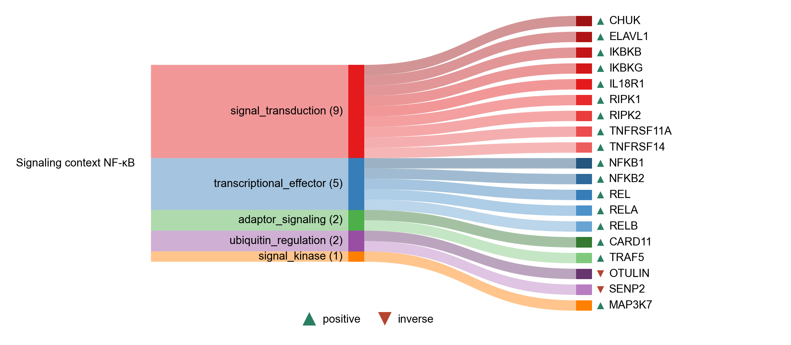

# Signaling context NF-κB

| Gene | Module Class | Sensor Family | Activation Tier | Scoring Direction | Cell Type Breadth | Detectability | Also in Module(s) | DOI | Aliases | Is_Sensor | Panel Source |
| --- | --- | --- | --- | --- | --- | --- | --- | --- | --- | --- | --- |
| CARD11 | adaptor_signaling |  | early | positive | Immune-enriched | medium |  | [10.1093/emboj/cdf505](https://doi.org/10.1093/emboj/cdf505) |  |  |  |
| TRAF5 | adaptor_signaling |  | early | positive | Immune-enriched | medium | SIGNALING_CONTEXT_NFKB | [10.1073/pnas.96.17.9803](https://doi.org/10.1073/pnas.96.17.9803) |  |  |  |
| MAP3K7 | signal_kinase | Multi | Active | positive | Broad | medium |  | [10.1038/ni1255](https://doi.org/10.1038/ni1255) |  |  |  |
| CHUK | signal_transduction |  | Active | positive | Broad | low |  | [10.1002/embr.201337983](https://doi.org/10.1002/embr.201337983) |  |  |  |
| ELAVL1 | signal_transduction | Multi | Active | positive | Broad | medium |  | [10.1038/s44318-024-00331-x](https://doi.org/10.1038/s44318-024-00331-x) |  |  |  |
| IKBKB | signal_transduction |  | Active | positive | Broad | medium |  | [10.1002/embr.201337983](https://doi.org/10.1002/embr.201337983) |  |  |  |
| IKBKG | signal_transduction |  | Active | positive | Broad | low |  | [10.1002/embr.201337983](https://doi.org/10.1002/embr.201337983) |  |  |  |
| IL18R1 | signal_transduction |  | early | positive | Immune-enriched | low |  | [10.1074/jbc.272.41.25737](https://doi.org/10.1074/jbc.272.41.25737) | CD218a |  |  |
| RIPK1 | signal_transduction |  | Active | positive | Broad | low |  | [10.1016/S1074-7613(00)80252-6](https://doi.org/10.1016/S1074-7613(00)80252-6) |  |  |  |
| RIPK2 | signal_transduction | Multi | Active | positive | Immune-enriched | low |  | [10.1038/s41467-018-06451-3](https://doi.org/10.1038/s41467-018-06451-3) |  |  |  |
| TNFRSF11A | signal_transduction |  | early | positive | Immune-enriched | low |  | [10.1074/jbc.274.12.7724](https://doi.org/10.1074/jbc.274.12.7724) | RANK |  |  |
| TNFRSF14 | signal_transduction |  | Active | positive | Immune-enriched | high |  | [10.1074/jbc.272.22.14029](https://doi.org/10.1074/jbc.272.22.14029) |  |  |  |
| NFKB1 | transcriptional_effector |  | Early | positive | Broad | high | SENESCENCE\|SASP\|SIGNALING_CONTEXT | [10.1101/cshperspect.a000034](https://doi.org/10.1101/cshperspect.a000034) |  |  |  |
| NFKB2 | transcriptional_effector |  | Early | positive | Broad | medium | SIGNALING_CONTEXT | [10.1101/cshperspect.a000034](https://doi.org/10.1101/cshperspect.a000034) |  |  |  |
| REL | transcriptional_effector |  | Early | positive | Broad | high | SIGNALING_CONTEXT | [10.1101/cshperspect.a000034](https://doi.org/10.1101/cshperspect.a000034) |  |  |  |
| RELA | transcriptional_effector |  | Early | positive | Broad | low | SASP\|SIGNALING_CONTEXT | [10.1101/cshperspect.a000034](https://doi.org/10.1101/cshperspect.a000034) |  |  |  |
| RELB | transcriptional_effector |  | Early | positive | Broad | medium | SIGNALING_CONTEXT | [10.1101/cshperspect.a000034](https://doi.org/10.1101/cshperspect.a000034) |  |  |  |
| OTULIN | ubiquitin_regulation |  | Active | inverse | Broad | medium |  | [10.1016/j.molcel.2014.03.016](https://doi.org/10.1016/j.molcel.2014.03.016) |  |  |  |
| SENP2 | ubiquitin_regulation | Multi | Active | inverse | Broad | medium |  | [10.1093/jmcb/mjr020](https://doi.org/10.1093/jmcb/mjr020) |  |  |  |
